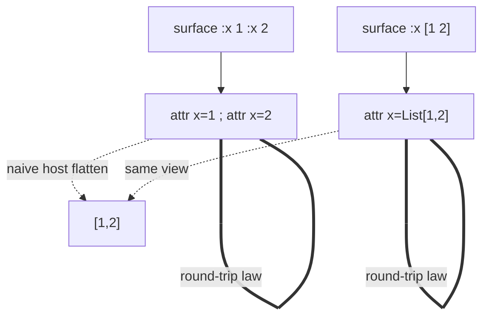
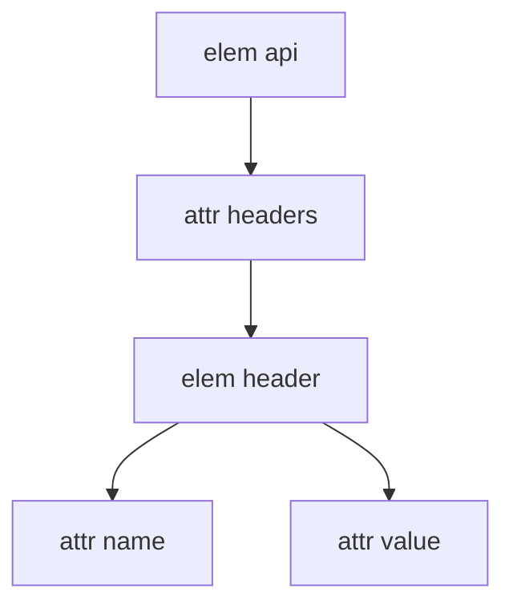
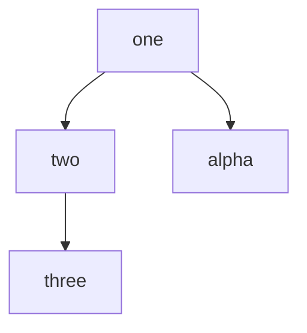

# Expected streams (hypothetical)

Companion to [snippets.udon](snippets.udon). Event vocabulary: [00-event-model.md](00-event-model.md).

Each case: **snippet** → **why I care** → **L2 event expectation** → optional diagram or cursor notes. Disagreements welcome — mark them and we refine CORE.

---

## T01 — Open attr tail vs finished-value tail

```udon
|el :first value :another with some text
|el :first value :another "with" some text
```

**Why:** The ownership asymmetry in one glance. Same shape, different second value.

### Line A — bare `another` still open → Flow owns the rest

```text
doc_start
elem_start name=el col=0
  attr key=first  value=Str("value")     ; bare "value", next is ":" → single token
  attr key=another value=Flow[Str("with some text")]
  ; no element text — tail never left the open attr
elem_end
doc_end
```

**Decision:** after bare `another`, next non-space is `w` → not a Boundary Marker → commit Flow for `another` through EOL.

### Line B — quoted value finishes → tail is element Content

```text
elem_start name=el col=0
  attr key=first  value=Str("value")
  attr key=another value=Str("with")     ; quotes self-terminate
  text " some text"                      ; ownership row 2 — element prose
  ; Content Phase begins at text
elem_end
```

```mermaid
flowchart LR
  subgraph lineA ["Line A: :another with…"]
    A1[":another"] --> A2["bare 'with'"]
    A2 --> A3["next=letter → Flow"]
    A3 --> A4["attr another = flow"]
  end
  subgraph lineB ["Line B: :another \"with\" …"]
    B1[":another"] --> B2["quoted with"]
    B2 --> B3["value finished"]
    B3 --> B4["tail → element text"]
  end
```

---

## T02 — Inline-Brace Principle

```udon
|el :n value |{em x} :a 1
```

**Why:** The rule everyone will fight. `|{` is *not* a boundary; `:a 1` is not an attribute.

```text
elem_start name=el col=0
  attr key=n value=Flow[
    Str("value "),
    inline_start name=em
      text "x"
    inline_end,
    Str(" :a 1")
  ]
elem_end
```

**Not:** `attr n=value` then child `em` then `attr a=1`.

**Decision:** bare `value`, next non-space is `|` of `|{` → inline brace → Flow commit; inside flow, `|{em x}` is an inline element segment; after `}`, rest is literal text including `:a 1`.

---

## T03 — Flow starting with brace; empty-string idiom

```udon
|el :n |{em x}
|el :n ;{}
```

### First line

```text
elem_start name=el col=0
  attr key=n value=Flow[
    inline_start name=em
      text "x"
    inline_end
  ]
elem_end
```

### Second line — `;{}` is inline comment, contributes no text

```text
elem_start name=el col=0
  attr key=n value=Flow[]          ; empty flow ≡ empty string value
  ; comment form=inline body="" may also be recorded if comments-in-values are modeled;
  ; either way value text is ""
elem_end
```

**Note:** This is the teachable “empty string without quotes” path. Distinct from missing value (Error + Nil) on a plain key with nothing at all.

---

## T04 — Stacking vs list (three wires, two shown)

```udon
|el :x 1 :x 2
|el :x [1 2]
```

```text
; --- document 1 ---
elem_start name=el col=0
  attr key=x value=Int(1)
  attr key=x value=Int(2)          ; two assignments — NOT List
elem_end

; --- document 2 ---
elem_start name=el col=0
  attr key=x value=List[Int(1), Int(2)]   ; one assignment
elem_end
```

**SEMANTICS:** these ADMs are **not** Core-equivalent. Host `values(x)→[1,2]` is a view.



---

## T05 — Warn-ingest on attribute-rooted line

```udon
|el
  :attr "first" and here's another one
```

```text
elem_start name=el col=0
  attr key=attr value=… multi-segment:
    ; logical form (either one multi-seg value or stacked segments — CORE: further segments under key)
    Str("first")
    Str("and here's another one")   ; or Flow of that text
  warn code=trailing_after_finished
       msg="trailing text extends finished value on attribute-rooted line"
elem_end
```

**Decision:** quotes finish value; line is attribute-rooted → collecting continues; tail warn-ingested.  
**Contrast:** same tail on `|el :attr "first" and…` (element-rooted) → element `text`, no multi-seg on `attr`.

---

## T06 — Deeper material under finished envelope

```udon
|el
  :when <7:02pm>
    extra deeper text
```

```text
elem_start name=el col=0
  attr_open key=when
    ; envelope self-contained on first value line
  attr key=when value=Env(body="7:02pm")   ; or typed if temporal dialect claims
  attr_seg / second assignment under when:
    Str("extra deeper text")               ; deeper finished-value case
  warn code=extra_under_finished
elem_end
```

**Open modeling choice (worth pinning later):** one multi-segment `when` vs two stacked `attr key=when`. CORE says stacking spirit / further segments — I treat as **second segment or second stacked assignment under same key**, always with Warning.  
Not child text of `el` (that would be wrong: indent is under the attr value column).

---

## T07 — Value-position `\`

```udon
|el :count \7 apples ; not a comment
```

```text
elem_start name=el col=0
  attr key=count value=Flow[Str("7 apples ; not a comment")]
  ; NO comment event — value-\ disables sameline comment framing
elem_end
```

**Not** `Int(7)`. **Not** comment body `not a comment`.

---

## T08 — Flow value then framed comment on block attr line

```udon
|el
  :title The full title goes here ; TODO
```

```text
elem_start name=el col=0
  attr key=title value=Flow[Str("The full title goes here")]
  comment form=sameline body="TODO"
elem_end
```

**Decision:** bare tokens form Flow until framed ` ; `; comment is not part of value.

---

## T09 — One-way door (happy path)

```udon
|api :headers |header :name Content-Type :value application/json
```

```text
elem_start name=api col=0
  attr key=headers value=Node →
    elem_start name=header col=…    ; col of this |header
      attr key=name  value=Str("Content-Type")
      attr key=value value=Str("application/json")
    elem_end
elem_end
```



Everything after `|header` on the line binds to **header**, not api.

---

## T10 — One-way door trap (`:timeout` goes to header)

```udon
|api :headers |header :k v :timeout 30
```

```text
elem_start name=api col=0
  attr key=headers value=Node →
    elem_start name=header
      attr key=k value=Str("v")
      attr key=timeout value=Int(30)    ; NOT on api
    elem_end
elem_end
```

**No warning required by CORE** (valid structure, surprising intent). Pedagogy/Host linter MAY warn. This is why the trace pack exists.

---

## T11 — Node value trailing prose is the node’s

```udon
|el :a |the-node :k "v" more
```

```text
elem_start name=el col=0
  attr key=a value=Node →
    elem_start name=the-node
      attr key=k value=Str("v")
      text " more"                     ; node's content, not el's
    elem_end
elem_end
```

---

## T12 — Teachable pair: node vs flow

```udon
|el :x |em hi
|el :x |{em hi}
```

```text
; line 1 — block form
elem_start name=el
  attr key=x value=Node →
    elem_start name=em
      text "hi"
    elem_end
elem_end

; line 2 — brace form
elem_start name=el
  attr key=x value=Flow[
    inline_start name=em
      text "hi"
    inline_end
  ]
elem_end
```

**SEMANTICS:** not equivalent. Different Value kinds (Node vs Flow).

---

## T13 — Attribute-under-attribute

```udon
|el
  :theta
    :first 1
```

```text
elem_start name=el col=0
  attr_open key=theta
  ; deeper line is :first — not a legal nested attr map
  error code=attr_under_attr
  attr key=theta value=… keep shape:
    ; CORE: ingest offending line as Text of open value
    Str(":first 1")    ; or text including leading spaces per keep rule
  attr_close
elem_end
```

**Preferred rewrite (not this snippet):**

```udon
|el
  :theta
    |config :first 1
```

---

## T14 — Flag re-owning

```udon
|el :a?
|el :a? false
|el :a? |beta
|el :a? well it sure is true
```

```text
; 1
elem_start name=el
  attr key=a? value=Bool(true)
elem_end

; 2
elem_start name=el
  attr key=a? value=Bool(false)
elem_end

; 3
elem_start name=el
  attr key=a? value=Bool(true)     ; re-own: |beta is NOT flag body
  elem_start name=beta             ; child of el
  elem_end
elem_end

; 4
elem_start name=el
  attr key=a? value=Bool(true)
  text "well it sure is true"      ; element content
elem_end
```

Key string includes `?`. No warn-ingest on flag re-own (specific rule wins).

---

## T15 — Keyword only when alone

```udon
|el :alpha true
|el :alpha true story
|el :alpha true \ story
```

```text
; 1
attr key=alpha value=Bool(true)

; 2
attr key=alpha value=Flow[Str("true story")]

; 3
attr key=alpha value=Bool(true)    ; boundary-\ finishes keyword alone
text " story"                      ; element prose; comment would be literal after \
```

---

## T16 — Failed number fallthrough

```udon
|el :x 12ab :y 3
|el :x 12ab more
```

```text
; 1
attr key=x value=Str("12ab")     ; not Int; fall through to bare
attr key=y value=Int(3)          ; ":" is boundary

; 2
attr key=x value=Flow[Str("12ab more")]
```

---

## T17 — Content Phase / late `:`

```udon
|el :a 1 tail
  :b 2
```

```text
elem_start name=el col=0
  attr key=a value=Int(1)
  text "tail"                      ; Content Phase begins
  text ":b 2"                      ; or text "\n:b 2" depending on line join —
                                   ; block line at child column is prose looking like attr
  warn code=late_colon
       msg="line-initial : after content phase is prose"
elem_end
; NO attr key=b
```

**Cursor:** sameline `tail` already entered Content Phase before the next line.

---

## T18 — Missing plain value

```udon
|button :disabled :type submit
```

```text
elem_start name=button
  attr key=disabled value=Nil
  error code=missing_value msg="plain attribute requires a value"
  attr key=type value=Str("submit")
elem_end
```

**Not** `disabled=true` (that needs `disabled?`). Shape preserved (Keep-Everything).

---

## T19 — Sameline nest + later sibling column

```udon
|one |two |three
  |alpha
```

```text
elem_start name=one col=0
  elem_start name=two col=5          ; illustrative cols
    elem_start name=three col=10
    elem_end
  elem_end                           ; pop two before alpha? 
  ; alpha at col=2: pop while 2 <= top.base
  ; pops three, two; 2 <= 0? no → child of one
  elem_start name=alpha col=2
  elem_end
elem_end
```



**Stack after line 1:** `[one@0, two@5, three@10]`  
**Line 2 col 2:** pop three, pop two, push alpha under one.

---

## T20 — Uniform scan on block attr line

```udon
|el
  :a 1 :b 2
```

```text
elem_start name=el
  attr key=a value=Int(1)
  attr key=b value=Int(2)
elem_end
```

**Not** a single value `Str("1 :b 2")`. Block line still runs the multi-attr scan.

---

## T21 — `$partial-key` (line-bound identity, post-Fable D1)

```udon
|user[trunc
```

```text
elem_start name=user
  attr key=$partial-key value=Str("trunc")   ; NOT $key
  warn code=unclosed_identity
incomplete                                   ; if this is true EOF of input
elem_end
doc_end
```

**Also (editing accident — fail-safe lives):**

```udon
|user[trunc
|next
```

```text
; line 1: newline closes identity as partial (line-bound), does NOT swallow |next
elem_start name=user
  attr key=$partial-key value=Str("trunc")
  warn code=unclosed_identity
elem_end
elem_start name=next
elem_end
; document complete unless other open delimited frames
```

---

## T22 — Multi-line string (D1 strings row)

```udon
|el :msg "line one
line two"
```

```text
elem_start name=el
  attr key=msg value=Str("line one\nline two")
elem_end
```

**Greenfield:** newline is content; no warn for multi-line string itself.  
Unclosed variant would warn + `incomplete`.

---

## T23 — Multi-line list (D1)

```udon
|el :ports [
  8080
  8443
]
```

```text
elem_start name=el
  attr key=ports value=List[Int(8080), Int(8443)]
elem_end
```

Interior newlines = whitespace between items. No structure recognition of `8080` lines as elements (inside delimited list).

---

## T24 — Root attribute (D3)

```udon
:orphan 1
```

```text
error code=root_attribute
text ":orphan 1"              ; Document-level text keep — no free-floating attr
; NO attr event at document root
```

---

## T25 — Inline comments vs literal semicolon

```udon
|p a ;{c1};{c2} b
|p end; not a comment
```

```text
; line 1
elem_start name=p
  text "a "
  comment form=inline body="c1"
  comment form=inline body="c2"
  text " b"                   ; framing spaces: CORE leaves exact space policy slightly soft;
                              ; expectation: both comments stripped from text, spaces may remain
elem_end

; line 2
elem_start name=p
  text "end; not a comment"   ; unframed ; is literal
elem_end
```

---

## T26 — Flag suffix vs trait absorption

```udon
|el.bar?
|el.bar ?
|el?.bar
```

```text
; 1 — ? absorbed into trait
elem_start name=el
  attr key=$traits value=Str("bar?")
elem_end

; 2 — space-separated suffix
elem_start name=el
  attr key=$traits value=Str("bar")
  attr key=$? value=Bool(true)
elem_end

; 3 — suffix before traits
elem_start name=el
  attr key=$? value=Bool(true)
  attr key=$traits value=Str("bar")
elem_end
```

---

## T27 — Deferred node value

```udon
|el
  :beta
    |veni-vidi-vici :working 1234
```

```text
elem_start name=el col=0
  attr_open key=beta
  attr key=beta value=Node →
    elem_start name=veni-vidi-vici col=4
      attr key=working value=Int(1234)
    elem_end
elem_end
```

Key line ends with no finished value → deeper lines are value body; first child element is the Node Value (one node preferred).

---

## T28 — Sameline comment then block attrs

```udon
|el ; note
  :a 1
```

```text
elem_start name=el col=0
  comment form=sameline body="note"
  ; Content Phase? Sameline comment after empty attrs — element still open for attrs?
  ; RULING SENSITIVE: framed comment after |el with no content yet.
  ; My expectation: comment does not enter Content Phase; :a still binds to el.
  attr key=a value=Int(1)
elem_end
```

**Why included:** This is an interplay edge (fixture `interplay1113`). I am **less certain** than T01–T12. If comment counts as “content,” late-`:` rules might fire — I currently say **comments are not Content Phase triggers**; only Text / child Elements / etc. Confirm against CORE wording (“any text or child element”). Comment ≠ text content of the element body → `:a` OK.

---

## Priority for working through (my interest order)

| Priority | IDs | Reason |
|---------:|-----|--------|
| 1 | T01, T02, T05, T14, T15 | Core ownership + boundary spine |
| 2 | T09–T12, T13 | Node door + node/flow pair + attr-under-attr |
| 3 | T17, T18, T04 | Phase, missing value, stacking law |
| 4 | T22–T24 | Greenfield pins (need corpus proof) |
| 5 | T19, T26, T21 | Hierarchy / sugar / fail-safe |
| 6 | T28, T06 | Soft spots — expect debate |

---

## How to disagree productively

When an expectation seems wrong, reply with:

1. Case id  
2. Alternative event list (same vocabulary or ADM sketch)  
3. Which CORE/GRAMMAR sentence you think forces it  
4. Whether this is “I read the contract differently” vs “the contract should change”

That keeps the flight manual and the constitution in the same conversation.
