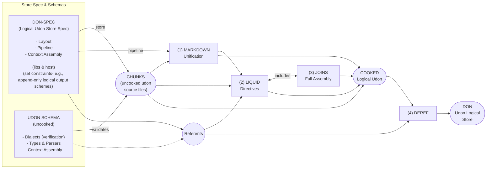

# The pipeline sketch, recreated (from `notebook-sketch-pipeline.jpg`)

**Register: recreation of Joseph's notebook sketch** (drawn earlier; recreated 2026-08-27, then redrawn by Joseph the same day for clarity, with some later-decided names — DON-SPEC, DON, Referents). Still deliberately a record of the *before references and 0.10 existed* thinking: basic thoughts on how schemas + a store-specification create the pipeline that turns directories of documents into a logical udon store. The right page is the "more correct but not finished" version and is the diagram below; the left page (predecessor) is summarized after it. Uncertain handwriting readings are marked ⟨?⟩ — correct them in place.

## The pipeline (right page)

### Open questions written on the page

- **Path dereferencing ⟨"desegmentation"?⟩ — before or after (or both) Liquid rendering?** → *A: a pipeline decision to make* (marked "open question" on the Logical UDON → Dereference edge).
- **Q: Modification via the store → how does it get back to files?** → *A (sketched): pipeline backwards? store projects en whole? store is canon?*

## The predecessor sketch (left page)

The earlier pass, kept for the record — same shape, less resolved:

- **UDON + typing + paths** → **Markdown inner udonification** → **Liquid template parsing** ("sometimes yields inner markdown directives").
- **Directory config + SCHEMA + dialect** → **object store and path dereferencing** → **assembly directives** → **LOGICAL UDON STORE**.
- Schema's four jobs (checklist at lower left): ✓ sets up pipeline · ✓ selects types & their parsers · ✓ has specially-prepared directives ready to go · ✓ Liquid context pre-assembly.
- The timing question already present: "Liquid assembly ~~before~~ — **on ingest vs on request** → view/projection of logical."

## Reading notes (recreator's, not the sketch's)

- Every stage boundary in the pipeline is a **binding time**: (1) unification binds prose shape; (2) Liquid binds template evaluation; (3) joins bind includes; (4) deref binds references; the store binds identity. The two open questions on the page are both *which stage does a binding fire in* — the same question the quote-operator / binding-time-axis discussion (2026-08-27 session) proposes to answer once, per item, rather than once, globally, per pipeline.
- The includes loop (LIQUID ↔ JOINS) is where template-writing-templates lives: an include can deliver material that still contains directives, so "uncooked" is a per-item property, not a stage.
- "On ingest vs on request" (left page) is the same axis as eager/lazy dereference (right page) — the sketch asked it twice, once for Liquid and once for paths.
- **"Referents"** (Joseph's redraw; the sketch's "ctx object + code") names the context node by *what it holds* rather than what code calls it — the same object the references work is defining. Both the schema (dotted: type/parser referents) and DON-SPEC feed it, and it feeds both Liquid evaluation and final deref — one context, consulted at two binding times.
