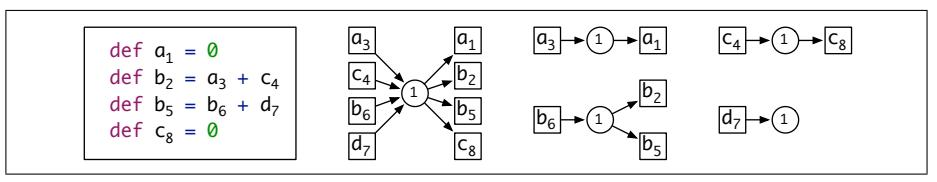
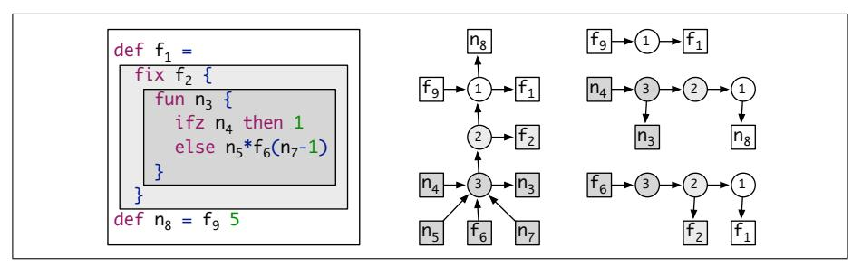
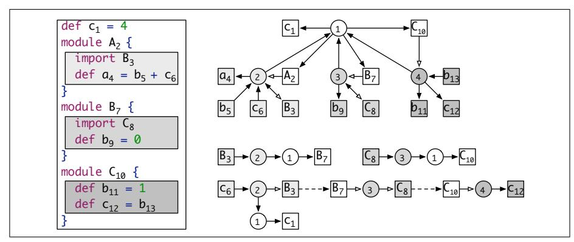
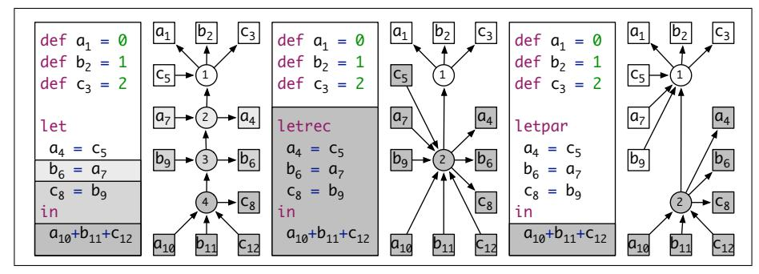
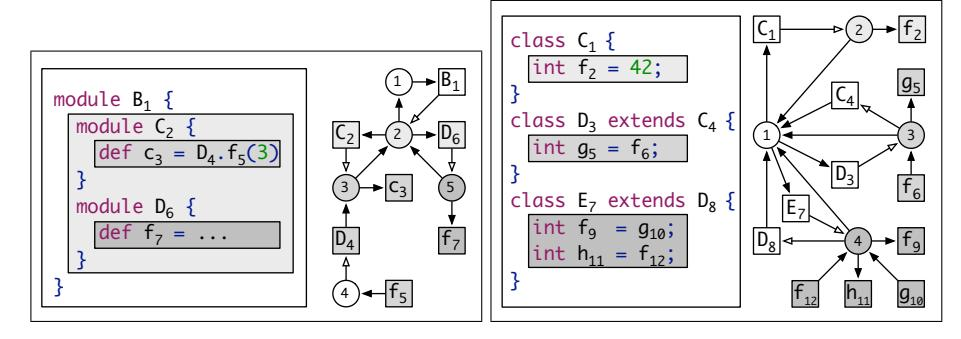

# A Theory of Name Resolution

Pierre Neron<sup>1</sup>, Andrew Tolmach<sup>2</sup>, Eelco Visser<sup>1</sup>, and Guido Wachsmuth<sup>1</sup>

1) Delft University of Technology, The Netherlands,
{p.j.m.neron, e.visser, g.wachsmuth}@tudelft.nl,
2) Portland State University, Portland, OR, USA
tolmach@pdx.edu

Abstract. We describe a language-independent theory for name binding and resolution, suitable for programming languages with complex scoping rules including both lexical scoping and modules. We formulate name resolution as a two-stage problem. First a language-independent scope graph is constructed using language-specific rules from an abstract syntax tree. Then references in the scope graph are resolved to corresponding declarations using a language-independent resolution process. We introduce a resolution calculus as a concise, declarative, and language-independent specification of name resolution. We develop a resolution algorithm that is sound and complete with respect to the calculus. Based on the resolution calculus we develop language-independent definitions of  $\alpha$ -equivalence and rename refactoring. We illustrate the approach using a small example language with modules. In addition, we show how our approach provides a model for a range of name binding patterns in existing languages.

#### 1 Introduction

Naming is a pervasive concern in the design and implementation of programming languages. Names identify declarations of program entities (variables, functions, types, modules, etc.) and allow these entities to be referenced from other parts of the program. Name resolution associates each reference to its intended declaration(s), according to the semantics of the language. Name resolution underlies most operations on languages and programs, including static checking, translation, mechanized description of semantics, and provision of editor services in IDEs. Resolution is often complicated, because it cuts across the local inductive structure of programs (as described by an abstract syntax tree). For example, the name introduced by a **let** node in an ML AST may be referenced by an arbitrarily distant child node. Languages with explicit name spaces lead to further complexity; for example, resolving a qualified reference in Java requires first resolving the class or package name to a context, and then resolving the member name within that context. But despite this diversity, it is intuitively clear that the basic concepts of resolution reappear in similar form across a broad range of lexically-scoped languages.

In practice, the name resolution rules of real programming languages are usually described using *ad hoc* and informal mechanisms. Even when a language *is* formalized, its resolution rules are typically encoded as part of static

Pierre Neron, Andrew P. Tolmach, Eelco Visser, Guido Wachsmuth. A Theory of Name Resolution. In Jan Vitek (editor), Programming Languages and Systems - 24th European Symposium on Programming, ESOP 2015, Held as Part of the European Joint Conferences on Theory and Practice of Software, ETAPS 2015, London, UK, April 11-18, 2015, Proceedings. Lecture Notes in Computer Science, Springer, April 2015.

and dynamic judgments tailored to the particular language, rather than being presented separately using a uniform mechanism. This lack of modularity in language description is mirrored in the implementation of language tools, where the resolution rules are often encoded multiple times to serve different purposes, e.g., as the manipulation of a symbol table in a compiler, a use-to-definition display in an IDE, or a substitution function in a mechanized soundness proof. This repetition results in duplication of effort and risks inconsistencies. To see how much better this situation might be, we need only contrast it with the realm of syntax definition, where context-free grammars provide a well-established declarative formalism that underpins a wide variety of useful tools.

Formalizing resolution. This paper describes a formalism that we believe can help play a similar role for name resolution in lexically-scoped languages. It consists of a scope graph, which represents the naming structure of a program, and a resolution calculus, which describes how to resolve references to declarations within a scope graph. The scope graph abstracts away from the details of a program AST, leaving just the information relevant to name resolution. Its nodes include name references, declarations, and "scopes," which (in a slight abuse of conventional terminology) we use to mean minimal program regions that behave uniformly with respect to name resolution. Edges in the scope graph associate references to scopes, declarations to scopes, or scopes to "parent" scopes (corresponding to lexical nesting in the original program AST). The resolution calculus specifies how to construct a path through the graph from a reference to a declaration, which corresponds to a possible resolution of the reference. Hiding of one definition by a "closer" definition is modeled by providing an ordering on resolution paths. Ambiguous references correspond naturally to multiple resolution paths starting from the same reference node; unresolved references correspond to the absence of resolution paths. To describe programs involving explicit name spaces, the scope graph also supports giving names to scopes, and can include "import" edges to make the contents of a named scope visible inside another scope. The calculus supports complex import patterns including transitive and cyclic import of scopes.

This language-independent formalism gives us clear, abstract definitions for concepts such as scope, resolution, hiding, and import. We build on these concepts to define generic notions of  $\alpha$ -equivalence and valid renaming. We also give a practical algorithm for computing conventional static environments mapping bound identifiers to the AST locations of the corresponding declarations, which can be used to implement a deterministic, terminating resolution function that is consistent with the calculus. We expect that the formalism can be used as the basis for other language-independent tools. In particular, any tool that relies on use-to-definition information, such as an IDE offering code completion for identifiers, or a live variable analysis in a compiler, should be specifiable using scope graphs.

On the other hand, the construction of a scope graph from a given program is a language-dependent process. For any given language, the construction can be specified by a conventional syntax-directed definition over the language grammar; we illustrate this approach for a small language in this paper. We would also like a more generic binding specification language which could be used to describe how to construct the scope graph for an arbitrary object language. We do not present such a language in this paper. However, the work described here was inspired in part by our previous work on NaBL [16], a DSL that provides high-level, non-algorithmic descriptions of name binding and scoping rules suitable for use by a (relatively) naive language designer. The NaBL implementation integrated into the Spoofax Language Workbench [14] automatically generates an incremental name resolution algorithm that supports services such as code completion and static analysis. However, the NaBL language itself is defined largely by example and lacks a high-level semantic description; one might say that it works well in practice, but not in theory. Because they are language-independent, scope graphs can be used to give a formal semantics for NaBL specifications, although we defer detailed exploration of this connection to further work.

Relationship to Related Work. The study of name binding has received a great deal of attention, focused in particular on two topics. The first is how to represent (already resolved) programs in a way that makes the binding structure explicit and supports convenient program manipulation "modulo  $\alpha$ -equivalence" [7, 20, 3, 10, 4]. Compared to this work, our system is novel in several significant respects. (i) Our representation of program binding structure is independent of the underlying language grammar and program AST, with the benefits described above. (ii) We support representation of ill-formed programs, in particular, programs with ambiguous or undefined references; such programs are the normal case in IDEs and other front-end tools. (iii) We support description of binding in languages with explicit name spaces, such as modules or OO classes, which are common in practice.

A second well-studied topic is binding specification languages, which are usually enriched grammar descriptions that permit simultaneous specification of language syntax and binding structure [22, 8, 13, 23, 25]. This work is essentially complementary to the design we present here.

## *Specific contributions.*

- Scope Graph and Resolution Calculus: We introduce a language-independent framework to capture the relations among references, declarations, scopes, and imports in a program. We give a declarative specification of the resolution of references to declarations by means of a calculus that defines resolution paths in a scope graph (Section 2).
- Variants: We illustrate the modularity of our core framework design by describing several variants that support more complex binding schemes (Section 2.5).
- Coverage: We show that the framework covers interesting name binding patterns in existing languages, including various flavors of let bindings, qualified names, and inheritance in Java (Section 3).

- Scope graph construction: We show how scope graphs can be constructed for arbitrary programs in a simple example language via straightforward syntax-directed traversal (Section 4).
- Resolution algorithm: We define a deterministic and terminating resolution algorithm based on the construction of binding environments, and prove that it is sound and complete with respect to the calculus (Section 5).
- $\alpha$ -equivalence and renaming: We define a language-independent characterization of  $\alpha$ -equivalence of programs, and use it to define a notion of valid renaming (Section 6).

The extended version of this paper [19] presents the encoding of additional name binding patterns and the details of the correctness proof of the resolution algorithm.

## 2 Scope Graphs and Resolution Paths

Defining name resolution directly in terms of the abstract syntax tree leads to complex scoping patterns. In unary lexical binding patterns, such as lambda abstraction, the scope of the bound variable is the subtree dominated by the binding construct. However, in name binding patterns such as the sequential let in ML, or the variable declarations in a block in Java, the set of abstract syntax tree locations where the bindings are visible does not necessarily form a contiguous region. Similarly, the list of declarations of formal parameters of a function is contained in a subtree of the function definition that does not dominate their use positions. Informally, we can understand these name binding patterns by a conceptual mapping from the abstract syntax tree to an underlying pattern of *scopes*. However, this mapping is not made explicit in conventional descriptions of programming languages.

We introduce the language-independent concept of a scope graph to capture the scoping patterns in programs. A scope graph is obtained by a language-specific mapping from the abstract syntax tree of a program. The mapping collapses all abstract syntax tree nodes that behave uniformly with respect to name resolution into a single 'scope' node in the scope graph. In this paper, we do not discuss how to specify such mappings for arbitrary languages, which is the task of a binding specification language, but we show how it can be done for a particular toy language, first by example and then systematically. We assume that it should be possible to build a scope graph in a single traversal of the abstract syntax tree. Furthermore, the mapping should be syntactic; no name resolution should be necessary to construct the mapping.

Figures 1 to 3 define the full theory. Fig. 1 defines the structure of scope graphs. Fig. 2 defines the structure of resolution paths, a subset of resolution paths that are well-formed, and a specificity ordering on resolution paths. Finally, Fig. 3 defines the resolution calculus, which consists of the definition of edges between scopes in the scope graph and their transitive closure, the definition of reachable and visible declarations in a scope, and the resolution of references to declarations. In the rest of this section we motivate and explain this theory.

### References and declarations

- $-x_i^{\mathsf{D}}$ :S: declaration with name x at position i and optional associated named scope S
- $-x_i^{\mathsf{R}}$ : reference with name x at posi-

## Scope graph

- $-\mathcal{G}$ : scope graph
- $-\mathcal{S}(\mathcal{G})$ : scopes S in  $\mathcal{G}$
- $\mathcal{J}(S)$ : scopes S in  $\mathcal{G}$   $\mathcal{D}(S)$ : declarations  $x_i^{\mathsf{D}}:S'$  in S-  $\mathcal{R}(S)$ : references  $x_i^{\mathsf{R}}$  in S-  $\mathcal{I}(S)$ : imports  $x_i^{\mathsf{R}}$  in S-  $\mathcal{P}(S)$ : parent scope of S

## Well-formedness properties

- $-\mathcal{P}(S)$  is a partial function
- The parent relation is well-founded
- Each  $x_i^{\mathsf{R}}$  and  $x_i^{\mathsf{D}}$  appears in exactly one scope S

## Resolution paths

$$s := \mathbf{D}(x_i^{\mathsf{D}}) \mid \mathbf{I}(x_i^{\mathsf{R}}, x_j^{\mathsf{D}} : S) \mid \mathbf{P}$$

$$p := [] \mid s \mid p \cdot p$$
(inductively generated)

$$[] \cdot p = p \cdot [] = p$$
$$(p_1 \cdot p_2) \cdot p_3 = p_1 \cdot (p_2 \cdot p_3)$$

### Well-formed paths

$$WF(p) \Leftrightarrow p \in \mathbf{P}^* \cdot \mathbf{I}(\ ,\ )^*$$

## Specificity ordering on paths

$$\overline{\mathbf{D}(\ ) < \mathbf{I}(\ ,\ )} \tag{DI}$$

$$\overline{\mathbf{I}(\phantom{A})} < \mathbf{P}$$
 (IP)

$$\overline{\mathbf{D}(\ ) < \mathbf{P}}$$
 (DP)

$$\frac{s_1 < s_2}{s_1 \cdot n_1 < s_2 \cdot n_2} \tag{Lex1}$$

$$\frac{p_1 < p_2}{s \cdot p_1 < s \cdot p_2} \tag{Lex2}$$

Fig. 1. Scope graphs

Fig. 2. Resolution paths, well-formedness predicate, and specificity ordering.

### Edges in scope graph

$$\frac{\mathcal{P}(S_1) = S_2}{\mathbb{I} \vdash \mathbf{P} : S_1 \longrightarrow S_2} \tag{P}$$

$$\frac{y_i^{\mathsf{R}} \in \mathcal{I}(S_1) \setminus \mathbb{I} \quad \mathbb{I} \vdash p : y_i^{\mathsf{R}} \longmapsto y_j^{\mathsf{D}} : S_2}{\mathbb{I} \vdash \mathbf{I}(y_i^{\mathsf{R}}, y_j^{\mathsf{D}} : S_2) : S_1 \longrightarrow S_2}$$
(I)

Transitive closure

$$\overline{\mathbb{I} \vdash \mathbb{I} : A \twoheadrightarrow A} \tag{N}$$

$$\frac{\mathbb{I} \vdash s : A \longrightarrow B \quad \mathbb{I} \vdash p : B \longrightarrow C}{\mathbb{I} \vdash s \cdot p : A \longrightarrow C} \tag{T}$$

Reachable declarations

$$\frac{x_i^{\mathsf{D}} \in \mathcal{D}(S') \quad \mathbb{I} \vdash p : S \longrightarrow S' \quad WF(p)}{\mathbb{I} \vdash p \cdot \mathbf{D}(x_i^{\mathsf{D}}) : S \rightarrowtail x_i^{\mathsf{D}}} \tag{R}$$

Visible declarations

$$\frac{\mathbb{I} \vdash p : S \rightarrowtail x_i^{\mathsf{D}} \qquad \forall j, p' (\mathbb{I} \vdash p' : S \rightarrowtail x_j^{\mathsf{D}} \Rightarrow \neg (p' < p))}{\mathbb{I} \vdash p : S \longmapsto x_i^{\mathsf{D}}} \tag{V}$$

Reference resolution

$$\frac{x_i^{\mathsf{R}} \in \mathcal{R}(S) \quad \{x_i^{\mathsf{R}}\} \cup \mathbb{I} \vdash p : S \longmapsto x_j^{\mathsf{D}}}{\mathbb{I} \vdash p : x_i^{\mathsf{R}} \longmapsto x_j^{\mathsf{D}}} \tag{X}$$

Fig. 3. Resolution calculus

```
program = decl*
  decl = module id { decl* } | import qid | def id = exp
  exp = qid | fun id { exp } | fix id { exp }
```

Fig. 4. Syntax of LM.

### 2.1 Example Language

To illustrate the scope graph framework we use the toy language LM, defined in Fig. 4, which contains a rather eclectic combination of features chosen to exhibit both simple and challenging name binding patterns. LM supports the following constructs for binding variables:

- Lambda and mu: The functional abstractions fun and fix represent lambda and mu terms, respectively; both have basic unary lexically scoped bindings.
- Let: The various flavors of let bindings (sequential let, letrec, and letpar)
   challenge the unary lexical binding model.
- Definition: A definition (def) declares a variable and binds it to the value of an initializing expression. The definitions in a module are not ordered (no requirement for 'def-before-use'), giving rise to mutually recursive definitions.

Most programming languages have some notion of *module* to divide a program into separate units and a notion of *imports* that make elements of one module available in another. Modules change the standard lexical scoping model, since names can be declared either in the lexical parent or in an imported module. The modules of LM support the following features:

- Qualified names: Elements of modules can be addressed by means of a qualified name using conventional dot notation.
- Imports: All declarations in an imported module are made visible without the need for qualification.
- Transitive imports: The definitions imported into an imported module are themselves visible in the importing module.
- Cyclic imports: Modules can (indirectly) mutually import each other, leading to cyclic import chains.
- Nested modules: Modules may have sub-modules, which can be accessed using dot notation or by importing the containing module.

In the remainder of this section, we use LM examples to illustrate the basic features of our framework. In Section 3 and Appendix A of [19] we explore the expressive power of the framework by applying it to a range of name binding patterns from both LM and real languages. Section 4 shows how to construct scope graphs for arbitrary LM programs.

## 2.2 Declarations, References, and Scopes

We now introduce and motivate the various elements of the name binding framework, gradually building up to the full system described in Figures 1 to 3. The central concepts in the framework are declarations, references, and scopes. A declaration (also known as binding occurrence) introduces a name. For example, the  $\mathbf{def} \ \mathbf{x} = \mathbf{e} \ \text{and module m} \ \{\ .\ .\ \}$  constructs in LM introduce names of variables and modules, respectively. (A declaration may or may not also define the name; this distinction is unimportant for name resolution—except in the case where the declaration defines a module, as discussed in detail later.) A reference (also known as applied occurrence) is the use of a name that refers to a declaration with the same name. In LM, the variables in expressions and the names in import statements (e.g. the x in import x) are references. Each reference and declaration is unique and is distinguished not just by its name, but also by its position in the program's AST. Formally, we write  $x_i^{\mathrm{R}}$  for a reference with name x at position i and  $x_i^{\mathrm{D}}$  for a declaration with name x at position i.

A scope is an abstraction over a group of nodes in the abstract syntax tree that behave uniformly with respect to name resolution. Each program has a scope graph  $\mathcal{G}$ , whose nodes are a finite set of scopes  $\mathcal{S}(\mathcal{G})$ . Every program has at least one scope, the global or root scope. Each scope S has an associated finite set  $\mathcal{D}(S)$  of declarations and finite set  $\mathcal{R}(S)$  of references (at particular program positions), and each declaration and reference in a program belongs to a unique scope. A scope is the atomic grouping for name resolution: roughly speaking, each reference  $x_i^R$  in a scope resolves to a declaration of the same variable  $x_j^D$  in the scope, if one exists. Intuitively, a single scope corresponds to a group of mutually recursive definitions, e.g., a letrec block, the declarations in a module, or the set of top-level bindings in a program. Below we will see that edges between nodes in a scope graph determine visibility of declarations in one scope from references in another scope.

Name resolution. We write  $\mathcal{R}(\mathcal{G})$  and  $\mathcal{D}(\mathcal{G})$  for the (finite) sets of all references and all declarations, respectively, in the program with scope graph  $\mathcal{G}$ . Name resolution is specified by a relation  $\longmapsto \subseteq \mathcal{R}(\mathcal{G}) \times \mathcal{D}(\mathcal{G})$  between references and corresponding declarations in  $\mathcal{G}$ . In the absence of edges, this relation is very simple:

$$\frac{x_i^{\mathsf{R}} \in \mathcal{R}(S) \quad x_j^{\mathsf{D}} \in \mathcal{D}(S)}{x_i^{\mathsf{R}} \longmapsto x_j^{\mathsf{D}}} \tag{X_0}$$

That is, a reference  $x_i^{\mathsf{R}}$  resolves to a declaration  $x_j^{\mathsf{D}}$ , if the scope S in which  $x_i^{\mathsf{R}}$  is contained also contains  $x_j^{\mathsf{D}}$ . We say that there is a resolution path from  $x_i^{\mathsf{R}}$  to  $x_j^{\mathsf{D}}$ . We will see soon that paths will grow beyond the one step relation defined by the rule above.

Scope graph diagrams. It can be illuminating to depict a scope graph graphically. In a scope graph diagram, a scope is depicted as a circle, a reference as a box with an arrow pointing *into* the scope that contains it, and a declaration as a



Fig. 5. Declarations and references in global scope.

box with an arrow from the scope that contains it. Fig. 5 shows an LM program consisting of a set of mutually-recursive global definitions; its scope graph; the resolution paths for variables a, b, and c; and an incomplete resolution path for variable d. In concrete example programs and scope diagrams we write both  $x_i^{\rm R}$  and  $x_i^{\rm D}$  as  $x_i$ , relying on context to distinguish references and declarations. For example, in Fig. 5, all occurrences  $b_i$  denote the same name b at different positions. In scope diagrams, the numbers in scope circles are arbitrarily chosen, and are just used to identify different scopes so that we can talk about them.

Duplicate declarations. It is possible for a scope to contain multiple references and/or declarations with the same name. For example, scope 1 in Fig. 5 has two declarations of the variable b. While the existence of multiple references is normal, multiple declarations may give rise to multiple resolutions. For example, the  $b_6$  reference in Fig. 5 resolves to each of the two declarations  $b_2$  and  $b_5$ .

Typically, correct programs will not declare the same identifier at two different locations in the same scope, although some languages have constructs (e.g. or-patterns in OCaml [17]) that are most naturally modeled this way. But even when the existence of multiple resolutions implies an erroneous program, we want the resolution calculus to identify *all* these resolutions, since IDEs and other front-end tools need to be able to represent erroneous programs. For example, a rename refactoring should support consistent renaming of identifiers, even in the presence of ambiguities (see Section 6). The ability of our calculus to describe ambiguous resolutions distinguishes it from systems, such as nominal logic [4], that inherently require unambiguous resolution of references.

#### 2.3 Lexical Scope

We model lexical scope by means of the *parent* relation on scopes. In a well-formed scope graph, each scope has at most one parent and the parent relation is well-founded. Formally, the partial function  $\mathcal{P}(\_)$  maps a scope S to its *parent* scope  $\mathcal{P}(S)$ . Given a scope graph with parent relation we can define the notion of *reachable* and *visible* declarations in a scope.

Fig. 6 illustrates how the parent relation is used to model common lexical scope patterns. Lexical scoping is typically presented through nested regions in the abstract syntax tree, as illustrated by the nested boxes in Fig. 6. Expressions in inner boxes may refer to declarations in surrounding boxes, but not vice versa. Each of the scopes in the program is mapped to a scope (circle) in the scope graph. The three scopes correspond to the global scope, the scope for  $\mathbf{fix}$   $\mathbf{f_2}$ , and the scope for  $\mathbf{fun}$   $\mathbf{n_3}$ . The edges from scopes to scopes correspond to the parent



Fig. 6. Lexical scoping modeled by edges between scopes in the scope graph with example program, scope graph, and reachability paths for references.

relation. The resolution paths on the right of Fig. 6 illustrate the consequences of the encoding. From reference  $\mathfrak{f}_6$  both declarations  $\mathfrak{f}_1$  and  $\mathfrak{f}_2$  are reachable, but from reference  $\mathfrak{f}_9$  only declaration  $\mathfrak{f}_1$  is reachable. In languages with lexical scoping, the redeclaration of a variable inside a nested region typically hides the outer declaration. Thus, the duplicate declaration of variable  $\mathfrak{f}$  does not indicate a program error in this situation because only  $\mathfrak{f}_2$  is visible from the scope of  $\mathfrak{f}_6$ .

Reachability. The first step towards a full resolution calculus is to take into account reachability. We redefine rule  $(X_0)$  as follows:

$$\frac{x_i^{\mathsf{R}} \in \mathcal{R}(S_1) \quad p : S_1 \longrightarrow S_2 \quad x_j^{\mathsf{D}} \in \mathcal{D}(S_2)}{p : x_i^{\mathsf{R}} \longmapsto x_j^{\mathsf{D}}}$$
 (X<sub>1</sub>)

That is,  $x_i^R$  in scope  $S_1$  can be resolved to  $x_j^D$  in scope  $S_2$ , if  $S_2$  is reachable from  $S_1$ , i.e. if  $S_1 \twoheadrightarrow S_2$ . Reachability is defined in terms of the parent relation as follows:

$$\frac{\mathcal{P}(S_1) = S_2}{\mathbf{P}: S_1 \longrightarrow S_2} \qquad \qquad \frac{s: A \longrightarrow B \quad p: B \longrightarrow C}{s \cdot p: A \longrightarrow C}$$

The parent relation between scopes gives rise to a direct edge  $S_1 \longrightarrow S_2$  between child and parent scope, and  $A \twoheadrightarrow B$  is the reflexive, transitive closure of the direct edge relation. In order to reason about the different ways in which a reference can be resolved, we record the resolution path p. For example, in Fig. 6 reference  $f_6$  can be resolved with path  $\mathbf{P}$  to declaration  $f_2$  and with path  $\mathbf{P} \cdot \mathbf{P}$  to  $f_1$ .

Visibility. Under lexical scoping, multiple possible resolutions are not problematic, as long as the declarations reached are not declared in the same scope. A declaration is visible unless it is shadowed by a declaration that is 'closer by'. To formalize visibility, we first extend reachability of scopes to reachability of declarations:

$$\frac{x_i^{\mathsf{D}} \in \mathcal{D}(S') \quad p : S \longrightarrow S'}{p \cdot \mathbf{D}(x_i^{\mathsf{D}}) : S \rightarrowtail x_i^{\mathsf{D}}}$$
 (R<sub>2</sub>)

That is, a declaration  $x_i^{\mathsf{D}}$  in S' is reachable from scope S  $(S \rightarrowtail x_i^{\mathsf{D}})$ , if scope S' is reachable from S.

Given multiple reachable declarations, which one should we prefer? A reachable declaration  $x_i^D$  is visible in scope  $S(S \longrightarrow x_i^D)$  if there is no other declaration for the same name that is reachable through a *more specific* path:

$$\frac{p: S \longmapsto x_i^{\mathsf{D}} \quad \forall j, p'(p': S \longmapsto x_j^{\mathsf{D}} \Rightarrow \neg (p' < p))}{p: S \longmapsto x_i^{\mathsf{D}}}$$
 (V<sub>2</sub>)

where the *specificity ordering* p' < p on paths is defined as

$$\frac{s_1 < s_2}{\mathbf{D}(\phantom{\cdot}) < \mathbf{P}} \qquad \frac{s_1 < s_2}{s_1 \cdot p_1 < s_2 \cdot p_2} \qquad \frac{p_1 < p_2}{s \cdot p_1 < s \cdot p_2}$$

That is, a path with fewer parent transitions is more specific than a path with more parent transitions. This formalizes the notion that a declaration in a "nearer" scope shadows a declaration in a "farther" scope.

Finally, a reference resolves to a declaration if that declaration is visible in the scope of the reference.

$$\frac{x_i^{\mathsf{R}} \in \mathcal{R}(S) \quad p : S \longmapsto x_j^{\mathsf{D}}}{p : x_i^{\mathsf{R}} \longmapsto x_j^{\mathsf{D}}} \tag{X_2}$$

Example. In Fig. 6 the scope (labeled 3) containing reference  $f_6$  can reach two declarations for  $f: \mathbf{P} \cdot \mathbf{D}(\mathbf{f}_2^{\mathsf{D}}) : S_3 \longrightarrow \mathbf{f}_2^{\mathsf{D}}$  and  $\mathbf{P} \cdot \mathbf{P} \cdot \mathbf{D}(\mathbf{f}_1^{\mathsf{D}}) : S_3 \longrightarrow \mathbf{f}_1^{\mathsf{D}}$ . Since the first path is more specific than the second path, only  $f_2$  is visible, i.e.  $\mathbf{P} \cdot \mathbf{D}(\mathbf{f}_2^{\mathsf{D}}) : S_3 \longmapsto \mathbf{f}_2^{\mathsf{D}}$ . Therefore  $f_6$  resolves to  $f_2$ , i.e.  $\mathbf{P} \cdot \mathbf{D}(\mathbf{f}_2^{\mathsf{D}}) : \mathbf{f}_6^{\mathsf{R}} \longmapsto \mathbf{f}_2^{\mathsf{D}}$ .

Scopes, revisited. Now that we have defined the notions of reachability and visibility, we can give a more precise description of the sense in which scopes "behave uniformly" with respect to resolution. For every scope S:

- Each declaration in the program is either visible at every reference in  $\mathcal{R}(S)$  or not visible at any reference in  $\mathcal{R}(S)$ .
- For each reference in the program, either every declaration in  $\mathcal{D}(S)$  is reachable from that reference, or no declaration in  $\mathcal{D}(S)$  is reachable from that reference.
- Every declaration in  $\mathcal{D}(S)$  is visible at every reference in  $\mathcal{R}(S)$ .

#### 2.4 Imports

Introducing modules and imports complicates the name binding picture. Declarations are no longer visible only through the lexical context, but may be visible through an import as well. Furthermore, resolving a reference may require first resolving one or more imports, which may in turn require resolving further imports, and so on.

We model an *import* by means of a reference  $x_i^{\mathsf{R}}$  in the set of imports  $\mathcal{I}(S)$  of a scope S. (Imports are also always references and included in some  $\mathcal{R}(S')$ , but not



Fig. 7. Modules and imports with example program, scope graph, and reachability paths for references.

necessarily in the same scope in which they are imports.) We model a module by associating a scope S with a declaration  $x_i^{\rm D}:S$ . This associated  $named\ scope$  (i.e., named by x) represents the declarations introduced by, and encapsulated in, the module. (We write the :S only in rules where it is required; where we omit it, the declaration may or may not have an associated scope.) Thus, importing entails resolving the import reference to a declaration and making the declarations in the scope associated with that declaration available in the importing scope.

Note that 'module' is not a built-in concept in our framework. A module is any construct that (1) is named, (2) has an associated scope that encapsulates declarations, and (3) can be imported into another scope. Of course, this can be used to model the module systems of languages such as ML. But it can be applied to constructs that are not modules at first glance. For example, a class in Java encapsulates class variables and methods, which are imported into its subclasses through the 'extends' clause. Thus, a class plays the role of module and the extends clause that of import. We discuss further applications in Section 3.

Reachability. To define name resolution in the presence of imports, we first extend the definition of reachability. We saw above that the parent relation on scopes induces an edge  $S_1 \longrightarrow S_2$  between a scope  $S_1$  and its parent scope  $S_2$  in the scope graph. Similarly, an import induces an edge  $S_1 \longrightarrow S_2$  between a scope  $S_1$  and the scope  $S_2$  associated with a declaration imported into  $S_1$ :

$$\frac{y_i^{\mathsf{R}} \in \mathcal{I}(S_1) \quad p: y_i^{\mathsf{R}} \longmapsto y_j^{\mathsf{D}}:S_2}{\mathbf{I}(y_i^{\mathsf{R}}, y_j^{\mathsf{D}}:S_2): S_1 \longrightarrow S_2} \tag{I_3}$$

Note the recursive invocation of the resolution relation on the name of the imported scope.

Figure 7 illustrates extensions to scope graphs and paths to describe imports. Association of a name to a scope is indicated by an open-headed arrow from the name declaration box to the scope circle. (For example, scope 2 is associated to declaration  $\mathbb{A}_2$ .) An import into a scope is indicated by an open-headed arrow from the scope circle to the import name reference box. (For example, scope 2

imports the contents of the scope associated to the resolution of reference B<sub>3</sub>; note that since B<sub>3</sub> is also a reference within scope 2, there is also an ordinary arrow in the opposite direction, leading to a double-headed arrow in the scope graph.) Edges in reachability paths representing the resolution of imported scope names to their definitions are drawn dashed. (For example, reference B<sub>3</sub> resolves to declaration B<sub>7</sub>, which has associated scope 3.) The paths at the bottom right of the figure illustrate that the scope (labeled 2) containing reference c<sub>6</sub> can reach two declarations for c:  $\mathbf{P} \cdot \mathbf{D}(c_1^D) : S_2 \rightarrowtail c_1^D$  and  $\mathbf{I}(\mathbf{B}_3^R, \mathbf{B}_7^D: S_3) \cdot \mathbf{I}(\mathbf{c}_8^R, \mathbf{c}_{10}^D: S_4) \cdot \mathbf{D}(c_{12}^D) : S_2 \rightarrowtail c_{12}^D$ , making use of the subsidiary resolutions  $\mathbf{B}_3^R \longmapsto \mathbf{B}_7^D$  and  $\mathbf{c}_8^R \longmapsto \mathbf{c}_{10}^D$ .

Visibility. Imports cause new kinds of ambiguities in resolution paths, which require extension of the visibility policy.

The first issue is illustrated by Fig. 8. In the scope of reference  $b_{10}$  we can reach declaration  $b_7$  with path  $\mathbf{D}(b_7^D)$  and declaration  $b_4$  with path  $\mathbf{I}(A_6^R, A_2^D: S_A) \cdot \mathbf{D}(b_4^D)$  (where  $S_A$  is the scope named by declaration  $A_2$ ). We resolve this conflict by extending the specificity order with the rule  $\mathbf{D}(\_) < \mathbf{I}(\_,\_)$ . That is, local declarations override imported declarations. Similarly, in the scope of reference  $a_8$  we can reach declaration  $a_1$  with path  $\mathbf{P} \cdot \mathbf{D}(a_1^D)$  and declaration  $a_3$  with path  $\mathbf{I}(A_6^R, A_2^D: S_A) \cdot \mathbf{D}(a_3^D)$ . We resolve this conflict by extending the specificity order with the rule  $\mathbf{I}(\_,\_) < \mathbf{P}$ . That is, resolution through imports is preferred over resolution through parents. In other words, declarations in imported modules override declarations in lexical parents.

The next issue is illustrated in Fig. 9. In the scope of reference  $a_8$  we can reach declaration  $a_4$  with path  $\mathbf{P} \cdot \mathbf{D}(\mathbf{a}_4^D)$  and declaration  $\mathbf{a}_1$  with path  $\mathbf{P} \cdot \mathbf{P} \cdot \mathbf{D}(\mathbf{a}_1^D)$ . The specificity ordering guarantees that only the first of these is visible, giving the resolution we expect. However, with the rules as stated so far, there is another way to reach  $\mathbf{a}_1$ , via the path  $\mathbf{I}(\mathbf{B}_6^R, \mathbf{B}_2^D: S_B) \cdot \mathbf{P} \cdot \mathbf{D}(\mathbf{a}_1^D)$ . That is, we first import module  $\mathbf{B}$ , and

```
def a<sub>1</sub> = ...
module A<sub>2</sub> {
  def a<sub>3</sub> = ...
  def b<sub>4</sub> = ...
}
module C<sub>5</sub> {
  import A<sub>6</sub>
  def b<sub>7</sub> = a<sub>8</sub>
  def c<sub>9</sub> = b<sub>10</sub>
}
```

Fig. 8. Parent vs Import

```
def a<sub>1</sub> = ...
  module B<sub>2</sub> {
  }
  module C<sub>3</sub> {
    def a<sub>4</sub> = ...
    module D<sub>5</sub> {
       import B<sub>6</sub>
       def e<sub>7</sub> = a<sub>8</sub>
    }
}
```

Fig. 9. Parent of import

then go to its lexical parent, where we find the declaration. In other words, when importing a module, we import not just its declarations, but all declarations in its lexical context. This behavior seems undesirable; to our knowledge, no real languages exhibit it. To rule out such resolutions, we define a well-formedness predicate WF(p) that requires paths p to be of the form  $\mathbf{P}^* \cdot \mathbf{I}(\_,\_)^*$ , i.e. forbidding the use of parent steps after one or more import steps. We use this predicate to restrict the reachable declarations relation by only considering scopes reachable through a well-formed path:

$$\frac{x_i^{\mathsf{D}} \in \mathcal{D}(S') \quad p : S \longrightarrow S' \quad WF(p)}{p \cdot \mathbf{D}(x_i^{\mathsf{D}}) : S \rightarrowtail x_i^{\mathsf{D}}} \tag{R_3}$$

$$A_{2}^{\mathsf{D}}:S_{A_{2}} \in \mathcal{D}(S_{A_{1}}) \qquad \frac{A_{4}^{\mathsf{R}} \in \mathcal{R}(S_{root}) \qquad A_{1}^{\mathsf{D}}:S_{A_{1}} \in \mathcal{D}(S_{root})}{A_{4}^{\mathsf{R}} \longmapsto A_{1}^{\mathsf{D}}:S_{A_{1}}}$$

$$S_{root} \longmapsto A_{2}^{\mathsf{D}}:S_{A_{2}} \qquad (*)$$

$$A_{4}^{\mathsf{R}} \in \mathcal{R}(S_{root}) \quad S_{root} \longmapsto A_{2}^{\mathsf{D}}:S_{A_{2}} \qquad A_{4}^{\mathsf{R}} \longmapsto A_{2}^{\mathsf{D}}:S_{A_{2}} \qquad A_{4}^{\mathsf{R}} \longmapsto A_{2}^{\mathsf{D}}:S_{A_{2}}$$

**Fig. 10.** Derivation for  $A_4^{\mathsf{R}} \longmapsto A_2^{\mathsf{D}}:S_{A_2}$  in a calculus without import tracking.

The complete definition of well-formed paths and specificity order on paths is given in Fig. 2. In Section 2.5 we discuss how alternative visibility policies can be defined by just changing the well-formedness predicate and specificity order.

Seen imports. Consider the example in Fig. 11. Is declaration a<sub>3</sub> reachable in the scope of reference a<sub>6</sub>? This reduces to the question whether the import of A<sub>4</sub> can resolve to module A<sub>2</sub>. Surprisingly, it can, in the calculus as discussed so far, as shown by the derivation in Fig. 10 (which takes a few shortcuts). The conclusion of the derivation is that  $A_4^{\mathsf{R}} \longmapsto$  $A_2^{\mathsf{D}}:S_{A_2}$ . This conclusion is obtained by using the import at  $A_4$ to conclude at step (\*) that  $S_{root} \longrightarrow S_{A_1}$ , i.e. that the body of module A<sub>1</sub> is reachable! In other words, the import of A<sub>4</sub> is used in its own resolution. Intuitively, this is nonsensical.

To rule out this kind of behavior we extend the calculus to keep track of the set of seen imports  $\mathbb{I}$  using judgements of the form  $\mathbb{I} \vdash p: x_i^{\mathsf{R}} \longmapsto x_j^{\mathsf{D}}.$  We need to extend all rules to pass the set I, but only the rules for resolution and import are truly affected:

$$\frac{x_i^{\mathsf{R}} \in \mathcal{R}(S) \quad \{x_i^{\mathsf{R}}\} \cup \mathbb{I} \vdash p : S \longmapsto x_j^{\mathsf{D}}}{\mathbb{I} \vdash p : x_i^{\mathsf{R}} \longmapsto x_j^{\mathsf{D}}} \tag{X}$$

$$\frac{y_i^{\mathsf{R}} \in \mathcal{I}(S_1) \setminus \mathbb{I} \quad \mathbb{I} \vdash p : y_i^{\mathsf{R}} \longmapsto y_j^{\mathsf{D}} : S_2}{\mathbb{I} \vdash \mathbf{I}(y_i^{\mathsf{R}}, y_j^{\mathsf{D}} : S_2) : S_1 \longrightarrow S_2}$$
 (I)

With this final ingredient, we reach the full calculus in Fig. 3. It is not hard to see that the resolution relation is well-founded. The only recursive invocation (via the I rule) uses a strictly larger set  $\mathbb{I}$  of seen imports (via the X rule); since the set  $\mathcal{R}(G)$ 

is finite, I cannot grow indefinitely.

```
module A_1 {
   module A_2 {
      def a<sub>3</sub>
import A<sub>4</sub>
\mathbf{def} \ b_5 = a_6
Fig. 11. Self im-
```

port

```
module A_1 {
  \verb|module| B_2 {
     def x_3 = 1
module B_4 {
  module A_5 {
     def y_6 = 2
module C7 {
  import A8
  import B9
  def z<sub>10</sub>
            = x_{11}
               У12
```

Fig. 12. Anomalous resolution

Anomalies. Although the calculus produces the desired resolutions for a wide variety of real language constructs, its behavior can be surprising on corner cases.

Even with the "seen imports" mechanism, it is still possible for a single derivation

to resolve a given import in two different ways, leading to unintuitive results. For example, in the program in Fig. 12,  $x_{11}$  can resolve to  $x_3$  and  $y_{12}$  can resolve to  $y_6$ . (Derivations left as an exercise to the curious reader!) In our experience, phenomena like this occur only in the presence of mutually-recursive imports; to our knowledge, no real language has these (perhaps for good reason). We defer deeper exploration of these anomalies to future work.

#### 2.5 Variants

The resolution calculus presented so far reflects a number of binding policy decisions. For example, we enforce imports to be transitive and local declarations to be preferred over imports. However, not every language behaves like this. We now present how other common behaviors can easily be represented with slight modifications of the calculus. Indeed, the modifications do not have to be done on the calculus itself (the  $\longrightarrow$ ,  $\longrightarrow$ ,  $\rightarrowtail$  and  $\longmapsto$  relations) but can simply be encoded in the WF predicate and the < ordering on paths.

Reachability policy. Reachability policies define how a reference can access a particular definition, i.e. what rules can be used during the resolution. We can change our reachability policy by modifying the WF predicate. For example, if we want to rule out transitive imports, we can change WF to be

$$WF(p) \Leftrightarrow p \in \mathbf{P}^* \cdot \mathbf{I}(\ ,\ )?$$

where? denotes the *at most one* operation on regular expressions. Therefore, an import can only be used once at the end of the chain of scopes.

For a language that supports both transitive and non-transitive imports, we can add a label on references corresponding to imports. If  $x^{\mathsf{R}}$  is a reference representing a non-transitive import and  $x^{\mathsf{TR}}$  a reference corresponding to a transitive import, then the WF predicate simply becomes:

$$WF(p) \Leftrightarrow p \in \mathbf{P}^* \cdot \mathbf{I}(\ ^\mathsf{TR},\ )^* \cdot \mathbf{I}(\ ^\mathsf{R},\ )?$$

Now no import can occur after the use of a non-transitive one. Similarly, we can modify the rule to handle the *Export* 

declaration in Coq, which forces transitivity (a resolution can always use an exported module even after importing from a non-transitive one). Assume  $x^{\mathsf{R}}$  is a reference representing a non-transitive import and  $x^{\mathsf{ER}}$  a reference corresponding to an export; then we can use the following predicate:

```
module A<sub>1</sub> {
    def x<sub>2</sub> = 3
}
module B<sub>3</sub> {
    include A<sub>4</sub>;
    def x<sub>5</sub> = 6;
    def z<sub>6</sub> = x<sub>7</sub>
}
```

$$WF(p) \Leftrightarrow p \in \mathbf{P}^* \cdot \mathbf{I}(_{\mathbf{R}}^{\mathbf{R}},_{\mathbf{N}})? \cdot \mathbf{I}(_{\mathbf{N}}^{\mathbf{ER}},_{\mathbf{N}})^*$$

Fig. 13. Include

Visibility policy. We can modify the visibility policy, i.e. how resolutions shadow each other, by changing the definition of the specificity ordering. For example, we might want imports to act like textual inclusion, so the declarations in the included module have the same precedence as local declarations. This is similar to Standard ML's **include** mechanism. In the program in Fig. 13, the reference  $x_7$  should be treated as having duplicate resolutions, to either  $x_5$  or  $x_2$ ; the



Fig. 14. Example LM programs with sequential, recursive, and parallel let, and their encodings as scope graphs.

former should not hide the latter. To handle this situation, we can drop the rule  $\mathbf{D}(\_) < \mathbf{I}(\_,\_)$  so that definitions and references will get the same precedence, and a definition will not shadow an imported definition. To handle both **include** and ordinary imports, we can once again differentiate the references, and define different ordering rules depending on the reference used in the import step.

## 3 Coverage

To what extent does the scope graph framework cover name binding systems that live in the world of real programming languages? It is not possible to prove complete coverage by the framework, in the sense of being able to encode all possible name binding systems that exist or may be designed in the future. (Indeed, given that these systems are typically implemented in compilers with algorithms in Turing-complete programming languages, the framework is likely not to be complete.) However, we believe that our approach handles many lexically-scoped languages. The design of the framework was informed by an investigation of a wide range of name binding patterns in existing languages, their (attempted) formalization in the NaBL name binding language [14, 16], and their encoding in scope graphs. In this section, we discuss three such examples: **let** bindings, qualified names, and inheritance in Java. This should provide the reader with a good sense of how name binding patterns can be expressed using scope graphs. Appendix A of [19] provides further examples, including definition-before-use, compilation units and packages in Java, and namespaces and partial classes in С#.

Let bindings. The several flavors of let bindings in languages such as ML, Haskell, and Scheme do not follow the unary lexical binding pattern in which the binding construct dominates the abstract syntax tree that makes up its scope. The LM language from Fig. 4 has three flavors of let bindings: sequential, recursive, and parallel let, each with a list of bindings and a body expression. Fig. 14 shows the encoding into scope graphs for each of the constructs and makes precise how the bindings are interpreted in each flavour. In the recursive



**Fig. 15.** Example LM program with **Fig. 16.** Class inheritance in Java modeled partially-qualified name. by import edges.

**letrec**, the bindings are visible in all initializing expressions, so a single scope suffices for the whole construct. In the sequential **let**, each binding is visible in the *subsequent* bindings, but not in its own initializing expression. This requires the introduction of a new scope for each binding. In the parallel **letpar**, the variables being bound are not visible in any of the initializing expressions, but only in the body. This is expressed by means of a single scope (2) in which the bindings are declared; any references in the initializing expressions are associated to the parent scope (1).

Qualified names. Qualified names refer to declarations in named scopes outside the lexical scoping. They can be either used as simple references or as imports. For example, fully-qualified names of Java classes can be used to refer to (or import) classes from other packages. While fully-qualified names allow navigating named scopes from the root scope, partially-qualified names give access to lexical subscopes, which are otherwise hidden from lexical parent scopes.

The LM program in Fig. 15 uses a partially-qualified name D.f to access function f in submodule D. We can model this pattern using an anonymous scope (4), which is not linked to the lexical context. The relative name ( $f_5$ ) is a reference in the anonymous scope. We add the qualifying scope name ( $f_4$ ) as an import in the anonymous scope.

Inheritance in Java. We can model inheritance in object-oriented languages with named scopes and imports. For example, Fig. 16 shows a hierarchy of three Java classes. Class C declares a field f. Class D extends C and inherits its field f. Class E extends D, inheriting the fields of C and D. Each class name is a declaration in the same package scope (1), and associated with the scope of its class body. Inheritance is modeled with imports: a subclass body scope contains an import referring to its super class, making the declarations in the super class reachable from the body. In the example, the scope (4) representing the body of class E contains an import referring to its super class D. Using this import,  $g_{10}$  correctly resolves to  $g_5$ . Since local declarations hide imported declarations,  $f_{12}$  also refers correctly to the local declaration  $f_9$ , which hides the transitively

```
 \begin{bmatrix} \operatorname{ds} \end{bmatrix}^{prog} & := \operatorname{let} S := \operatorname{new}_{\bot} \operatorname{in} \ [\operatorname{ds}]^{recd}_{S} \\ & := \operatorname{dd} \end{bmatrix}^{dec}_{S} ; \left[\operatorname{ds} \right]^{recd}_{S} \\ & := \operatorname{let} \end{bmatrix}^{dec}_{S} ; \left[\operatorname{ds} \right]^{secd}_{S} \\ & := \operatorname{let} S' := \operatorname{new}_{S} \operatorname{in} \mathcal{D}(S) += x_{i}^{\mathsf{D}} : S' ; \left[\operatorname{ds} \right]^{recd}_{S'} \\ & [\operatorname{import} \ x \otimes]^{dec}_{S} := \left[\operatorname{xs}\right]^{rqid}_{S} ; \left[\operatorname{xs}\right]^{sipid}_{S} \\ & [\operatorname{def} \ x_{i} = e]^{dec}_{S} := \mathcal{D}(S) += x_{i}^{\mathsf{D}} : [e]^{exp}_{S} \\ & [\operatorname{xs}]^{ss}_{S} := \left[\operatorname{xs}\right]^{rqid}_{S} ; \left[\operatorname{spec}_{S} \right]^{e}_{S} \\ & [\operatorname{fun} \ + \operatorname{fix}) \ x_{i} \in \mathbb{I}^{ss}_{S} := \operatorname{let} S' := \operatorname{new}_{S} \operatorname{in} \mathcal{D}(S') += x_{i}^{\mathsf{D}} : [e]^{exp}_{S'} \\ & [\operatorname{letrec} \ b \ s \ in \ e]^{ssp}_{S} := \operatorname{let} S' := \operatorname{new}_{S} \operatorname{in} \left[\operatorname{bs}\right]^{secb}_{S'} : [e]^{ssp}_{S'} \\ & [\operatorname{letpar} \ b \ s \ in \ e]^{esp}_{S} := \operatorname{let} S' := \operatorname{new}_{S} \operatorname{in} \left[\operatorname{bs}\right]^{secp}_{S'} : [e]^{ssp}_{S'} \\ & [\operatorname{let} \ b \ s \ in \ e]^{esp}_{S} := \operatorname{let} S' := \operatorname{let} S' := \operatorname{let} S' := \operatorname{let} S' := \operatorname{let} S' := \operatorname{let} S' := \operatorname{let} S' := \operatorname{let} S' := \operatorname{let} S' := \operatorname{let} S' := \operatorname{let} S' := \operatorname{let} S' := \operatorname{let} S' := \operatorname{let} S' := \operatorname{let} S' := \operatorname{let} S' := \operatorname{let} S' := \operatorname{let} S' := \operatorname{let} S' := \operatorname{let} S' := \operatorname{let} S' := \operatorname{let} S' := \operatorname{let} S' := \operatorname{let} S' := \operatorname{let} S' := \operatorname{let} S' := \operatorname{let} S' := \operatorname{let} S' := \operatorname{let} S' := \operatorname{let} S' := \operatorname{let} S' := \operatorname{let} S' := \operatorname{let} S' := \operatorname{let} S' := \operatorname{let} S' := \operatorname{let} S' := \operatorname{let} S' := \operatorname{let} S' := \operatorname{let} S' := \operatorname{let} S' := \operatorname{let} S' := \operatorname{let} S' := \operatorname{let} S' := \operatorname{let} S' := \operatorname{let} S' := \operatorname{let} S' := \operatorname{let} S' := \operatorname{let} S' := \operatorname{let} S' := \operatorname{let} S' := \operatorname{let} S' := \operatorname{let} S' := \operatorname{let} S' := \operatorname{let} S' := \operatorname{let} S' := \operatorname{let} S' := \operatorname{let} S' := \operatorname{let} S' := \operatorname{let} S' := \operatorname{let} S' := \operatorname{let} S' := \operatorname{let} S' := \operatorname{let} S' := \operatorname{let} S' := \operatorname{let} S' := \operatorname{let} S' := \operatorname{let} S' := \operatorname{let} S' := \operatorname{let} S' := \operatorname{let} S' := \operatorname{let} S' := \operatorname{let} S' := \operatorname{let} S' := \operatorname{let} S' := \operatorname{let} S' := \operatorname{let} S' := \operatorname{let} S' := \operatorname{let} S' := \operatorname{let} S' := \operatorname{let} S' := \operatorname{let} S' := \operatorname{let} S' := \operatorname{let} S' := \operatorname{let} S' := \operatorname{let} S' := \operatorname{let} S' := \operatorname{let} S' := \operatorname{let} S' := \operatorname{let} S' :
```

Fig. 17. Scope graph construction for LM via syntax-directed AST traversal.

imported  $f_2$ . Note that since a scope can contain several imports, encoding multiple inheritance uses exactly the same principle.

## 4 Scope Graph Construction

The preceding sections have illustrated scope graph construction by means of examples corresponding to various language features. Of course, to apply our formalism in practice, one must be able to construct scope graphs systematically. Ultimately, we would like to be able to specify this process for arbitrary languages using a generic binding specification language such as NaBL [16], but that remains future work. Here we illustrate systematic scope graph construction for arbitrary programs in a *specific* language, LM (Fig. 4), via straightforward syntax-directed traversal.

Figure 17 describes the construction algorithm. For clarity of presentation, the algorithm traverses the program's concrete syntax; a real implementation would traverse the program's AST. The algorithm is presented in an *ad hoc* 

imperative language, explained here. The traversal is specified as a collection of (potentially) mutually recursive functions, one or more for each syntactic class of LM. Each function f is defined by a set of clauses  $[pattern]_{args}^f$ . When f is invoked on a term, the clause whose pattern matches the term is executed. Functions may also take additional arguments args. Each clause body consists of a sequence of statements separated by semicolons. Functions can optionally return a value using ret(). The let statement binds a metavariable in the remainder of the clause body. An empty clause body is written ().

The algorithm is initiated by invoking  $\llbracket \_ \rrbracket^{prog}$  on an entire LM program. Its net effect is to produce a scope graph via a sequence of imperative operations. The construct  $\mathsf{new}_P$  creates a new scope S with parent P (or no parent if  $p = \bot$ ) and empty sets  $\mathcal{D}(S)$ ,  $\mathcal{R}(S)$ , and  $\mathcal{I}(S)$ . These sets are subsequently populated using the += operator, which extends a set imperatively. The program scope graph is simply the set of scopes that have been created and populated when the traversal terminates.

## 5 Resolution Algorithm

The calculus of Section 2 gives a precise definition of resolution. In principle, we can search for derivations in the calculus to answer questions such as "Does this variable reference resolve to this declaration?" or "Which variable declarations does this reference resolve to?" But automating this search process is not trivial, because of the need for back-tracking and because the paths in reachability derivations can have cycles (visiting the same scope more than once), and hence can grow arbitrarily long.

In this section we describe a deterministic and terminating algorithm for computing resolutions, which provides a practical basis for implementing tools based on scope graphs, and prove that it is sound and complete with respect to the calculus. This algorithm also connects the calculus, which talks about resolution of a single variable at a time, to more conventional descriptions of binding which use "environments" or "contexts" to describe all the visible or reachable declarations accessible from a program location.

For us, an environment is just a set of declarations  $x_i^{\mathsf{D}}$ . This can be thought of as a function from identifiers to (possible empty) sets of declaration positions. (In this paper, we leave the representation of environments abstract; in practice, one would use a hash table or other dictionary data structure.) We construct an atomic environment corresponding to the declarations in each scope, and then combine atomic environments to describe the sets of reachable and visible declarations resulting from the parent and import relations. The key operator for combining environments is shadowing, which returns the union of the declarations in two environments restricted so that if a variable x has any declarations in the first environment, no declarations of x are included from the second environment. More formally:

**Definition 1 (Shadowing).** For any environments 
$$E_1$$
,  $E_2$ , we write:  $E_1 \triangleleft E_2 := E_1 \cup \{x_i^{\mathsf{D}} \in E_2 \mid \nexists \ x_{i'}^{\mathsf{D}} \in E_1\}$ 

$$Res[\mathbb{I}](x_{i}^{\mathsf{R}}) := \{x_{j}^{\mathsf{D}} \mid \exists S \ s.t. \ x_{i}^{\mathsf{R}} \in \mathcal{R}(S) \land x_{j}^{\mathsf{D}} \in Env_{V}[\{x_{i}^{\mathsf{R}}\} \cup \mathbb{I}, \emptyset](S)\}$$

$$Env_{V}[\mathbb{I}, \mathbb{S}](S) := Env_{L}[\mathbb{I}, \mathbb{S}](S) \triangleleft Env_{P}[\mathbb{I}, \mathbb{S}](S)$$

$$Env_{L}[\mathbb{I}, \mathbb{S}](S) := Env_{D}[\mathbb{I}, \mathbb{S}](S) \triangleleft Env_{I}[\mathbb{I}, \mathbb{S}](S)$$

$$Env_{D}[\mathbb{I}, \mathbb{S}](S) := \begin{cases} \emptyset \text{ if } S \in \mathbb{S} \\ \mathcal{D}(S) \end{cases}$$

$$Env_{I}[\mathbb{I}, \mathbb{S}](S) := \begin{cases} \emptyset \text{ if } S \in \mathbb{S} \\ \bigcup \left\{ Env_{L}[\mathbb{I}, \{S\} \cup \mathbb{S}](S_{y}) \mid y_{i}^{\mathsf{R}} \in \mathcal{I}(S) \setminus \mathbb{I} \land y_{j}^{\mathsf{D}} : S_{y} \in Res[\mathbb{I}](y_{i}^{\mathsf{R}}) \right\} \end{cases}$$

$$Env_{P}[\mathbb{I}, \mathbb{S}](S) := \begin{cases} \emptyset \text{ if } S \in \mathbb{S} \\ Env_{V}[\mathbb{I}, \{S\} \cup \mathbb{S}](\mathcal{P}(S)) \end{cases}$$

Fig. 18. Resolution algorithm

Figure 18 specifies an algorithm  $Res[\mathbb{I}](x_i^{\mathsf{R}})$  for resolving a reference  $x_i^{\mathsf{R}}$  to a set of corresponding declarations  $x_i^{\rm D}$ . Like the calculus, the algorithm avoids trying to use an import to resolve itself by maintaining a set I of "already seen" imports. The algorithm works by computing the full environment  $Env_V[\mathbb{I}, \mathbb{S}](S)$  of declarations that are visible in the scope S containing  $x_i^{\mathsf{R}}$ , and then extracting just the declarations for x. The full environment, in turn, is built from the more basic environments  $Env_D$  of immediate declarations,  $Env_I$  of imported declarations, and  $Env_P$  of lexically enclosing declarations, using the shadowing operator. The order of construction matches both the WF restriction from the calculus, which prevents the use of parent after an import, and the path ordering <, which prefers immediate declarations over imports and imports over declarations from the parent scope. (Note that the algorithm does not work for the variants of WFand < described in Section 2.5.) A key difference from the calculus is that the shadowing operator is applied at each stage in environment construction, rather than applying the visibility criterion just once at the "top level" as in calculus rule V. This difference is a natural consequence of the fact that the algorithm computes sets of declarations rather than full derivation paths, so it does not maintain enough information to delay the visibility computation.

Termination The algorithm is terminating using the well-founded lexicographic measure  $(|\mathcal{R}(\mathcal{G}) \setminus \mathbb{I}|, |\mathcal{S}(\mathcal{G}) \setminus \mathbb{S}|)$ . Termination is straightforward by unfolding the calls to Res in  $Env_I$  and then inlining the definitions of  $Env_V$  and  $Env_L$ : this gives an equivalent algorithm in which the measure strictly decreases at every recursive call.

## 5.1 Correctness of Resolution Algorithm

The resolution algorithm is sound and complete with respect to the calculus.

**Theorem 1.** 
$$\forall \ \mathbb{I}, x_i^{\mathsf{R}}, j, (x_j^{\mathsf{D}} \in \mathit{Res}[\mathbb{I}](x_i^{\mathsf{R}})) \iff (\exists p \ \mathit{s.t.} \ \mathbb{I} \vdash p : x_i^{\mathsf{R}} \longmapsto x_j^{\mathsf{D}}).$$

We sketch the proof of this theorem here; details of the supporting lemmas and proofs are in Appendix B of [19]. To begin with, we must deal with the

Transitive closure 
$$\overline{\mathbb{I},\mathbb{S} \vdash \mathbb{I} : A \twoheadrightarrow A} \tag{N'}$$

$$\frac{\mathbb{I} \vdash s : A \longrightarrow B \quad B \not\in \mathbb{S} \quad \mathbb{I}, \{B\} \cup \mathbb{S} \vdash p : B \xrightarrow{\longrightarrow} C}{\mathbb{I}, \mathbb{S} \vdash s \cdot p : A \xrightarrow{\longrightarrow} C} \tag{T'}$$

Reachable declarations

$$\frac{x_i^{\mathsf{D}} \in \mathcal{D}(S') \quad S \notin \mathbb{S} \quad \mathbb{I}, \{S\} \cup \mathbb{S} \vdash p : S \xrightarrow{\mathcal{P}} S' \quad WF(p)}{\mathbb{I}, \mathbb{S} \vdash p \cdot \mathbf{D}(x_i^{\mathsf{D}}) : S \rightarrowtail x_i^{\mathsf{D}}}$$

$$(R')$$

Visible declarations

$$\underbrace{\mathbb{I}, \mathbb{S} \vdash p : S \rightarrowtail x_i^{\mathsf{D}} \quad \forall j, p'(\mathbb{I}, \mathbb{S} \vdash p' : S \rightarrowtail x_j^{\mathsf{D}} \Rightarrow \neg(p' < p))}_{\mathbb{I}, \mathbb{S} \vdash p : S \longmapsto x_j^{\mathsf{D}}}$$

$$(V')$$

Reference resolution

$$\frac{x_i^{\mathsf{R}} \in \mathcal{R}(S) \quad \{x_i^{\mathsf{R}}\} \cup \mathbb{I}, \emptyset \vdash p : S \longmapsto x_j^{\mathsf{D}}}{\mathbb{I} \vdash p : x_i^{\mathsf{R}} \longmapsto x_j^{\mathsf{D}}}$$
 (X')

Fig. 19. "Primed" resolution calculus with "seen scopes" component

fact that the calculus can generate reachability derivations with cycles, but the algorithm does not follow cycles. In fact, *visibility* derivations cannot have cycles:

**Lemma 1.** If 
$$\mathbb{I} \vdash p : x_i^{\mathsf{R}} \longmapsto x_j^{\mathsf{D}}$$
 then  $p$  is cycle-free.

We therefore begin by defining an alternative version of the calculus that prevents construction of cyclic paths. This alternative calculus consists of the original rules (P), (I) from Figure 3 together with the new rules (N'), (T'), (R'), (V'), (X') from Figure 19. The new rules describe transitions that include a "seen scopes" component  $\mathbb S$  which is used to enforce acyclicity of paths. By inspection, this is the only difference between the "primed" system and original one. Thus, by Lemma 1, we have

$$\textbf{Lemma 2.} \ \forall \mathbb{I}, \mathbb{S}, x_i^\mathsf{D}, (\exists p \ s.t. \ \mathbb{I} \vdash p : S \longmapsto x_i^\mathsf{D}) \Longleftrightarrow (\exists p \ s.t. \ \mathbb{I}, \emptyset \vdash p : S \longmapsto x_i^\mathsf{D}).$$

Hereinafter, we can work with the primed system.

Next we define a family of sets  $\mathbb{P}$  of derivable paths in the (primed) calculus.

#### Definition 2 (Path Sets).

$$\mathbb{P}_{D}[\mathbb{I}, \mathbb{S}](S) := \{ p \mid \exists \ x_{i}^{\mathsf{D}} \ s.t. \ p = \mathbf{D}(x_{i}^{\mathsf{D}}) \land \mathbb{I}, \mathbb{S} \vdash p : S \rightarrowtail x_{i}^{\mathsf{D}} \}$$

$$\mathbb{P}_{P}[\mathbb{I}, \mathbb{S}](S) := \{ p \mid \exists \ p' \ x_{i}^{\mathsf{D}} \ s.t. \ p = \mathbf{P} \cdot p' \land$$

$$\mathbb{I}, \mathbb{S} \vdash p : S \rightarrowtail x_{i}^{\mathsf{D}} \land \mathbb{I}, \{ S \} \cup \mathbb{S} \vdash p' : \mathcal{P}(S) \longmapsto x_{i}^{\mathsf{D}} \}$$

$$\mathbb{P}_{I}[\mathbb{I}, \mathbb{S}](S) := \{ p \mid \exists \ p' \ x_{i}^{\mathsf{D}} \ y_{j}^{\mathsf{D}} \ y_{j}^{\mathsf{D}} : S' \ s.t. \ p = \mathbf{I}(y_{j}^{\mathsf{P}}, y_{j'}^{\mathsf{D}} : S') \cdot p' \land$$

$$\mathbb{I}, \mathbb{S} \vdash p : S \rightarrowtail x_{i}^{\mathsf{D}} \land \mathbb{I}, \{ S \} \cup \mathbb{S} \vdash p' : S' \longmapsto x_{i}^{\mathsf{D}} \}$$

$$\mathbb{P}_{L}[\mathbb{I}, \mathbb{S}](S) := \{ p \mid \exists \ x_{i}^{\mathsf{D}} \ s.t. \ \mathbb{I}, \mathbb{S} \vdash p : S \longmapsto x_{i}^{\mathsf{D}} \land p \in \mathbf{I}(\_, \_)^{*} \cdot \mathbf{D}(\_) \}$$

$$\mathbb{P}_{V}[\mathbb{I}, \mathbb{S}](S) := \{ p \mid \exists \ x_{i}^{\mathsf{D}} \ s.t. \ \mathbb{I}, \mathbb{S} \vdash p : S \longmapsto x_{i}^{\mathsf{D}} \}$$

These sets are designed to correspond to the various classes of environments  $Env_C$ .  $\mathbb{P}_D$ ,  $\mathbb{P}_P$ , and  $\mathbb{P}_I$  contain all reachability derivations starting with a  $\mathbf{D}(\ )$ ,  $\mathbf{P}$ , or  $\mathbf{I}(\underline{\ },\underline{\ })$  respectively, with the further condition that the tail of each derivation is a visibility derivation (i.e. is most specific among all reachability derivations).  $\mathbb{P}_V$  describes the set of all visibility derivations. ( $\mathbb{P}_L$  is similar, but omits paths including P steps, because well-formedness prevents using these steps after an import step.) For compactness, we state the key result uniformly over all classes of sets:

**Definition 3.** For any path p,  $\delta(p) := x_i^{\mathsf{D}}$  iff  $\exists p' \ s.t. \ p = p' \cdot \mathbf{D}(x_i^{\mathsf{D}})$  and for any set of paths P,  $\Delta(P) := \{\delta(p) \mid p \in P\}$ .

**Lemma 3.** For each class  $C \in \{V, L, D, I, P\}$ :

$$\forall \ \mathbb{I} \ \mathbb{S} \ S, Env_c[\mathbb{I}, \mathbb{S}](S) = \Delta(\mathbb{P}_C[\mathbb{I}, \mathbb{S}](S))$$

*Proof.* We first prove two auxiliary lemmas about reachability and visibility after one step:

$$\forall \, \mathbb{I} \, \mathbb{S} \, s \, p \, S \, x_i^{\mathsf{D}}, (\mathbb{I}, \mathbb{S} \vdash s \cdot p \cdot \mathbf{D}(x_i^{\mathsf{D}}) : S \rightarrowtail x_i^{\mathsf{D}} \Longrightarrow \mathbb{I}, \{S\} \cup \mathbb{S} \vdash s : S \longrightarrow S' \Longrightarrow \mathbb{I}, \{S\} \cup \mathbb{S} \vdash p \cdot \mathbf{D}(x_i^{\mathsf{D}}) : S' \rightarrowtail x_i^{\mathsf{D}}) \quad (\lozenge)$$

$$\forall \; \mathbb{I} \; \mathbb{S} \; s \; p \; S \; x_i^\mathsf{D}, (\mathbb{I}, \mathbb{S} \vdash s \cdot p : S \longmapsto x_i^\mathsf{D} \Longrightarrow \mathbb{I}, \{S\} \cup \mathbb{S} \vdash s : S \longrightarrow S' \Longrightarrow \mathbb{I}, \{S\} \cup \mathbb{S} \vdash p : S' \longmapsto x_i^\mathsf{D}) \quad (\spadesuit)$$

Then we proceed by three nested inductions, the outer one on  $\mathbb{I}$  (or, more strictly, on  $|\mathcal{R}(\mathcal{G}) \setminus \mathbb{I}|$ , the number of references not in  $\mathbb{I}$ ), the second one on  $\mathbb{S}$  (more strictly, on  $|\mathcal{S}(\mathcal{G}) \setminus \mathbb{S}|$ , the number of scopes not in  $\mathbb{S}$ ) and the third one on the class C with the order V > L > P, I, D. Then we conclude using  $\Diamond$  and  $\blacklozenge$  and a number of other technical results. Details are in Appendix B of [19]. 

With these lemmas in hand we proceed to prove Theorem 1.

*Proof.* Fix  $\mathbb{I}$ ,  $x_i^{\mathsf{R}}$ , and j. Given S, the (unique) scope such that  $x_i^{\mathsf{R}} \in \mathcal{R}(S)$ :

$$x_j^\mathsf{D} \in \mathit{Res}[x_i^\mathsf{R}](\mathbb{I}) \Leftrightarrow x_j^\mathsf{D} \in \mathit{Env}_V[\{x_i^\mathsf{R}\} \cup \mathbb{I}, \emptyset](S)$$
 By the  $V$  case of Lemma 3 and the definition of  $\mathbb{P}_S$ , this is equivalent to

$$\exists p \ s.t. \ \{x_i^{\mathsf{R}}\} \cup \mathbb{I}, \emptyset \vdash p : S \longmapsto x_i^{\mathsf{L}}$$

 $\exists p \ s.t. \ \{x_i^{\mathsf{R}}\} \cup \mathbb{I}, \emptyset \vdash p : S \longmapsto x_j^{\mathsf{D}}$  which, by Lemma 2 and rule X, is equivalent to  $\exists p \ s.t. \ \mathbb{I} \vdash p : x_i^{\mathsf{R}} \longmapsto x_j^{\mathsf{D}}$ . 

## $\alpha$ -equivalence and Renaming

The choice of a particular name for a bound identifier should not affect the meaning of a program. This notion of name irrelevance is usually referred to as  $\alpha$ -equivalence, but definitions of  $\alpha$ -equivalence exist only for some languages and are language-specific. In this section we show how the scope graph and resolution calculus can be used to specify  $\alpha$ -equivalence in a language-independent way.

Free variables. A free variable is a reference that does not resolve to any declaration  $(x_i^{\mathsf{R}} \text{ is free if } \nexists j, p \ s.t. \ \mathbb{I} \vdash p : x_i^{\mathsf{R}} \longmapsto x_j^{\mathsf{D}})$ ; a bound variable has at least one declaration. For uniformity, we introduce for each possibly free variable x a program-independent artificial declaration  $x_{\bar{x}}^{\mathsf{D}}$  with an artificial position  $\bar{x}$ . These declarations do not belong to any scope but are reachable through a particular well-formed path  $\top$ , which is less specific than any other path, according to the following rules:

 $\frac{p \neq \top}{\mathbb{I} \vdash \top : S \rightarrowtail x_{\bar{x}}^{\mathsf{D}}} \qquad \frac{p \neq \top}{p < \top}$ 

This path representing the resolution of a free reference is shadowed by any existing path leading to a concrete declaration; therefore the resolution of bound variables is unchanged.

### 6.1 $\alpha$ -Equivalence

We now define  $\alpha$ -equivalence using scope graphs. Except for the leaves representing identifiers, two  $\alpha$ -equivalent programs must have the same abstract syntax tree. We write  $P \simeq P'$  (pronounced "P and P' are similar") when the ASTs of P and P' are equal up to identifiers. To compare two programs we first compare their AST structures; if these are similar then we compare how identifiers behave in these programs. Since two potentially  $\alpha$ -equivalent programs are similar, the identifiers occur at the same positions. In order to compare the identifiers' behavior, we define equivalence classes of positions of identifiers in a program: positions in the same equivalence class are declarations of, or references to, the same entity. The abstract position  $\bar{x}$  identifies the equivalence class corresponding to the free variable x.

Given a program P, we write  $\mathbb{P}$  for the set of positions corresponding to references and declarations and  $\mathbb{PX}$  for  $\mathbb{P}$  extended with the artificial positions (e.g.  $\bar{x}$ ). We define the  $\stackrel{\mathbb{P}}{\sim}$  equivalence relation between elements of  $\mathbb{PX}$  as the reflexive symmetric and transitive closure of the resolution relation.

Definition 4 (Position equivalence).

$$\frac{\mathbb{I} \vdash p : x_i^{\mathsf{R}} \longmapsto x_{i'}^{\mathsf{D}}}{i \stackrel{\mathsf{P}}{\sim} i'} \qquad \qquad \frac{i' \stackrel{\mathsf{P}}{\sim} i}{i \stackrel{\mathsf{P}}{\sim} i'} \qquad \qquad \frac{i \stackrel{\mathsf{P}}{\sim} i' \quad i' \stackrel{\mathsf{P}}{\sim} i''}{i \stackrel{\mathsf{P}}{\sim} i''} \qquad \qquad \frac{i \stackrel{\mathsf{P}}{\sim} i'}{i \stackrel{\mathsf{P}}{\sim} i''}$$

In this equivalence relation, the class containing the abstract free variable declaration cannot contain any other declaration. So the references in a particular class are either all free or all bound.

**Lemma 4 (Free variable class).** The equivalence class of a free variable does not contain any other declaration, i.e.  $\forall x_i^D, i \stackrel{P}{\sim} \bar{x} \Longrightarrow i = \bar{x}$ 

*Proof.* Detailed proof is in Appendix B of [19]. We first prove:  $\forall x_i^{\mathsf{R}}, \ (\mathbb{I} \vdash \top : x_i^{\mathsf{R}} \longmapsto x_{\bar{x}}^{\mathsf{D}}) \Longrightarrow \forall \ p \ i', \ \mathbb{I} \vdash p : x_i^{\mathsf{R}} \longmapsto x_{i'}^{\mathsf{D}} \Longrightarrow i' = \bar{x} \land p = \top$  and then proceed by induction on the equivalence relation.

The equivalence classes defined by this relation contain references to or declarations of the same entity. Given this relation, we can state that two programs are  $\alpha$ -equivalent if the identifiers at identical positions refer to the same entity, that belong to the same equivalence class:

**Definition 5** ( $\alpha$ -equivalence). Two programs P1 and P2 are  $\alpha$ -equivalent (denoted P1  $\stackrel{\alpha}{\approx}$  P2) when they are similar and have the same  $\sim$ -equivalence classes:

$$\mathtt{P1} \overset{\alpha}{\approx} \mathtt{P2} \ \triangleq \ \mathtt{P1} \simeq \mathtt{P2} \land \forall \ i \ i', \ i \overset{\mathtt{P1}}{\sim} i' \Leftrightarrow i \overset{\mathtt{P2}}{\sim} i'$$

Remark 1.  $\stackrel{\alpha}{\approx}$  is an equivalence relation since  $\simeq$  and  $\Leftrightarrow$  are equivalence relations.

Free variables. The  $\stackrel{\mathsf{P}}{\sim}$  equivalence classes corresponding to free variables x also contain the artificial position  $\bar{x}$ . Since the equivalence classes of two equivalent programs P1 and P2 have to be exactly the same, every element equivalent to  $\bar{x}$  (i.e. a free reference) in P1 is also equivalent to  $\bar{x}$  in P2. Therefore the free references of  $\alpha$ -equivalent programs have to be identical.

Duplicate declarations. The definition allows us to also capture  $\alpha$ -equivalence of programs with duplicate declarations. Assume that a reference  $x_{i_1}^{\mathsf{R}}$  resolves to two definitions  $x_{i_2}^{\mathsf{D}}$  and  $x_{i_3}^{\mathsf{D}}$ ; then  $i_1$ ,  $i_2$  and  $i_3$  belong to the same equivalence class. Thus all  $\alpha$ -equivalent programs will have the same ambiguities.

#### 6.2 Renaming

Renaming is the substitution of a bound variable by a new variable throughout the program. It has several practical applications such as rename refactoring in an IDE, transformation to a program with unique identifiers, or as an intermediate transformation when implementing capture-avoiding substitution.

A valid renaming should respect  $\alpha$ -equivalence classes. To formalize this idea we first define a generic transformation scheme on programs that also depends on the position of the sub-term to rewrite:

**Definition 6 (Position dependent rewrite rule).** Given a program P, we denote by  $(t_i \to t' \mid F)$  the transformation that replaces the occurrences of the sub-term t at positions i by t' if the condition F is true. (T)P denotes the application of the transformation T to the program P.

Given this definition we can now define the renaming transformation that replaces the identifier corresponding to an entire equivalence class:

**Definition 7 (Renaming).** Given a program P and a position i corresponding to a declaration or a reference for the name x, we denote by  $[x_i:=y]$ P the program P' corresponding to P where all the identifiers x at positions  $\stackrel{P}{\sim}$ -equivalent to i are replaced by y:

$$[x_i := y] \mathtt{P} \triangleq (x_{i'} \to y \mid i' \stackrel{\mathtt{P}}{\sim} i) \mathtt{P}$$

However, not every renaming is acceptable: a renaming might provoke variable captures and completely change the meaning of a program.

**Definition 8 (Valid renamings).** Given a program P, renaming  $[x_i := y]$  is valid only if it produces an  $\alpha$ -equivalent program, i.e.  $[x_i := y]P \stackrel{\alpha}{\approx} P$ 

Remark 2. This definition prevents the renaming of free variables since  $\alpha$ -equivalent programs have exactly the same free variables.

Intuitively, valid renamings are those that do not accidentally "capture" variables. Since the capture of a reference resolution also depends on the seen-import context in which this resolution occurs, a precise characterization of capture in our general setting is complex and we leave it for future work.

### 7 Related Work

Binding-sensitive program representations. There has been a great deal of work on representing program syntax in ways that take explicit note of binding structure, usually with the goal of supporting program transformation or mechanized reasoning tools that respect  $\alpha$ -equivalence by construction. Notable techniques include de Bruijn indexing [7], Higher-Order Abstract Syntax (HOAS) [20], locally nameless representations [3], and nominal sets [10]. (Aydemir, et al. [2] give a survey in the context of mechanized reasoning.) However, most of this work has concentrated on simple lexical binding structures, such as single-argument  $\lambda$ -terms. Cheney [4] gives a catalog of more interesting binding patterns and suggests how nominal logic can be used to describe many of them. However, he leaves treatment of module imports as future work.

Binding specification languages. The Ott system [22] allows definition of syntax, name binding and semantics. This tool generates language definitions for theorem provers along with a notion of  $\alpha$ -equivalence and functions such as capture-avoiding substitution that can be proven correct in the chosen proof assistant modulo  $\alpha$ -equivalence. Avoiding capture is also the basis of hygienic macros in Scheme. Dybvig [8] gives an algorithmic description of what hygiene means. Herman and Wand [13, 12] introduce static binding specifications to formalize a notion of  $\alpha$ -equivalence that does not depend on macro expansion. Stansifer and Wand's Romeo system [23] extends these specifications to somewhat more elaborate binding forms, such as sequential **let**. Unbound [25] is another recent domain specific language for describing bindings that supports moderately complex binding forms. Again, none of these systems treat modules or imports.

Language engineering. In language engineering approaches, name bindings are often realized using a random-access symbol table such that multiple analysis and transformation stages can reuse the results of a single name resolution pass [1]. Another approach is to represent the result of name resolution by means of reference attributes, direct pointers from the uses of a name to its definition

[11]. However these representations are usually built using an implementation of a language-specific resolution algorithm. Erdweg, et al. [9] describe a system for defining capture-free transformations, assuming resolution algorithms are provided for the source and target languages. The approach represents the result of name resolution using 'name graphs' that map uses to definitions (references to declarations in our terminology) and are language independent. This notion of 'name graph' inspired our notion of 'scope graph'. The key difference is that the results of name resolution generated by the resolution calculus are paths that extend a use-def pair with the language-independent evidence for the resolution.

Semantics engineering. Semantics engineering approaches to name binding vary from first-order representation with substitution [15], to explicit or implicit environment propagation [21, 18, 6], to HOAS [5]. Identifier bindings represented with environments are passed along in derivation rules, rediscovering bindings for each operation. This approach is inconvenient for more complex patterns such as mutually recursive definitions.

## 8 Conclusion and Future Work

We have introduced a generic, language-independent framework for describing name binding in programming languages. Its theoretical basis is the notion of a scope graph, which abstracts away from syntax, together with a calculus for deriving resolution paths in the graph. Scope graphs are expressive enough to describe a wide range of binding patterns found in real languages, in particular those involving modules or classes. We have presented a practical resolution algorithm, which is provably correct with respect to the resolution calculus. We can use the framework to define generic notions of  $\alpha$ -equivalence and renaming.

As future work, we plan to explore and extend the theory of scope graphs, in particular to find ways to rule out anomalous examples and to give precise characterizations of variable capture and substitution. On the practical side, we will use our formalism to give a precise semantics to the NaBL DSL, and verify (using proof and/or testing) that the current NaBL implementation conforms to this semantics.

Our broader vision is that of a complete language designer's workbench that includes NaBL as the domain-specific language for name binding specification and also includes languages for type systems and dynamic semantics specifications. In this setting, we also plan to study the interaction of name resolution and types, including issues of dependent types and name disambiguation based on types. Eventually we aim to derive a complete mechanized meta-theory for the languages defined in this workbench and to prove the correspondence between static name binding and name binding in dynamics semantics as outlined in [24].

Acknowledgments We thank the many people who reacted to our previous work on NaBL by asking "but what is its semantics?"; this paper provides our answer. We thank the anonymous reviewers for their feedback on previous versions

of this paper. This research was partially funded by the NWO VICI *Language Designer's Workbench* project (639.023.206). Andrew Tolmach was partly supported by a Digiteo Chair at Laboratoire de Recherche en Informatique, Université Paris-Sud.

## References

- A. V. Aho, R. Sethi, and J. D. Ullman. Compilers: Principles, Techniques, and Tools. Addison-Wesley, 1986.
- B. E. Aydemir, A. Charguéraud, B. C. Pierce, R. Pollack, and S. Weirich. Engineering formal metatheory. In G. C. Necula and P. Wadler, editors, Proceedings of the 35th ACM SIGPLAN-SIGACT Symposium on Principles of Programming Languages, POPL 2008, San Francisco, California, USA, January 7-12, 2008, pages 3-15. ACM, 2008.
- 3. A. Charguéraud. The locally nameless representation. *Journal of Automated Reasoning*, 49(3):363–408, 2012.
- J. Cheney. Toward a general theory of names: binding and scope. In R. Pollack, editor, ACM SIGPLAN International Conference on Functional Programming, Workshop on Mechanized reasoning about languages with variable binding, MERLIN 2005, Tallinn. Estonia. September 30, 2005, pages 33-40. ACM, 2005.
- A. J. Chlipala. A verified compiler for an impure functional language. In M. V. Hermenegildo and J. Palsberg, editors, Proceedings of the 37th ACM SIGPLAN-SIGACT Symposium on Principles of Programming Languages, POPL 2010, Madrid, Spain, January 17-23, 2010, pages 93-106. ACM, 2010.
- M. Churchill, P. D. Mosses, and P. Torrini. Reusable components of semantic specifications. In W. Binder, E. Ernst, A. Peternier, and R. Hirschfeld, editors, 13th International Conference on Modularity, MODULARITY '14, Lugano, Switzerland, April 22-26, 2014, pages 145–156. ACM, 2014.
- N. G. de Bruijn. Lambda calculus notation with nameless dummies, a tool for automatic formula manipulation, with application to the Church-Rosser theorem. *Indagationes Mathematicae*, 34(5):381–392, 1972.
- 8. R. K. Dybvig, R. Hieb, and C. Bruggeman. Syntactic abstraction in scheme. *Higher-Order and Symbolic Computation*, 5(4):295–326, 1992.
- S. Erdweg, T. van der Storm, and Y. Dai. Capture-avoiding and hygienic program transformations. In R. Jones, editor, ECOOP 2014 - Object-Oriented Programming - 28th European Conference, Uppsala, Sweden, July 28 - August 1, 2014. Proceedings, volume 8586 of Lecture Notes in Computer Science, pages 489–514. Springer, 2014.
- 10. M. Gabbay and A. M. Pitts. A new approach to abstract syntax with variable binding. *Formal Asp. Comput.*, 13(3-5):341–363, 2002.
- 11. G. Hedin and E. Magnusson. Jastadd–an aspect-oriented compiler construction system. Science of Computer Programming, 47(1):37–58, 2003.
- 12. D. Herman. A Theory of Hygienic Macros. PhD thesis, Northeastern University, Boston, Massachusetts, May 2010.
- 13. D. Herman and M. Wand. A theory of hygienic macros. In S. Drossopoulou, editor, Programming Languages and Systems, 17th European Symposium on Programming, ESOP 2008, Held as Part of the Joint European Conferences on Theory and Practice of Software, ETAPS 2008, Budapest, Hungary, March 29-April 6, 2008. Proceedings, volume 4960 of Lecture Notes in Computer Science, pages 48–62. Springer, 2008.

- 14. L. C. L. Kats and E. Visser. The Spoofax language workbench: rules for declarative specification of languages and IDEs. In W. R. Cook, S. Clarke, and M. C. Rinard, editors, Proceedings of the 25th Annual ACM SIGPLAN Conference on Object-Oriented Programming, Systems, Languages, and Applications, OOPSLA 2010, pages 444–463, Reno/Tahoe, Nevada, 2010. ACM.
- C. Klein, J. Clements, C. Dimoulas, C. Eastlund, M. Felleisen, M. Flatt, J. A. McCarthy, J. Rafkind, S. Tobin-Hochstadt, and R. B. Findler. Run your research: on the effectiveness of lightweight mechanization. In J. Field and M. Hicks, editors, Proceedings of the 39th ACM SIGPLAN-SIGACT Symposium on Principles of Programming Languages, POPL 2012, Philadelphia, Pennsylvania, USA, January 22-28, 2012, pages 285-296. ACM, 2012.
- 16. G. D. P. Konat, L. C. L. Kats, G. Wachsmuth, and E. Visser. Declarative name binding and scope rules. In K. Czarnecki and G. Hedin, editors, Software Language Engineering, 5th International Conference, SLE 2012, Dresden, Germany, September 26-28, 2012, Revised Selected Papers, volume 7745 of Lecture Notes in Computer Science, pages 311–331. Springer, 2012.
- 17. X. Leroy, D. Doligez, A. Frisch, J. Garrigue, D. Rémy, and J. Vouillon. *The OCaml system (release 4.00): Documentation and user's manual.* Institut National de Recherche en Informatique et en Automatique, July 2012.
- P. D. Mosses. Modular structural operational semantics. Journal of Logic and Algebraic Programming, 60-61:195-228, 2004.
- 19. P. Neron, A. P. Tolmach, E. Visser, and G. Wachsmuth. A theory of name resolution with extended coverage and proofs. Technical Report TUD-SERG-2015-001, Software Engineering Research Group. Delft University of Technology, January 2015. Extended version of this paper.
- 20. F. Pfenning and C. Elliott. Higher-order abstract syntax. In R. L. Wexelblat, editor, Proceedings of the ACM SIGPLAN'88 Conference on Programming Language Design and Implementation (PLDI), Atlanta, Georgia, USA, June 22-24, 1988, pages 199–208. ACM, 1988.
- B. C. Pierce. Types and Programming Languages. MIT Press, Cambridge, Massachusetts, 2002.
- 22. P. Sewell, F. Z. Nardelli, S. Owens, G. Peskine, T. Ridge, S. Sarkar, and R. Strnisa. Ott: Effective tool support for the working semanticist. *Journal of Functional Programming*, 20(1):71–122, 2010.
- 23. P. Stansifer and M. Wand. Romeo: a system for more flexible binding-safe programming. In J. Jeuring and M. M. T. Chakravarty, editors, Proceedings of the 19th ACM SIGPLAN international conference on Functional programming, Gothenburg, Sweden, September 1-3, 2014, pages 53–65. ACM, 2014.
- 24. E. Visser, G. Wachsmuth, A. P. Tolmach, P. Neron, V. A. Vergu, A. Passalaqua, and G. D. P. Konat. A language designer's workbench: A one-stop-shop for implementation and verification of language designs. In A. P. Black, S. Krishnamurthi, B. Bruegge, and J. N. Ruskiewicz, editors, Onward! 2014, Proceedings of the 2014 ACM International Symposium on New Ideas, New Paradigms, and Reflections on Programming & Software, part of SLASH '14, Portland, OR, USA, October 20-24, 2014, pages 95-111. ACM, 2014.
- 25. S. Weirich, B. A. Yorgey, and T. Sheard. Binders unbound. In M. M. T. Chakravarty, Z. Hu, and O. Danvy, editors, Proceeding of the 16th ACM SIG-PLAN international conference on Functional Programming, ICFP 2011, Tokyo, Japan, September 19-21, 2011, pages 333-345. ACM, 2011.