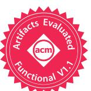
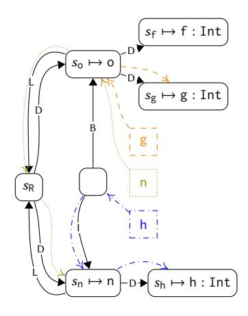
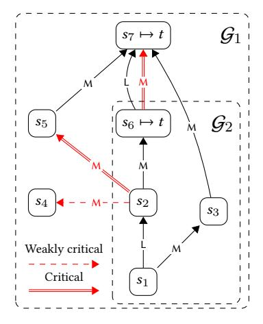

# Knowing When to Ask

Sound Scheduling of Name Resolution in Type Checkers Derived from Declarative Specifications

ARJEN ROUVOET, Delft University of Technology, The Netherlands HENDRIK VAN ANTWERPEN, Delft University of Technology, The Netherlands CASPER BACH POULSEN, Delft University of Technology, The Netherlands ROBBERT KREBBERS, Radboud University and Delft University of Technology, The Netherlands EELCO VISSER, Delft University of Technology, The Netherlands

There is a large gap between the specification of type systems and the implementation of their type checkers, which impedes reasoning about the soundness of the type checker with respect to the specification. A vision to close this gap is to automatically obtain type checkers from declarative programming language specifications. This moves the burden of proving correctness from a case-by-case basis for concrete languages to a single correctness proof for the specification language. This vision is obstructed by an aspect common to all programming languages: name resolution. Naming and scoping are pervasive and complex aspects of the static semantics of programming languages. Implementations of type checkers for languages with name binding features such as modules, imports, classes, and inheritance interleave collection of binding information (i.e., declarations, scoping structure, and imports) and querying that information. This requires scheduling those two aspects in such a way that query answers are stableÐi.e., they are computed only after all relevant binding structure has been collected. Type checkers for concrete languages accomplish stability using language-specific knowledge about the type system.

In this paper we give a language-independent characterization of necessary and sufficient conditions to guarantee stability of name and type queries during type checking in terms of critical edges in an incomplete scope graph. We use critical edges to give a formal small-step operational semantics to a declarative specification language for type systems, that achieves soundness by delaying queries that may depend on missing information. This yields type checkers for the specified languages that are sound by constructionÐi.e., they schedule queries so that the answers are stable, and only accept programs that are name- and type-correct according to the declarative language specification. We implement this approach, and evaluate it against specifications of a small module and record language, as well as subsets of Java and Scala.

CCS Concepts: • Theory of computation → Constraint and logic programming; Operational semantics.

Additional Key Words and Phrases: Name Binding, Type Checker, Statix, Static Semantics, Type Systems

## ACM Reference Format:

Arjen Rouvoet, Hendrik van Antwerpen, Casper Bach Poulsen, Robbert Krebbers, and Eelco Visser. 2020. Knowing When to Ask: Sound Scheduling of Name Resolution in Type Checkers Derived from Declarative Specifications. Proc. ACM Program. Lang. 4, OOPSLA, Article 180 (November 2020), [28](#page-27-0) pages. [https://doi.org/](https://doi.org/10.1145/3428248) [10.1145/3428248](https://doi.org/10.1145/3428248)

Authors' addresses: Arjen Rouvoet, a.j.rouvoet@tudelft.nl, Delft University of Technology, The Netherlands; Hendrik van Antwerpen, h.vanantwerpen@tudelft.nl, Delft University of Technology, The Netherlands; Casper Bach Poulsen, c.b.poulsen@tudelft.nl, Delft University of Technology, The Netherlands; Robbert Krebbers, mail@robbertkrebbers.nl, Radboud University and Delft University of Technology, The Netherlands; Eelco Visser, e.visser@tudelft.nl, Delft University of Technology, The Netherlands.


[This work is licensed under a Creative Commons Attribution 4.0 International License.](http://creativecommons.org/licenses/by/4.0/)

© 2020 Copyright held by the owner/author(s).

2475-1421/2020/11-ART180

<https://doi.org/10.1145/3428248>

```
1 object M { object B { ... }}
2 import M.B;
3 object A {
4 import B._;
5 ...
6 }
7 object B { ... }
                                                1 class A extends B.D {
                                                2 def g:Int = f
                                                3 }
                                                4 object B extends C {}
                                                5 class C {
                                                6 class D { def f:Int = 1 }
                                                7 }
```

(a) Forward reference to shadowing definition.

(b) Inheritance in Scala.

Fig. 1. Scala examples.

## 1 INTRODUCTION

In an ideal world, programming language designers should not have to deal with accidental complexity when defining and implementing languages. Some aspects of language design are already close to realizing this ideal. For example, parser generators make it possible to obtain parsers from declarative grammar specifications, thus abstracting over the accidental complexity of implementing parsing. There should be similar support for generating implementations of type checkers from declarative specifications of type systems.

The variety of language features found in real-world languages presents many challenges in the way of this ideal. This paper focuses on the challenges presented by name resolution, an aspect common to all programming languages. Many language features found in actual languages interact with name resolution. Modules, imports, classes, interfaces, inheritance, overloading, and type-dependent member access to objects and records are a few examples that are commonplace. Implementing type checkers for languages with such features is complicated because the use of names in programs causes dependencies between type-checking tasks, and requires that the construction of symbol tables and type environments is interleaved with querying those data structures. Evaluating a query too early may result in an unstable answerÐi.e., an answer that is invalidated by subsequent additions to the environment or symbol table. A wrong answer can have far reaching consequences, either compromising the soundness of the type checker, or later requiring backtracking on an arbitrary amount of work that depends on the wrong answer.

Consider, for example, the valid Scala program in Fig. [1a.](#page-1-0) A type checker working its way forward through the program would initially resolve **import** B.\_ to the imported object M.B, and type check the remainder of the body of A under the resulting environment. If only then it encounters the local declaration of B on line 7, it needs to redo the type checking of the body of A because the local definition shadows the earlier imported declaration.

To avoid this, the interleaving chosen by the type checker must ensure that query resolution is stableÐi.e., that answers to queries that consult the symbol table are not invalidated by subsequent additions to the environment or symbol table. This can be a non-trivial scheduling problem because environment and symbol table construction can also depend on answering queries.

Languages often have many features that interact with name binding and disambiguation, and as a consequence it can be difficult to construct schedules that guarantee query stability. The simple valid Scala program in Fig. [1b](#page-1-0) shows for example how classes and inheritance interact with name resolution. In this program, the f on line 2 resolves to the **def** f on line 6; but for this resolution to succeed, the qualified reference B.D on line 1 must first have been resolved to the D on line 4, to make the bindings in class **class** D reachable from the body of **class** A. Resolving B.D in turn depends on: (1) resolving the B in B.D to **object** B on line 4; and (2) resolving the C in the extends clause for **object** B on line 4 to the C declaration on line 5.

Determining these dependencies requires a good understanding of the binding and disambiguation rules of a language. The type checking algorithm must take all these dependencies into account, so that names are only resolved once all information that is relevant to their resolution is collected. If this is the case, then the result of name resolution is stable. Type checker implementations use various strategies for stratifying or scheduling the collection and querying of name binding information. Every type checker must, implicitly or explicitly, solve this scheduling problem. For example, Haskell's binding restrictions ensure that binding collection and resolution can be separated into static passes over the program, whereas Scala and Rust require type-dependent name resolution, which requires interleaving type checking and name resolution. A key property of sound strategies is that names are only resolved after all the relevant information has been collected.

The concrete strategies are irrelevant for understanding and reasoning about the underlying type system, but crucial to a correct implementation of the type checker. This tension between implementation and specification is felt by language designers. For example, the Rust language developers write the following about specifying name binding in the language:[1](#page-2-0)

Whilst name resolution is sometimes considered a simple part of the compiler, there are some details in Rust which make it tricky to properly specify and implement.

And in reply to changes to the design and implementation of name binding, a contributor states:[2](#page-2-1)

I'm finding it hard to reason about the precise model proposed here, I admit. I wonder if there is a way to make the write up a bit more declarative.

A more declarative specification should allow reasoning about name binding without having to rely on an understanding of the operational details such as the scheduling of name and type queries. But if we want to obtain type checkers from these declarative specifications, we need to be able to automatically construct sound schedules. In this paper we give a language independent explanation of necessary and sufficient conditions to guarantee stability of name and type queries during type checking. We use this to make declarative type system specifications executable as type checkers for the specified language. Using this approach, we can guarantee that the resulting type checkers are sound with respect to the formal declarative semantics of the specifications, as well as confluent. These important properties of type checkers are proven once-and-for-all for languages specified using our formalism, rather than on a language-by-language basis.

Problem. We start from a specification of an object language's static semantics in the metalanguage Statix [\[van Antwerpen et al.](#page-27-1) [2018\]](#page-27-1). Language specifications in Statix are given by typing rules, written as predicates on terms, types, and a scope graph [\[Neron et al.](#page-27-2) [2015\]](#page-27-2). Scope graphs generalize language specific notions of type environments and symbol tables. A distinguishing feature of Statix are its scope graph assertions and queries, which can be used to give high-level specifications of name resolution. These assertions can express fine-grained name resolution rules, which enable high-level specification of, for example, shadowing rules of Java and Scala.

The problem we face is to derive a type-checker from a Statix specification. Statix's scope graph assertions and queries make it possible to give high-level specifications of name binding, but, at the same time, make the problem of deriving these type checkers more difficult. In particular, we have to solve a generalized version of the scheduling problem described above. That is, we need a general characterization of the conditions under which it is sound to query symbol tables and type environments during type checking. We then need to derive a type checker from a Statix specification in such a way that these conditions are always satisfied.

<span id="page-2-0"></span><sup>1</sup><https://github.com/nrc/rfcs/blob/name-resolution/text/0000-name-resolution.md>

<span id="page-2-1"></span><sup>2</sup><https://github.com/rust-lang/rfcs/pull/1560>

The general approach to deriving type checkers from Statix specifications is already sketched by [van Antwerpen et al.](#page-27-1) [\[2018\]](#page-27-1), who provide a Java implementation. They explain the problem with unsound name resolution when queries answers are unstable, and they claim that their implementation implements a sound strategy. This strategy, however, is only informally described, and lacks evidence of its soundness.

This paper addresses both those deficiencies by formalizing the derivation of type checkers from Statix specifications, and proving soundness. Our formalization of the operational aspects revealed that the Java implementation of Statix is, in fact, not confluent [\[Rouvoet et al.](#page-27-3) [2020b,](#page-27-3) Appendix A], which we address in this paper by refining the scope graph primitives. Confluence is an important property because Statix implements a non-deterministic solver. It ensures that the solver does not have to backtrack on evaluation order. In order to formalize the soundness and confluence results, we develop a theory around the novel concept of critical edges in scope graphs. We believe that this concept is a useful device in both the design of languages, and the implementation of their type checkers. We also hope that the formalization of the operational semantics of Statix makes it feasible to port the novel ideas of Statix about the high-level specification of name binding to other formalisms and type checker implementations.

Approach. To enable this formalization, we first introduce Statix-core. This core language refines and simplifies the previous formulation of the Statix meta-language. The declarative semantics of Statix-core is similar to the declarative semantics of Statix, and explains what are valid type derivations of a specified language. In other words, it explains when a given object-language program, together with a type assignment and a scope graph model of its binding, satisfies the specified static semantics of an object language.

We equip this refined core of Statix with a novel small-step operational semantics. This operational semantics takes a specification and an object-language program, and then computes a type assignment and a scope graph, thus fulfilling the task of a type checker for the object language. The key question of this paper arises when we try to define how queries in Statix compute. What are the conditions that ensure that the answer to a scope graph query is stable under future additions to the scope graph model of binding in the program? Or, how do we know when to ask a query?

To make the condition for query answering precise, we introduce the new idea of critical edges for a query in a scope graph extension, precisely characterizing missing dependencies of the query. Conceptually, query answers that are computed in a partial scope graph are stable if recomputing the answer in a complete model of the program yields the same result. We will show that it is safe to answer a query in a partial graph G when the complete model contains no critical edges for the query with respect to G.

The absence of critical edges in the complete model can in practice not be checked by a type checker because it requires knowing the complete model of binding upfront. We solve this by weakening the condition to a sufficient condition that can be checked. We then impose a wellformedness judgment on Statix-core specifications to also make this tractable in practice. Specifically, typing rules must have permission to extend a scope in the scope graph to be able to make assertions on the scope graph. In practice this means that although scopes can be queried from anywhere, they can only be extended locally with new binding information.

We prove that the operational semantics of Statix-core using the weaker sufficient condition is sound for well-formed specificationsÐi.e., it computes a type assignment and scope graph model that satisfy the specification. Importantly, and in contrast to the implementation of Statix by [van](#page-27-1) [Antwerpen et al.](#page-27-1) [\[2018\]](#page-27-1), the non-deterministic operational semantics can also be proven confluent for the refined Statix-core language. The confluence argument again uses critical edges to reason about stability of query answers.

We implement the operational semantics and the static analysis that checks if all rules have sufficient permissions to extend scopes in Haskell. We give specifications of subsets of Java and Scala in Statix-core (extended with recursive predicates). Using these specifications we also test soundness of the reference implementation against the Java and Scala type checker. These case studies provide evidence of the expressiveness of Statix as a formalism, and show that the wellformedness restriction does not prohibit specifications of complex, real-world binding patterns.

In summary, the contributions of this paper are:

- A semantic characterization of name resolution query answer stability in terms of critical edges in an incomplete scope graph ([ğ5.2\)](#page-16-0).
- Statix-core ([ğ3\)](#page-9-0), a constraint language with built-in support for scope graphs, which distills and refines the core aspects of the Statix language and its declarative semantics due to [van](#page-27-1) [Antwerpen et al.](#page-27-1) [\[2018\]](#page-27-1).
- An operational semantics for Statix-core ([ğ4](#page-12-0) and [ğ5\)](#page-15-0) that schedules name resolution queries such that query answer stability is guaranteed, thereby allowing language designers to abstract from the accidental complexity of implementing name resolution.
- A proof that the operational semantics of Statix-core is sound w.r.t. the declarative semantics of Statix-core ([ğ5.3\)](#page-18-0). The key that enables this proof is a type system for Statix-core (based on permission to extend a scope) and the scheduling criterion that is built into the operational semantics of Statix-core (based on an over-approximation of critical edges).
- MiniStatix, a Haskell implementation of Statix-core extended with (recursive) predicates. The implementation infers whether specifications have sufficient permissions to extend scopes, and can type check programs against their declarative language specification.
- Three case studies ([ğ6\)](#page-21-0) of languages specified in MiniStatix: (1) a subset of Java that includes packages, inner classes, type-dependent name resolution of fields and methods; (2) a subset of Scala with imports and objects; and (3) an implementation of the LMR module system that is similar to the one in Rust. The case studies demonstrate the expressive power and declarative nature of Statix-core, and test the approach against the reference type-checkers of Java and Scala.

## <span id="page-4-0"></span>2 SPECIFYING & SCHEDULING NAME RESOLUTION

Programming languages with modules or objects (e.g., ML, Java, C♯, Scala, or Rust) use very different name resolution rules than languages with only lexical scoping. For example, the static semantics of non-lexical static binding, such as accessing a member of an object o.m, is to resolve the name m not in the local (lexical) scope, but in a remote scope (in this case the inner scope of the class declaration that corresponds to the type of the reference o). Similarly, a name in Scala or Rust is not always resolved in the lexical scope, but sometimes in an explicitly imported module or object scope, whose definitions may be declared in a very different part of the program.

These richer scoping constructs lead to more subtle resolution and disambiguation rules. Scala, for example, applies different scoping rules for names defined in the lexical scope (which can be forward referenced) compared to names that are imported (which cannot). Scala also applies different precedence rules depending on whether an imported name is explicitly listed, or caught by a wildcard. Precedence rules are often incomplete, in the sense that overlapping names sometimes lead to ambiguous uses. This requires more information to be available in environments.

These aspects make it more difficult to both specify, and implement static semantics. In this section we discuss both specification and implementation. We first discuss the role of name binding in the specification of static semantics ([ğ2.1\)](#page-5-0), and how Statix as a formalism enables the high-level specification of the above mentioned features ([ğ2.2\)](#page-6-0). We then discuss how name binding features

```
object o {
  def f:Int = g;
  def g:Int = f
}
                      T-Body
                       + 
                           ′
                            ⊢ bs ⇒ 
                                     ′
                       ⊢ { bs } ⇒ 
                                    ′
                                        T-Seq
                                         ⊢ b ⇒ 
                                                  ′
                                                        ⊢ bs ⇒ 
                                                                  ′′
                                             ⊢ b;bs ⇒ (
                                                         ′ ⊔ 
                                                             ′′)
                                                                      T-Def
                                                                                 ⊢  : 
                                                                       ⊢ (def f :  = ) ⇒ { :  }
```

(a) Mutual binding.

(b) Typing of mutual binding using environments.

Fig. 2. Scala example program and the corresponding typing rules.

contribute to a scheduling problem for type checkers ([ğ2.3\)](#page-7-0). Finally, we show how the innovative features of Statix impact this scheduling problem ([ğ2.4\)](#page-8-0). We will argue that there are two sides to this. On the one hand, these features make the scheduling problem more difficult because value dependencies are less explicit. On the other hand, the high level specification of binding in Statix provides a semantic tool to think about the scheduling problem and recover a provably sound schedule: critical edges. We end this section with an overview of how we use critical edges to address the scheduling problem for Statix.

## <span id="page-5-0"></span>2.1 Name Resolution: Non-lexical Static Binding and Disambiguation

The presence of non-lexical name binding can easily complicate a specification, harming conciseness, understanding, and maintenance of the static semantics rules. Typing rules use type environments to propagate binding information through a program. Type environments are appropriate and easy to use in the specification of static semantics for languages with only lexical binding because lexical binding follows the nesting structure of the AST. This is not the case for languages with non-lexical static scoping, where binding information may flow through references (e.g., module imports), or against the nesting structure of the AST (forward references) [\[Hedin 2000\]](#page-27-4).

To demonstrate the issues that arise in language specification, we consider a simple Scala program. The program in Fig. [2a](#page-5-1) is a well-typed Scala program with two methods in an object o that mutually refer to one another. To specify the static semantics of such a list of mutually recursive definitions, we can follow the style of the ML specification [\[Milner et al.](#page-27-5) [1997\]](#page-27-5), which uses rules of the form ⊢ ⇒ , with the type environment of the phrase , and the context generated by the phrase . The context is downward propagating, whereas is upward propagating. We obtain the rules for block definitions shown in Fig. [2b.](#page-5-1) Name resolution behavior is the result of the way environments are combined in the different rules. The mutually-recursive behavior of the block is visible in rule T-Body, which updates the type environment with the aggregated binding that has propagated upwards from the block. The combination operator + in the premise of T-Body updates the environment such that it shadows bindings in that are also in ′ . The disjoint union ⊔ in the conclusion of T-Seq merges the environments produced by the definitions in the sequence, and enforces that the names do not overlap. We can see in this example that environments play two roles in these rules: to aggregate binding information from the program, and to distribute it throughout the program. Aggregation ties back into distribution at the scope boundary.

The update and disjoint union of environments are examples of bookkeeping operations that encode high-level binding concepts: disallowing duplicate definitions and shadowing respectively. Similarly, the 'cycle' in environment aggregation and distribution encodes mutual recursion. Encoding this using environments is a relatively small matter here, due to the limited number of rules and binding features to take into account. This becomes increasingly more difficult when we add language features that interact with binding and that require more sophisticated disambiguation.

In particular, non-lexical static binding complicates matters significantly: the definitions in Fig. [2a](#page-5-1) are not just locally in scope, but can be accessed from remote use sites, either qualified with the

object o, or unqualified after importing object o. The potential for remote use significantly increases the required effort for aggregating and distributing binding facts. To lookup the structure of modules and classes, we may want to refer to a symbol table. Thus we have to explain through our typing rules how declarations generate unique entries in this symbol table. This requires aggregating all the entries to the root of the program. For the purposes of disambiguation, we may also need more structure in the environment. In Scala for example, we need to look beyond the closest matching binding because additional binders in outer scopes may make a reference ambiguous.

We argue that bookkeeping of environments is not a high-level means for expressing name resolution concepts of languages like Scala. Consequently, it is both unnecessarily hard to define rules that express the right semantics, and unnecessarily difficult to understand the high-level concepts from the written rules. Previous work proposes Statix [\[van Antwerpen et al.](#page-27-1) [2018\]](#page-27-1) to address this problem. In [ğ3,](#page-9-0) we discuss the concepts of Statix. We will show how Scala's name resolution rules can be understood using scope graphs, and made precise using Statix rules.

## <span id="page-6-0"></span>2.2 Declarative Specification using Scope Graphs in Statix

The problem of aggregating and distributing binding information is addressed by Statix in two ways: (1) scopes have independent existence and can be passed around, which allows extending scopes without the need for explicit aggregation, and allows remote access without explicit distribution; and (2) shadowing behavior is specified at the use site, allowing definitions to simply assert the scoping structure without having to anticipate all possible uses. To achieve this, Statix typing rules are predicates on terms and an ambient scope graph. Nodes in the graph represent scopes and binders, whereas (labeled) edges are used to represent (conditional) scope inclusion. Nodes contain a data term that can carry the information of a binder.

The binding of the program in Fig. [2a](#page-5-1) can be summarized as the scope graph in Fig. [3a.](#page-7-1) We write ↦→ for a node with identity and data term . The nodes <sup>R</sup> and <sup>o</sup> represent the root scope and the object scope respectively. The latter is a lexical child of the former, indicated by the L-edge. The object scope contains two declarations, indicated by the two D-edges to declaration nodes, whose data terms f : Int and g : Int contain the usual information about the binders.

Previous work has shown how scope graphs can be used to model many binding structures [\[Neron](#page-27-2) [et al.](#page-27-2) [2015;](#page-27-2) [van Antwerpen et al.](#page-27-6) [2016,](#page-27-6) [2018\]](#page-27-1). The fact that this particular scope graph models the binding of the given program, is made formal through a number of Statix rules, together with the declarative semantics of Statix. We give the required rules here using the Statix-core syntax, so that we can informally discuss how Statix constraints address the problems with declarative specification of binding using environments explained above. We will explain the formal syntax and declarative semantics of Statix-core in [ğ3.](#page-9-0)

The Statix-core counterparts to the ML-specification style rules for the mutual binding in Fig. [2a](#page-5-1) are given in Fig. [3b.](#page-7-1) The Statix specification consists of constraint rules, which define that the typing judgment in the conclusion holds if the constraints in the premises hold. The phrases are typed in a lexical scope , written suggestively as ⊢ . [3](#page-6-1) Premises are separated using conjunction (∗). The fact that blocks introduce new scope is expressed in the rule T-Body by asserting a scope ′ in the scope graph (using ∇ ′ ↦→ ...), connected to the lexical parent by an L-edge (using ′ L ). The declarations are asserted similarly in the rule T-Def using a D-edge.

The first notable difference with the ML-style rules is that the Statix rules have no upward propagating context for aggregating binding. This is unnecessary because of the reference semantics of scopes in Statix rules. The rule T-Def can directly assert the structure that a definition induces

<span id="page-6-1"></span><sup>3</sup>The form of this typing judgment is not enforced in Statix rulesÐi.e., Statix predicates do not have to be defined exclusively over AST terms and can have multiple scope arguments.

<span id="page-7-1"></span>T-Body
$$(\nabla s' \mapsto ()) * (s' \xrightarrow{\bot} s) * (s' \mapsto bs)$$

$$s \mapsto \{bs\}$$

$$T-Def$$

$$(s \mapsto e : T) * (\nabla s' \mapsto (f : T)) * (s \xrightarrow{D} s') * noDups(s, f, s')$$

$$s \mapsto (def f : T = e)$$
(a) Scope graph for Fig. 2a.
(b) Typing rules using Statix-core constraints.

Fig. 3. Scope graph and Statix-core rules for the example in Fig. [2.](#page-5-1)

in the ambient scope graph. Because the scope graph is a global model of binding, this structure does not need to be explicitly aggregated or distributed.

The second difference is in the way that lexical shadowing is specified. Rather than encoding this disambiguation rule using environment update in T-Body, the Statix-core rule only witnesses the structure of the scope graph model. Disambiguation is expressed directly in the rule for typing variables. We postpone the discussion of scope graph queries that fulfill this purpose until [ğ3.](#page-9-0) For now it suffices to know that variable lookup works by finding minimal paths in the scope graph. Shadowing can be expressed by using a lexicographical path order where D < L.

The third difference is that the rule T-Seq is a completely binding-neutral rule. The fact that definitions should be unique in their scope, is expressed directly as a premise noDups(...) on the rule T-Def, rather than being encoded in the way that sequencing aggregates binders. We leave the predicate abstract for now, but it is specified using a graph query in the declaration scope.

Specification of languages with rich, non-lexical name binding features is complicated when using environment-based typing rules. Statix provides a general formalism that allows concise specification of these languages, by removing the concerns of aggregating and distributing binding information from the typing rules.

## <span id="page-7-0"></span>2.3 Sound Type Checkers Require Scheduling

We now turn to the problem of writing a type checker based on a specification of static semantics, focusing on the difficulties surrounding name binding features. We will argue that type checkers face a scheduling problem in constructing the relevant environment and symbol table (or scope graph) to be able to type the names used in a program. Consider again the typing rules in Fig. [2b.](#page-5-1) A type checker arriving at the block faces the problem that the downward propagating input environment is constructed from the upward propagating output environment. For this reason, the type checker needs to be staged: it first needs to aggregate the binding from the block, before it can type check the expressions in the right environment. This simple example demonstrates how name binding induces dependencies between tasks in a type checker. Name resolution (and thus type checking) is only sound with respect to the typing rules if queries are only executed after all relevant information has been aggregated.

The binding features of a language determine how difficult it is to find a sound schedule. A language with forward references requires a schedule in which binding aggregation happens before querying. In our simple example, the schedule can be entirely static: one can always collect all definitions before ever typing their bodies. First class modules and type-dependent name resolution require more dynamic scheduling. For example, the resolution of a member name m in a Java or Scala expression e.m(...) requires the type of e. Typing e can in turn depend on all kinds of name resolution and type-checking tasks. This means that name resolution cannot be statically stratified.

When language engineers develop a type checker for a given language, they implement either such a statically stratified schedule as a number of fixed type-checking passes, or implement a method that in effect schedules type-checking tasks dynamically (even if the scheduling is simply 'on demand'). Soundness of the implemented approach is judged by the language engineers. Our goal is to automatically obtain sound type checkers from typing rules, and therefore we need a systematic approach to solving the scheduling problem.

## <span id="page-8-0"></span>2.4 Sound Schedules from Statix Rules

In [ğ2.3](#page-7-0) we arrived at a sound schedule for the typing of mutually recursive binding simply by lazily following the demand for dependencies. These dependencies are explicit in the environmentbased rules of Fig. [2b.](#page-5-1) In languages with more complex scope and disambiguation rules, the dependencies of name resolution are not as easy to determine. We have argued that environmentbased rules are difficult to specify for such languages. Ensuring that those rules can be evaluated on demand puts additional requirements on the rules, making it even more difficult to write the specification [\[Boyland 2005\]](#page-27-7). (This is a known problem with canonical attribute grammars. We compare in depth to attribute grammars in [ğ7.](#page-23-0)) By decoupling scope from binding and name resolution rules in those scopes, Statix rules can specify complicated languages without regard for dependencies. As a result, more work is required to reconstruct the dependencies and a sound schedule from the rules.

We illustrate this with the Scala program in Fig. [4,](#page-8-1) which combines mutually recursive definitions with imports. The semantics of Scala are such that the definitions in an object are mutually recursive, allowing the forward reference g, while imports are sequential, only allowing references to the imported name h after the import statement. Local definitions have precedence over names imported in the same block, regardless of the order in which the definitions and imports appear in the program.

The scoping structure of our example is modeled with the scope graph shown in Fig. [5.](#page-9-1) The colored dotted boxes show in which scopes names are resolved, with arrows indicating the resolution path. The definitions f and g are declared in the object scope o. Because imports are treated sequentially, import statements induce a scope, connected to the previous

```
object o {
  def f:Int = g;
  import n._;
  def g:Int = h
}
object n {
  def h:Int = 42;
}
```

Fig. 4. Scala example with mutual binding and imports.

import or object scope using a B-edge. The import is represented by an I-edge to the scope <sup>n</sup> of object n. The forward reference g resolves to the definition in the same scope. The reference to h reaches the imported name via the B-edge and the outgoing I-edge.

Name resolution can be specified in terms of queries on the scope graph, which specify reachability and visibility of declarations in terms of a regular expression and an order on paths, respectively ([ğ3.1\)](#page-9-2). In this Scala subset, a declaration is reachable if it can be found in the scope graph via a path that matches the regular expression B ∗ (LB<sup>∗</sup> ) ∗ I ?D. One can check that all the colored paths indeed match the regular expression.

During type checking, the scope graph is constructed from an initial empty graph, by adding more and more scopes and edges, until the graph is a complete model of the binding and scoping structure in the program. Name resolution is finding least reaching paths in the scope graph. Although conceptually simple, difficulty arises because scope graph construction can depend on resolving queries as well as the other way around. This is the case for imports, where the I-edge depends on resolution of the named import. In general, even the fact whether there is an edge at all can depend on name resolution. This means that scope graph construction must be interleaved with query evaluation.

This raises the following concrete scheduling problem: Given a scope graph query, a partial scope graph, and a partially satisfied type specification, is it sound to evaluate the query now or should it be delayed? Conceptually, the answer is 'yes, it is sound' if the answer to the query in the current partial model is the same as the answer in a complete model. The answer is 'no, delay' if the complete model contains additional binding information that is relevant to the query at hand.

To specify what information is relevant, we introduce the notion of critical edges for a query in a model with respect to a partial scope graph. An unstable resolution answer means that a resolution path that is valid in the model graph is not yet a valid path in the partial graph because some part of the final graph is missing. A critical edge of a query is an edge along a resolution path in the model that is not present yet in the partial graph, but whose source node is present. We can think of critical edges as the root cause of instability, as they are the first missing step in a resolution

<span id="page-9-1"></span>

Fig. 5. Scope graph corresponding to the program in Fig. [4.](#page-8-1)

path in the model. Whether an edge is critical is determined based on the regular expression that expresses reachability, which exactly demarcates the part of the scope graph that will be searched.

Because the complete model is yet unknown, we cannot directly identify missing critical edges. Instead, we look ahead at the remaining type checking problem to determine whether any critical edges are still missing. In general, precise determination may require arbitrary type checking, which would lead to a backtracking implementation. Instead, we approximate critical edges as weakly critical edges, whose absence can be determined without backtracking. We show that our approximation is sound for a subset of Statix specifications. Importantly, we can statically determine if a specification is in this subset using a type analysis that we formalize as permission-to-extend.

## <span id="page-9-0"></span>3 STATIX-CORE: A CONSTRAINT LANGUAGE

In this section we introduce Statix-core, modeling the essential ingredients of Statix [\[van Antwerpen](#page-27-1) [et al.](#page-27-1) [2018\]](#page-27-1): a framework for the declarative specification of type systems. Statix specifications have a precise declarative semantics that specifies which scope graphs are models of the specification. They do not have a formal operational semantics that can be used to find a model for a given program if it exists. Such an operational semantics requires a sound scheduling strategy for name and type resolution.

In [ğ3.1](#page-9-2) we first introduce scope graphs formally, together with a concise presentation of its resolution calculus [\[Neron et al.](#page-27-2) [2015;](#page-27-2) [van Antwerpen et al.](#page-27-6) [2016\]](#page-27-6). We then present the syntax ([ğ3.2\)](#page-10-0) and declarative semantics ([ğ3.3\)](#page-11-0) of Statix-core. Subsequently, in [ğ4](#page-12-0) and [ğ5,](#page-15-0) we present the sound operational semantics using a general delay mechanism for queries based on critical edges.

## <span id="page-9-2"></span>3.1 Preliminaries

Statix-core is a constraint language extended with primitives for scope graph assertions and queries. The assertions internalize scope graph construction, whereas the queries internalize scope graph resolution. We discuss what a scope graph comprises, and present resolution in scope graphs as computing the answer to a visibility query.

Scope graphs. A scope graph G is a triple ⟨, , ⟩ where is a set of node identifiers, is a multi-set of labeled, directed edges, and is a finite map from node identifiers to terms. We will write G, <sup>G</sup> and <sup>G</sup> for projecting the three components out of a graph G, and may omit the subscript

when it is unambiguous. We will refer to the term associated with a node identifier as the *datum* of a node. The complete syntax of graphs and terms is given in Fig. 6. We write  $\epsilon$  for the empty graph and  $\mathcal{G} \sqsubseteq \mathcal{G}'$  for the extension order on graphs. On sets we use the notation  $X \sqcup Y$  to denote the *disjoint union* of sets X and Y,  $X \setminus Y$  to denote the set difference, and X : X to denote  $\{x\} \sqcup X$ .

Regular paths. Name resolution is modeled with regular paths in the graph. We write  $\mathcal{G} \vdash p : s \xrightarrow{w} s_k$  to denote that p is a regular (acyclic) path in  $\mathcal{G}$ , starting in s, ending in  $s_k$ , and spelling the word  $s_k$  along its edges. We define the operations  $s_k$  (\_), tgt (\_) and labels (\_) to act on paths and project out the source node  $s_k$ , target node  $s_k$ , and list of labels on the edges, respectively.

*Graph queries.* The answer to a *reachability query*  $s \xrightarrow{r} D$  is a set of regular paths  $s \xrightarrow{w} s'$  such that w matches the regular expression r and the datum of s' inhabits the term predicate D:

$$\operatorname{Ans}\left(\mathcal{G}, s \xrightarrow{r} D\right) = \left\{ p \mid \mathcal{G} \vdash p : s \xrightarrow{w} s' \text{ and } w \in \mathcal{L}(r) \text{ and } \rho_{\mathcal{G}}(s') \in D \right\}$$

We write  $\mathcal{L}(r)$  for the set of words in the regular language described by r. A useful device when we consider partial reaching paths is the Brzozowski derivative [Brzozowski 1964]  $\delta_w r$  of a regular expression r with respect to a word w, whose language is  $\mathcal{L}(\delta_w r) = \{w' \mid ww' \in \mathcal{L}(r)\}$ .

Often we are interested in a refinement of reachability, which we call *visibility*. A datum is visible via a path p only if p is a least reaching path. Given reachability answer A, the subset of visible paths is defined as the minimum of A over a preorder R on paths:

$$min(A, R) = \{ p \in A \mid \forall q \in A. Rqp \Rightarrow Rpq \}$$

Reachability is monotone with respect to graph extension: extending a graph with additional nodes and edges can only make *more* things reachable. In contrast, visibility is *non-monotonic* with respect to graph extension: extending a graph with additional nodes and edges may obscure—i.e., shadow—information that was previously visible.

We can now formally state the notion of stability of query answers that is key to the correct implementation of static name resolution: a query (answer) q is said to be *stable* between graphs  $\mathcal{G} \sqsubseteq \mathcal{G}'$ , when the answer set for the query is identical in both graphs: i.e. Ans  $(\mathcal{G}, q) = \text{Ans } (\mathcal{G}', q)$ .

#### <span id="page-10-0"></span>3.2 Syntax of Statix-core

We introduce the constraint language Statix-core for making assertions about terms and an implicit, ambient scope graph. The syntax is defined in Fig. 6. We summarize the main syntactic categories.

Terms t are either variables x, compound terms  $f(t^*)$ , graph edge-labels l, graph nodes s, or graph edges  $t \stackrel{l}{\longrightarrow} t$ . Importantly, nodes only appear as an artifact of substitution in the operational semantics and do not appear in source constraint problems. Literals for sets of terms  $\bar{t}$  are used to represent query answer sets in programs and are generated from the disjoint union of singletons and empty sets. Sets of terms are implicitly understood to exist up to reordering.

Constraints C define assertions on terms and an underlying scope graph. As we shall see in §3.3, constraint satisfaction uses a notion of *ownership*, which gives the semantics a separation logic [O'Hearn et al. 2001] flavor. This is reflected in the syntax of Statix-core where we use C \* C for *separating* conjunction, and emp and false for the neutral and absorbing elements of \*, respectively. The  $t_1 = t_2$  constraint asserts that  $t_1$  and  $t_2$  are equal. The x binder in existential quantification  $\exists x.C$  ranges over all possible terms, whereas the x in universal quantification  $\forall x$  in  $\overline{t}.C$  ranges over members in a given finite set of terms  $\overline{t}$ .

The assertions on the ambient scope graph  $\mathcal{G}$  come in two flavors: node and edge assertion. The former is written  $\nabla t_1 \mapsto t_2$  and assert that  $t_1$  is a node  $s \in S_{\mathcal{G}}$  such that  $\rho_{\mathcal{G}}(s) = t_2$ . The node assertion gets unique ownership of s, such that no other node assertion can observe the same

```
Signature
                                                                  Variables
    \in
          I
                                           label
                                                                  x \in X
                                                                                  term variable
                                                                  z \in \mathcal{Z}
f \in \mathcal{F} term constructor symbol
                                                                                     set variable
                        regular expression
                                                                  s \in V
                                                                                     node name
Terms
                                                                  Sets of Terms
t \in \mathcal{T} ::=
                                      variable
                                                                  \bar{t} ::= z \mid \zeta
                                                                                          set variable and set literal
           | f(t^*) compound term
                                                                  \zeta ::= \emptyset \mid \{t\}
                                                                                            empty and singleton set
                           label and node
                                                                            \zeta \sqcup \zeta
                                                                                                          disjoint union
Graphs
\mathcal{G} ::= \langle S \subseteq \mathcal{V}, E \subseteq (\mathcal{V} \times \mathcal{I} \times \mathcal{V}), \rho \subseteq (\mathcal{V} \to \mathcal{T}) \rangle
Constraints
C ::= emp \mid false
                                                                                                     true and false
       | C*C
                                                                                         separating conjunction
       | t = t \mid \exists x.C
                                                                            term equality and quantification
       single(t, \bar{t}) \mid \min(\bar{t}, R, \bar{t}) \mid \forall x \text{ in } \bar{t}.C set singletons, minimum and quantification
       \nabla t \mapsto t \mid t \stackrel{l}{\longrightarrow} t
                                                                                       node and edge assertion
             query t \xrightarrow{r} D as z.C \mid dataOf(t, t)
                                                                               graph query and data retrieval
```

Fig. 6. Syntax of Statix-core.

fact about the model  $\mathcal{G}$ . Similarly, edge assertions  $t_1 \xrightarrow{l} t_2$  assert unique ownership of an edge  $(t_1, l, t_2) \in E_{\mathcal{G}}$ . The dataOf $(t_1, t_2)$  constraint asserts that the data associated with node  $t_1$  is  $t_2$ .

Query constraints (query  $t \xrightarrow{r} D$  as z.C) internalize the reachability queries from §3.1: we query node t for the set of all reaching paths over the regular expression r to nodes whose data satisfy the predicate D, and bind the query result to z in C. Queries yield sets of paths (embedded as terms) which motivates the need for set literals, forall quantification over these, and the single  $(t, \bar{t})$  constraint which asserts that  $\bar{t}$  is a singleton set containing just the element t. The constraint  $\min(\bar{t}, R, \bar{t}')$  asserts that the latter set of terms is the minimum of the former over the preorder R and is used to specify disambiguation of a set of reaching paths to the set of visible paths. We implicitly convert between mathematical sets and term set syntax where necessary. We assume that the set  $\mathcal{F}$  of term constructor symbols contains the necessary constructors to encode paths.

#### <span id="page-11-0"></span>3.3 Declarative Semantics of Statix-core

The meaning of constraints is given by the *constraint satisfaction* relation that is inductively defined by the rules in Fig. 7. Satisfiability is expressed as  $\mathcal{G} \models_{\sigma} C$ , stating that the graph  $\mathcal{G}$  satisfies the closed constraint C with graph support  $\sigma = \langle S, E \rangle$ , where  $S \subseteq S_{\mathcal{G}}$  and  $E \subseteq E_{\mathcal{G}}$ . In case the satisfaction judgment holds, we say that  $\mathcal{G}$  is a model for the constraint C.

We lift the declarative semantics to open constraints in the usual way and write  $\mathcal{G}$ ,  $\varphi \models_{\sigma} C$  to denote  $\mathcal{G} \models_{\sigma} C\varphi$ . We also define constraint entailment  $\Vdash$  and equivalence  $\dashv$  $\vdash$ , which we will use when we consider the properties of the operational semantics:

$$\frac{\mathsf{Entails}}{\forall \mathcal{G}, \varphi, \sigma. \, (\mathcal{G}, \varphi \models_{\sigma} C_1 \; \mathsf{implies} \; \mathcal{G}, \varphi \models_{\sigma} C_2)}{C_1 \Vdash C_2} \qquad \qquad \frac{\mathsf{Equivalent}}{C_1 \Vdash C_2} \\ \\ \frac{C_1 \Vdash C_2}{C_1 \dashv_{\vdash} C_2}$$

The graph support declaratively expresses *ownership* of graph structure in constraints. The role of support in constraint satisfiability gives the resulting logic a separation logic flavor. Support is

<span id="page-12-1"></span>
$$\begin{array}{c|ccccccccccccccccccccccccccccccccccc$$

Fig. 7. Statix constraint satisfiability.

distributed linearly, which means that we get the constraint equivalences of linear logics: conjunction is commutative and associative and has emp as its identity and false as the absorbing element, but the left and right elimination rules of conjunction do not hold.

We lift set operations pointwise to graph support. A particularly important operation is the disjoint union, written <sup>1</sup> ⊔ 2, which is defined as <sup>1</sup> ∪ 2, if and only if <sup>1</sup> ∩ <sup>2</sup> is empty. We write ⊥ to denote empty support and distinguish fully supported models from unsupported ones:

$$\frac{\mathcal{G} \models_{\langle S_{\mathcal{G}}, E_{\mathcal{G}} \rangle} C}{\mathcal{G} \models C} \text{ Supported}$$

Intuitively, a model G is supported by a constraint when every node and edge in it is asserted by . For top-level constraints, we are exclusively interested in supported models. Models that are not fully supported at the top-level contain łjunkž: graph structure that is not asserted by the Statix specification. For our problem domain it does not make sense to consider those models, as they would contain binding structure that does not correspond to the input program. Not every constraint that has a model also has a supported one. Consider for example the following constraint:

$$\exists s. \left( \mathsf{query} \ s \xrightarrow{P*} D \ \mathsf{as} \ z. \left( \exists x. \mathsf{single}(x,z) \right) \right)$$

Whenever is inhabited, there are clearly graphs that satisfy the constraint. None of those graphs are supported, however, because there are no node or edge assertions. This means that the whole constraint has empty support and the empty graph is not a model of the query.

## <span id="page-12-0"></span>4 SOLVING CONSTRAINTS

Our goal is to derive, from the Statix specification of a type system, an executable type checker. A sound type checker should take a specification and an input program and construct the ambient scope graph G such that G and together obey the specification. Or, if and only if the program does not obey the specification, produce an error. Our approach to this is to equip Statix-core with

<span id="page-13-0"></span>
$$\begin{array}{c} \kappa \rightarrow \kappa' \\ \\ \\ OP\text{-Conj} \\ \left\langle \mathcal{G} \mid (C_1 \ast C_2) ; \overline{C} \right\rangle \rightarrow \left\langle \mathcal{G} \mid C_1; C_2; \overline{C} \right\rangle \\ \\ \\ OP\text{-EQ-TRUE} \\ \\ \hline \\ OP\text{-EQ-FALSE} \\ \hline \\ \neg \exists \varphi. t_1 \varphi = t_2 \varphi \\ \hline \\ \left\langle \mathcal{G} \mid (t_1 = t_2) ; \overline{C} \right\rangle \rightarrow \left\langle \mathcal{G} \mid \{ \text{false} \} \right\rangle \\ \\ \\ OP\text{-EXISTS} \\ \\ y \text{ is fresh for } \mathcal{G} \text{ and } \overline{C} \\ \hline \\ \left\langle \mathcal{G} \mid (\exists x.C) ; \overline{C} \right\rangle \rightarrow \left\langle \mathcal{G} \mid C \left[ y/x \right] ; \overline{C} \right\rangle \\ \\ OP\text{-SINGLETON-TRUE} \\ \left\langle \mathcal{G} \mid \text{single}(t, \{t'\}) ; \overline{C} \right\rangle \rightarrow \left\langle \mathcal{G} \mid (t = t') ; \overline{C} \right\rangle \\ \\ \\ OP\text{-Node-Fresh} \\ \\ S \notin S \\ \hline \\ \left\langle \langle S, E, \rho \rangle \mid (\nabla x \mapsto t) ; \overline{C} \right\rangle \rightarrow \left\langle \langle (s; S), E, \rho[s \rightarrow t] \left[ s/x \right] \right\rangle \mid \overline{C} \left[ s/x \right] \right\rangle \\ \\ OP\text{-Node-Stale} \\ \\ t_2 \text{ is not a variable} \\ \\ \\ \left\langle \mathcal{G} \mid (\nabla t_2 \mapsto t_1) ; \overline{C} \right\rangle \rightarrow \left\langle \mathcal{G} \mid \{ \text{false} \} \right\rangle \\ \\ OP\text{-DATA} \\ \\ OP\text{-DATA} \\ \\ \left\langle \mathcal{G} \mid \text{dataOf}(s, t_1) ; \overline{C} \right\rangle \rightarrow \left\langle \mathcal{G} \mid (t_1 = t_2) ; \overline{C} \right\rangle \\ \\ OP\text{-Edge} \\ \left\langle \langle S, E, \rho \rangle \mid (s_1 \xrightarrow{l} \bullet s_2) ; \overline{C} \right\rangle \rightarrow \left\langle \langle S, (s_1, l, s_2) ; E, \rho \rangle \mid \overline{C} \right\rangle \\ \\ OP\text{-DEGGE} \\ \left\langle \langle S, E, \rho \rangle \mid (s_1 \xrightarrow{l} \bullet s_2) ; \overline{C} \right\rangle \rightarrow \left\langle \langle S, (s_1, l, s_2) ; E, \rho \rangle \mid \overline{C} \right\rangle \\ \\ \\ OP\text{-DEDGE} \\ \left\langle S, E, \rho \rangle \mid (s_1 \xrightarrow{l} \bullet s_2) ; \overline{C} \right\rangle \rightarrow \left\langle \langle S, (s_1, l, s_2) ; E, \rho \rangle \mid \overline{C} \right\rangle \\ \\ \\ OP\text{-DATA} \\ \left\langle \mathcal{G} \mid \text{dataOf}(s, t_1) ; \overline{C} \right\rangle \rightarrow \left\langle \mathcal{G} \mid (t_1 = t_2) ; \overline{C} \right\rangle \\ \\ OP\text{-DATA} \\ \left\langle \mathcal{G} \mid \text{dataOf}(s, t_1) ; \overline{C} \right\rangle \rightarrow \left\langle \mathcal{G} \mid (t_1 = t_2) ; \overline{C} \right\rangle \\ \\ \\ OP\text{-DATA} \\ \left\langle \mathcal{G} \mid \text{dataOf}(s, t_1) ; \overline{C} \right\rangle \rightarrow \left\langle \mathcal{G} \mid (t_1 = t_2) ; \overline{C} \right\rangle \\ \\ OP\text{-DATA} \\ \left\langle \mathcal{G} \mid \text{dataOf}(s, t_1) ; \overline{C} \right\rangle \rightarrow \left\langle \mathcal{G} \mid (t_1 = t_2) ; \overline{C} \right\rangle \\ \\ \\ OP\text{-DATA} \\ \left\langle \mathcal{G} \mid \text{dataOf}(s, t_1) ; \overline{C} \right\rangle \rightarrow \left\langle \mathcal{G} \mid (t_1 = t_2) ; \overline{C} \right\rangle \\ \\ OP\text{-DATA} \\ \left\langle \mathcal{G} \mid \text{dataOf}(s, t_1) ; \overline{C} \right\rangle \rightarrow \left\langle \mathcal{G} \mid (t_1 = t_2) ; \overline{C} \right\rangle \\ \\ OP\text{-DATA} \\ \left\langle \mathcal{G} \mid \text{dataOf}(s, t_1) ; \overline{C} \right\rangle \rightarrow \left\langle \mathcal{G} \mid (t_1 = t_2) ; \overline{C} \right\rangle$$

Fig. 8. Operational semantics of Statix without queries (complete rules in Rouvoet et al. [2020b, Appendix B]).

an operational semantics that reduces constraints, as generated over a program, to a graph that satisfies the constraint according to the declarative semantics, or rejects the constraint *if and only if* such a graph does not exist. In this section we describe such an operational semantics *without queries*. We show that the operational semantics enjoys confluence and soundness with respect to the declarative semantics. Extending the operational semantics to queries requires us to schedule constraint solving such that the (implicit) dependencies between graph construction and query resolution are appropriately respected. In §5 we formally discuss a naive, unsound strategy, and develop a sound strategy derived from a formal characterization of a criterion for answer stability: absence of critical edges in graph extensions.

#### 4.1 The Small-Step Operational Semantics

The operational semantics of Statix without queries is a small-step semantics defined on state tuples  $\langle \mathcal{G} \mid \overline{C} \rangle$ , where  $\mathcal{G}$  is a graph and  $\overline{C}$  is a set of constraints that is repeatedly simplified. The interesting rules are displayed in Fig. 8. The full operational semantics can be found in Rouvoet et al. [2020b, Appendix B]. Semantically we treat the constraint set as a large conjunction and we non-deterministically pick a constraint from this set to perform a step on.

A constraint C is solved by constructing an initial state  $\kappa$  as  $\langle \epsilon \mid \{C\} \rangle$  and repeatedly stepping until a final or stuck state  $\kappa'$  is reached. We say that the operational semantics *accepts* C iff it reaches a final state  $\langle \mathcal{G} \mid \emptyset \rangle$  and *rejects* C iff it reaches a final state  $\langle \mathcal{G} \mid \{\text{false}\} \rangle$ . Any other states in which we cannot reduce by taking a step are said to be *stuck*.

The rules for the usual logical connectives (emp, false,  $C_1 * C_2$ , =,  $\exists$ ,  $\forall$ , and single) are standard. The rule for answer set minimums simply proceeds by computation. For  $\nabla t_1 \mapsto t_2$  there are two rules. If  $t_1$  is a variable x, rule Op-Node-Fresh will extend the graph with a fresh node s, claim unique ownership over it, and substitute s for x everywhere. If  $t_1$  is not a variable, specifically if it is a node, then it must be owned already and the rule Op-Node-Stale rejects the constraint by stepping to {false}. For example, both rules would be executed once for the specification  $\nabla x \mapsto () * \nabla x \mapsto ()$ : one of the constraints gets ownership, and the other fails to get it. Edge assertions  $t_1 \stackrel{l}{\longrightarrow} t_2$  construct new edges in the graph via Op-Edge when both endpoints have become nodes. Multiple edges with the same label between the same endpoints can exist separately—i.e., there is no edge counterpart to the be Op-Node-Stale rule. Data assertions dataOf( $t_1$ ,  $t_2$ ) compute by unification when the node  $t_1$  becomes ground.

#### 4.2 Properties of the Operational Semantics

We will show that the operational interpretation of a Statix-core specification is sound with respect to the declarative reading. That is, if the operational semantics accepts a constraint C, then the resulting graph is a *supported model* for C. And additionally, if the operational semantics rejects a constraint C, then there exists no supported model for C. From the perspective of the object language semantics defined in Statix-core this means that the derived type-checker is sound by construction with respect to the typing rules of the language.

If we extend our declarative semantics for constraints to states, we can state the soundness criterion more concisely and uniformly. We accomplish this via an *embedding* of states into constraints:

<span id="page-14-0"></span>Definition 4.1. The embedding of a graph  $\langle V, E, \rho \rangle$  and the embedding of a state  $\langle \mathcal{G} \mid \overline{C} \rangle$  are defined as follows:

$$[\![\langle V, E, \rho \rangle]\!] = \left( \underset{s \in V}{*} \nabla s \mapsto \rho(s) \right) * \left( \underset{(s, l, s') \in E}{*} (s \xrightarrow{l} s') \right) \qquad [\![\langle \mathcal{G} \mid \overline{C} \rangle]\!] = [\![\mathcal{G}]\!] * \left( \underset{\overline{C}}{*} \overline{C} \right)$$

The soundness criterion can now be stated in terms of constraint equivalence between initial and final states. Specifically, we will show that the following theorem holds:

<span id="page-14-1"></span>Theorem 4.2 (Soundness of Statix-core without queries). Let  $\kappa$  be either an accepting or rejecting state. The operational semantics for Statix-core without queries is sound:

$$\langle \epsilon \mid \{C\} \rangle \rightarrow^* \kappa \text{ implies } C + \llbracket \kappa \rrbracket$$

This is equivalent to the aforementioned informal definition of soundness, which can be shown using the facts that top-level constraints are closed and that graphs are trivially a model for their own embedding. We would like to prove this statement by induction on the trace of steps. This requires us to show that individual steps operate along constraint equivalences—i.e., that  $\kappa_1 \to \kappa_2$  implies  $[\![\kappa_1]\!] + [\![\kappa_2]\!]$ . Indeed, this is the case for many of the rules. For example, Op-Conj and Op-Emp rewrite along commutativity, associativity, and identity of the separating conjunction. The rules for existential quantification and node assertion, however, cannot be justified using logical equivalences. To this end we define a more general notion of *preserving satisfiability*:

Definition 4.3. We write  $C_1 \nleq C_2$  to denote that  $C_2$  is satisfiable when  $C_1$  is satisfiable, that is, the existence of a model  $\mathcal{G}$  for open constraint  $C_1$ , implies that  $\mathcal{G}$  is also a model for  $C_2$ , but modulo graph equivalence ( $\approx$ ):

$$\frac{\forall \mathcal{G}_1, \varphi_1. \ (\mathcal{G}_1, \varphi_1 \models C_1 \text{ implies } (\exists \mathcal{G}_2, \varphi_2. \mathcal{G}_2, \varphi_2 \models C_2 \quad \text{ s.t. } \mathcal{G}_1 \approx \mathcal{G}_2))}{C_1 \models C_2}$$

We also define the symmetric counterpart  $C_1 \rightharpoonup C_2 \equiv C_1 \rightharpoonup C_2$ , which denotes preservation of satisfiability. For top-level (closed) constraints this notion of preserving satisfiability coincides with constraint equivalence. Furthermore, constraint entailment  $C_1 \rightharpoonup C_2$  always implies  $C_1 \rightharpoonup C_2$ , allowing the use of laws such as identity, commutativity, and associativity of the separating conjunction when we reason about preservation of satisfiability. Steps in the operational semantics are semantically justified in that they preserve satisfiability of the constraint problem:

<span id="page-15-1"></span>Lemma 4.4. Steps preserves satisfiability: 
$$\kappa_1 \to \kappa_2$$
 implies  $[\![\kappa_1]\!] \sim [\![\kappa_2]\!]$ 

This may feel counter-intuitive, as steps construct a graph and preservation of satisfiability demands equivalent graphs as the model for the left- and right-hand-sides of the step. The key to understanding this lies in Def. 4.1 of the state embedding together with the rules for graph construction Op-Node-True and Op-Edge, which show that bits of graph (support) are *merely moved* between the constraint program and the (partial) model. In the initial state the entire model should be specified in the input constraint and in the final state the entire model is a given.

PROOF SKETCH. The proof is by case analysis on the constraint that is the focus of the step. Many cases can indeed be proven using logical equivalences. Other cases, such as the elimination of existential quantifiers rely on the commutativity of substitutions with embedding of states. The graph equivalence is trivial everywhere, except for the step Op-Node-True. An arbitrary *fresh* node is chosen there, which means that the models for the different sides of the step are only equal up-to renaming of nodes.

As a consequence of Lemma 4.4, the operational semantics enjoys soundness with respect to the declarative semantics (Thm. 4.2).

PROOF SKETCH OF THM. 4.2. The embeddings of the initial and final states reduce to C and  $[\![\mathcal{G}]\!]$  respectively. We repeatedly apply the fact that steps preserve satisfiability and prove  $C \bowtie [\![\mathcal{G}]\!]$ . Now we make use of the fact that graphs are trivially a supported model for their own embedding:  $\mathcal{G} \models [\![\mathcal{G}]\!]$ . By the above constraint equivalence,  $\mathcal{G}$  must then also be a supported model for C up-to renaming of nodes. The theorem follows from the fact that constraint satisfaction is preserved by consistent renaming of nodes in the model and the constraint, and the fact that node renaming vanishes on top-level constraints.

The operational semantics is non-deterministic, but confluent. This can be shown to hold by proving the diamond property for the reflexive closure of the step relation. A sketch of the proof can be found in the [Rouvoet et al. 2020b, Appendix A].

Theorem 4.5 (Confluence). If  $\kappa \to^* \kappa_1$  and  $\kappa \to^* \kappa_2$  then there exists  $\kappa_1'$  and  $\kappa_2'$  such that  $\kappa_1 \to^* \kappa_1'$  and  $\kappa_2 \to^* \kappa_2'$  where  $\kappa_1' \approx \kappa_2'$ .

### <span id="page-15-0"></span>5 SOLVING QUERIES: KNOWING WHEN TO ASK

We address the problem of extending the Statix-core operational semantics to support queries. First we improve our understanding of the problem, by considering a naive semantics that answers queries unconditionally. We show that this approach yields unsound name resolution by violating answer stability. A rule for queries needs to ensure that query answers are stable. We develop the sound rule in three steps: (1) We characterize the scope graph extensions that causes query answer instability (§5.1) and show that we can guarantee stability by ensuring the *absence of (weakly) critical edge* extensions. (2) We describe a fragment of *well-formed* constraint programs for which it is feasible to check, without constraint solving, that certain graph edges cannot exist in any future graph (§5.3), addressing the problem that the complete scope graph is unknown during

type checking. (3) We obtain an operational semantics for well-formed Statix-core constraints with queries by guarding query simplification by the absence of weakly critical edges in all future graphs. We prove that this guarded rule preserves satisfiability and thus yields a sound operational semantics (§5.3, Thm. 5.9). In §6 we discuss case studies we conducted to test the completeness of the operational semantics.

## <span id="page-16-1"></span>5.1 Naive Query Answering

Consider a naive and unconditional rule for queries query  $s \xrightarrow{r} D$  as z.C:

$$\frac{\overline{t} = \mathsf{Ans}\left(\mathcal{G}, s \xrightarrow{r} D\right)}{\left\langle \mathcal{G} \mid \mathsf{query} \ s \xrightarrow{r} D \ \mathsf{as} \ z.C; \overline{C} \right\rangle \rightarrow \left\langle \mathcal{G} \mid C\left[\overline{t}/z\right]; \overline{C} \right\rangle} \ \mathsf{Op-Query-Naive}$$

It solves them by answering the given reachability query in the incomplete graph that is part of the solver state at that time. It then simplifies the constraint program by substituting the answer set into *C*. This rule is *unsound*: it results in graphs that are not models of the input constraint. Consider the following example:

$$\overline{C} = \nabla x \mapsto (); \nabla y \mapsto (); \text{ query } x \xrightarrow{P+} \top \text{ as } z. (\forall x' \text{ in } z. \text{ false}); x \xrightarrow{P} y$$

The query in these constraints asks for any node that is reachable in the graph after traversing at least one P-labeled edge, starting in the node for the variable x. It then asserts (via  $\forall x'$  in z.false) that the answer to this query is empty. A complete trace for this example is visualized in Fig. 9. Clearly, the final graph in Fig. 9 is *not* a model for the input constraint. The answer to the query in the final graph is non-empty: there is a single path in the answer consisting of the only edge in the graph. The reason for this faulty behavior can be reduced to two observations: (1) the naive solver answers queries based on incomplete information, namely the partial graph that happens to be part of its state at that point in the trace, and (2) query answers are in general not stable under graph extensions that occur later in the constraint solver. This raises the question: what additional conditions must hold in a given state such that query solving *is sound*—i.e., under what side-condition is the following rule for query answering sound?

$$\left\langle \mathcal{G} \mid \mathsf{query} \; s \xrightarrow{r} D \; \mathsf{as} \; z.C; \overline{C} \right\rangle \rightarrow \left\langle \mathcal{G} \mid C \left[ \mathsf{Ans} \left( \mathcal{G}, s \xrightarrow{r} D \right) / z \right]; \overline{C} \right\rangle$$

In order to prove that this rule is sound, it suffices to prove that it preserves satisfiability, as is the case for the other steps of the operational semantics (c.f. Lemma 4.4). Concretely, to show that this rule preserves satisfiability, we have to prove:

$$\llbracket \mathcal{G} \rrbracket * \text{query } s \xrightarrow{r} D \text{ as } z.C; \overline{C} * \left( \bigstar \overline{C} \right) \sim \llbracket \mathcal{G} \rrbracket * C \left[ \text{Ans} \left( \mathcal{G}, s_1 \xrightarrow{r} D \right) / z \right] * \left( \bigstar \overline{C} \right)$$

This means that every supported model  $\mathcal{G}'$  for the left constraint must be a supported model for the right constraint as well, and vice versa. When is this the case? It holds exactly when the query  $s \xrightarrow{r} D$  is stable for the graph extension  $\mathcal{G} \sqsubseteq \mathcal{G}'$ . Or, in the terms of the application domain of Statix, it holds if all *relevant* namebinding information that may influence resolution of the specified name is present in  $\mathcal{G}$ . That means, for example, that no further names will be discovered in the remainder of the program that shadow declarations that are reachable in the current graph  $\mathcal{G}$ .

#### <span id="page-16-0"></span>5.2 Ensuring Answer Stability

In this section we untangle the definition of stability under graph extension and find the *root cause* of instability: *critical edges* in a scope graph extension. To guarantee query stability, we want to prevent that the solver extends the graph with critical edges. We argue however that the absence

<span id="page-17-0"></span>

Fig. 9. Trace demonstrating unsoundness of a naive query simplification rule.

of critical edges is too strong a notion for a solver to verify. To remedy this, we derive the notion of a *weakly critical edge* which only considers the extension boundary.

To appoint a *root cause of instability* of reachability queries under graph extensions  $\mathcal{G} \sqsubseteq \mathcal{G}'$ , we focus on paths that exist in  $\mathcal{G}'$ , but not in  $\mathcal{G}$ :

$$p \in \mathsf{Ans}\left(\mathcal{G}', s_1 \xrightarrow{r} D\right) \setminus \mathsf{Ans}\left(\mathcal{G}, s_1 \xrightarrow{r} D\right)$$

Because the start node of every path in the answer set of a query is fixed (in this case to  $s_1$ ) they can always be partitioned into a non-empty prefix in G and the remainder. The first edge of the remainder can be considered the root cause for this new path in G'. We call such edges *critical*:

Definition 5.1. An edge  $(s_1, l, s_2) \in E_{\mathcal{G}'}$  is called *critical* with respect to a graph extension  $\mathcal{G} \sqsubseteq \mathcal{G}'$  and a query  $s \xrightarrow{r} D$  if there exist paths  $p_1$  and  $p_2$  that satisfy the following conditions:

- (a)  $\mathcal{G} \vdash p_1 : s \xrightarrow{w_1} s_1$  for some word  $w_1$ ,
- (b)  $\mathcal{G}' \vdash p_2 : s_2 \xrightarrow{w_2} s_3$  for some node  $s_3$  and word  $w_2$ ,
- (c)  $(p_1 \cdot l \cdot p_2) \in \mathsf{Ans}\left(\mathcal{G}', s_1 \xrightarrow{r} D\right)$ ,
- (d) and  $(s_1, l, s_2) \notin E_G$ .

Fig. 10 visualizes the critical edges for a particular graph extension and query. Critical edges for a query are interesting because *their absence* in a graph extension guarantees stability of the answer to that query:



<span id="page-17-1"></span>Fig. 10. (Weakly) critical edges for the query  $s_1 \xrightarrow{LM^*} D$  (if  $t \in D$ ).

<span id="page-17-2"></span>LEMMA 5.2 (ABSENCE OF CRITICAL EDGES). A reachability query  $s \xrightarrow{r} D$  is stable under graph extension  $G \sqsubseteq G'$  iff  $G \sqsubseteq G'$  contains no critical edges for  $s \xrightarrow{r} D$ .

PROOF. This absence of critical edges implies stability because *every* path that answers a query that is in the extended graph  $\mathcal{G}'$  but not in the original graph  $\mathcal{G}$  can be partitioned as  $p_1 \cdot l \cdot p_2$  such that  $(\mathsf{tgt}(p_1), l, \mathsf{src}(p_2))$  is a critical edge. Consequently, the absence of critical edges in an extension immediately implies that the extended graph yields no new answers to the query under scrutiny. The other direction of this lemma holds trivially.

As indicated by Lemma 5.2, it would be sufficient for the rule for queries to require the absence of critical edges in future graphs. The problematic question however is: critical with respect to

which graph extension? Indeed, the graphs  $\mathcal{G}'$  that Lemma 5.2 quantifies over are *all future graphs* of a trace in the operational semantics. Precisely knowing  $\mathcal{G}'$  is as difficult as solving the constraint program. Hence it is not feasible for a solver to guard against the absence of critical edges with pinpoint accuracy. In the remainder of this section we describe a two-part approach to sound operation of a non-backtracking solver based on *over-approximating* the criticality of an edge.

Weakly critical edges. Because the notion of criticality is derived from entire new reaching paths in graph extensions, guarding against critical edge extensions requires looking ahead over arbitrary constraint solving. Our approximation, a weakly critical edge, reduces the required lookahead to just one-edge extensions of the current graph:

Definition 5.3. An edge  $(s_1, l, s_2)$  is called *weakly critical* with respect to a graph  $\mathcal{G}$  and a query  $s \xrightarrow{r} D$  if there exists a path  $p_1$  that satisfies the following conditions:

- (a)  $\mathcal{G} \vdash p_1 : s \xrightarrow{w_1} s_1$  for some word  $w_1$ ,
- (b) the word  $(w_1 l)$  is a prefix of some word in  $\mathcal{L}(r)$ ,
- (c) and  $(s_1, l, s_2) \notin E_G$ .

In Fig. 10 an edge is highlighted that is only weakly critical: it shares all the features of a critical edge except that it does not actually give rise to new paths in the answer set of the query. The intuition behind a weakly critical edge is that it may lead to additional reaching paths. Every critical edge is also weakly critical, such that the following corollary holds:

<span id="page-18-1"></span>COROLLARY 5.4. A reachability query  $Q = s \xrightarrow{r} D$  is stable under graph extension  $G_1 \sqsubseteq G_2$  if the graph extension  $G_1 \sqsubseteq G_2$  contains no edges that are weakly critical for Q.

PROOF. Every critical edge is also weakly critical because  $(p_1 \cdot l \cdot p_2) \in \mathsf{Ans}\left(\mathcal{G}', s_1 \xrightarrow{r} D\right)$  implies that (wl) is a prefix of some word in  $\mathcal{L}(r)$ , for  $w = \mathsf{labels}\left(p_1\right)$ . The conclusion then immediately follows from Lemma 5.2.

Because visibility is defined as the minimum of a reachability query answer (§3.1), the absence of weakly critical edges is also a *sufficient condition* for stability of visibility query answers.

COROLLARY 5.5 (ABSENCE OF WEAKLY CRITICAL EDGES). A visibility query  $Q = s \xrightarrow{r} D$  is stable under graph extension  $G_1 \sqsubseteq G_2$  if the graph extension  $G_1 \sqsubseteq G_2$  contains no edges that are weakly critical for Q.

Consequently, the absence of weakly critical edges is also sufficient to guarantee the soundness of visibility queries with any path order  $\leq_p$ . However, for particular choices of the path order there exist tractable approximations of criticality of edges for stability of reachability that are more precise than weak criticality. For example, the path ordering is often defined as the lexicographical extension of a precedence ordering on edge labels. Edge extensions of the graph with lower precedence than existing edges can in that case be disregarded as influential to name resolution. Our results extend to such refinements in a straightforward manner.

#### <span id="page-18-0"></span>5.3 Guarded Query Answering

By means of a well-formedness judgment  $\vdash C$  wf on Statix-core constraints, we define a large class of constraints for which we can check the absence of weakly critical edges. To this end we will also define a predicate  $C \nleftrightarrow (s, l)$  which can be checked syntactically, but has the semantics that C does

not support any l-edges out of s if C is well-formed. We then prove the following guarded query simplification rule correct:

OP-QUERY-GUARDED
$$\frac{\forall s_{2}, l. \left(\mathcal{G} \vdash p : s_{1} \xrightarrow{w} s_{2} \text{ and } \mathcal{L}(\delta_{wl}r) \neq \emptyset \text{ implies } (C; \overline{C}) \not\hookrightarrow (s_{2}, l)\right)}{\left\langle \mathcal{G} \mid \text{query } s_{1} \xrightarrow{r} D \text{ as } z.C; \overline{C} \right\rangle \rightarrow \left\langle \mathcal{G} \mid C \left[ \text{Ans} \left(\mathcal{G}, s_{1} \xrightarrow{r} D\right) / z \right]; \overline{C} \right\rangle}$$

Recall that the  $\mathcal{L}(\delta_{wl}r) \neq \emptyset$  denotes that (wl) is a prefix of some word in  $\mathcal{L}(r)$ . Intuitively, the precondition states that the remainder of the constraint program does not support any weakly critical edges for the query under scrutiny.

Well-formed constraints. We define well-formedness inductively using the rules in Fig. 11. The intuition behind well-formed constraints is that asserting new outgoing edges on nodes requires permission to extend that scope. This judgment is defined in terms of an auxiliary judgment  $\Delta^{\downarrow}$ ,  $\Delta^{\uparrow} \vdash C$  which denotes that the constraint C requires permission for variables in  $\Delta^{\downarrow}$ , and has permission for those in  $\Delta^{\uparrow}$ .

Syntactical extends predicate. We also inductively define a syntactical judgment  $C \hookrightarrow (s, l)$  in Fig. 11, denoting that C supports an edge (s, l, s') for some s'. We write  $C \not\hookrightarrow (s, l)$  to denote its negation. We lift both relations to work on constraint sets. The key result is the following:

<span id="page-19-0"></span>LEMMA 5.6. For all well-formed constraints the syntactical approximation of absence of support implies the semantic counterpart. That is:

$$\frac{\vdash C \text{ wf} \qquad C \not\hookrightarrow (s,l) \qquad \mathcal{G}, \varphi \vDash_{\sigma} C \qquad s \notin \sigma}{\forall s'. (s,l,s') \notin \sigma}$$

PROOF SKETCH. We prove a stronger property, whose assumptions hold under the premises of the lemma in question:

$$\frac{\Delta^{\downarrow}, \Delta^{\uparrow} \vdash C \qquad \left(\forall (x \in \Delta^{\downarrow}) \Rightarrow (x\varphi \neq s)\right) \qquad C \not\hookrightarrow (s, l) \qquad \mathcal{G}, \varphi \vDash_{\sigma} C \qquad s \not\in \sigma}{\forall s', (s, l, s') \not\in \sigma}$$

The proof itself is by induction on C. The interesting case to consider is edge assertions. In case the source of the edge is ground, the conclusion follows from inversion of the third premise  $(s' \xrightarrow{l'} t) \nleftrightarrow (s, l)$ . In case the source of the edge is represented by a variable x, the first premise guarantees  $x \in \Delta^{\downarrow}$ , such that the conclusion follows by the second premise.

Equally important is the fact that  $\vdash C$  wf is preserved by steps. That allows it to be checked only once on the input program without dynamically enforcing it on intermediate constraint sets.

THEOREM 5.7. Steps preserve well-formedness of constraints:

$$\left(\left\langle \mathcal{G}\mid\overline{C}_{1}\right\rangle \rightarrow\left\langle \mathcal{G}'\mid\overline{C}_{2}\right\rangle \text{ and }\vdash\overline{C}_{1}\text{ wf}\right)\text{ imply }\vdash\overline{C}_{2}\text{ wf}$$

Using the fact that absence of weakly critical edges is sufficient for stability (Lemma 5.4), *and* the fact that the absence of weakly critical edges can be ensured for well-formed constraints (Lemma 5.6), we prove that the guarded simplification rule preserves satisfiability of the constraint problem:

<span id="page-19-1"></span>THEOREM 5.8. The guarded simplification step preserves satisfiability:

$$\frac{\left(\forall s_{2}, l.\mathcal{G} \vdash p : s_{1} \xrightarrow{w} s_{2} \ and \ \mathcal{L}(\delta_{wl}r) \neq \emptyset \ imply \ (C; \overline{C}) \not \hookrightarrow (s_{2}, l)\right)}{\left[\!\!\left[\mathcal{G}\right]\!\!\right] * \mathsf{query} \ s_{1} \xrightarrow{r} D \ \mathsf{as} \ z.C * \left(\bigstar\overline{C}\right) \dashv \left[\!\!\mid\!\!\!\mid \left[\!\!\mid\!\!\mid \mathcal{G}\right]\!\!\right] * C \left[\mathsf{Ans}\left(\mathcal{G}, s_{1} \xrightarrow{r} D\right) / z\right] * \left(\bigstar\overline{C}\right)}$$

Proc. ACM Program. Lang., Vol. 4, No. OOPSLA, Article 180. Publication date: November 2020.

<span id="page-20-0"></span>
$$\begin{array}{c|ccccccccccccccccccccccccccccccccccc$$

Fig. 11. Well-formed constraints and syntax directed edge support predicate.

Proof sketch. We prove this equivalence in the direction right to left. The other direction proceeds similarly. The hypothesis states that there is a graph G ′ , which is a supported model for the right hand side of the above equivalence:

$$\mathcal{G}', \varphi \models \llbracket \mathcal{G} \rrbracket * C \left[ \mathsf{Ans} \left( \mathcal{G}, s_1 \xrightarrow{r} D \right) / z \right] * \left( \bigstar \overline{C} \right)$$
 (I)

We prove that the substituted answer to the query is stable for the extension G ⊑ G′ . The conjunction distributes support in disjoint fashion over the operands, and the embedding of G requires support for all of its nodes and edges. Consequently:

$$\mathcal{G}', \varphi \models_{\left\langle S_{\mathcal{G}'} \setminus S_{\mathcal{G}}, E_{\mathcal{G}'} \setminus E_{\mathcal{G}} \right\rangle} C \left[ \mathsf{Ans} \left( \mathcal{G}, s_1 \xrightarrow{r} D \right) / z \right] * \left( \bigstar \overline{C} \right)$$
 (II)

Now assume a weakly critical edge  $(s_2, l, s_3)$ . By definition we must have that  $\mathcal{G} \vdash p : s_1 \xrightarrow{w} s_2$  and  $\mathcal{L}(\delta_{wl}r) \neq \emptyset$ . From the guard of the query simplification rule we may conclude  $(C; \overline{C}) \not\hookrightarrow (s_2, l)$ . This relation is preserved under the answer set substitution into the constraint C. Lemma 5.6 now ensures that the remainder of the constraint program cannot support the weakly critical edge:

$$\forall s_3.(s_2, l, s_3) \notin (E_{\mathcal{G}'} \setminus E_{\mathcal{G}})$$

It follows by Lemma 5.4 that the answer set is stable for this graph extension:

$$\operatorname{Ans}\left(\mathcal{G}, s_1 \xrightarrow{r} D\right) = \operatorname{Ans}\left(\mathcal{G}', s_1 \xrightarrow{r} D\right) \tag{III}$$

П

Combining (I) and (III), we have:

$$\mathcal{G}', \varphi \models \llbracket \mathcal{G} \rrbracket * C \left[ \mathsf{Ans} \left( \mathcal{G}', s_1 \xrightarrow{r} D \right) / z \right] * \left( \bigstar \overline{C} \right)$$

The desired result follows from query-introduction in the middle operand.

We have proven that all steps in the extended operational semantics preserve satisfiability. Soundness follows:

<span id="page-21-1"></span>Theorem 5.9 (Soundness of Statix-Core with Queries). If the operational semantics accepts a closed and well-formed constraint C, i.e.  $\langle \epsilon \mid \{C\} \rangle \rightarrow^* \langle \mathcal{G} \mid \emptyset \rangle$ , then the resulting graph is a supported model for that constraint:  $\mathcal{G} \models C$ . If C is rejected, then no supported model exists.

PROOF. The proof is the same as the proof for soundness of the fragment without queries, using Thm. 5.8 to prove that the additional step in the operational semantics also preserves satisfiability.

We end our discussion of the extended operational semantics by observing that it is still confluent. The interesting critical pair reduces a query in the left step and an edge asserting in the right step. The diamond is formed using the fact that the premise of the query step ensures that the asserted edge cannot be critical for the query [Rouvoet et al. 2020b, Appendix A].

#### <span id="page-21-0"></span>6 IMPLEMENTATION AND CASE STUDIES

We developed the operational semantics of Statix-core and have proven that the operational semantics computes sound name resolution results for well-formed specifications. However, the well-formedness restriction and the possibility that the scheduling gets stuck limits the expressiveness of Statix-core. In this section we describe an evaluation of our approach using MiniStatix: a prototype implementation of Statix that closely follows the operational semantics.

MiniStatix implements the core constraint language Statix-core, as well as (mutually) recursive predicates and (guarded) pattern matching, in approximately 3000 lines of Haskell. The language has a simple module system to enable the larger case study language specifications to be organized across files. After parsing, the specification is statically checked: names are statically resolved, after which *permissions are inferred* for constraints, deriving the relation formally stated in Fig. 11. The implementation extends the definition of permissions and well-formedness to predicates and pattern matching.

The solver implementation is a variation of the small-step operational semantics that uses environments rather than substitution. It uses a round-robin, delaying scheduler for constraints, which can detect configurations where no more progress can be made (i.e., stuckness). For satisfied constraints, the solver outputs a complete scope graph and the unifier for the top-level existential quantifier if there is any. For rejected programs, the solver will give the trace of instantiated predicates that led to falsification, which functions as a formal explanation of the error. Stuck configurations are output for specification debugging purposes.

We have evaluated our approach using MiniStatix on three case studies by implementing a subset of name resolution for Java and Scala, and the whole of LMR [\[van Antwerpen](#page-27-6) [et al.](#page-27-6) [2016\]](#page-27-6): a toy language with modules and records. The former two show that our approach can indeed resolve challenging patterns of real

Table 1. Evaluation: test results.

<span id="page-22-0"></span>

| Language | LOC Spec | Tests | Succeed | Fail | Stuck |
|----------|----------|-------|---------|------|-------|
| Java     | 1201     | 125   | 125     | 0    | 0     |
| Scala    | 517      | 109   | 109     | 0    | 0     |
| LMR      | 263      | 19    | 15      | 0    | 4     |
| Total    | 1976     | 253   | 249     | 0    | 4     |

languages. By targeting subsets of real languages, we are able to directly test our approach against the Java and Scala type checker. The test succeeds if MiniStatix and the reference type checker agree on whether a test program is valid. Programs that should be rejected are equipped with specific error expectations to avoid false positives. The third case study (LMR) is used to explain when our approach is incomplete, causing stuck configurations in MiniStatix. We count a test case as a success if it does not get stuck and meets the manually set test expectation (because LMR has no reference type checker). The results are summarized in Table [1](#page-22-0) and we briefly highlight some parts of the case studies below.

The implementation of MiniStatix, the language specifications and tests are available as an artifact accompanying this paper [\[Rouvoet et al. 2020a\]](#page-27-10).

The Java study. We selected a subset of Java with a focus on the binding aspects of packages, imports, classes, interfaces, inheritance, inner classes, and method and field members. Test cases are set up so that faulty name resolutions result in type errors and focus on interesting edge cases. The tests come in pairs that test that good programs are accepted and ill-typed variants are rejected.

Packages in Java are an interesting test subject because at first sight they seem to require remote extensionÐi.e. the very pattern that is forbidden by our well-formedness restriction. Package names in Java have no authoritative declaration, but exist by virtue of use. More than one compilation unit can declare to define members in the same package. The well-formedness restriction indeed does not permit modeling this by resolving the package name at the top of a compilation unit to obtain a package scope and contributing definitions to that scope. This would constitute remote extension of the package scope. However, the right binding semantics can also be modeled via a mixin-pattern: compilation units query for all other compilation units in the same package and make their types accessible by adding import edges. This model makes it locally very apparent what things are in scope of the compilation unit, and also passes the well-formedness check so that stability of query answers can be guaranteed.

The Scala study. The focus of the Scala case study is resolution of names to local definitions and imports. Scala not only gives different precedence levels to local definitions, wildcard, and specific imports, but also distinguishes their scope. Concretely, local definitions are accessible in the surrounding scope to accommodate mutual definitions, whereas imported names are only accessible in subsequent scope. This ensures that resolving import statements cannot influence their own resolution. This simplifies scheduling because it avoids the need to iterate name resolution within a block. We discuss iterated name resolution (which Rust and LMR require) in more detail below.

The well-typed example test case in Fig. [12a](#page-23-1) highlights the scoping difference between declarations and imports, and also shows specific imports, wildcard imports, and imports from imported objects. The forward reference to the locally defined object a is well bound, whereas the imported definition of h cannot be forward referenced. In addition to the shown features, our Scala subset supports hiding and renaming in imports.

```
object c {
  import a._;
  def g(): Unit = {
    val x: Int = h();
    import b.h;
  };
  def h(): Int = 42;
};
object a {
  object b {
    def h(): Unit = {};
  };
};
      (a) Scala's scoping.
                               pub mod foo {
                                  pub mod bar {}
                               }
                               pub mod test {
                                  use super ::*;
                                  use bar ::*;
                                  use foo ::*;
                               }
                                 (b) Well-typed Rust example.
                                                               pub mod foo {
                                                                 pub mod foo {}
                                                               }
                                                               pub mod test {
                                                                 use super ::*;
                                                                 use foo ::*;
                                                               }
                                                                 (c) Ambiguous Rust example.
```

Fig. 12. Example programs from the case studies.

The LMR/Rust study. As a third study we looked at a language that has imports that can affect their own resolution. (An extended version of the following discussion can be found in [\[Rouvoet](#page-27-3) [et al.](#page-27-3) [2020b,](#page-27-3) Appendix C]). Although this does not appear to be a common language feature, at least Rust does implement this import semantics. The difficulty arises because LMR and Rust combine features that are not usually found together in other module systems: (1) relative imports, (2) unordered imports, and (3) glob imports. The combination of these features make programs as depicted in Fig. [12b](#page-23-1) well-typed. In contrast, Scala has imports that resolve relative to the local scope, but they only open in subsequent scopeÐi.e., they are ordered. The direct Scala equivalent of the given example would therefore not be able to resolve the name bar. Example Fig. [12c](#page-23-1) shows how this can lead to strange name resolution situations where imports are self-influencing. The Rust type checker judges this program to be ambiguous: imports do not shadow outer declarations, so that two declarations of foo are visible in the block of module test.

The Rust type checker uses iterated name resolution to implement the desired behavior, reresolving module names until the environment stabilizes. MiniStatix on the other hand gets stuck on Rust/LMR programs with importsÐi.e., also non-ambiguous programs. The import is specified using a query and an import edge assertion. However, the query is delayed on the weakly critical edge assertion that in turn is waiting on the query to resolve the target scope of the edge.

The difference between Scala's and Rust's imports exactly exposes the limits of our particular over-approximation of dependencies using weakly critical edges: it may lead to the operational semantics being stuck on programs that in principle have a stable model. Rust shows that a sound fixed point algorithm exists for name resolution in Rust programs. How to systematically derive such an algorithm from high-level declarative specifications is a different question. From a declarative specification of self-influencing imports some paradoxes can arise. It is worth pondering what should be the meaning of Fig. [12c](#page-23-1) if imports do shadow outer declarations.

## <span id="page-23-0"></span>7 RELATED WORK

The main novelties of the Statix specification language compared to typical typing rules are the assertions of scope graph structure, and the queries over the resulting graph. The fact that scopes are passed by reference enables the high-level specification of name binding in two ways. First, it makes it possible to separate the assertion that a scope exists from the description of its contents. This is useful because scope is naturally a concept that extends over larger parts of syntax, whereas

typing rules are usually given by induction over the syntax. Second, it makes retrieving binding information about remote parts of the AST lightweight because it is accessible via scope references. This makes it unnecessary to propagate and construct complicated environments in typing rules.

At the same time, these features present a challenge operationally. In order to maintain soundness with respect to the declarative semantics, queries need to be delayed until all contributions to the relevant scopes have been witnessed. This paper addresses that challenge. In this section, we want to relate to and compare with other approaches to operationalizing declarative specifications of static semantics.

## 7.1 Constraint Generation and Solving

Statix is a constraint language in the tradition of Constraint Handling Rules (CHR) [\[Frühwirth](#page-27-11) [1998\]](#page-27-11). CHR has a sound semantics of fact assertion and retraction. Fact assertion and retraction are considered impure primitives in Prolog [\[Moss 1986\]](#page-27-12). Where CHR uses the constraint store to record assertions, Statix uses the scope graph. Unlike constraint store facts, scope graph facts are only asserted and never retracted. The context-sensitive effects that can be achieved using multi-head propagation and simpagation rules in CHR can be realized using scope graph constraints in Statix.

The approach of CHR and Statix is distinctly different from approaches that separate the constraint generation and constraint solving phases in the tradition of Hindley-Milner typeinference [\[Odersky et al.](#page-27-13) [1999;](#page-27-13) [Pottier and Rémy 2005\]](#page-27-14). The constraint-generation based formalism that is closest to Statix is its precursor NaBL2 [\[van Antwerpen et al.](#page-27-6) [2016\]](#page-27-6). Like Statix, it has built-in support for name resolution using scope graphs [\[Neron et al.](#page-27-2) [2015\]](#page-27-2), but separates constraint generation from constraint solving.

NaBL2 supports type-dependent name resolution, in which the resolution of a name (such as the method name in .()) depends on the resolution of a type (for the receiver expression ), which in turn may depend on name resolution. It has to deal with the fact that sometimes not all binding information is available when a name is resolved. The incomplete information is represented explicitly in the model using an incomplete scope graph, where unification variables can be placeholders for scopes. During constraint solving, such unification variables must be unified before they can be traversed as part of queries. The solver guarantees query stability by relying on a resolution algorithm that delays when resolution encounters an edge to a unification variable.

Unlike in Statix, scope graphs in NaBL2 can only be incomplete in the sense that the target of an edge is yet unknown. Edges cannot be missing entirely. This prohibits specifications where the presence of edges is dependent on resolution in the scope graph. In Statix this is permitted and used [\[van Antwerpen et al.](#page-27-1) [2018\]](#page-27-1). For example, imports-with-hiding in our Scala case study is specified using a query that finds all members of an object scope and a new scope that is a masked version of the object scope. The number of edges of the masked scope depends on query resolution.

## 7.2 On-demand Evaluation of Canonical Attribute Grammars

Another way to operationalize a type system is to use an attribute grammar (AG), using equations on AST nodes to define the values of attributes. Attributes are either inherited (i.e., computed by the parent and propagated down the AST), or synthesized (i.e., computed on the node itself and propagated upwards). Name resolution can be specified using AGs by taking environment-based typing rules such as in Fig. [2b](#page-5-1) and turning the downwards and upwards propagating environments into inherited and synthesized attributes respectively.

Canonical attribute grammars were implemented by statically computing a schedule (or plan) consisting of multiple passes over the AST, ordered such that the input values of the attribute computations in one pass are computed in a previous pass (see [Alblas](#page-27-15) [\[1991\]](#page-27-15) for a survey). Expressivity of canonical attribute grammars is limited by this stratified evaluation. By building on

the circular programming techniques of [Bird](#page-27-16) [\[1984\]](#page-27-16), [Johnsson](#page-27-17) [\[1987\]](#page-27-17) shows how dependencies between attributes can be determined dynamically, relaxing the non-circularity requirements on specifications. Modern attribute grammar formalisms like JastAdd [\[Ekman and Hedin 2005,](#page-27-18) [2007a\]](#page-27-19) and Silver [\[Wyk et al. 2010\]](#page-27-20) use these techniques, relying mostly on on-demand computation.

The specification problems that we describe in [ğ2](#page-4-0) with environment-based rules also affect canonical attribute grammars (AG). In particular, to gain access to binding information from somewhere else in the tree, this information needs to be aggregated and distributed through the least common ancestor [\[Boyland 2005\]](#page-27-7). This leads to more complex, non-modular grammars for languages with complex binding rules [\[Hedin 2000\]](#page-27-4). This specification problem is the motivation for Reference Attribute Grammars (RAGs), which we discuss separately below.

[Boyland](#page-27-7) [\[2005\]](#page-27-7) also describes how canonical AGs suffer from an implementation problem: packaging multiple values into environment attributes requires that they can be computed at the same time. Sometimes this causes circular dependencies that disappear when values are split across multiple environments. This means that the specification writer has to be aware of the operational semantics. [Boyland](#page-27-7) [\[2005\]](#page-27-7) concludes: łThe decision of whether two values can be packaged together (thus reducing complexity and increasing efficiency) relies on global scheduling information, and thus should be left to an implementation tool, not the description writer.ž This motivates the development of Remote Attribute Grammars. The same problem also motivated the design of Statix.

## 7.3 Scheduling of Reference Attribute Grammars with Collection Attributes

Reference attributes [\[Hedin 2000\]](#page-27-4) are an extension of canonical AGs that allow attributes that reference AST nodes. Attributes of the referenced AST nodes can be read directly. This can be used to avoid the need to propagate information using environments, and thus avoids some of the problems with the specification and the implementation of static semantics using environments that we described in [ğ2.](#page-4-0) Reference attributes can be used to superimpose graphs on an AST.

By themselves, reference attributes do not solve the problems with the aggregation of binding described in [ğ2.](#page-4-0) To additionally avoid the specification overhead of aggregating values from an AST, they can be combined with parameterized attributes or collection attributes [\[Boyland 1996\]](#page-27-21).

Parameterized attributes are used for example to define name resolution for large subsets of Java in the JastAdd AG system [\[Ekman and Hedin 2007a,](#page-27-19)[b\]](#page-27-22). This is accomplished by defining a parameterized lookup attributes on nodes that implement the name resolution policy. These attributes are invoked on references, passing the name to be resolved. Shadowing can be implemented by deferring to the lookup of child and parent nodes in a particular order. The effective resolution policy for the resolution of a variable is thus determined by the combination of all local policies implemented in the nodes that are traversed. This differs significantly from Statix specifications, where the resolution policy is determined more uniformly by the query parameters in the variable rule. The separation queries from scope graph construction in Statix is designed to make it easy to extract an abstract model of binding. Parameterized attributes are evaluated on-demand.

Collection attributes collect contributions that can come from different contributor nodes throughout the AST. A contributor uses a reference attribute to specify to which collection it contributes. The mutual binding example in Fig. [2a](#page-5-1) can be specified using reference and collection attributes. A block defines a collection attribute that collects the binding contributions from its immediate children. To that end the children need a reference to the block, which can be specified as an inherited attribute. We are not aware of any case studies involving non-lexical static binding that make use of collection attributes for name resolution.

There are two approaches to evaluating AGs with collection attributes. The first approach is due to [Magnusson et al.](#page-27-23) [\[2009\]](#page-27-23). Before a collection is read, all contributions must have been computed. To be able to determine if this is the case, a pass is made over the AST and for all contributions to

any instance of the collection attribute, the reference that is contributed to it is evaluated. Like in Statix, this is an over-approximation of dependencies. After this, all contributions are evaluated for the one reference whose collection is being read. Because of the first pass, the reference attribute can never depend on any instance of the collection attribute, or a cycle would occur [\[Magnusson](#page-27-23) [et al. 2009\]](#page-27-23). This can cause evaluation to get stuck even when sound schedules exist.

The specification of contributions differs from the specification of edges in Statix, in that edge assertions can occur anywhere in a specification on any scope reference. In a Statix specification that does not enforce our permission-to-extend restriction, it is not possible to demand the evaluation of the scope reference that the edge is 'contributed to'. This is the case because the scope reference can be determined by arbitrary constraints, which can be blocked. On the other hand, if permissionto-extend is enforced, then it is unnecessary to evaluate all scope references that are contributed to. This is the case because a scope that is not yet ground cannot be instantiated to any already existing scopeÐhence ( ) ̸↩→ (,) is sound.

A Statix specification has no immediate counterpart as a RAG. An obstacle is that Statix rules do not clearly distinguish inputs and outputs, which is part of their declarative appeal. It also potentially enables them to be used to solve other language implementation problems that involve the static semantics, such as suggesting well-typed program completions [\[Pelsmaeker et al.](#page-27-24) [2019\]](#page-27-24). Attribute grammars on the other hand organize specifications into equations for attributes, which have a clear direction. A benefit of this approach is that dependencies are more explicitly present in the specification (even for equations that specify contributions to collection attributes), so that on-demand evaluation is available. Encoding Statix rules into AG equations requires a factorization into attributes. Whether this is always possible is an interesting open research problem.

## 8 CONCLUSION

We envision closing the gap between language specification and language implementation by using specification languages that can address the complexity of actual programming languages and systematically deriving implementations from specifications. Importantly, this moves the question of implementation correctness from the concrete language to the specification language. This approach leads to correct-by-construction language implementations and higher-level specifications that abstract from operational concerns.

In this paper, we tackled one aspect of that challenge. Critical edges represent language independent insight into a scheduling problem that type checker implementations need to address. Because it is a high-level concept, it can be used to think about language design. We exploit this insight and obtain sound-by-construction scheduling in type checkers derived from specifications.

Interesting future research topics are the declarative specification of dependently typed languages, and type inference beyond what is covered by Statix's support for unification. It would also be interesting to investigate support for user-defined fixed point properties [\[Magnusson and Hedin](#page-27-25) [2003;](#page-27-25) [Sasaki and Sassa 2003\]](#page-27-26), enabling the specification of data-flow analyses in Statix.

## ACKNOWLEDGMENTS

We thank Andrew Tolmach and Reuben Rowe for the many discussions on scope graphs and constraint semantics and resolution. We also thank the anonymous reviewers of this paper and its prior submissions for their feedback and valuable suggestions. This research was funded by the NWO VICI Language Designer's Workbench project (639.023.206), the NWO VENI Verified Programming Language Interaction project (016.Veni.192.259), and the NWO VENI Composable and Safe-by-Construction Programming Language Definitions project (VI.Veni.192.259).

## <span id="page-27-0"></span>REFERENCES

- <span id="page-27-15"></span>Henk Alblas. 1991. Attribute Evaluation Methods. In Attribute Grammars, Applications and Systems (LNCS, Vol. 545). Springer, 48ś113. [https://doi.org/10.1007/3-540-54572-7\\_3](https://doi.org/10.1007/3-540-54572-7_3)
- <span id="page-27-16"></span>Richard S. Bird. 1984. Using Circular Programs to Eliminate Multiple Traversals of Data. Acta Informatica 21 (1984), 239ś250. <https://doi.org/10.1007/BF00264249>
- <span id="page-27-21"></span>John T Boyland. 1996. Descriptional composition of compiler components. Technical Report. University of California.
- <span id="page-27-7"></span>John Tang Boyland. 2005. Remote attribute grammars. Journal of the ACM 52, 4 (2005), 627ś687. [https://doi.org/10.1145/](https://doi.org/10.1145/1082036.1082042) [1082036.1082042](https://doi.org/10.1145/1082036.1082042)
- <span id="page-27-8"></span>Janusz A. Brzozowski. 1964. Derivatives of Regular Expressions. Journal of the ACM 11, 4 (1964), 481ś494. [https:](https://doi.org/10.1145/321239.321249) [//doi.org/10.1145/321239.321249](https://doi.org/10.1145/321239.321249)
- <span id="page-27-18"></span>Torbjörn Ekman and Görel Hedin. 2005. Modular Name Analysis for Java Using JastAdd. In Generative and Transformational Techniques in Software Engineering (LNCS, Vol. 4143). Springer, 422ś436. [https://doi.org/10.1007/11877028\\_18](https://doi.org/10.1007/11877028_18)
- <span id="page-27-19"></span>Torbjörn Ekman and Görel Hedin. 2007a. The JastAdd extensible Java compiler. In Proceedings of the ACM SIGPLAN Conference on Object-Oriented Programming, Systems, Languages, and Applications (OOPSLA). ACM, 1ś18. [https:](https://doi.org/10.1145/1297027.1297029) [//doi.org/10.1145/1297027.1297029](https://doi.org/10.1145/1297027.1297029)
- <span id="page-27-22"></span>Torbjörn Ekman and Görel Hedin. 2007b. The JastAdd systemÐmodular extensible compiler construction. Science of Computer Programming 69, 1-3 (2007), 14ś26. <https://doi.org/10.1016/j.scico.2007.02.003>
- <span id="page-27-11"></span>Thom W. Frühwirth. 1998. Theory and Practice of Constraint Handling Rules. The Journal of Logic Programming 37, 1-3 (1998), 95ś138. [https://doi.org/10.1016/S0743-1066\(98\)10005-5](https://doi.org/10.1016/S0743-1066(98)10005-5)
- <span id="page-27-4"></span>Görel Hedin. 2000. Reference Attributed Grammars. Informatica (Slovenia) 24, 3 (2000).
- <span id="page-27-17"></span>Thomas Johnsson. 1987. Attribute grammars as a functional programming paradigm. In Functional Programming Languages and Computer Architecture (LNCS, Vol. 274). Springer, 154ś173. [https://doi.org/10.1007/3-540-18317-5\\_10](https://doi.org/10.1007/3-540-18317-5_10)
- <span id="page-27-23"></span>Eva Magnusson, Torbjörn Ekman, and Görel Hedin. 2009. Demand-driven evaluation of collection attributes. Automated Software Engineering 16, 2 (2009), 291ś322. <https://doi.org/10.1007/s10515-009-0046-z>
- <span id="page-27-25"></span>Eva Magnusson and Görel Hedin. 2003. Circular Reference Attributed GrammarsÐTheir Evaluation and Applications. ENTCS 82, 3 (2003), 532ś554. [https://doi.org/10.1016/S1571-0661\(05\)82627-1](https://doi.org/10.1016/S1571-0661(05)82627-1)
- <span id="page-27-5"></span>Robin Milner, Mads Tofte, Robert Harper, and David MacQueen. 1997. The Definition of Standard ML, Revised. The MIT Press.
- <span id="page-27-12"></span>Chris Moss. 1986. Cut and PasteÐdefining the impure Primitives of Prolog. In International Conference on Logic Programming (ICLP (LNCS, Vol. 225). Springer, 686ś694. [https://doi.org/10.1007/3-540-16492-8\\_118](https://doi.org/10.1007/3-540-16492-8_118)
- <span id="page-27-2"></span>Pierre Neron, Andrew P. Tolmach, Eelco Visser, and Guido Wachsmuth. 2015. A Theory of Name Resolution. In European Symposium on Programming (LNCS, Vol. 9032). Springer, 205ś231. [https://doi.org/10.1007/978-3-662-46669-8\\_9](https://doi.org/10.1007/978-3-662-46669-8_9)
- <span id="page-27-13"></span>Martin Odersky, Martin Sulzmann, and Martin Wehr. 1999. Type Inference with Constrained Types. Theory and Practice of Object Systems (TAPOS) 5, 1 (1999), 35ś55. [https://doi.org/10.1002/\(SICI\)1096-9942\(199901/03\)5:1<35::AID-TAPO4>3.0.](https://doi.org/10.1002/(SICI)1096-9942(199901/03)5:1<35::AID-TAPO4>3.0.CO;2-4) [CO;2-4](https://doi.org/10.1002/(SICI)1096-9942(199901/03)5:1<35::AID-TAPO4>3.0.CO;2-4)
- <span id="page-27-9"></span>Peter W. O'Hearn, John C. Reynolds, and Hongseok Yang. 2001. Local Reasoning about Programs that Alter Data Structures. In Computer Science Logic (CSL) (LNCS, Vol. 2142). Springer, 1ś19. [https://doi.org/10.1007/3-540-44802-0\\_1](https://doi.org/10.1007/3-540-44802-0_1)
- <span id="page-27-24"></span>Daniël A. A. Pelsmaeker, Hendrik van Antwerpen, and Eelco Visser. 2019. Towards Language-Parametric Semantic Editor Services Based on Declarative Type System Specifications (Brave New Idea Paper). In European Conference on Object-Oriented Programming (ECOOP) (LIPIcs, Vol. 134). Schloss Dagstuhl - Leibniz-Zentrum fuer Informatik. [https:](https://doi.org/10.4230/LIPIcs.ECOOP.2019.26) [//doi.org/10.4230/LIPIcs.ECOOP.2019.26](https://doi.org/10.4230/LIPIcs.ECOOP.2019.26)
- <span id="page-27-14"></span>François Pottier and Diddier Rémy. 2005. The Essence of ML Type Inference. In Advanced Topics in Types and Programming Languages. The MIT Press, 389ś489.
- <span id="page-27-10"></span>Arjen Rouvoet, Hendrik van Antwerpen, Casper Bach Poulsen, Robbert Krebbers, and Eelco Visser. 2020a. Haskell Implementation of Ministatix, and Scala, Java, and LMR Case Studies. <https://doi.org/10.5281/zenodo.4068064>
- <span id="page-27-3"></span>Arjen Rouvoet, Hendrik van Antwerpen, Casper Bach Poulsen, Robbert Krebbers, and Eelco Visser. 2020b. Knowing When to Ask: Extended Version. (2020). <https://doi.org/10.5281/zenodo.4091445>
- <span id="page-27-26"></span>Akira Sasaki and Masataka Sassa. 2003. Circular Attribute Grammars with Remote Attribute References and their Evaluators. New Generation Computing 22, 1 (2003), 37ś60. <https://doi.org/10.1007/BF03037280>
- <span id="page-27-6"></span>Hendrik van Antwerpen, Pierre Néron, Andrew P. Tolmach, Eelco Visser, and Guido Wachsmuth. 2016. A constraint language for static semantic analysis based on scope graphs. In Proceedings of the ACM SIGPLAN Workshop on Partial Evaluation and Program Manipulation (PEPM). ACM, 49ś60. <https://doi.org/10.1145/2847538.2847543>
- <span id="page-27-1"></span>Hendrik van Antwerpen, Casper Bach Poulsen, Arjen Rouvoet, and Eelco Visser. 2018. Scopes as types. Proceedings of the ACM on Programming Languages 2, Object-oriented Programming, Systems, Languages, and Applications (OOPSLA) (2018), 114:1ś114:30. <https://doi.org/10.1145/3276484>
- <span id="page-27-20"></span>Eric Van Wyk, Derek Bodin, Jimin Gao, and Lijesh Krishnan. 2010. Silver: An extensible attribute grammar system. Science of Computer Programming 75, 1-2 (2010), 39ś54. <https://doi.org/10.1016/j.scico.2009.07.004>