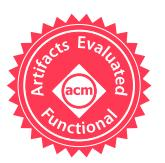
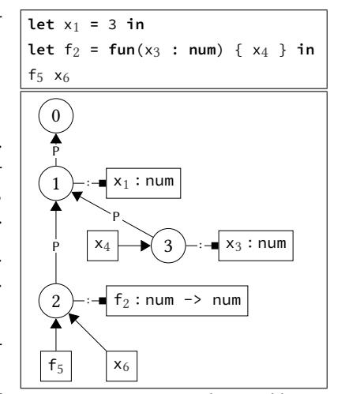
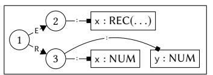
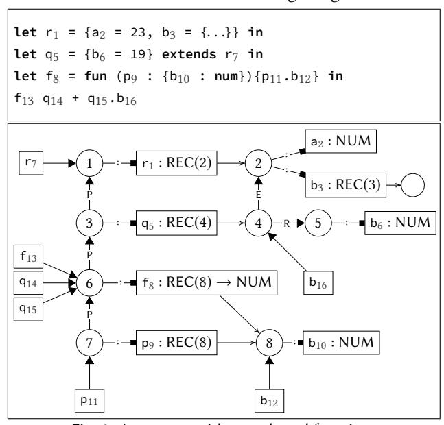
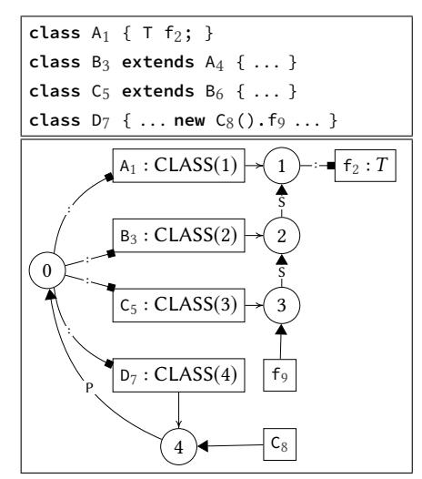
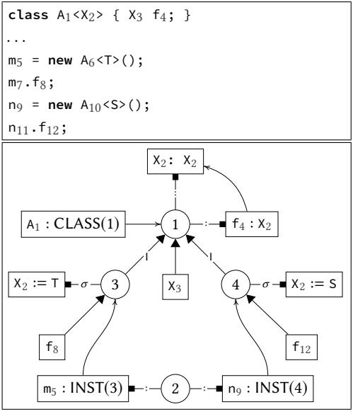
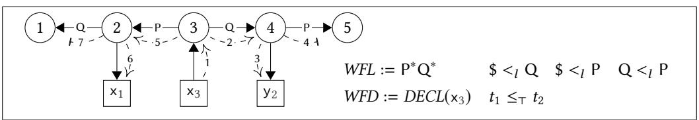
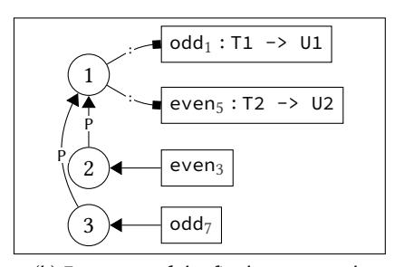
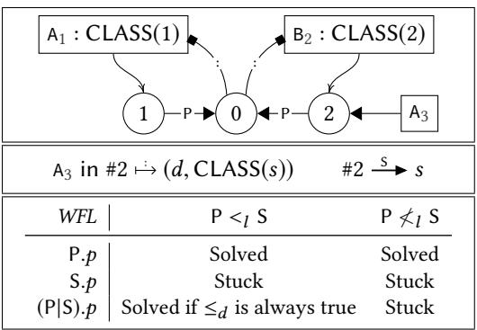

### Scopes as Types

HENDRIK VAN ANTWERPEN, Delft University of Technology, Netherlands CASPER BACH POULSEN, Delft University of Technology, Netherlands ARJEN ROUVOET, Delft University of Technology, Netherlands EELCO VISSER, Delft University of Technology, Netherlands

Scope graphs are a promising generic framework to model the binding structures of programming languages, bridging formalization and implementation, supporting the definition of type checkers and the automation of type safety proofs. However, previous work on scope graphs has been limited to simple, nominal type systems. In this paper, we show that viewing scopes as types enables us to model the internal structure of types in a range of non-simple type systems (including structural records and generic classes) using the generic representation of scopes. Further, we show that relations between such types can be expressed in terms of generalized scope graph queries. We extend scope graphs with scoped relations and queries. We introduce Statix, a new domain-specific meta-language for the specification of static semantics, based on scope graphs and constraints. We evaluate the scopes as types approach and the Statix design in case studies of the simply-typed lambda calculus with records, System F, and Featherweight Generic Java.

CCS Concepts: • Software and its engineering → Semantics; Domain specific languages;

Additional Key Words and Phrases: static semantics, type system, type checker, name resolution, scope graphs, domain-specific language

#### ACM Reference Format:

Hendrik van Antwerpen, Casper Bach Poulsen, Arjen Rouvoet, and Eelco Visser. 2018. Scopes as Types. Proc. ACM Program. Lang. 2, OOPSLA, Article 114 (November 2018), [30](#page-29-0) pages. <https://doi.org/10.1145/3276484>

#### 1 INTRODUCTION

The goal of our work is to support high-level specification of type systems that can be used for multiple purposes, including reasoning (about type safety among other things) and the implementation of type checkers [\[Visser et al.](#page-28-0) [2014\]](#page-28-0). Traditional approaches to type system specification do not reflect the commonality underlying the name binding mechanisms for different languages. Furthermore, operationalizing name binding in a type checker requires carefully staging the traversals of the abstract syntax tree in order to collect information before it is needed. In this paper, we introduce an approach to the declarative specification of type systems that is close in abstraction to traditional type system specifications, but can be directly interpreted as type checking rules. The approach is based on scope graphs for name resolution, and constraints to separate traversal order from solving order.

Authors' addresses: Hendrik van Antwerpen, Delft University of Technology, Delft, Netherlands, H.vanAntwerpen@tudelft. nl; Casper Bach Poulsen, Delft University of Technology, Delft, Netherlands, C.B.Poulsen@tudelft.nl; Arjen Rouvoet, Delft University of Technology, Delft, Netherlands, A.J.Rouvoet@tudelft.nl; Eelco Visser, Delft University of Technology, Delft, Netherlands, E.Visser@tudelft.nl.


contact the owner/author(s). This work is licensed under a Creative Commons Attribution 4.0 International License.

© 2018 Copyright held by the owner/author(s).

2475-1421/2018/11-ART114

<https://doi.org/10.1145/3276484>

Modeling Names in Programming Languages. Formal definitions of type systems and their implementation as type checkers feature a variety of techniques to model and implement name binding and name resolution for different languages. For example, if we consider [Pierce'](#page-28-1)s [\[2002\]](#page-28-1) book we encounter the following representations for the treatment of names: sequences of name-type associations to represent type environments for the simply-typed lambda calculus; tuples of labeltype associations to represent record and variant types; class tables with functions for field and method lookup to represent the nominal class types of Featherweight Java; types with quantifiers to represent parameterized types in System F; and pairs of type variables and types to represent existential types. These are all fine mathematical representations, but they have been optimized for the particular language they model. These optimizations obscure the understanding of the common underlying concepts of name binding. Furthermore, the variation in representations is not a good basis for the construction of reusable tools for language design. Would it be possible to standardize the treatment of names in programming languages?

Modeling Name Resolution with Scope Graphs. Scope graphs were introduced by [Néron et al.](#page-28-2) [\[2015\]](#page-28-2) as a general model for name resolution in programming languages that is suitable for formalization as well as implementation. A scope graph captures the binding structure of a program. A scope is a region in a program that behaves uniformly with respect to name resolution. Declarations of names and references are associated with scopes. Visibility is modeled by edges between scopes. A generic, language-independent resolution algorithm interprets a scope graph to resolve references to declarations by finding the most specific well-formed path in a scope graph. To express the binding rules of a programming language, one defines a mapping from abstract syntax trees to scope graphs. Scope graphs cover a wide range of binding structures, including lexical bindings[1](#page-1-0) such as let bindings, function parameters, and local variables in blocks; and non-lexical bindings such as (potentially cyclic) module imports and class inheritance. The framework enables languageindependent definitions of alpha equivalence and safe variable renaming.

The scope graph framework has already been used succesfully in several applications. [Van](#page-28-3) [Antwerpen et al.](#page-28-3) [\[2016\]](#page-28-3) use scope graphs to model name binding in a constraint language for the definition of type checkers. [Poulsen et al.](#page-28-4) [\[2016\]](#page-28-4) define a framework in which scopes describe frames, providing a language-independent model for run-time memory in dynamic semantics. [Poulsen et al.](#page-28-5) [\[2018\]](#page-28-5) show that this model can be used to realize type safety by construction in intrinsically-typed definitional interpreters for imperative languages.

Thus, scope graphs are the basis for a promising approach to the definition of the static semantics of programming languages that serves the implementation of tools such as type checkers, as well as the verification of language properties such as type safety. However, the adoption of scope graphs is inhibited by its limitation to simple type systems. As a model that ties information to names, scope graphs appear to be limited in expressiveness. The works cited above cover languages with simple, nominal type systems in which types are identified by name, and their future work calls for extension to more sophisticated type systems. In particular, it is not clear how scope graphs can be used to describe structural types, in which types are not identified by name, and generic types, in which types are parameterized by types.

Scopes as Types. In this paper, we demonstrate how scope graphs can be used to model type systems with more sophisticated forms of type representation and compatibility checking, such as structural record types and parameterized types in both nominal and structural type systems, by using scopes as types. Scope graph scopes can model a variety of structured types such as records

<span id="page-1-0"></span><sup>1</sup> Lexical bindings are those in which the name binding construct dominates the abstract tree that corresponds to the scope of the construct. Non-lexical bindings define names that are reachable outside the dominated tree.

and classes. Visibility edges between scopes can be used to model subtyping. The instantiation of a parameterized type can be modeled by means of a new scope that refines the binding of a parameter. To realize scopes-as-types we generalize scope graphs with scoped relations, formalizing scoped information including typed declarations, and we simplify scope graphs by using the scopes-as-types approach to model imports, which were previously built into the framework.

We demonstrate how the approach can be applied in the definition of type systems for the simply-typed lambda calculus with records (featuring structural sub-typing) [\[Pierce 2002\]](#page-28-1), System F (featuring parametric types) [\[Girard 1972;](#page-27-0) [Reynolds 1974\]](#page-28-6), and Featherweight Generic Java (featuring generic class types) [\[Igarashi et al. 2001\]](#page-27-1).

Staging Name Resolution and Type Checking. Scope graphs provide a uniform model for the representation and resolution of binding information in programs, but they do not, by themselves, address another issue with realizing declarative definition of type checkers: the staging of name resolution and type checking. It is common practice to use constraints in type checkers in order to separate the collection of type compatibility requirements, and checking that these are satisfied. However, name resolution is typically performed during the traversal of the abstract syntax tree that generates constraints. This requires a careful staging of the traversal in order to collect information (names and their types) before it will be needed. For example, checking a recursive let expression requires processing the declared variables before checking the initializing expressions. Similarly, checking modules or classes requires collecting signature information before checking their contents. This approach is further complicated when considering type-dependent name resolution in which the resolution of names depends on the resolution of types.

In this paper, we introduce Statix, a constraint-based declarative language for the specification of type systems that combines type constraints with name resolution constraints based on scope graphs. That is, Statix rules define the static semantics of language constructs in terms of constraints over type terms and constraints that define and query a scope graph. Definition of type checkers using this approach is more declarative since the order of evaluation of constraints is not tied to the order of the traversal of the abstract syntax tree. In particular, this relieves the language designer from ensuring that information is collected before it is used. Statix generalizes the constraint language of [Van Antwerpen et al.](#page-28-3) [\[2016\]](#page-28-3) by introducing user-defined constraints, required to define type compatibility predicates, and by generalizing name resolution to scope graph queries to retrieve (visible) scoped information.

Contributions. The paper makes the following technical contributions:

- We show that viewing scopes as types enables modeling the internal structure of types in a range of interesting type systems, including structural records and generic classes, using the generic representation of scopes.
- We extend the scope graph framework of [Néron et al.](#page-28-2) [\[2015\]](#page-28-2) and [Van Antwerpen et al.](#page-28-3) [\[2016\]](#page-28-3) with scoped relations to model the association of types with declarations and the representation of explicit substitutions in the instantiation of parameterized types. We generalize name resolution from resolution of references to general queries for scoped relations. Furthermore, visibility policies, which were global (per language), can be defined per query, enabling namespace-specific visibility policies. We simplify the framework by not including imports as a primitive, since these can be encoded using the scopes-as-types approach.
- We extend the visual notation of scope graph diagrams with scoped relations, which provides a useful language to explain patterns of names and types in programming languages.
- We introduce Statix, a declarative language to specify type systems. The language provides simple guarded rules for the definition of user-defined constraints with unification, scope

graph construction, and name resolution as built-in theories. We provide a formal definition of the declarative semantics of Statix.

- We discuss the execution model of Statix and how it guarantees soundness of resolution in incomplete graphs.
- We evaluate the scopes-as-types approach and the Statix language in three case studies: the simply-typed lambda calculus with records (featuring structural sub-typing) [\[Pierce](#page-28-1) [2002\]](#page-28-1) (STLC-REC), System F (featuring parametric types) [\[Girard 1972;](#page-27-0) [Reynolds 1974\]](#page-28-6), and Featherweight Generic Java (featuring generic class types) [\[Igarashi et al. 2001\]](#page-27-1).

Outline. In Section [2](#page-3-0) we present the revised scope graph framework and the corresponding resolution calculus. We demonstrate how this formalism supports the specification of type systems, including ones with structural and parametric types. In Section [3](#page-17-0) we introduce the Statix language and its declarative semantics. We show the specification in Statix of typical patterns in programming languages with structural and parametric type systems. In Section [4](#page-19-0) we discuss the execution model of the solver for the Statix language. In particular, we discuss resolution in incomplete scope graphs. In Section [5](#page-23-0) we discuss the evaluation of Statix by means of an implementation in the Spoofax language workbench and several critical case studies. In Section [6](#page-24-0) we discuss how the approach compares to other approaches. We conclude in Section [7.](#page-26-0)

#### <span id="page-3-0"></span>2 SCOPES AS TYPES

Typing is deeply dependent on name resolution: a program phrase is typically typed by resolving names that occur in it to names in its surrounding context. In many interesting languages, types can also bind names; this is the case with record types, object or class types, and dependent types. In this section we observe and illustrate how types that bind names (records, objects, etc.) can be described by scopes in a scope graph, and we present a revised definition of the scope graph framework of [Néron et al.](#page-28-2) [\[2015\]](#page-28-2) and [Van Antwerpen et al.](#page-28-3) [\[2016\]](#page-28-3) and show how it can be applied to the definition of type systems.

#### <span id="page-3-1"></span>2.1 Scope Graphs and the Resolution Calculus

In the scope graph approach, a program is reduced to a graph that represents its binding information. The first part of Fig. [1](#page-4-0) defines the structure of scope graphs. A scope graph consists of scopes, connected by edges, containing data. A labeled edge s<sup>1</sup> s<sup>2</sup> between scopes s<sup>1</sup> and s<sup>2</sup> determines that the declarations in scope s<sup>2</sup> are reachable from scope s1. The label can be used to regulate visibility. A scoped datum s r d associates a data term d with a scope s under relation r. For example, we will use s (x,T ), to represent a declaration of name x in the scope s with type T , and use x : T to denote the pair. There may be multiple data items associated with a scope under the same relation.

Given this structure, we can now precisely characterize name resolution for a reference as finding a path from its scope to a scope with a matching declaration. This intuition is formally captured by the resolution calculus in the third part of Fig. [1,](#page-4-0) which is parameterized by well-formedness and visibility parameters defined in the second part of Fig. [1.](#page-4-0) We discuss the judgments of the calculus.

The judgment G ⊢ p : s<sup>1</sup> ↠ s<sup>2</sup> states that there is a path p from scope s<sup>1</sup> to scope s2, if there is a sequence of labeled scope edges starting at s<sup>1</sup> and leading to s2. Cyclic paths are not admitted: the s<sup>1</sup> < scopes(p) premise of (NR-Cons) asserts that scope s<sup>1</sup> does not occur in path p. The path p records the scopes and edge labels that it passes through.

The judgment WFD, WFL, G ⊢ p : s r d states that data term (declaration) d is reachable through path p from scope s under relation r with data term predicate WFD and label well-formedness predicate WFL. Label well-formedness tests that the path has a 'good shape' as defined by a regular

```
Syntax Parameters
          data terms d ∈ D a set of data terms
              labels l ∈ L a set of edge labels
           relations r ∈ R a set of relation names
Syntax Definitions
          scopes s ∈ S := some countable set
           paths p ∈ P ::= s | s·l·p
           edges Edges ::= s
                                    s
         datums Data ::= s
                                 r
                                    d
     scope graphs G ∈ Graphs ::= ⟨scopes ⊆ S, edges ⊆ Edges, data ⊆ Data⟩
   extended labels ˆ
                  l ∈ Lˆ := L ∪ {$} where $ indicates the end of a path
Visibility Parameters
   data term well-formedness WFD ⊆ D
       label well-formedness WFL ⊆ L∗
                                         defined as a regular expression
                data order ≤d ⊆ D × D partial order
                label order <l ⊆ L ׈ Lˆ strict partial order
Path Well-formedness WFL ⊢ p ok
                               (l1 . . . ln) ∈ WFL
                          WFL ⊢ (s1·l1· . . . · sn·ln·sn+1) ok
Visibility Order <l ⊢ p <p p
     <l ⊢ p1 <p p2
   <l ⊢ s·l·p1 <p s·l·p2
                           $ <l
                               l
                       <l ⊢ s <p s·l·p
                                           l <l $
                                        <l ⊢ s·l·p <p s
                                                              l1 <l
                                                                  l2
                                                        <l ⊢ s·l1·p1 <p s·l2·p2
Paths G ⊢ p : s ↠ s
(NR-Refl)
       s ∈ scopes(G)
       G ⊢ s : s ↠ s
                      (NR-Cons)
                              s1
                                   s2 ∈ edges(G) G ⊢ p : s2 ↠ s3 s1 < scopes(p)
                                             G ⊢ s1·l·p : s1 ↠ s3
Reachability WFD, WFL, G ⊢ p : s
                                                                         r
                                                                          d
         (NR-Rel)
               G ⊢ p : s ↠ s
                          ′
                             s
                              ′ r
                                  d ∈ data(G) WFL ⊢ p ok d ∈ WFD
                              WFD, WFL, G ⊢ p : s
                                                r
                                                  d
Visibility WFD, WFL, ≤d , <l
                                                                , G ⊢ p : s
                                                                         r
                                                                          d
        (NR-Vis)
                              WFD, WFL, G ⊢ p : s
                                                r
                                                  d
              ∄ p
                 ′d
                  ′
                   .
                     WFD, WFL, G ⊢ p
                                   ′
                                    : s
                                       r
                                         d
                                          ′

                                            ∧

                                               <l ⊢ p
                                                   ′ <p p

                                                         ∧ (d
                                                             ′ ≤d d)

                            WFD, WFL, ≤d , <l
                                          , G ⊢ p : s
                                                   r
                                                    d
```

Fig. 1. Formal definition of scope graphs with syntax, visibility predicates, and resolution calculus

expression. This is used to model policies such as transitive vs. non-transitive imports or the unreachability of lexical parents of imported modules [\[Van Antwerpen et al.](#page-28-3) [2016\]](#page-28-3). Data term well-formedness tests whether we have found the datum we were looking for. For example, to resolve a reference x we use a well-formedness predicate that matches all declaration-type pairs y: T where  $x \simeq y$ , that is, the reference has the same name as the declaration (but a different position in the program).

Finally, the judgment *WFD*, *WFL*,  $\leq_d$ ,  $<_l$ ,  $G \vdash p : s \stackrel{r}{\vdash} d$  states that data term d is *visible* through path p from scope s under relation r with the well-formedness predicates WFD, WFL, and the orders  $\leq_d$  and  $<_l$ . The parameterization is chosen such that algorithmic resolution remains feasible (see Section 4.2). The *visibility order*  $p_1 <_p p_2$  (' $p_1$  shadows  $p_2$ ') is defined as a prefix order over the labels of a path, in terms of a label order  $<_l$ . A special label \$ indicates the end of a path, and is used to order paths of different lengths. The prefix order only orders paths that have a common prefix. That is,  $s_1 \cdot l_1 \cdot s_2 \not<_p s_1' \cdot l_1' \cdot s_2' \cdot l_2' \cdot s_3'$  when  $s_1 \neq s_1'$  or  $l_1 \neq l_1'$ . The *data order*  $d \leq_d d$  decides which declarations shadow each other, if multiple declarations are reachable via shadowing paths. This is used to specify all visible declarations, where a declaration only shadows a declaration that is reached via a shadowed path, if it has the same name. Using the visibility order and data order, the rule (NR-Vis) defines that a data term d is visible through path p when there does not exist a data term d' reachable through p' such that d' shadows d and such that p' is strictly preferred over p. We will illustrate below how this captures the notion of shadowing in name resolution.

In the rest of this section we show how scope graphs can be used in the definition of type systems for languages with a variety of binding systems, including bindings in types. We discuss how our approach compares to representations of binding in traditional definitions of type systems.

#### <span id="page-5-1"></span>2.2 Simply-Typed Lambda Calculus

First we consider the syntax and typing rules for the simply-typed lambda calculus with arithmetic expressions (STLC) in Fig. 3. The language consists of number constants, addition, function literals, variables, function application, and let bindings.

Name binding for STLC is typically modeled using type environments, which are ordered lists of pairs associating a name with a type. Scoping is modeled by extension of an environment with a new pair, which shadows any earlier declarations of the same name (either by removing a matching pair or through definition of the lookup function). The extended environment is only used for those sub-expressions where the binding is in scope. Scope graphs make the shadowing rules explicit by separating the construction of the binding structure and the definition of resolution.

The typing rules in Fig. 3 use scope graphs and the resolution calculus instead of type environments to model binding in STLC. The judgment  $\mathcal{G}$ ,  $s \vdash e : t$  states that in the context of scope graph  $\mathcal{G}$  and scope s, expression e has type t. The rules are implicitly parameterized by a scope graph  $\mathcal{G}$ , and use  $s_1 \xrightarrow{l} s_2$  as a shorthand for  $s_1 \xrightarrow{l} s_2 \in \text{edges}(\mathcal{G})$ , and  $s \xrightarrow{r} d$  for  $s \xrightarrow{r} d \in \text{data}(\mathcal{G})$ . The notation  $\nabla s$  is used to assert that a scope s is distinct in a scope graph. For example, the  $\nabla s_2$  premise in the (STLC-Fun) rule asserts that the scope  $s_2$  is distinct from  $s_1$  in the scope graph.

Scope Graph Structure. In addition to defining the *types* of expression forms, the typing rules define the scoping structure of expressions by relating the scope of an expression to the scope(s) of its sub-expressions. Numbers, addition, and function application are non-binding, non-scoping constructs. Thus, rules (STLC-Num), (STLC-Plus), and (STLC-App) state that the scope of the sub-expressions (if any) of these operators is the same as the scope of the parent. Rules (STLC-Fun) and (STLC-Let) introduce a distinct scope  $s_2$  and associate a declaration  $x_i$ : t for the binding occurrence with that scope. A scope edge  $s_2 \xrightarrow{P} s_1$  makes the declarations reachable from  $s_1$ , also reachable from the scope  $s_2$ , which is used as the scope for the sub-expression in which the binding occurrence is in scope: the bodies of the function and let expression. Note that in (STLC-Let), scope

<span id="page-5-0"></span><sup>&</sup>lt;sup>2</sup>We can think of  $\nabla s$  as a claim to "ownership" of scope s. Each scope in the scope graph can have exactly one "owner". In Section 4 we give a declarative semantics of Statix where this notion is formally defined.

```
Syntax
           integers z \in \mathbb{Z} := {...,-1,0,1,...}
      identifiers x \in Id := some countable set
   expressions e \in Expr := z \mid e + e \mid fun(x : t) \{ e \} \mid x \mid e e \mid let x = e in e
                types t \in Type ::= num \mid t \rightarrow t
Resolution Syntax Parameters
                                            labels l \in \mathcal{L} ::= P
                                      relations r \in \mathcal{R} ::= :
                                  data terms d \in \mathcal{D} ::= x_i : t
                                                                                                                                       d \in DECL(x_i) || \hat{l} <_l \hat{l}
Matching Declarations, Label Order and Data Order
                                                    \frac{\mathsf{x}_i \simeq \mathsf{x}_j}{(\mathsf{x}_j : \mathsf{t}) \in DECL(\mathsf{x}_i)} \qquad \$ <_l P \qquad t_1 \leq_\top t_2
Typing Rules
                                                                                                                                                                                 G, s \vdash e : t
                                  (STLC-Num)\frac{s \vdash e_1 : num}{s \vdash z : num} \qquad (STLC-Plus)\frac{s \vdash e_1 : num}{s \vdash e_1 + e_2 : num}
                                        (STLC-Fun) \frac{\nabla s_2 \quad s_2 \xrightarrow{P} s_1 \quad s_2 \stackrel{:}{\longrightarrow} x_i : t_1 \quad s_2 \vdash e : t_2}{s_1 \vdash \mathbf{fun} \quad (x_i : t_1) \quad \{e\} : t_1 \rightarrow t_2}
        (STLC-Id) \frac{DECL(\mathsf{x}_i), \mathsf{P}^*, \leq_\mathsf{T}, <_l \vdash p : s \stackrel{:}{\mapsto} \mathsf{x}_j : \mathsf{t}}{s \vdash \mathsf{x}_i : \mathsf{t}} \qquad (STLC-App) \frac{s \vdash \mathsf{e}_1 : \mathsf{t}_1 \rightarrow \mathsf{t}_2 \quad s \vdash \mathsf{e}_2 : \mathsf{t}_1}{s \vdash \mathsf{e}_1 : \mathsf{e}_2 : \mathsf{t}_2}
                 \frac{s_1 \vdash e_1 : t_1 \quad \nabla s_2 \quad s_2 \stackrel{P}{\longrightarrow} s_1 \quad s_2 \stackrel{:}{\longrightarrow} x_i : t_1 \quad s_2 \vdash e_2 : t_2}{s_1 \vdash \text{let } x_i = e_1 \text{ in } e_2 : t_2}
Fig. 3. Syntax and typing rules for a simply-typed lambda calculus using scope graphs
```

 $s_1$  is used for the initialization expression, reflecting that the variable introduced is not in scope in that expression.

Before we consider the rule (SLTC-Id) and name resolution, it can be helpful to visualize scope graphs using scope graph diagrams. To distinguish different occurrences of the same name in a program we subscript names in programs by a position index. For example, the program fun  $(x : num) \{ x \}$  is written fun  $(x_1 : num) \{ x_2 \}$ . Fig. 2 shows an example program and its scope graph diagram. Scopes are depicted by circles labeled with a number, and edges between scopes are depicted as labeled edges  $\stackrel{l}{\longrightarrow}$ . Scope #0 in the scope graph in Fig. 2 is the scope of the context of the outer let. Scopes #1 and #2 are the scopes of the first and second let, respectively. Scope #3 is the scope of the function literal. The scopes are connected via P-labeled edges to their lexical parent scope (thus P is for parent). Declarations are depicted as boxes associated with scopes via an — edge going from a scope to a declaration. Lastly, references are depicted as boxes connected to scopes by edges

<span id="page-6-1"></span>

Fig. 2. A program with nested lets

going from the reference to the scope. References are not formally part of the structure of scope

graphs (Fig. [1\)](#page-4-0), but we include them in scope graph diagrams to indicate which scope each reference is resolved relative to.

Reachability and Visibility. Now we can consider how variables in STLC are resolved in rule (STLC-Id). The premise of the rule states that x<sup>i</sup> has type t if x<sup>i</sup> can be resolved in scope s through path p leading to a declaration x<sup>j</sup> : t, such that there is no other declaration with a matching name that shadows x<sup>j</sup> : t. The data well-formedness and label order used as parameters to resolve x<sup>i</sup> in (STLC-Id) are defined in Fig. [3.](#page-6-0) The declaration well-formedness predicate DECL(xi) is parameterized by an identifier x<sup>i</sup> with position subscript i as input, and identifies the set of all declarations with the same name as, but at positions different from, x<sup>i</sup> . The label well-formedness predicate for STLC is P ∗ , which reflects that a variable can be resolved in any scope reachable through a sequence of parent edges. Declarations are not ordered in STLC, and the ≤<sup>⊤</sup> order passed as parameter to the visibility judgment in (STLC-Id) is the order where all declarations are equal. The definition \$ <<sup>l</sup> P of the visibility ordering for STLC specifies that shorter paths are preferred over longer paths. Thus, declaration in a scope that has a path with fewer P edges is preferred, which formalizes the usual notion of shadowing based on on lexical proximity. For example, the reference x<sup>4</sup> in the program in Fig. [2](#page-6-1) reaches x<sup>1</sup> and x<sup>3</sup> since DECL(x4), P ∗ ⊢ s3·P·s2·P·s<sup>1</sup> : s<sup>3</sup> x<sup>1</sup> : **num** and DECL(x4), P ∗ ⊢ s<sup>3</sup> : s<sup>3</sup> x<sup>3</sup> : **num**. However, because s<sup>3</sup> <<sup>p</sup> s3·P·s2, we have that x<sup>4</sup> resolves to x3.

#### <span id="page-7-0"></span>2.3 Records and Structural Subtyping

Next we consider an extension of STLC with structural records. The language defined in Fig. [4](#page-8-0) extends STLC with record literals, field access, record extension, and a Pascal/JavaScript-like **with** expression. Record types are structural, that is, record types are not identified by name, but by a set of field-type pairs. The type system features subtyping between record types: a function expecting a record as parameter can be provided any extension of the expected record type. We discuss how to identify, represent, compose, access, and compare record types.

Identifying Record Types. In nominal type systems, types are identified by name. Information about the type is associated with that name. For example, with scope graphs we can state s td (Point,rPoint), which associates with the type name Point some representation rPoint of the record type. A record type can then be represented as REC(Point) referring to the declaration of the type by its name. Such a representation is efficient since copying the type entails copying a reference to its representation. Furthermore, a type is directly related to its origin in a program. The disadvantage of nominal types is that each variation of a type must be given a name and that comparisons must be organized through relations between names. In structural type systems, types are identified by their structure [\[Cardelli 1988\]](#page-27-2). This means that new types can be created 'on the fly', that is, not all types have to be defined by name. In previous work, [Van Antwerpen et al.](#page-28-3) [\[2016\]](#page-28-3) show how to represent nominal record types with scope graphs, but not how to express structural comparisons and composition of such types. Here we show how to do that using scopes as types and scope graph queries.

Representing Record Types. The representation of record types requires a mapping from field names to types. [Pierce](#page-28-1) [\[2002\]](#page-28-1) uses association lists to represent record types. With scope graphs, we do not need a new representation: scopes provide a natural representation for record types. For example, the x coordinate of a Point type is represented as a declaration in the scope:sPoint x : num. Such a scope could be associated with a type name to realize a nominal type system, as discussed above. To realize a structural type system, we use the scope reference itself as a type, and represent a record type as REC(s<sup>r</sup> ). A difference with the traditional representation of structural types as association lists is that scopes have identity. Thus, copying types entails copying of references.

```
Syntax
  expressions e ∈ Expr ::= . . . | { (x = e)
                                            ∗
                                            } | e.x | e extends e | with e do e
syntactic types t ∈ TypeExpr ::= num | t -> t | { (x : t)
                                                   ∗
                                                    }
semantic types T,U ∈ Type ::= NUM | T → T | REC(s)
Resolution Syntax Parameters
      labels l ∈ L ::= . . . | R | E and otherwise like STLC
Syntactic to Semantic Typing G ⊢ JtK ⇛ T
          (T-Num)
                  ⊢ JnumK ⇛ NUM
                                     (T-Fun)
                                           ⊢ Jt1K ⇛ T1 ⊢ Jt2K ⇛ T2
                                            ⊢ Jt1 -> t2K ⇛ T1 → T2
                     (T-Rec)
                           ⊢ Jt¯K ⇛ T¯ ∇sr sr
                                                  x¯i
                                                     : T¯
                              ⊢ J{ x¯i : t } ¯ K ⇛ REC(sr )
Typing Rules (Records) G,s ⊢ e : T
(ERS-Rec)
               s ⊢ e¯ : T¯
           ∇sr sr
                      x¯i
                        : T¯
        s ⊢ { x¯i = e } ¯ : REC(sr )
                                 (ERS-Access)
                                                     s ⊢ e : REC(sr )
                                           DECL(xi), (R|E)
                                                       ∗
                                                        , ≤⊤, <l ⊢ p : sr
                                                                       xj
                                                                         : T
                                                       s ⊢ e.xi
                                                             : T
     (ERS-Extends)
                s ⊢ e1 : REC(s1) s ⊢ e2 : REC(s2) ∇sr sr
                                                        R
                                                           s1 sr
                                                                  E
                                                                     s2
                                s ⊢ e1 extends e2 : REC(sr )
        (ERS-With)
                 s ⊢ e1 : REC(sr ) ∇sw sw
                                          R
                                             sr sw
                                                     P
                                                        s sw ⊢ e2 : T
                                  s ⊢ with e1 do e2 : T
Label Order ˆ
                                                                         l <l
                                                                             ˆ
                                                                             l
                  $ <l P $ <l R $ <l E R <l P R <l E
Subtyping G ⊢ T <: T
           (<:-Num)
                   ⊢ NUM <: NUM
                                      (<:-Fun)
                                              ⊢ T2 <: T1 ⊢ U1 <: U2
                                              ⊢ T1 → U1 <: T2 → U2
        (<:-Rec)
               ∀xi p xj T .DECL(xi), (R|E)
                                    ∗
                                     , ≤⊤, <l ⊢ p : s2
                                                    xj
                                                      : T =⇒
                 ∃p
                   ′ U xk .DECL(xi), (R|E)
                                     ∗
                                      , ≤⊤, <l ⊢ p
                                               ′
                                                : s1
                                                     xk : U ∧ ⊢ U <: T
                                 ⊢ REC(s1) <: REC(s2)
```

Fig. 4. Syntax and typing rules for a language with extensible records. The expression syntax is extended from Fig. [3.](#page-6-0) The typing rules for functions are mostly the same as in Fig. [3](#page-6-0)

Since scopes are not part of the surface syntax of types, Fig. [4](#page-8-0) defines two notions of types: syntactic types and semantic types for use in typing rules. Fig. [4](#page-8-0) defines a relation ⊢ JtK ⇛ T that relates a syntactic type t to a corresponding semantic type T . In particular, the (T-Rec) rule defines how a syntactic record type is related to a scope with a declaration for each field in the record type. We use the vector notation x¯ to denote sequences and point-wise application. The mapping from syntactic to semantic types is used in the (ERS-Fun) rule (not shown) to convert the syntactic type annotation on the formal parameter. The (ERS-Rec) rule asserts that a record literal is typed by a scope that has a declaration for each field name in the list, inferring the type from the initialization expression. In the (T-Rec) and (ERS-Rec) rules we have omitted the assertion that field names of record types need to be unique. This can be expressed with a scope graph query that requires that a field name reference in the record scope resolves to a single declaration.

Composing Record Types. Traditional type environments and scope graphs can be considered as a kind of explicit substitution [Abadi et al. 1991]. The difference between the approaches is in their treatment of extension of substitutions. For example, consider the  $e_1$  extends  $e_2$  form, which creates a record by extending the record computed by  $e_2$  with the record fields computed by  $e_1$ . In a variation on the definition by Pierce [2002], we allow a record extension to shadow fields from the extended record. Using type environments as record types, with the operator  $\Gamma_1 \triangleleft \Gamma_2$  eagerly defined to compose two environments such that bindings in  $\Gamma_2$  shadow those in  $\Gamma_1$ , the typing rule for extends can be defined as follows:

(Γ-Extends) 
$$\frac{\Gamma \vdash \mathsf{e}_1 : \{\mathsf{x}_i : \mathsf{T}_i{}^{i \in 1..n}\} \qquad \Gamma \vdash \mathsf{e}_2 : \{\mathsf{x}_i : \mathsf{T}_i{}^{j \in 1..m}\}}{\Gamma \vdash \mathsf{e}_1 \text{ extends } \mathsf{e}_2 : \{\mathsf{x}_i : \mathsf{T}_i{}^{j \in 1..m} \triangleleft \mathsf{x}_i : \mathsf{T}_i{}^{i \in 1..n}\}}$$

So, the expression  $\{x = 1, y = 2\}$  extends  $\{x = \{z = 4\}\}$  has type  $\{x : num, y : num\}$ . A context resulting from a shadowing extension  $\Gamma_1 \triangleleft \Gamma_2$  loses information about the structure of the original  $\Gamma_1$ , because it eagerly merges the two substitutions.

By contrast, a scope graph representation retains the structure of the composition. Consider rule (ERS-Extends) in Fig. 4, which defines the **extends** form by creating a new record type  $REC(s_r)$  with scope edges to the record types of the two branches. The R edge in (ERS-Extends) makes the bindings in the  $s_1$  scope for

<span id="page-9-0"></span>

Fig. 5. Record extension

the record extension reachable from  $s_r$ . Similarly, the E edge makes the bindings in the  $s_2$  scope reachable from  $s_r$ . Fig. 5 shows the resulting scope graph for the expression above. Thus, extensions are represented as edges that preserve the structure of the substitutions being merged.

The (ERS-With) rule shows a variation of this pattern. The form with  $e_1$  do  $e_2$  (inspired by the deprecated JavaScript construct) makes the fields of the record computed by  $e_1$  available as local variables in  $e_2$ . This is modeled by the (ERS-With) rule by creating scope edges from the scope  $s_w$  for the body  $e_2$  to the record scope via an R edge and to the lexical parent scope via a P edge.

Accessing Record Types. Field access e.x is an example of type-dependent name resolution where a name is resolved relative to a type. The first premise of rule (ERS-Access) requires the expression e to have a record type REC( $s_r$ ). The second premise resolves the field x relative to the scope  $s_r$  of that type using the

<span id="page-9-1"></span>

Fig. 6. A program with records and functions

resolution query  $DECL(x_i)$ ,  $(R|E)^*$ ,  $\leq_T$ ,  $<_l \vdash p : s_r \mapsto x_j : T$ . The declaration well-formedness predicate  $DECL(x_i)$  is defined in Fig. 3, and path well-formedness is given by a regular expression stating that resolution may follow any path via R and E edges. Record fields can also be accessed using plain variables due to the with form. Since variables may also be defined in lexical parents, the well-formedness for variable resolution first traverses a series of lexical parent edges before considering record (extension) edges:  $DECL(x_i)$ ,  $(P^*(R|E)^*)$ ,  $\leq_T$ ,  $<_l \vdash p : s_r \mapsto x_j : T$ .

```
Syntax
       names C, D, E, f, g, m, n, x ∈ Name := some countable set
class definitions L ∈ ClassDecl ::= class C extends C {(C f;)
                                                                ∗
                                                                  K M∗
                                                                       }
  constructors K ∈ KDecl ::= C((C f)
                                                ∗
                                                ) { super(f∗
                                                           ); (this.f=f;)
                                                                        ∗
                                                                          }
     methods M ∈ Methods ::= C m((C x)
                                                 ∗
                                                  ) { return e; }
   expressions e ∈ Expr ::= x | e.f | e.m(e∗
                                                      ) | new C(e∗
                                                                ) | (C)e
 semantic type T,U,V ∈ Type ::= INST(s)
  method type M ∈ MethType ::= T
                                           ∗ → T
    class types L ∈ ClassType ::= CLASS(s)
Resolution Syntax Parameters
           labels l ∈ L ::= P | S
         relations r ∈ R ::= : | K
       data terms d ∈ D ::= C : L | m : M | this : T | x : T | T¯
```

Fig. 7. Syntax for Featherweight Java

The visibility ordering <<sup>l</sup> in Fig. [4](#page-8-0) states that record edges (R) are preferred over both lexical parent edges (P) and extension edges (E). Consequently, declarations in record scopes shadow lexical bindings (as intended for **with** expressions), and extended record scope bindings (as intended for **extends** expressions). Consider the resolution of the field access q15.b<sup>16</sup> in Fig. [6.](#page-9-1) The variable q<sup>15</sup> is resolved relative to scope #6 to q<sup>5</sup> with type REC(4). Hence, field b<sup>16</sup> is resolved relative to scope #4 from which two declarations can be reached: b<sup>3</sup> and b6. Since R <<sup>l</sup> E, the latter is selected.

Comparing Record Types. Finally, we consider the definition of subtyping for structural record types. When a record of type REC(s2) is expected we may provide a record of type REC(s1) provided that REC(s1) has at least all the fields of REC(s2). This is expressed using the resolution calculus by means of querying the visible fields of the scopes of the super type and sub type. The (<:-Rec) rule in Fig. [4](#page-8-0) asserts that for each declaration x<sup>i</sup> with type T visible in scope s<sup>2</sup> of the super type, <sup>x</sup><sup>i</sup> resolves to a declaration of type U in scope s<sup>1</sup> of the sub type, and that U <: T . The (<:-Rec) rule corresponds to traditional structural record subtyping [\[Pierce 2002,](#page-28-1) Fig. 16-1]. For example, consider the function application f<sup>13</sup> q<sup>14</sup> in Fig. [6.](#page-9-1) f<sup>13</sup> resolves to f<sup>8</sup> with type REC(8) → NUM and q<sup>14</sup> resolves to q<sup>5</sup> with REC(4). The rule for function application (omitted) adapts (STLC-App) to require that the type of the actual parameter is a subtype of the type of the formal parameter. (This is the only rule using the subtype relation.) This is the case in our example since REC(4) <: REC(8): the b<sup>6</sup> field visible in scope #4 matches the b<sup>10</sup> field of scope #8.

Summary. A crucial difference between scope graphs and association lists is that association lists represent an eager name shadowing policy (applied before doing name resolution), while scope graphs support a lazy name shadowing policy (applied during name resolution). The scopes as types approach scales to type systems with binding patterns that go beyond lambdas and records, including type systems for languages with classes; association lists alone do not.

#### <span id="page-10-1"></span>2.4 Classes and Nominal Subtyping: Featherweight Java

Next we consider a type system for classes with subtyping, specifically for Featherweight Java (FJ) [\[Igarashi et al.](#page-27-1) [2001\]](#page-27-1). We show how nominal class identity and subtyping is characterized by scope identity and paths in the scope graph. The syntax and typing rules of FJ using scope graphs is summarized in Fig. [7](#page-10-0) and [8.](#page-11-0) Assuming some familiarity with FJ, we summarize the main highlights.

# <span id="page-11-0"></span> $\mathcal{G}, s \vdash \llbracket c_i \rrbracket \Rightarrow T$ Syntactic to Semantic Typing $(\text{T-Class}) \xrightarrow{DECL(C_i), P^*, \leq_{\top}, <_l \vdash s \mapsto C_j : CLASS(s_c)}$ $s \vdash \llbracket c_i \rrbracket \Rightarrow \mathsf{INST}(s_c)$ $G, s \vdash L OK$ **Class Typing** $s \xrightarrow{:} \mathsf{C}_i : \mathsf{CLASS}(s_c) \quad s_c \xrightarrow{\mathsf{P}} s \quad DECL(\mathsf{D}_j), \epsilon, \leq_\mathsf{T}, <_l \vdash p : s \mapsto \mathsf{D}_k : \mathsf{CLASS}(s_d) \\ \hline \nabla s_c \quad s_c \xrightarrow{\mathsf{S}} s_d \quad s_c \vdash \bar{\mathsf{C}}_h \quad \bar{\mathsf{f}}_j ; \; \mathsf{K} \; \mathsf{OK} \quad s_c \vdash \bar{\mathsf{M}}_g \; \mathsf{OK} \\ \hline s \vdash \mathsf{class} \; \mathsf{C}_i \; \mathsf{extends} \; \mathsf{D}_j \; \{ \; \bar{\mathsf{C}}_h \; \bar{\mathsf{f}}_j ; \; \mathsf{K} \; \bar{\mathsf{M}}_g \; \} \; \mathsf{OK} \\ \\ \end{cases}$ **Field and Constructor Typing** $\frac{DECL(\mathsf{C}_z), \mathsf{P}, \leq_{\top}, <_l \vdash s \mapsto \mathsf{C}_u : \mathsf{CLASS}(s) \quad s \vdash \llbracket \bar{\mathsf{D}}_i \rrbracket \Rightarrow \bar{T} \quad WFD_{\top}, \mathsf{S}, \leq_{\top}, <_l \vdash p : s \stackrel{\mathsf{K}}{\mapsto} \bar{T}}{s \vdash \llbracket \bar{\mathsf{C}}_x \rrbracket \Rightarrow \bar{U} \quad s \vdash \llbracket \bar{\mathsf{E}}_k \rrbracket \Rightarrow \bar{V} \quad \bar{U} = \bar{V} \quad s \stackrel{\mathsf{L}}{\longrightarrow} \bar{\mathsf{I}}_m : \bar{U} \quad s \stackrel{\mathsf{L}}{\longrightarrow} \bar{T}, \bar{U} \quad \bar{\mathsf{g}}_j \simeq \bar{\mathsf{g}}_h}{s \vdash \bar{\mathsf{C}}_x \quad \bar{\mathsf{f}}_y ; \quad \mathsf{C}_z \quad (\bar{\mathsf{D}}_i \quad \bar{\mathsf{g}}_j, \bar{\mathsf{E}}_k \quad \bar{\mathsf{f}}_g) \quad \{\mathsf{super} \quad (\bar{\mathsf{g}}_h) ; \quad \mathsf{this.} \quad \bar{\mathsf{f}}_m = \bar{\mathsf{f}}_n \} \quad \mathsf{OK}}$ $G, s \vdash M OK$ Method Typing $\begin{array}{c} s \vdash \llbracket \bar{\mathsf{D}}_{k} \rrbracket \Rightarrow \bar{T} \qquad s \vdash \llbracket \mathsf{C}_{i} \rrbracket \Rightarrow T \qquad s \stackrel{\vdash}{\longrightarrow} \mathsf{m}_{j} : \bar{T} \to T \qquad \nabla s_{m} \\ s_{m} \stackrel{P}{\longrightarrow} s \qquad s_{m} \stackrel{\vdash}{\longrightarrow} \mathsf{x}_{g} : \bar{T} \qquad s_{m} \stackrel{\vdash}{\longrightarrow} \mathsf{this} : \mathsf{INST}(s) \qquad s_{m} \vdash \mathsf{e} : U \qquad \vdash U \lessdot T \\ & \qquad \qquad \qquad \qquad \qquad \qquad \qquad \qquad \qquad \qquad \qquad \qquad \qquad \qquad \qquad \qquad \qquad \qquad$ **Expression Typing** $\underbrace{DECL(\mathsf{x}_i), \mathsf{P}^*\mathsf{S}^*, \leq_\mathsf{T}, <_l \vdash p : s \mapsto \mathsf{x}_j : T}_{\mathsf{S} \vdash \mathsf{x}_i : T} \quad \underbrace{(\mathsf{FJ}\text{-Field})} \underbrace{DECL(\mathsf{f}_i), \mathsf{S}^*, \leq_\mathsf{T}, <_l \vdash p : s_c \mapsto \mathsf{f}_j : T}_{\mathsf{S} \vdash \mathsf{P}}$ $(\text{FJ-Invk}) \frac{s \vdash \mathsf{e} : \mathsf{INST}(s_c) \qquad DECL(\mathsf{m}_i), \mathsf{S}^*, \leq_\top, <_l \vdash p : s_c \mapsto \bar{U} \to T \qquad s \vdash \bar{\mathsf{e}} : \bar{V} \qquad \vdash \bar{V} <: \bar{U}}{s \vdash \mathsf{e} \cdot \mathsf{m}_i \, (\bar{\mathsf{e}}) : T}$ $DECL(c_i), P^*, \leq_T, <_l \vdash s \stackrel{:}{\mapsto} c_i : CLASS(s_c) \quad s \vdash \bar{e} : \bar{T}$ $(\text{FJ-New}) \frac{WFD_{\top}, \epsilon, \leq_{\top}, <_{l} \vdash p : s_{c} \stackrel{\mathsf{K}}{\longmapsto} \bar{U} \qquad \vdash \bar{T} <: \bar{U}}{s \vdash \mathsf{new} \ \mathsf{C}_{l}(\bar{\mathtt{e}}) : \mathsf{INST}(s_{c})}$ $(\text{FJ-UCast}) \frac{s \vdash e : T \quad s \vdash \llbracket \mathsf{C}_i \rrbracket \Rightarrow U \quad \vdash T \mathrel{<:} U}{s \vdash (C_i)e : U} \quad (\text{FJ-DCast}) \frac{s \vdash e : T \quad s \vdash \llbracket \mathsf{C}_i \rrbracket \Rightarrow U \quad \vdash U \mathrel{<:} T \quad U \neq T}{s \vdash (C_i)e : U}$ $(\text{FJ-Stupid}) \xrightarrow{s \vdash e : T \qquad s \vdash \llbracket c_i \rrbracket} \Rightarrow U \qquad \vdash T \nleq : U \qquad \vdash U \nleq : T \qquad \textit{stupid warning}$ $s \vdash (c_i)e : U$ $\mathcal{G} \vdash T \mathrel{<:} T$ Subtyping $(<:-Class) \frac{\vdash p: s_1 \rightarrow s_2 \quad p \in S^*}{\vdash \mathsf{INST}(s_1) <: \mathsf{INST}(s_2)}$ **Label Order and Data Well-Formedness** $\ \ \ \ \ \ \ \ \ \ \ \ \ \ \ \ \ \ \$

Fig. 8. Typing rules for Featherweight Java

Class Tables. The original presentation of FJ relies on various data structures for name resolution, notably class tables, type contexts, and the AST of classes themselves. Names are mapped to class definitions via the class table. In turn, the class table is used in auxiliary relations that define how to retrieve association lists of names and types for class members, by traversing the AST of classes. Thus, classes are used as a data structure since they are not reducible to a simple association list representation. But the AST of FJ programs is not an ideal data structure for reuse to define name resolution for other languages with nominal subtyping. For such languages we would have to re-specify similar auxiliary relations to do name resolution using a different AST. We show how the definition of a class table data structure is subsumed by the use of scope graphs.

Syntactic and Semantic Types. FJ has a single kind of syntactic type, namely class names ranged over by C. The corresponding semantic type of a class name C is an INST(s) type where s is the scope of the class declared as C. The (T-Class) rule in Fig. [8](#page-11-0) translates a syntactic type to a semantic type by resolving the name in the lexical context by following a sequence of P edges. The łrootž scope is similar to a class table: it binds all class declarations that a program defines and is a dominating lexical context for all classes in a program. Whereas INST(s) represents an instance of the class identified by scope s in the scope graph, the class type CLASS(s) represents the definition of the class s, and is the type of declarations in the łrootž scope.

Class Typing. The structure of a class is reflected in the scope graph. The (FJ-Class) rule declares the name of a class (C) as being typed by the scope that defines it (s<sup>c</sup> ) in the łrootž scope of a program (s). The rule omits the assertion that field and record names are unique in a class. (The : relation is overloaded to associate names with either semantic types, class types, or method types. It is always clear from the context which kind of type a name is associated with.) The (FJ-FldK) rule asserts that fields and constructors are associated with class scopes, where the constructor parameter types are recorded using the relation <sup>K</sup> . To resolve the parameter types of a constructor we use a trivially true well-formedness predicate WFD<sup>⊤</sup> in (FJ-FldK). The (FJ-Method) rule asserts that well-typed methods are associated with the class scope, and that overriding methods have the same type signature as the overridden methods in super classes.

Fig. [9](#page-12-0) shows a program with four classes, and the scope graph of this program. Each class has a name that

<span id="page-12-0"></span>

Fig. 9. Classes with inheritance. The P edges from scopes #1, #2, #3 to scope #0 have been omitted.

is typed as a CLASS(s) where s is the scope of the class. Class scopes have a declaration for each member. For example, A<sup>1</sup> is associated with the class scope that has a single declaration f<sup>2</sup> of type T (a semantic type of T). Class scopes are connected to the scope of their super class via an edge labeled S (for super) which makes the class members in super classes reachable via name resolution. S edges are the result of resolving the **extends** clauses of classes (FJ-Class). For example, the class scope for B is connected to the class scope of A because A<sup>4</sup> in the program resolves to A1. (For brevity we have omitted the extends clause references from the scope graph diagram.) Thus scopes directly represent and expose the inheritance structure of classes.

Expression Typing. The expression typing rules in Fig. [8](#page-11-0) stay close to the original presentation of FJ by [Igarashi et al.](#page-27-1) [\[2001\]](#page-27-1); we discuss the generalizations we have made. The (FJ-Var) rule matches paths that either traverse a sequence of lexical parent edges, which makes formal parameters of methods as well as local fields reachable, or traverse a sequence of super edges which makes fields in super classes reachable. Thus, unlike the original presentation of FJ, field access need not happen via a qualified field access expression. The (FJ-New) rule for **new** expressions dereferences the constructor method of a class by resolving the <sup>K</sup> relation in the class scope s<sup>c</sup> ; ϵ denotes the empty regular expression, which matches a 0-step path.

Subtyping. Nominal subtyping allows the use of a sub-class in the place of any of its super classes: if A is a super type of B, then B can be used anywhere an A is expected. The scope graph affords a straightforward characterization of this subtype relationship: any class member declaration that is reachable from the class scope of A is also reachable from the inheriting class scope of B, because their scopes are connected via an S edge. In other words, using scopes as types lets us define nominal subtyping as path connectedness in a scope graph, as defined by (<:-Class) in Fig. [8.](#page-11-0)

#### <span id="page-13-0"></span>2.5 Parametric Polymorphism

Parametric polymorphism characterizes types that are parameterized by other types and that can be instantiated by substitution. Thus to support parametric polymorphism when the structure of types is given by scopes, we need a notion of substitution over scopes in a scope graph. There are several ways to approach this task. A naive definition of a substitution function would eagerly traverse the structure of a scope graph to substitute named references that occur in the graph. Conceptually, this eager approach produces a new scope graph where some identifiers have been substituted. In other words, the approach duplicates parts of the scope graph. Our goal is to support the implementation of practical type checkers, so we prefer a substitution strategy that does not require inefficient duplication of scopes and scope graphs.

We present an approach based on scopes with explicit substitutions that are lazily applied during name resolution, as opposed to eager application before name resolution. We illustrate the approach with a specification of the type system of System F in Fig. [10.](#page-14-0) System F extends the simplytyped lambda calculus with explicitly parameterized types, type quantification expressions, and type application expressions. With the exception of parameterized types (X **=**> t), the types in System F are rather simple and absent of name binding. As such it is not a language where scopes are an obviously well-suited choice of representation for types. Yet the same pattern of type parameterization occurs in languages with more interesting types, such Featherweight Generic Java (FGJ), the extension of Featherweight Java with generics [\[Igarashi et al.](#page-27-1) [2001\]](#page-27-1). We use System F as an example language which illustrates the approach to parametric polymorphism using scopes as types, and discuss how this approach scales to FGJ.

Syntactic and Semantic Types. There are two new kinds of syntactic and semantic types in Fig. [10,](#page-14-0) as compared with Fig. [3.](#page-6-0) Syntactically, X **=**> t denotes a forall type that quantifies a type t over another type, ranged over by the named parameter X. The corresponding semantic ALL(X,s) type quantifies a scope over a type. The (T-All) rule in Fig. [10](#page-14-0) asserts that the scope s<sup>a</sup> of a semantic forall type is: (1) connected to the lexical context scope s; (2) associated with the declared type variable using the <sup>V</sup> relation; and (3) associated with the semantic type in the body of the forall type via the <sup>B</sup> relation. Semantic forall types are reminiscent of how parameterized types are represented in the Dependent Object Types (DOT) calculus [\[Amin et al.](#page-27-4) [2016;](#page-27-4) [Amin and Rompf](#page-27-5) [2017\]](#page-27-5), where a parameterized type can be represented as a two-field record with an abstract type field ( <sup>V</sup> ), and another field whose type may contain named references to the abstract type field. (Indeed, the scopes-as-types approach was inspired by the treatment of type parameters in DOT.) Rule (T-Var) defines the semantic type of a type variable reference X<sup>i</sup> to be the type variable declaration X<sup>j</sup> that the reference resolves to and that uniquely identifies a declared type parameter.

## <span id="page-14-0"></span>Syntax type identifiers $X \in TypeId := some countable set$ expressions $e \in Expr ::= ... | Fun(X) \{ e \} | e [t]$ syntactic types $t \in Type ::= ... \mid X \Rightarrow t \mid X$ semantic types $T, U, V \in Type ::= ... \mid ALL(X, s) \mid X \mid \pi_B(s)$ **Resolution Syntax Parameters** labels $l \in \mathcal{L} := \dots \mid I$ and otherwise like STLC $\mathcal{G}, s \vdash \llbracket \mathsf{t} \rrbracket \Rrightarrow T$ **Syntactic to Semantic Typing** $(\text{T-All}) \frac{\nabla s_{a} \quad s_{a} \stackrel{P}{\longrightarrow} s \quad s_{a} \stackrel{V}{\longrightarrow} \chi_{i}}{s_{a} \vdash [\![t]\!] \Rightarrow T \quad s_{a} \stackrel{B}{\longrightarrow} T} }{s \vdash [\![x_{i}]\!] \Rightarrow \text{ALL}(\chi_{i}, s_{a})}$ $(\text{T-Var}) \frac{DECL(\chi_{i}), P^{*}, \leq_{T}, <_{l} \vdash p : s \stackrel{V}{\longmapsto} \chi_{j}}{s \vdash [\![\chi_{i}]\!] \Rightarrow \chi_{j}}$ Expression Typing (Selected Rules) $\begin{array}{cccccccccccccccccccccccccccccccccccc$ $(F-Strict) \frac{s \vdash e : T \vdash T \Rightarrow U}{s \vdash o : U}$ $\boxed{\mathcal{G} \vdash T \Rightarrow T \mid \mathcal{G}, p \vdash T \stackrel{.}{\Rightarrow} T}$ Type Normalization $(Strict-Pi) \xrightarrow{\qquad p \vdash T \Rightarrow \hat{U} \qquad \qquad} (Strict-NotPi) \xrightarrow{T \neq \pi_{B}(s)} \xrightarrow{(N-Pi)} \xrightarrow{\mu} \xrightarrow{\pi_{B}(s) \Rightarrow T \qquad p \vdash T \Rightarrow U} \xrightarrow{p \vdash \pi_{B}(s) \Rightarrow U}$ $\text{(N-Done)} \frac{}{s \vdash T \ \dot{\Rightarrow} \ T} \qquad \text{(N-Num)} \frac{}{p \vdash \mathsf{NUM} \ \dot{\Rightarrow} \ \mathsf{NUM}} \qquad \text{(N-Fun)} \frac{p \vdash T_1 \ \dot{\Rightarrow} \ T_2 \qquad p \vdash U_1 \ \dot{\Rightarrow} \ U_2}{p \vdash T_1 \ \rightarrow U_1 \ \dot{\Rightarrow} \ T_2 \ \rightarrow IU_2}$ $WFD_{\top}, \epsilon, \leq_{\top}, <_l \vdash p' : s_k \stackrel{\sigma}{\longmapsto} \mathsf{X}_j := T$ $(N-All) \frac{WFD_{\top}, \epsilon, \leq_{\top}, <_{l} \vdash p' : s_{k} \stackrel{\sigma}{\longmapsto} x_{j} := T \quad s'_{k} \stackrel{I}{\longmapsto} s_{a}}{p \vdash ALL(x_{i}, s'_{k}) \stackrel{\sigma}{\Rightarrow} T \quad s'_{k} \stackrel{\sigma}{\longrightarrow} x_{j} := T} \qquad (N-Var) \frac{WFD_{\top}, \epsilon, \leq_{\top}, <_{l} \vdash p' : s_{k} \longmapsto x_{j} := T}{p \vdash U \stackrel{\Rightarrow}{\Rightarrow} V}$ $(N-Var) \frac{\nabla s'_{k} \quad p \vdash ALL(x_{i}, s'_{k}) \stackrel{\Rightarrow}{\Rightarrow} T \quad s'_{k} \stackrel{\sigma}{\longrightarrow} x_{j} := T}{p \vdash U \stackrel{\Rightarrow}{\Rightarrow} V}$ $(\text{Eq-Num}) \frac{$ Semantic Type Equality $\nabla s'_{1} \qquad s'_{1} \xrightarrow{\longrightarrow} s_{1} \qquad s'_{1} \xrightarrow{\sigma} \mathbf{x}_{i} := X$ $\nabla s'_{2} \qquad s'_{2} \xrightarrow{\longrightarrow} s_{2} \qquad s'_{2} \xrightarrow{\sigma} \mathbf{x}_{j} := X$ $\vdash \pi_{B}(s'_{1}) \cong \pi_{B}(s'_{2}) \qquad \nabla X$ $(\text{Eq-All}) \xrightarrow{\vdash \text{ALL}(X_{i}, s_{1})} \cong \text{ALL}(X_{i}, s_{2})$ $(\text{Eq-Pi1}) \xrightarrow{\vdash \pi_{B}(s)} T$ $(\text{Eq-Pi2}) \xrightarrow{\vdash T \cong U}$ $|\hat{l} <_l \hat{l}|$ **Label Order** $S <_1 P$ $S <_1 I$ Fig. 10. Syntax and typing rules for System F (expressions and syntactic types extend Fig. 3)

Expression Typing. Fig. [10](#page-14-0) summarizes the typing rules for the syntactic forms that introduce forall types (**Fun**(Xi) { e }) and eliminate forall types (e [t]). The introduction rule (F-All) is similar to the (T-All) rule. The (F-TApp) rule asserts that there is an instantiation scope s<sup>k</sup> with an explicit substitution of the parameter X<sup>i</sup> by the argument type T . This instantiation scope is associated with the scope of the forall type via an instantiation edge <sup>I</sup> . Instead of eagerly propagating the explicit substitution, the (F-TApp) rule returns a type πB(s) representing a delayed projection of the body of a semantic forall type. When needed, we apply strictness (discussed below) to normalize projections. Not shown in Fig. [10](#page-14-0) are the rules for the STLC fragment of System F. The only difference from Section [2.2](#page-5-1) is that function application uses semantic type equality, which we also discuss below, to require that the type of the actual parameter matches the type of the formal parameter.

Type Normalization. Strictness ⊢ T ⇒ U forces the application of delayed projections that occur in the head position of T to obtain a normalized type U . Projections are applied by using the resolution calculus in (Strict-Pi) to resolve the nearest <sup>B</sup> relation through a sequence of instantiation scopes (which correspond to delayed and explicit substitutions), and then normalizing the resolved type with respect to each instantiation scope.

The (N-Done) rule matches on a path consisting of a single scope, that is, a 0-step path. The two most interesting rules for normalization are the (N-All) rules and the (N-Var) rules. The (N-All) rule normalizes a forall type by matching on a path in reverse order (i.e., the order in which sequenced instantiation scopes have been created), to augment the scope of a forall-type with each explicit substitution found along the projection path. The (N-Var) rule also matches on paths in reverse order and resolves the substitution in the instantiation scope s<sup>k</sup> . The substitution is only applied if the resolved substitution is for a type variable parameter X<sup>j</sup> that is syntactically equal to the variable X<sup>i</sup> being normalized; that is, the position subscripts on the identifiers must match. Because we use the declaration identifiers as the semantic type of type variable references, we avoid problems with shadowing and name capture. Consider, for example, how type normalization applies to the term (**Fun** (A1) { **Fun** (A2) { **fun** (x<sup>3</sup> : A4) { x<sup>5</sup> } } }) [**num**]. The substitution <sup>A</sup><sup>1</sup> := **num** will be recorded in the semantic forall type that is returned, but will never substitute the semantic type of the reference in the innermost **Fun** (i.e., A2) because it has a different position subscript.

Semantic Type Equality. Fig. [10](#page-14-0) also defines a notion of semantic type equality between semantic types. The most interesting rule is the (Eq-All) rule for forall types. The premises of this rule assert that we create instantiation scopes which substitute the parameter names by the same identifier X where X is chosen to be fresh. We then compare the result of projecting the body of the semantic forall types in the context of these instantiation scopes. This parameter instantiation makes alphaequivalent forall types match. The (Eq-Var) rule equates type variables by using syntactic equality. Projections are compared by applying strictness as defined by the rules (Eq-Pi1) and (Eq-Pi2).

From System F to Generic Classes in FGJ. The typing rules in Fig. [10](#page-14-0) define an approach to substitution in scopes that does not require inefficient duplication of scopes and scope graphs. Instead of eagerly propagating substitutions, which result in duplicating scope graphs, we record delayed and explicit substitutions in the scope graph, thereby sharing scopes between different type parameter instantiations. This approach scales to languages where types have interesting binding structure, such as Featherweight Java with generic classes, FGJ. For brevity, we omit the full specification of the type system for FGJ and instead discuss an illustrative example program and its corresponding scope graph diagram. The artifact accompanying this paper contains implementations of type checkers for both System F and FGJ in Statix.

Fig. [11](#page-16-0) shows a program with a class definition A with a type parameter X and a single field f, typed with the type parameter X. The program also contains two instantiations of A with different

type arguments. The field accesses m7.f<sup>8</sup> and n9.f<sup>10</sup> both resolve to the field in A. However, their type should be considered relative to the specific instantiation of the type parameter. That is, m7.f<sup>8</sup> has type T and n9.f<sup>10</sup> has type S (for some types T and S).

The scope graph in Fig. [11](#page-16-0) illustrates how generic class instantiation is modeled using scope graphs: each generic class instantiation is modeled as an instantiation scope (scopes #3 and #4 in the figure). The instantiation m<sup>5</sup> = **new** A6<T>() gives rise to scope #3 with the substitution <sup>X</sup><sup>2</sup> := <sup>T</sup>. As in System F, delayed substitutions are applied to field types once a field is accessed, as opposed to eagerly when the class is initialized. By delaying the substitution as an instantiation scope we save having to duplicate the entire class scope when we instantiate the generic class A with a different generic type argument S. The class members of the class scope for A (scope #1) remain reachable via the I-labeled instantiation edge between scope #3 and scope #1.

#### 2.6 Discussion

As argued above, scope graphs provide a data structure for name binding and resolution that

<span id="page-16-0"></span>

Fig. 11. Generic class with two instantiations

does not prematurely optimize for particular binding patterns. We have shown that scope graphs can deal with type systems with parametric polymorphism in a way that also does not prematurely optimize for particular binding patterns. By recording substitutions explicitly in the scope graph we retain a history of substitutions to be applied to a type, and only during resolution of a particular relation do we actually apply the substitutions. This avoids duplication of scope graphs, and makes the approach promising for languages that do normalization during type checking for types with rich binding structure. It also shows that scope graphs and the revised resolution calculus presented in Section [2.1](#page-3-1) provide a theory for name binding and name resolution in type systems that scales to languages beyond the relatively simple type systems that scope graphs were demonstrated to work previously [\[Néron et al. 2015;](#page-28-2) [Poulsen et al. 2016,](#page-28-4) [2018;](#page-28-5) [van Antwerpen et al. 2016\]](#page-28-3).

The notions of normalization and semantic type equality in Fig. [10](#page-14-0) are inductively defined over the syntax of types, which is language specific. Our goal with scope graphs is to develop tools that are reusable between different languages. From this perspective it is not ideal that type normalization and semantic type equality is defined in a language-specific way. The notions of type normalization and semantic type equality that we have defined for System F and FGJ follow a similar pattern which indicates the existence of a schema for automatically generating notions of strictness and type equality. An alternative would be to augment the resolution calculus to support applying substitutions along a path.

Typing rules that use scope graphs are close to traditional type system rules such as those found in textbooks like [Pierce'](#page-28-1)s [\[2002\]](#page-28-1). Some rules that use scope graphs are less concise than traditional rules due to the explicit passing of parameters to the resolution calculus, but we argue that this source of verbosity is outweighed by the benefits afforded by scope graphs: uniform treatment of name binding that does not prematurely optimize for particular binding patterns. The distinction between syntactic and semantic types found in type systems using scopes as types is rarely made in traditional type system specifications, although it is not uncommon in type system implementations where, for example, de Bruijn indices are commonly used to represent bindings in types. Formal definitions of type equality and substitution are commonly omitted from traditional type system specifications by alluding to the existence of a łstandardž substitution function and alpha renaming scheme. Nevertheless, type system implementations must implement these notions. Thus the additional (as compared with traditional type system specification) rules for syntactic to semantic typing, type equality, and type substitution all help bridge the gap between type system specification and type system implementation, which is the goal that this work is pursuing.

#### <span id="page-17-0"></span>3 STATIX: SPECIFICATION WITH SCOPES AND CONSTRAINTS

Type systems written in the style of the previous section do not immediately give us executable implementations. In this section we introduce Statix, a specification language to develop type checkers with scope graphs, which has precise declarative and operational interpretations. Rules in Statix are close to the inference rules of the previous section, but the language makes several finer points of those rules, that we glossed over before, precise. We explain the language using an example specification and define a formal declarative semantics.

Statix by Example. The formal syntax of Statix is defined in Fig. [13.](#page-18-0) A Statix program consists of a collection of user-defined constraint rules, together with a top-level constraint. Rules must be syntax-directed, with non-overlapping guards, and are expressed in terms of equality, scope graph based name resolution, and user-defined constraints. We introduce the language using the constraint rules in Fig. [12,](#page-17-1) which define the simply-typed lambda calculus of Fig. [3.](#page-6-0)

The typing relation s ⊢ e : T is expressed as the user-defined constraint typeOfExp(s, e, T). Analogous to Fig. [3,](#page-6-0) Fig. [12](#page-17-1) defines a rule for each expression form. A rule of the form c(t¯) ← C states that a constraint matching the head c(t¯) holds, if the body constraint C holds. Constraints are combined using conjunction C ∧C. The body of a rule may invoke user-defined constraints by applying the predicate name to a list of terms c(t¯). For example, the rule

```
typeOfExp(s, e1 + e2, T) ← T = num ∧ typeOfExp(s, e1, num) ∧ typeOfExp(s, e2, num)
```

uses typeOfExp to constrain the types of the sub-expressions. All variables matched in the head are bound in the body of a rule. Local variables are introduced using ∃v.C. For example, the rule for **fun** introduces local variables for the return type T<sup>2</sup> and the function scope s<sup>f</sup> .

For ease of reading, we define each predicate using a set of rules and inline matches in the rule head. This desugars to a single rule using guarded choice G ? C : C in the formal syntax:

```
typeOfExp(s, e, T) ← (e = z ? T = num : (e = e1 + e2 ? . . . : (. . . ? . . . : ⊥)))
```

```
typeOfExp(s, z, T) ← T = num
            typeOfExp(s, e1 + e2, T) ← T = num ∧ typeOfExp(s, e1, num) ∧ typeOfExp(s, e2, num)
  typeOfExp(s, fun(xi:T1){ e }, T) ← ∃T2 . ∃sf
                                                  . T = FUN(T1, T2) ∧
                                           ∇sf ∧ sf
                                                     P
                                                        s ∧ sf
                                                                   (xi
                                                                      , T1) ∧ typeOfExp(sf
                                                                                            , e, T2)
                  typeOfExp(s, xi
                                   , T) ← xi
                                             in s
                                                    (xj
                                                       , [T|[]])
             typeOfExp(s, e1 e2, T2) ← ∃T1 . typeOfExp(s, e1, FUN(T1, T2)) ∧ typeOfExp(s, e2, T1)
typeOfExp(s, let x = e1 in e2, T2) ← ∃T1 . ∃sb. typeOfExp(s, e1, T1) ∧
                                           ∇sb ∧ sb
                                                     P
                                                         s ∧ sb
                                                                 :
                                                                     (xi
                                                                       , T1) ∧ typeOfExp(sb, e2, T2)
```

Fig. 12. Statix specification for a simply-typed lambda calculus using scope graphs

```
Figurature

function symbols f,g \in \mathcal{F} with \operatorname{arity}(f) \in \mathbb{N}

predicates symbols c,d \in C with \operatorname{arity}(c) \in \mathbb{N}

Definitions

term variables x \in \mathcal{V} := some countable set

terms t,u \in \mathcal{T} ::= x \mid f(\bar{t}) \mid s \mid p \mid l \mid [] \mid [t|t] \mid (t,t)

guards G \in Guards ::= \top \mid G \land G \mid t = t \mid \exists x.G

constraints C \in C ::= \top \mid \bot \mid t = t \mid C \land C \mid c(\bar{t}) \mid \exists x.C \mid G?C:C \mid \nabla t \mid t \xrightarrow{l} t

\mid t \xrightarrow{r} t \mid \text{query } (c(\bar{t}), c(\bar{t}), c(\bar{t})) \text{ in } t \xrightarrow{r} t \mid t \stackrel{r}{\searrow} t \text{ program}

P \in Progs ::= let pred^* in C
```

Fig. 13. Syntax of Statix

$$\begin{array}{c} \textbf{Definitions} & \text{substitution} \quad \varphi, \theta : \mathcal{V} \rightarrow t \\ \\ \textbf{Constraint satisfaction} \\ \\ \textbf{(DS-True)} \hline \\ \boldsymbol{\mathcal{G}}, \varphi \models_{S} \top \\ \\ \textbf{(DS-Disj-L)} \hline \\ \boldsymbol{\mathcal{G}}, \varphi \models_{S} \top \\ \\ \textbf{(DS-Disj-L)} \hline \\ \boldsymbol{\mathcal{G}}, \varphi \models_{S} \nabla \\ \\ \boldsymbol{\mathcal{G}}, \varphi \models_{S} \nabla \\ \\ \boldsymbol{\mathcal{G}}, \varphi \models_{S} \nabla \\ \\ \boldsymbol{\mathcal{G}}, \varphi \models_{S} \nabla \\ \\ \boldsymbol{\mathcal{G}}, \varphi \models_{S} \nabla \\ \\ \boldsymbol{\mathcal{G}}, \varphi \models_{S} \nabla \\ \\ \boldsymbol{\mathcal{G}}, \varphi \models_{S} \nabla \\ \\ \boldsymbol{\mathcal{G}}, \varphi \models_{S} \nabla \\ \\ \boldsymbol{\mathcal{G}}, \varphi \models_{S} \nabla \\ \\ \boldsymbol{\mathcal{G}}, \varphi \models_{S} \nabla \\ \\ \boldsymbol{\mathcal{G}}, \varphi \models_{S} \nabla \\ \\ \boldsymbol{\mathcal{G}}, \varphi \models_{S} \nabla \\ \\ \boldsymbol{\mathcal{G}}, \varphi \models_{S} \nabla \\ \\ \boldsymbol{\mathcal{G}}, \varphi \models_{S} \nabla \\ \\ \boldsymbol{\mathcal{G}}, \varphi \models_{S} \nabla \\ \\ \boldsymbol{\mathcal{G}}, \varphi \models_{S} \nabla \\ \\ \boldsymbol{\mathcal{G}}, \varphi \models_{S} \nabla \\ \\ \boldsymbol{\mathcal{G}}, \varphi \models_{S} \nabla \\ \\ \boldsymbol{\mathcal{G}}, \varphi \models_{S} \nabla \\ \\ \boldsymbol{\mathcal{G}}, \varphi \models_{S} \nabla \\ \\ \boldsymbol{\mathcal{G}}, \varphi \models_{S} \nabla \\ \\ \boldsymbol{\mathcal{G}}, \varphi \models_{S} \nabla \\ \\ \boldsymbol{\mathcal{G}}, \varphi \models_{S} \nabla \\ \\ \boldsymbol{\mathcal{G}}, \varphi \models_{S} \nabla \\ \\ \boldsymbol{\mathcal{G}}, \varphi \models_{S} \nabla \\ \\ \boldsymbol{\mathcal{G}}, \varphi \models_{S} \nabla \\ \\ \boldsymbol{\mathcal{G}}, \varphi \models_{S} \nabla \\ \\ \boldsymbol{\mathcal{G}}, \varphi \models_{S} \nabla \\ \\ \boldsymbol{\mathcal{G}}, \varphi \models_{S} \nabla \\ \\ \boldsymbol{\mathcal{G}}, \varphi \models_{S} \nabla \\ \\ \boldsymbol{\mathcal{G}}, \varphi \models_{S} \nabla \\ \\ \boldsymbol{\mathcal{G}}, \varphi \models_{S} \nabla \\ \\ \boldsymbol{\mathcal{G}}, \varphi \models_{S} \nabla \\ \\ \boldsymbol{\mathcal{G}}, \varphi \models_{S} \nabla \\ \\ \boldsymbol{\mathcal{G}}, \varphi \models_{S} \nabla \\ \\ \boldsymbol{\mathcal{G}}, \varphi \models_{S} \nabla \\ \\ \boldsymbol{\mathcal{G}}, \varphi \models_{S} \nabla \\ \\ \boldsymbol{\mathcal{G}}, \varphi \models_{S} \nabla \\ \\ \boldsymbol{\mathcal{G}}, \varphi \models_{S} \nabla \\ \\ \boldsymbol{\mathcal{G}}, \varphi \models_{S} \nabla \\ \\ \boldsymbol{\mathcal{G}}, \varphi \models_{S} \nabla \\ \\ \boldsymbol{\mathcal{G}}, \varphi \models_{S} \nabla \\ \\ \boldsymbol{\mathcal{G}}, \varphi \models_{S} \nabla \\ \\ \boldsymbol{\mathcal{G}}, \varphi \models_{S} \nabla \\ \\ \boldsymbol{\mathcal{G}}, \varphi \models_{S} \nabla \\ \\ \boldsymbol{\mathcal{G}}, \varphi \models_{S} \nabla \\ \\ \boldsymbol{\mathcal{G}}, \varphi \models_{S} \nabla \\ \\ \boldsymbol{\mathcal{G}}, \varphi \models_{S} \nabla \\ \\ \boldsymbol{\mathcal{G}}, \varphi \models_{S} \nabla \\ \\ \boldsymbol{\mathcal{G}}, \varphi \models_{S} \nabla \\ \\ \boldsymbol{\mathcal{G}}, \varphi \models_{S} \nabla \\ \\ \boldsymbol{\mathcal{G}}, \varphi \models_{S} \nabla \\ \\ \boldsymbol{\mathcal{G}}, \varphi \models_{S} \nabla \\ \\ \boldsymbol{\mathcal{G}}, \varphi \models_{S} \nabla \\ \\ \boldsymbol{\mathcal{G}}, \varphi \models_{S} \nabla \\ \\ \boldsymbol{\mathcal{G}}, \varphi \models_{S} \nabla \\ \\ \boldsymbol{\mathcal{G}}, \varphi \models_{S} \nabla \\ \\ \boldsymbol{\mathcal{G}}, \varphi \models_{S} \nabla \\ \\ \boldsymbol{\mathcal{G}}, \varphi \models_{S} \nabla \\ \\ \boldsymbol{\mathcal{G}}, \varphi \models_{S} \nabla \\ \\ \boldsymbol{\mathcal{G}}, \varphi \models_{S} \nabla \\ \\ \boldsymbol{\mathcal{G}}, \varphi \models_{S} \nabla \\ \\ \boldsymbol{\mathcal{G}}, \varphi \models_{S} \nabla \\ \\ \boldsymbol{\mathcal{G}}, \varphi \models_{S} \nabla \\ \\ \boldsymbol{\mathcal{G}}, \varphi \models_{S} \nabla \\ \\ \boldsymbol{\mathcal{G}}, \varphi \models_{S} \nabla \\ \\ \boldsymbol{\mathcal{G}}, \varphi \models_{S} \nabla \\ \\ \boldsymbol{\mathcal{G}}, \varphi \models_{S} \nabla \\ \\ \boldsymbol{\mathcal{G}}, \varphi \models_{S} \nabla \\ \\ \boldsymbol{\mathcal{G}}, \varphi \models_{S} \nabla \\ \\ \boldsymbol{\mathcal{G}}, \varphi \models_{S} \nabla \\ \\ \boldsymbol{\mathcal{G}}, \varphi \models_{S} \nabla \\ \\ \boldsymbol{\mathcal{G}}, \varphi \models_{S} \nabla \\ \\ \boldsymbol{\mathcal{G}}, \varphi \models_{S} \nabla \\ \\ \boldsymbol{\mathcal{G}}, \varphi \models_{S} \nabla \\ \\ \boldsymbol{\mathcal{G}}, \varphi \models_{S} \nabla \\ \\ \boldsymbol{\mathcal{G}}, \varphi \models_{S} \nabla \\ \\ \boldsymbol{\mathcal{G}}, \varphi \models_{S} \nabla \\ \\ \boldsymbol{\mathcal{G}}, \varphi \models_{S} \nabla \\ \\ \boldsymbol{\mathcal{G}}, \varphi \models_{S} \nabla \\ \\ \boldsymbol{\mathcal{G}}, \varphi$$

Fig. 14. Declarative semantics of Statix

Guarded choice is *committed* choice: for G ?  $C_1$  :  $C_2$ , either G and  $C_1$  hold, or G does not hold and  $C_2$  holds. Thus, if G holds,  $C_2$  is never considered. Guards are restricted to existential quantification and term equality, to ease reasoning about coverage and non-overlapping rules.

Syntactic equality is expressed with the *equality* constraint  $t_1 = t_2$ . For example, it is used to constrain the type to num in the rules for z and +. Note that these types are written inline in the

judgments of Fig. 3. Logically, they are equivalent, but, operationally it matters whether terms appear in the body, or in the head, where they are used for rule selection (see Section 4.1).

Three constraints assert facts about the scope graph. The constraint  $\nabla t$  (pronounced: t is fresh) is satisfied if the scope value t is different from scope values t' that appear as  $\nabla t'$  elsewhere. As such, one can think of this as claiming exclusive ownership of the scope. An edge constraint  $t_1 \stackrel{l}{\longrightarrow} t_2$  asserts the existence of an l edge from  $t_1$  to  $t_2$ . Similarly, a data constraint  $t_1 \stackrel{r}{\longrightarrow} t_2$  asserts the existence of a  $t_2$  value in the relation r in scope  $t_1$ . Using these constraints, the rules in Fig. 12 for function and let expressions specify their local scope, its parent edge, and the binding declaration.

Finally, resolution constraints specify queries on the scope graph. A resolution constraint query  $(c_{wfd}(\bar{u}), c_{wfl}(\bar{u}), c_{\leq d}(\bar{u}), c_{< l}(\bar{u}))$  in  $t_1 \stackrel{r}{\longmapsto} t_2$  states that resolving the relation r in scope  $t_1$ , results in  $t_2$ . The well-formedness and order predicates correspond to the parameters of the resolution calculus defined in Fig. 1. The well-formedness and order predicates can be partially applied, to make resolution context aware.

For example, the variable rule uses the short-hand notation  $x_i$  in  $s \mapsto (x_j, \mathsf{T})$  for resolving data from a reference occurrence, which corresponds to query  $(\mathsf{wfd}(x_i), \mathsf{wfl}, \mathsf{ord}_d, \mathsf{ord}_l)$  in  $s \mapsto (x_j, \mathsf{T})$ . The data well-formedness is partially applied to the reference  $x_i$ , and the result of resolution must be a single declaration-type pair. The label well-formedness  $\mathsf{wfl}$  and data well-formedness  $\mathsf{wfd}$  are defined with the rules  $\mathsf{wfl}(x_i, ls) \leftarrow ls \backsim^\mathsf{P} \mathsf{P}^*$  and  $\mathsf{wfd}(x_i, y_j) \leftarrow x = y$ . The label order is defined in terms of the  $\mathsf{match}$  constraint  $t \backsim^\mathsf{P} \mathsf{re}$ , which states that the list of labels t must match the regular expressions  $\mathsf{re}$ . The label order  $\mathsf{ord}_l$  and data order  $\mathsf{ord}_d$  define a lexical ordering with the rules  $\mathsf{ord}_l(\$, \mathsf{P}) \leftarrow \mathsf{T}$  and  $\mathsf{ord}_d(x_i, y_j) \leftarrow \mathsf{T}$ .

Declarative Semantics. The declarative semantics in Fig. 14 gives a precise definition of the meaning of the constraints in terms of a satisfaction relation  $\mathcal{G}, \varphi \models_S C$ , witnessing that the constraint C is satisfied relative to the model  $\mathcal{G}, \varphi$  with support S. The notion of support is used to distribute ownership of scopes in the graph in a disjoint fashion over the constraint. The notion of unique ownership over scopes in the graph gives Statix constraints a separation logic flavor, which is visible in the satisfaction rules for the  $\nabla t$  constraint and conjunction  $C_1 \wedge C_2$ . The intuition we gave for  $\nabla$  can be captured formally as  $\nabla x \wedge \nabla y \wedge (x = y) \equiv \bot$ . The rule for conjunction separates the support S into two disjoint parts  $(S = S_1 \sqcup S_2)$  and distributes this among the left and right operands. Entailment and equivalence of constraints are defined as usual:

$$C_1 \Vdash C_2 \triangleq \forall \mathcal{G} \varphi S. (\mathcal{G}, \varphi \models_S C_1 \implies \mathcal{G}, \varphi \models_S C_2) \qquad C_1 \equiv C_2 \triangleq (C_1 \Vdash C_2) \land (C_2 \Vdash C_1)$$

We emphasize that due to the presence of scope ownership, Statix constraints do not enjoy all the equivalences that, for example, ML-constraints do [Pottier and Rémy 2005]. A general rule  $(C_1 \Vdash C_2) \implies (C_1 \equiv C_1 \land C_2)$  does not hold, since both  $C_1$  and  $C_2$  may require ownership over the same scopes. This is consistent with the rules for separating conjunction in affine separation logics.

#### <span id="page-19-0"></span>4 EXECUTING STATIX SPECIFICATIONS

In this section we discuss how Statix specifications can be executed as type checkers.

#### <span id="page-19-1"></span>4.1 Constraint Solving by Simplification

The requirement to use Statix specifications as executable type checkers has guided its design. In particular, the following three concerns have been important: (1) Specifications should have a declarative meaning that is independent of the operational interpretation. (2) Users should not be concerned with execution order when writing specifications. (3) The implementation should not rely on expensive techniques such as full back-tracking, which make it difficult to reason about performance. To achieve this, we take a constraint solving approach. User-defined constraints are

```
typeOfExp(s, letrec b¯ in e, T) ← ∃sb. ∇sb ∧ sb
                                                       P
                                                           s ∧ bindOK(sb, b¯) ∧ typeOfExp(sb, e, T)
                bindOK(s, xi = e) ← ∃T. typeOfExp(s, e, T) ∧ s
                                                                     :
                                                                        (xi
                                                                           , T)
letrec odd1 = fun(n2:num) { . . . even3(n4-1) . . . }
       even5 = fun(n6:num) { . . . odd7(n8-1) . . . } in odd9 11
```

Fig. 15. Statix rules for a recursive let extension of the simply-typed lambda calculus rules of Fig. [12](#page-17-1) and an example program using the letrec construct.

simplified, using the rules from the specification, to built-in constraints, which are solved using algorithms for unification and name resolution. By disallowing overlapping guards, rule selection follows a committed choice strategy, that is, no backtracking is needed. We use the example in Fig. [15](#page-20-1) with Statix rules for a recursive let construct to illustrate issues around order and soundness.

Constraint Simplification. The solver maintains a state consisting of a set of constraints to solve, a unifier, and a scope graph. The ultimate goal is to eliminate all constraints. The resulting unifier and scope graph are the solution. We illustrate the simplification process by discussing the first steps of checking the example program in Fig. [15.](#page-20-1) We start with a single constraint:

```
typeOfExp(#0, letrec odd1 = ...; even3 = ... in ..., T)
```

We assume a scope graph with a single scope #0. The constraint is simplified using the first rule in Fig. [15,](#page-20-1) resulting in the constraints

$$\nabla s_{b0} \wedge s_{b0} \xrightarrow{P} s \wedge bindOK(s_{b0},...) \wedge typeOfExp(s_{b0},...,T)$$

A fresh unification variable sb0 is created for the locally quantified variable sb. Solving ∇sb0 results in a fresh scope #1, which is added to the scope graph, as well as a substitution sb0 7→ #1 in the unifier. The edge constraint sb0 s is solved by adding an edge to the scope graph from scope #1 to scope #0. Note the order: the edge could only be added after the fresh scope was created. Next, the solver needs to ensure that the constraint s : (x, T) from the bindOK rule is solved for both binds, before attempting to resolve the references in the expressions. How the solver ensures that this is the case is the subject of most of the rest of this section.

Delayed Constraints. In general, the solver randomly selects the next constraint to solve from the constraint set. A satisfied constraint results in an updated unifier and scope graph, and the constraint is removed from the constraint set. If a user-defined constraint is simplified, the constraints from the applied rule body are added to the constraint set. However, sometimes a constraint cannot be solved yet. For example, a guard constraint <sup>T</sup> = **num** cannot be discharged if <sup>T</sup> is a unification variable without a substitution. In this case, the constraint is delayed, and put back into the constraint set. Other constraints may instantiate T, after which the equality can be tested. Just unifying T would not be sound in general due to the committed choice strategy. Constraint solving continues until all constraints are resolved or remain delayed. Similar techniques are found in other constraint solvers that support guarded rules and constraints, such as CHR [\[Frühwirth and Brisset 1995\]](#page-27-6).

#### <span id="page-20-0"></span>4.2 Name Resolution Algorithm

The calculus presented in Section [2.1](#page-3-1) gives a precise definition of name resolution. In this section we discuss the name resolution algorithm that is used in the implementation of Statix. The algorithm essentially implements an ordered depth-first search in the scope graph. The well-formedness predicate WFL is used to control depth, and the label order <<sup>l</sup> is used to control breadth and cut-off of the search. Cyclic paths are also disallowed (by the condition on rule (NR-Cons) in Fig. [1\)](#page-4-0), so the algorithm is terminating.

<span id="page-21-0"></span>

Fig. 16. Name resolution example. The dashed arrows visualize the search in the graph, and the label numbers indicate the search order.

We show how the algorithm operates using the example scope graph in Fig. 16. The parameters we show are for resolving the reference  $x_3$ . Edges have labels P and Q. Path well-formedness *WFL* states that well-formed paths cannot follow Q edges after P edges. Data well-formedness *WFD* matches declarations with the same name x as the reference. The label order  $<_l$  prefers Q over P, and local declarations over both. Finally, the data order  $\le_{\mathsf{T}}$  states that declarations via more specific paths always shadow declarations reachable via less specific paths. Resolution starts in scope #3.

The dashed lines show the order in which the algorithm traverses the graph. The search starts at scope #3 of the reference ①, and tries the different labels in order. The most specific label is \$, for the local declarations. However, this scope has no local declarations, so the Q edge to #4 is traversed ②. Again the algorithm starts with the most specific label. In this case there are local declarations, and the path up to here is well-formed. The local declaration  $y_2$  is matched ③, but the match fails, so the search continues. There are no Q edges in scope #4, so P edges are followed next. However, according to path well-formedness, no more P steps are allowed. Therefore the search is cut-off ④, and continues at scope #3. After trying local declarations and Q edges, the P edge is followed ⑤, which is allowed at this point, because we are back at the starting scope and the path is empty. The local declarations contain the matching declaration  $x_1$ , which is added to the results ⑥. Next, the algorithm could continue following Q edges. However, according to the data order, the result found so far shadows any results reachable via the less specific paths that are tried next. Therefore, the search is cut off ⑦, and the algorithm returns  $\{(\#3\cdot P\cdot \#2, x_1)\}$  as the final result. Note that the well-formedness cut-off can always be performed, but the order cut-off only when the data order is always true.

#### 4.3 Sound Name Resolution

The declarative semantics of query constraints is expressed in terms of resolution in a complete scope graph. However, during constraint solving, we gradually build the scope graph. Invoking the resolution algorithm on an intermediate, incomplete graph may yield a different result than invoking it on the final graph. This is potentially unsound, and should therefore be prevented. We explain the problem and our solution using the example from Fig. 15.

*Problem.* Fig. 17 shows some of the constraints that occur when checking our example, as well as the relevant fragment of the final scope graph. Scope #1 is the let scope, while scopes #2 and #3 are the function scopes. We only show the references and declarations for the let bindings. We discuss the constraints for binds, on lines 1 and 4, and the declaration and query they eventually simplify to, on lines 2 and 3, and 5 and 6, respectively. We refer to the constraints by their line numbers.

Consider a state where 1 and 4 are simplified, but 2, 3, 5 and 6 remain. Intuitively, we see that 5 must be solved before 3, and 2 before 6. This conclusion requires detailed knowledge of where declarations are added, and what names they have. An easy approach is to delay all queries until the graph is fully known. This solution is sound, because all queries are performed on the final graph. However, this solution is also unsatisfactory, because the solver would not be able to solve

```
bindOK(#1, odd<sub>1</sub> = ... even<sub>3</sub> ...) (1)

\rightarrow \dots #1 \stackrel{\blacksquare}{-} (odd_1, FUN(T1, U1)) \dots (2)

... even<sub>3</sub> in #2 \mapsto (d1, S1) ... (3)

bindOK(#1, even<sub>5</sub> = ... odd<sub>7</sub> ...) (4)

\rightarrow \dots #1 \stackrel{\blacksquare}{-} (even_5, FUN(T2, U2)) \dots (5)

... odd<sub>7</sub> in #3 \mapsto (d2, S2) ... (6)
```



(a) Bind constraints and part of their simplification

(b) Fragment of the final scope graph

Fig. 17. Partial constraints and scope graph for the letrec example program.

type dependent names, such as field accesses. Our goal is a solution that is sound, but does allow interleaved building and querying of the scope graph.

Tracking Possible Scopes Extensions in the Constraint Set. Our solution consists of two parts. First, the solver tracks possible scope extensions in the constraint set. Second, the resolution algorithm aborts when it searches a scope that may be incomplete. We first consider the scenario where constraints 2, 3, 5, and 6 are in the constraint set. Constraints 2 and 5 both extend scope #1 in the relation. If the solver tried to solve constraint 6, the resolution algorithm would search scope #3, then step to scope #1, where it would try to find local data for the relation. However, since there are constraints in the constraint set that extend scope #1 in that relation, resolution is aborted, and the query constraint delayed. This scheme forces constraints 2 and 5 to be solved before 3 and 6. However, possible incompleteness in other scopes, for example the parent of scope #1, would not block solving these constraints.

The situation is more complicated when we consider user-defined constraints. For example, if the solver is in a state where constraint 1 is simplified to 2 and 3, but 4 is not simplified yet. Solving constraint 3 next would be unsound, because the declaration  $even_5$  is still missing in the scope graph. The fact that the rule for bindok contains a s ... constraint, allows us to conclude that scope #1, the first argument to bindok, may be extended in the — relation. However, the situation is not always that simple. Consider the following three rules for a predicate c, all extending a scope:

$$c(\dots,s,\dots) \leftarrow \dots \wedge s \xrightarrow{\varsigma} \dots \wedge \dots$$

$$c(\dots) \leftarrow \dots \wedge \nabla s \wedge s \xrightarrow{\varsigma} \dots \wedge \dots$$

$$c(\dots) \leftarrow \dots \wedge d(\dots,s,\dots) \wedge s \xrightarrow{\varsigma} \dots \wedge \dots$$

The first rule is the case of bindOK, where the extended scope is passed as an argument. Here we know how c might extend the scope. In the second rule, the scope that is extended is locally fresh. Because the scope is fresh, we know that the extension does not concern any of the scopes already in the scope graph. In the third rule, the scope is only restricted by a predicate d. Determining the potential scope value(s) may be impossible, or require a sophisticated data-flow analysis. To keep things simple, Statix does not allow rules of the third form. This restriction is reasonable if the scope graph is seen as a rich environment. Although lookups originate in many places, construction is inherently local. Computing the possible scope extensions for all constraints is now a simple data flow analysis on a Statix specification. This static information is used to track possible scope extensions for user-defined constraints.

So far all scopes in the constraint set were known. In a situation where the constraint set contains a constraint s1 — ..., where s1 is a free unification variable, we cannot be sure which scope can be extended. Therefore, as long as such a constraint is present, all scopes are marked incomplete for the — relation. However, our rule restrictions ensure that these scope variables are eventually substituted by constraint arguments or fresh scopes.

#### 4.4 Incompleteness

The technique presented above ensures that if a query is resolved, its result will not be invalidated when the scope graph is extended. Therefore, soundness with respect to the declarative semantics is achieved. However, this method over-approximates possible extensions, and does not take the values stored in relations into account. Therefore, it is incomplete, and it is possible to define constraints that get stuck, because the solver cannot find an order it knows to be safe.

In general, constraints get stuck if the extension of a scope depends on the resolution of a query via that scope. To illustrate this, we use an example from FJ, shown in Fig. [18.](#page-23-1) It shows an incomplete scope graph, which is the result of checking two classes, A and B extends A. Sub-classing is modeled by an S edge from sub-class to super-class. Scope #1 of the super-class is discovered by resolving A<sup>3</sup> in scope #2, after which the S edge is added. To solve these constraints, the resolution of A<sup>3</sup> must be allowed while scope #2 is incomplete in S.

Whether resolution is possible depends on the resolution parameters. The table in Fig. [18](#page-23-1) lists the possible values for well-formedness, label order, and data order for this scenario. The options are the allowed first step of the path, and the relative specificity of labels P and S. First row: if the first step can only be a P step, the incompleteness in S is irrelevant, and the reference can be resolved. Second row: if the first step can only be a S step, then the declarations are unreachable, and the constraints cannot be solved. Third row: if both steps are well-formed, the label order is relevant. If P is more specific than S, the reference can be resolved, provided the data order agrees.

<span id="page-23-1"></span>

Fig. 18. Scope graph, constraints, and stuckness for the different possible label well-formedness WFL, label order <<sup>l</sup> , and data order ≤<sup>d</sup> parameters

#### <span id="page-23-0"></span>5 EVALUATION

We have evaluated the expressiveness of the scopes-as-types approach and the Statix language by means of several case studies implemented with the Spoofax Language Workbench [\[Kats and](#page-27-7) [Visser 2010\]](#page-27-7) extended with Statix.

Statix Implementation. In this paper we have defined a Statix core language with mathematical notation and a formal declarative semantics. We have also developed a full fledged Statix programming language with a concrete ASCII notation embodying the design described in this paper. We have implemented the Statix language itself with Spoofax. The implementation consists of a syntax definition in SDF3, a type checker in NaBL2 (the precursor of Statix), and a solver in Java. The syntax definition provides an Eclipse editor with syntax checking and highlighting of Statix definitions. The NaBL2 definition provides type checking and reference resolution (jump to declaration) for Statix definitions in the editor. The Statix solver interprets the AST of a Statix specification applied to the AST of an object language program. Currently, the solver only accepts or rejects an object language program. It does not yet give error messages to explain a failure. The solver is integrated with object language editors and in the SPT testing framework [\[Kats et al.](#page-27-8) [2011\]](#page-27-8). The Statix language and solver are available in the current continuous releases of Spoofax.

Case Studies. To validate the expressiveness of Statix and the operation of the solver, we have developed Statix specifications for several model languages: STLC-REC, System F, and FGJ. These

languages represent points in the design space of type systems and are well-known benchmarks to validate approaches and tools for type systems. The languages are models in the sense that they are reduced to the essence of a feature in type systems and abstract from details irrelevant to that feature. Thus, it becomes easier to appreciate the key ideas of the encoding. While such case studies do not demonstrate that the approach scales to specification of full-fledged languages (and the feature interaction that comes with those), they do provide evidence of the expressiveness of the approach. For each language we have defined a Spoofax project including a syntax definition in SDF3, a static semantics definition in Statix, example programs, and an SPT test suite to test the static semantics. The implementations provide source code editors with syntax highlighting and type checking, and automated execution of the test suites.

Validation. We have validated the Statix definitions in two ways. First, for each language we have constructed test suites with key examples testing the corner cases of the language. Second, we have constructed the definitions by closely following existing formalizations, replacing traditional name binding mechanisms (environments, association lists, class tables) with the corresponding scope graph mechanisms. In Section [2](#page-3-0) we have discussed in detail type system specifications of STLC, SLTC-REC, FJ, and System F. Those specifications are 'backports' from the Statix specifications in our case studies to traditional inference rules using scope graphs for name resolution. (The specification of FGJ combines the ideas of FJ and System F.) These presentations do not suffer from the 'clutter' that comes from an encoding in ASCII, but instead use the notational abstraction of mathematics (reducing judgements to turnstiles, vector notation for lists, concrete syntax instead of term syntax, etc.), which should make it easier for the reader to appreciate the commonalities and differences with standard formalizations. In Section [2](#page-3-0) we have discussed how the specifications for the case studies compare to standard formalizations of type systems.

Artifact. The Statix specifications from the case studies are available in the artifact accompanying the paper, which is publicly available at https://github.com/MetaBorgCube/oopsla18-artifact. The prototype implementation of Statix has been integrated in the Spoofax Language Workbench.

#### <span id="page-24-0"></span>6 RELATED WORK

In this section we discuss how our approach to type system specification compares to other approaches, focusing on the support for name binding and executability of specifications as type checkers. In Section [2](#page-3-0) we compared the scope graph approach with representations for name binding in traditional type system definitions.

Name Binding Languages. Name binding is a concern in all kinds of language engineering processes, and that can benefit from more specialized support. When formalizing a language for use in mechanically verified meta-theory, details of name binding (e.g., substitution functions) are important, but tedious to define. Various libraries and DSLs have been developed to automate the support for name binding in proof assistants such as Coq. For example, AutoSubst [\[Schäfer](#page-28-8) [et al.](#page-28-8) [2015\]](#page-28-8) is a Coq library that derives substitution and renaming functions and lemmas about their properties from annotations on an inductive type definition; Ott [\[Sewell et al.](#page-28-9) [2010\]](#page-28-9) is a DSL to define type systems and reduction rules for languages with name binding, from which it automatically generates data types and substitution functions for different proof assistant backends; Lem [\[Mulligan et al.](#page-28-10) [2014\]](#page-28-10) and Needle & Knot [\[Keuchel et al.](#page-28-11) [2016\]](#page-28-11) provide similar support. These tools follow similar schemas to define bindings: an annotation in the constructor signature indicates that a binding occurrence is bound in one or more sub-terms of the binding construct.

Fig. [19](#page-25-0) shows the definition of OCaml patterns in Ott, a non-trivial example, since the variables occurring (deep) inside the pattern p are bound in the body t' of the let. To realize this, an auxiliary

```
t ::=
 | x
 | (t1, t2)
 | let p = t in t' bind b(p) in t'
                                     p ::=
                                       | x b = x
                                       | (p1, p2) b = b(p1) U b(p2)
                                       | p1 | p2 b = b(p1) U b(p2)
```

Fig. 19. Pattern binders in Ott (from [\[Sewell et al. 2010\]](#page-28-9))

```
typeOfExp(s, xi
                                   , T) ← ∃xj
                                              . ∃T'. xi
                                                        in s
                                                               (xj
                                                                  , T') ∧ eqTypes(T', T)
     typeOfExp(s,(t1, t2), T1 × T2) ← typeOfExp(s, t1, T1) ∧ typeOfExp(s, t2, T2)
typeOfExp(s, let p = t1 in t2, T2) ← ∃T1 . ∃sl
                                                   . ∇sl ∧ sl
                                                              P
                                                                  s ∧ typeOfExp(s, t1, T1)
                                          ∧ typePat(sl
                                                        , p, T1) ∧ typeOfExp(sl
                                                                                , t2, T2)
                     typePat(s, xi
                                   , T) ← s
                                                 (xi
                                                    , T)
        typePat(s,(p1, p2), T1 × T2) ← typePat(s, p1, T1) ∧ typePat(s, p2, T2)
             typePat(s,(p1 | p2), T) ← ∃s1. ∃s2. ∇s1 ∧ ∇s2 ∧ s
                                                                    O
                                                                        s1 ∧ s
                                                                               O
                                                                                   s2
                                          ∧ typePat(s1, p1, T) ∧ typePat(s2, p2, T) ∧ comp(s1,s2)
```

Fig. 20. Pattern binders and types in Statix

function b(p) is defined (alongside the inductive definition) that collects the binding occurrences. The typing rules for such a language are defined separately, and assert that the sub-patterns of the or-pattern declare the same variables. Fig. [20](#page-25-0) shows the definition in Statix of the typeOfExp and typeOfPat predicates for the same language. The predicates define the binding and typing of expressions and patterns without a separate collection traversal. Pattern variable binders are added as declarations to the scope graph (4th rule) with a constraint variable T as type. Unification with the requirements from the context and any references will specialize the type assignment. Checking that the branches of an or-pattern should define the same variables is modeled by creating a new scope for each branch, and checking with the comp predicate that they declare the same variables with the same types (similar to structural record comparison in Section [2.3\)](#page-7-0).

The Ott definition for Lightweight Java [\[Strnisa and Parkinson 2011\]](#page-28-12) follows the F(G)J formalization of [Igarashi et al.](#page-27-1) [\[2001\]](#page-27-1) by defining projections on syntactic entities to look-up information instead of using binding specifications. By contrast, our definition of F(G)J uses scope graphs for such non-lexical bindings as well (Section [2.4\)](#page-10-1).

Statix does not (yet) support generating infrastructure for proof assistants, although scope graph libraries exist for use in type safety proofs in both Coq [\[Poulsen et al.](#page-28-4) [2016\]](#page-28-4) and Agda [\[Poulsen](#page-28-5) [et al.](#page-28-5) [2018\]](#page-28-5). We intend to extend these libraries to the scopes-as-types extension presented in this paper and connect Statix type checkers to intrinsically-typed definitional interpreters.

Abstractions for Type Checker Implementation. The PLT Redex semantic specification framework [\[Felleisen et al.](#page-27-9) [2009\]](#page-27-9) can also be used to define type systems similar in style to traditional inference rules using type environments. Redex supports the definition of lexical binding forms as part of language definitions, which cause all uses of the term to avoid capture [\[Stansifer 2016\]](#page-28-13). Its name binding DSL can express only simple forms of name binding. Redex rules can be used as a random generator of (well-typed) terms [\[Fetscher et al. 2015;](#page-27-10) [Lampropoulos et al. 2017\]](#page-28-14), an interpretation we intend to explore for Statix in future work. The Turnstile language [\[Chang et al.](#page-27-11) [2017\]](#page-27-11), which shares our goal of bridging specification and implementation, allows writing a type judgement-like syntax, which directly corresponds to a macro-based type checker implementation that reuses the binding mechanism [\[Flatt 2016\]](#page-27-12) of the underlying macro system.

K is a framework aimed at the executable definition of dynamic semantics based on rewriting [\[Rosu and Serbanuta 2010\]](#page-28-15). The context of evaluation (environment, store) is represented by (nested)

configurations, which can be accessed using powerful pattern matching expressions. K can also be used to define static semantics as a set of rules that rewrite a program to a type in abstract interpretation style [\[Ellison III 2008\]](#page-27-13). In that setting, configurations are used to represent the typing context. No further abstractions are provided for the treatment of name binding.

The JastAdd attribute grammar system [\[Ekman and Hedin 2006,](#page-27-14) [2007;](#page-27-15) [Hedin](#page-27-16) [2009\]](#page-27-16) uses reference attributes to link references to their declarations in the abstract syntax tree. Name resolution is defined using inherited parameterized attributes that search for a declaration node. For example, the definition of the resolution of a field in a class in Fig. [21](#page-26-1) first considers the member fields of a class,

```
syn FieldDecl ClassDecl.memberField(String name) {
  for(int i = 0; i < getNumBodyDecl(); i++)
    if(getBodyDecl(i).isField(name))
      return (FieldDecl)getBodyDecl(i);
  if(getSuper().type().memberField(name) != null)
    return getSuper().type().memberField(name);
  return null;
}
```

Fig. 21. Field resolution in a class and its superclasses in JastAdd (from [\[Ekman and Hedin 2006\]](#page-27-14)).

and if none is found, it recursively continues the search in the superclass. This is a programmatic encoding of the name resolution query in rule (FJ-Field) in Fig. [8.](#page-11-0) Scope graphs provide a reusable abstraction for characterizing such name resolution strategies.

Constraint-Based Approaches. The design of Statix was inspired by Constraint Handling Rules (CHR) [\[Frühwirth 2009\]](#page-27-17), which have been used to define type checkers. CHR provides 'simpagation' rules that can match multiple constraints in the constraint set simultaneously, and thus extend or reduce the constraint set. Statix only provides rules that consider a single constraint, to ensure deterministic execution. The built-in theory of name resolution replaces the constraint store to support the context-sensitive nature of type checking.

Specifying and implementing type checkers using constraints is an established technique [e.g., [Odersky et al.](#page-28-16) [1999;](#page-28-16) [Pottier and Rémy 2005;](#page-28-7) [Simonet and Pottier 2007;](#page-28-17) [Sulzmann and Stuckey 2008;](#page-28-18) [Vytiniotis et al.](#page-29-1) [2011\]](#page-29-1). Usually name resolution is considered part of the constraint generation phase. When it is part of the constraint language [e.g., [Pottier and Rémy 2005\]](#page-28-7), the constraints mimic the (lexical) binding structure from the object language, which is a limitation for the definition of languages with type-dependent name resolution. To extend Hindley-Milner type inference [\[Damas](#page-27-18) [and Milner 1982;](#page-27-18) [Hindley 1969;](#page-27-19) [Milner 1978\]](#page-28-19) to System F, [Pierce and Turner](#page-28-20) [\[2000\]](#page-28-20) and [Odersky](#page-28-21) [et al.](#page-28-21) [\[2001\]](#page-28-21) developed bidirectional type checking, which carefully controls the introduction of constraint variables for the inference of type parameters. Our definition of System F (Section [2.5\)](#page-13-0) does not include inference of type parameters, but the bidirectional approach seems to be applicable.

#### <span id="page-26-0"></span>7 CONCLUSION

We have demonstrated that the scope graph framework covers a wide range of name binding patterns in programming languages, including structural and parameterized types. We have also presented the design of Statix, a language for the specification of type checkers that uses scope graphs to abstract from the stratification of collecting and using binding information. We believe that the scope graph approach has the potential for standardizing the treatment of name binding in programming languages and their tools, just as context-free grammars have done for syntax.

#### ACKNOWLEDGMENTS

We thank Reuben Rowe, Robbert Krebbers, Andrew Tolmach, Robby Findler, Simon Peyton Jones, and the OOPSLA reviewers for their comments on earlier versions of this paper. This research was funded by the NWO VICI Language Designer's Workbench project (639.023.206).

#### REFERENCES

- <span id="page-27-3"></span>Martín Abadi, Luca Cardelli, Pierre-Louis Curien, and Jean-Jacques Lévy. 1991. Explicit Substitutions. Journal of Functional Programming 1, 4 (1991), 375ś416.
- <span id="page-27-4"></span>Nada Amin, Samuel Grütter, Martin Odersky, Tiark Rompf, and Sandro Stucki. 2016. The Essence of Dependent Object Types. In A List of Successes That Can Change the World - Essays Dedicated to Philip Wadler on the Occasion of His 60th Birthday (Lecture Notes in Computer Science), Sam Lindley, Conor McBride, Philip W. Trinder, and Donald Sannella (Eds.), Vol. 9600. Springer, 249ś272. [https://doi.org/10.1007/978-3-319-30936-1\\_14](https://doi.org/10.1007/978-3-319-30936-1_14)
- <span id="page-27-5"></span>Nada Amin and Tiark Rompf. 2017. Type soundness proofs with definitional interpreters. In Proceedings of the 44th ACM SIGPLAN Symposium on Principles of Programming Languages, POPL 2017, Paris, France, January 18-20, 2017, Giuseppe Castagna and Andrew D. Gordon (Eds.). ACM, 666ś679. <https://doi.org/citation.cfm?id=3009866>
- <span id="page-27-2"></span>Luca Cardelli. 1988. Structural Subtyping and the Notion of Power Type. In POPL. 70ś79.
- <span id="page-27-11"></span>Stephen Chang, Alex Knauth, and Ben Greenman. 2017. Type systems as macros. In Proceedings of the 44th ACM SIGPLAN Symposium on Principles of Programming Languages, POPL 2017, Paris, France, January 18-20, 2017, Giuseppe Castagna and Andrew D. Gordon (Eds.). ACM, 694ś705. <https://doi.org/citation.cfm?id=3009886>
- <span id="page-27-18"></span>Luís Damas and Robin Milner. 1982. Principal Type-Schemes for Functional Programs. In POPL. 207ś212.
- <span id="page-27-14"></span>Torbjörn Ekman and Görel Hedin. 2006. Modular Name Analysis for Java Using JastAdd. In Generative and Transformational Techniques in Software Engineering, International Summer School, GTTSE 2005, Braga, Portugal, July 4-8, 2005. Revised Papers (Lecture Notes in Computer Science), Ralf Lämmel, João Saraiva, and Joost Visser (Eds.), Vol. 4143. Springer, 422ś436. [https://doi.org/10.1007/11877028\\_18](https://doi.org/10.1007/11877028_18)
- <span id="page-27-15"></span>Torbjörn Ekman and Görel Hedin. 2007. The JastAdd extensible Java compiler. In Proceedings of the 22nd Annual ACM SIGPLAN Conference on Object-Oriented Programming, Systems, Languages, and Applications, OOPSLA 2007, October 21-25, 2007, Montreal, Quebec, Canada, Richard P. Gabriel, David F. Bacon, Cristina Videira Lopes, and Guy L. Steele Jr. (Eds.). ACM, 1ś18. <https://doi.org/10.1145/1297027.1297029>
- <span id="page-27-13"></span>Charles M. Ellison III. 2008. A Rewriting Logic Approach to Defining Type Systems. Master's thesis. University of Illinois at Urbana-Champaign. [http://hdl.handle.net/2142/18078.](http://hdl.handle.net/2142/18078)
- <span id="page-27-9"></span>Matthias Felleisen, Robby Findler, and Matthew Flatt. 2009. Semantics Engineering with PLT Redex. MIT Press. [https:](https://doi.org/catalog/item/default.asp?ttype=2&tid=11885) [//doi.org/catalog/item/default.asp?ttype=2&tid=11885](https://doi.org/catalog/item/default.asp?ttype=2&tid=11885)
- <span id="page-27-10"></span>Burke Fetscher, Koen Claessen, Michal H. Palka, John Hughes, and Robby Findler. 2015. Making Random Judgments: Automatically Generating Well-Typed Terms from the Definition of a Type-System. In Programming Languages and Systems - 24th European Symposium on Programming, ESOP 2015, Held as Part of the European Joint Conferences on Theory and Practice of Software, ETAPS 2015, London, UK, April 11-18, 2015. Proceedings (Lecture Notes in Computer Science), Jan Vitek (Ed.), Vol. 9032. Springer, 383ś405. [https://doi.org/10.1007/978-3-662-46669-8\\_16](https://doi.org/10.1007/978-3-662-46669-8_16)
- <span id="page-27-12"></span>Matthew Flatt. 2016. Binding as sets of scopes. In Proceedings of the 43rd Annual ACM SIGPLAN-SIGACT Symposium on Principles of Programming Languages, POPL 2016, St. Petersburg, FL, USA, January 20 - 22, 2016, Rastislav Bodik and Rupak Majumdar (Eds.). ACM, 705ś717. <https://doi.org/10.1145/2837614.2837620>
- <span id="page-27-17"></span><span id="page-27-6"></span>Thom Frühwirth. 2009. Constraint Handling Rules. Cambridge University Press.
- Thom Frühwirth and Pascal Brisset. 1995. High-Level Implementations of Constraint Handling Rules. Technical Report ECRC-TR-95-20.
- <span id="page-27-0"></span>Jean-Yves Girard. 1972. Interprétation fonctionnelle et élimination des coupures de l'arithmétique d'ordre supérieur. Ph.D. Dissertation. Université Paris 7.
- <span id="page-27-16"></span>Görel Hedin. 2009. An Introductory Tutorial on JastAdd Attribute Grammars. In Generative and Transformational Techniques in Software Engineering III - International Summer School, GTTSE 2009, Braga, Portugal, July 6-11, 2009. Revised Papers (Lecture Notes in Computer Science), Joao M. Fernandes, Ralf Lämmel, Joost Visser, and João Saraiva (Eds.), Vol. 6491. Springer, 166ś200. [https://doi.org/10.1007/978-3-642-18023-1\\_4](https://doi.org/10.1007/978-3-642-18023-1_4)
- <span id="page-27-19"></span>Roger Hindley. 1969. The Principal Type-Scheme of an Object in Combinatory Logic. Trans. Amer. Math. Soc 146 (December 1969).
- <span id="page-27-1"></span>Atsushi Igarashi, Benjamin C. Pierce, and Philip Wadler. 2001. Featherweight Java: a minimal core calculus for Java and GJ. ACM Transactions on Programming Languages and Systems 23, 3 (2001), 396ś450. <https://doi.org/10.1145/503502.503505>
- <span id="page-27-8"></span>Lennart C. L. Kats, Rob Vermaas, and Eelco Visser. 2011. Testing domain-specific languages. In Companion to the 26th Annual ACM SIGPLAN Conference on Object-Oriented Programming, Systems, Languages, and Applications, OOPSLA 2011, part of SPLASH 2011, Portland, OR, USA, October 22 - 27, 2011, Cristina Videira Lopes and Kathleen Fisher (Eds.). ACM, 25ś26. <https://doi.org/10.1145/2048147.2048160>
- <span id="page-27-7"></span>Lennart C. L. Kats and Eelco Visser. 2010. The Spoofax language workbench: rules for declarative specification of languages and IDEs. In Proceedings of the 25th Annual ACM SIGPLAN Conference on Object-Oriented Programming, Systems, Languages, and Applications, OOPSLA 2010, William R. Cook, Siobhán Clarke, and Martin C. Rinard (Eds.). ACM, Reno/Tahoe, Nevada, 444ś463. <https://doi.org/10.1145/1869459.1869497>

<span id="page-28-11"></span>Steven Keuchel, Stephanie Weirich, and Tom Schrijvers. 2016. Needle & Knot: Binder Boilerplate Tied Up. In Programming Languages and Systems - 25th European Symposium on Programming, ESOP 2016, Held as Part of the European Joint Conferences on Theory and Practice of Software, ETAPS 2016, Eindhoven, The Netherlands, April 2-8, 2016, Proceedings (Lecture Notes in Computer Science), Peter Thiemann (Ed.), Vol. 9632. Springer, 419ś445. [https://doi.org/10.1007/978-3-662-49498-1\\_17](https://doi.org/10.1007/978-3-662-49498-1_17)

- <span id="page-28-14"></span>Leonidas Lampropoulos, Diane Gallois-Wong, Catalin Hritcu, John Hughes, Benjamin C. Pierce, and Li yao Xia. 2017. Beginner's luck: a language for property-based generators. In Proceedings of the 44th ACM SIGPLAN Symposium on Principles of Programming Languages, POPL 2017, Paris, France, January 18-20, 2017, Giuseppe Castagna and Andrew D. Gordon (Eds.). ACM, 114ś129. <https://doi.org/citation.cfm?id=3009868>
- <span id="page-28-19"></span><span id="page-28-10"></span>Robin Milner. 1978. A Theory of Type Polymorphism in Programming. J. Comput. Syst. Sci. 17, 3 (1978), 348ś375.
- Dominic P. Mulligan, Scott Owens, Kathryn E. Gray, Tom Ridge, and Peter Sewell. 2014. Lem: reusable engineering of real-world semantics. In Proceedings of the 19th ACM SIGPLAN international conference on Functional programming, Gothenburg, Sweden, September 1-3, 2014, Johan Jeuring and Manuel M. T. Chakravarty (Eds.). ACM, 175ś188. [https:](https://doi.org/10.1145/2628136.2628143) [//doi.org/10.1145/2628136.2628143](https://doi.org/10.1145/2628136.2628143)
- <span id="page-28-2"></span>Pierre Néron, Andrew P. Tolmach, Eelco Visser, and Guido Wachsmuth. 2015. A Theory of Name Resolution. In Programming Languages and Systems - 24th European Symposium on Programming, ESOP 2015, Held as Part of the European Joint Conferences on Theory and Practice of Software, ETAPS 2015, London, UK, April 11-18, 2015. Proceedings (Lecture Notes in Computer Science), Jan Vitek (Ed.), Vol. 9032. Springer, 205ś231. [https://doi.org/10.1007/978-3-662-46669-8\\_9](https://doi.org/10.1007/978-3-662-46669-8_9)
- <span id="page-28-16"></span>Martin Odersky, Martin Sulzmann, and Martin Wehr. 1999. Type Inference with Constrained Types. TAPOS 5, 1 (1999), 35ś55.
- <span id="page-28-21"></span>Martin Odersky, Christoph Zenger, and Matthias Zenger. 2001. Colored local type inference. In POPL. 41ś53. [https:](https://doi.org/10.1145/360204.360207) [//doi.org/10.1145/360204.360207](https://doi.org/10.1145/360204.360207)
- <span id="page-28-1"></span>Benjamin C. Pierce. 2002. Types and Programming Languages. MIT Press, Cambridge, Massachusetts.
- <span id="page-28-20"></span>Benjamin C. Pierce and David N. Turner. 2000. Local type inference. ACM Transactions on Programming Languages and Systems 22, 1 (2000), 1ś44. <https://doi.org/10.1145/345099.345100>
- <span id="page-28-7"></span>François Pottier and Diddier Rémy. 2005. The Essence of ML Type Inference. In Advanced Topics in Types and Programming Languages, Benjamin C. Pierce (Ed.). The MIT Press, 389ś489.
- <span id="page-28-4"></span>Casper Bach Poulsen, Pierre Néron, Andrew P. Tolmach, and Eelco Visser. 2016. Scopes Describe Frames: A Uniform Model for Memory Layout in Dynamic Semantics. In 30th European Conference on Object-Oriented Programming, ECOOP 2016, July 18-22, 2016, Rome, Italy (LIPIcs), Shriram Krishnamurthi and Benjamin S. Lerner (Eds.), Vol. 56. Schloss Dagstuhl - Leibniz-Zentrum fuer Informatik. <https://doi.org/10.4230/LIPIcs.ECOOP.2016.20>
- <span id="page-28-5"></span>Casper Bach Poulsen, Arjen Rouvoet, Andrew P. Tolmach, Robbert Krebbers, and Eelco Visser. 2018. Intrinsically-typed definitional interpreters for imperative languages. PACMPL 2, POPL (2018). <https://doi.org/10.1145/3158104>
- <span id="page-28-6"></span>John C. Reynolds. 1974. Towards a theory of type structure. In Programming Symposium, Proceedings Colloque sur la Programmation, Paris, France, April 9-11, 1974 (Lecture Notes in Computer Science), Bernard Robinet (Ed.), Vol. 19. Springer, 408ś423.
- <span id="page-28-15"></span>Grigore Rosu and Traian-Florin Serbanuta. 2010. An overview of the K semantic framework. Journal of Logic and Algebraic Programming 79, 6 (2010), 397ś434. <https://doi.org/10.1016/j.jlap.2010.03.012>
- <span id="page-28-8"></span>Steven Schäfer, Tobias Tebbi, and Gert Smolka. 2015. Autosubst: Reasoning with de Bruijn Terms and Parallel Substitutions. In Interactive Theorem Proving - 6th International Conference, ITP 2015, Nanjing, China, August 24-27, 2015, Proceedings (Lecture Notes in Computer Science), Christian Urban and Xingyuan Zhang (Eds.), Vol. 9236. Springer, 359ś374. [https:](https://doi.org/10.1007/978-3-319-22102-1_24) [//doi.org/10.1007/978-3-319-22102-1\\_24](https://doi.org/10.1007/978-3-319-22102-1_24)
- <span id="page-28-9"></span>Peter Sewell, Francesco Zappa Nardelli, Scott Owens, Gilles Peskine, Thomas Ridge, Susmit Sarkar, and Rok Strnisa. 2010. Ott: Effective tool support for the working semanticist. Journal of Functional Programming 20, 1 (2010), 71ś122. <https://doi.org/10.1017/S0956796809990293>
- <span id="page-28-17"></span>Vincent Simonet and François Pottier. 2007. A constraint-based approach to guarded algebraic data types. ACM Transactions on Programming Languages and Systems 29, 1 (2007), 1. <https://doi.org/10.1145/1180475.1180476>
- <span id="page-28-13"></span><span id="page-28-12"></span>Paul Stansifer. 2016. Flexible binding-safe programming. Ph.D. Dissertation. Northeastern University.
- Rok Strnisa and Matthew J. Parkinson. 2011. Lightweight Java. Archive of Formal Proofs 2011 (2011). [https://doi.org/entries/](https://doi.org/entries/LightweightJava.shtml) [LightweightJava.shtml](https://doi.org/entries/LightweightJava.shtml) Formal proof development.
- <span id="page-28-18"></span>Martin Sulzmann and Peter J. Stuckey. 2008. HM(X) type inference is CLP(X) solving. Journal of Functional Programming 18, 2 (2008), 251ś283. <https://doi.org/10.1017/S0956796807006569>
- <span id="page-28-3"></span>Hendrik van Antwerpen, Pierre Néron, Andrew P. Tolmach, Eelco Visser, and Guido Wachsmuth. 2016. A constraint language for static semantic analysis based on scope graphs. In Proceedings of the 2016 ACM SIGPLAN Workshop on Partial Evaluation and Program Manipulation, PEPM 2016, St. Petersburg, FL, USA, January 20 - 22, 2016, Martin Erwig and Tiark Rompf (Eds.). ACM, 49ś60. <https://doi.org/10.1145/2847538.2847543>
- <span id="page-28-0"></span>Eelco Visser, Guido Wachsmuth, Andrew P. Tolmach, Pierre Néron, Vlad A. Vergu, Augusto Passalaqua, and Gabriël Konat. 2014. A Language Designer's Workbench: A One-Stop-Shop for Implementation and Verification of Language Designs.

<span id="page-29-1"></span><span id="page-29-0"></span>In Onward! 2014, Proceedings of the 2014 ACM International Symposium on New Ideas, New Paradigms, and Reflections on Programming & Software, part of SPLASH '14, Portland, OR, USA, October 20-24, 2014, Andrew P. Black, Shriram Krishnamurthi, Bernd Bruegge, and Joseph N. Ruskiewicz (Eds.). ACM, 95ś111. <https://doi.org/10.1145/2661136.2661149> Dimitrios Vytiniotis, Simon L. Peyton Jones, Tom Schrijvers, and Martin Sulzmann. 2011. OutsideIn(X) Modular type inference with local assumptions. J. Funct. Program. 21, 4-5 (2011), 333ś412.