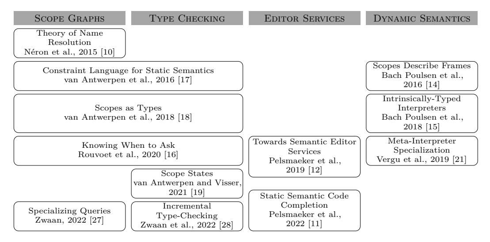
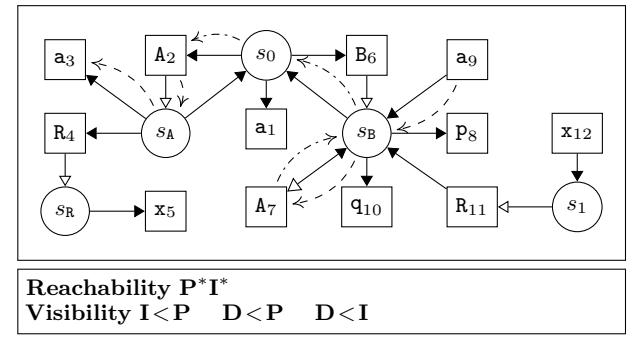
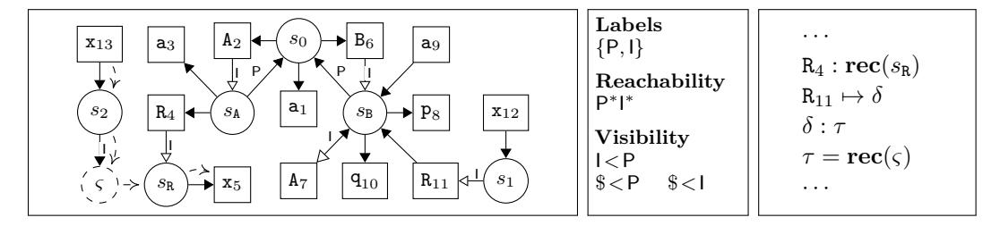
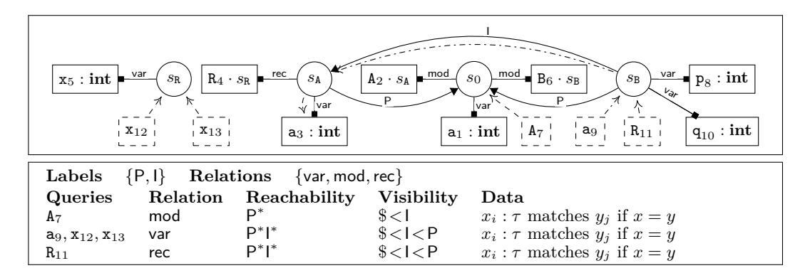
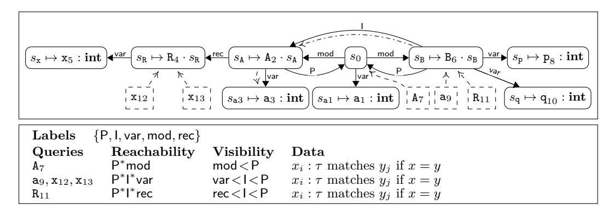

# **Scope Graphs: The Story so Far**

**Aron Zwaan** [#](mailto:a.s.zwaan@tudelft.nl)

Delft University of Technology, Netherlands

**Hendrik van Antwerpen** [#](mailto:hendrik@van-antwerpen.net)

GitHub, Amsterdam, Netherlands

#### **Abstract**

Static name binding (i.e., associating references with appropriate declarations) is an essential aspect of programming languages. However, it is usually treated in an unprincipled manner, often leaving a gap between formalization and implementation. The scope graph formalism mitigates these deficiencies by providing a well-defined, first-class, language-parametric representation of name binding. Scope graphs serve as a foundation for deriving type checkers from declarative type system specifications, reasoning about type soundness, and implementing editor services and refactorings. In this paper we present an overview of scope graphs, and, using examples, show how the ideas and notation of the formalism have evolved. We also briefly discuss follow-up research beyond type checking, and evaluate the formalism.

**2012 ACM Subject Classification** Theory of computation → Program semantics; Theory of computation → Program specifications; Theory of computation → Program analysis

**Keywords and phrases** scope graph, name binding, reference resolution, type system, static semantics

**Digital Object Identifier** [10.4230/OASIcs.EVCS.2023.32](https://doi.org/10.4230/OASIcs.EVCS.2023.32)

**Acknowledgements** We thank Casper Bach Poulsen, Douglas A. Creager, and the anonymous reviewers for their helpful comments to improve this paper.

# **1 Introduction**

Formal presentations of type systems often abstract over surface language features. For example, names are assumed to be unique, or module systems are omitted. Although this yields concise and elegant calculi, it does not cover all the concerns real-world language implementations, such as compilers, interpreters and editors, have to deal with. Part of Eelco Visser's legacy is his work on principled and comprehensive approaches to specify name binding that do support those real-world programming language features. In his vision, language implementations should be derived from high level specifications expressed in *meta-languages* [\[23,](#page-12-0) [24\]](#page-12-1).

Visser's meta-language research is reflected in the development of the Spoofax Language Workbench [\[7\]](#page-11-0). Initially, name binding and type checking were expressed in an imperative style, using the Stratego term rewriting language [\[2,](#page-11-1) [6\]](#page-11-2). The introduction of the NaBL (pronounced *enable*) language [\[8\]](#page-11-3) was the first step towards *declarative* name binding specification. NaBL supports defining name binding rules for AST patterns for a whole range of common binding constructs, such as namespaced declarations and references, lexically nested scopes, transitive and non-transitive imports opening in the surrounding or subsequent scope, and typedependent name resolution with overloading support. From these rules, an incremental name resolution algorithm was automatically generated [\[8,](#page-11-3) [25\]](#page-12-2). However, the semantics of NaBL were implementation-defined, documented by examples [\[10\]](#page-11-4). Attempts to define a declarative semantics for NaBL failed. Visser wrote: "[We] had a hard time explaining exactly how it worked. We kept getting the question 'but what is the semantics of NaBL?' and we didn't have a good answer. Our attempts at formulating a high-level concise formalization of the semantics underlying the implementation proved that this was a non-trivial problem." [\[22\]](#page-12-3)

The resulting research, discussed in this paper, was guided by the goal to design a meta-language for name binding that (i) has a clear and clean underlying theory (*principled*); (ii) can handle a broad range of common language features (*expressive*); (iii) is *declarative*, but realizable by practical algorithms and tools (*executable*); (iv) is factored into language-specific and language-independent parts, to maximize re-use (*reusable*); and (v) can be applied to erroneous programs as well as to correct ones (*resilient*) [\[17\]](#page-12-4).

Traditionally, type systems deal with *names* using *environments*: finite mappings from names to types [\[13\]](#page-11-5). A *declaration* extends the environment, which is then used to type check the part of the program in which the declaration is in scope. A *reference* is type checked by looking up its name in the environment. This process of associating references with declarations is called *name binding*[1](#page-1-0) . Environments work well for lexical binding such as lambdas, where names are scoped in subtrees of the binding construct, because they closely follow the structure of the abstract syntax tree (AST). However, it is more tedious to encode non-lexical binding such as imports or type members, where names are visible in parts of the AST that are not descendants or close siblings of the binding construct, this way. Therefore, environment-based type system formulations do not meet the goals set out before. Non-lexical binding feature are encoded in either a high-level style that is hard to translate to an executable type checker (as exemplified by the effort taken to formalize Scala's type system [\[1\]](#page-11-6)), or in a more low-level style that is hard to reason with (cf. Hedin [\[5\]](#page-11-7) for a similar observation about canonical attribute grammars). In both styles, the encoding is often very specific to the object language and difficult to reuse (cf. Pierce [\[13,](#page-11-5) ch. 15, 19, 20, 23, and 24], which all introduce custom encodings for particular new features). As a result, type checker implementations use other techniques, such as multiple passes over the program, to stage construction and use of environments [\[16,](#page-12-5) sect. 2.3]. In the end, the formalization and implementation differ in a way that makes it challenging to co-develop them, or verify their correspondence [\[3\]](#page-11-8).

Luckily, although the details of name binding semantics differ across languages, there is a significant commonality below the surface. Recurring concepts are *scopes*, the "regions that behave uniformly with respect to name resolution" [\[10\]](#page-11-4), *namespaces*, which categorize names based on their position in the program, and *shadowing*, strategies to disambiguate between multiple candidate declarations. Scope graphs [\[10\]](#page-11-4) capture this uniformity using a reusable representation of name binding structure. In scope graphs, nodes represent scopes and declarations, which are connected by labeled edges. References are resolved by finding paths to eligible declarations, subject to visibility and shadowing policies expressed in terms of edge labels. Using this formalism, many different (non-lexical) binding patterns can be encoded.

Scope graphs have been embedded in type system specification meta-languages such as NaBL2 [\[17\]](#page-12-4) and Statix [\[18,](#page-12-6) [16\]](#page-12-5), implemented as part of the Spoofax language workbench [\[7\]](#page-11-0). Type checkers can be derived automatically from declarative type system specifications written in these languages. Type checker execution is performed by language-parametric algorithms that take care of operational aspects such as scheduling name lookups and scope graph construction, and are guaranteed to be sound with respect to the specification.

This paper gives an overview of published work related to scope graphs to date (visualized in Figure [1\)](#page-2-0). First, we provide an introduction for readers without much background on scope graphs (Section [2\)](#page-2-1). Next, we give an overview of all approaches that use scope graphs to derive sound type checkers from type system specifications, and the way the scope graph formalism has evolved (Section [3\)](#page-3-0). Furthermore, we discuss how scope graphs are used

1 We consider name binding to be *static* name binding, unless noted otherwise.

**Figure 1** Overview of publications related to scope graphs.

beyond type checking for editor services and reasoning about type soundness (Section [4\)](#page-7-0). Finally, we reflect on the development of the formalism (Section [5\)](#page-8-0). This paper is necessarily brief, but we hope it can serve as an introduction and starting point to learn more about scope graphs.

# **2 A Model for Name Binding: Néron et al., 2015**

Scope graphs were introduced as a language-independent theory of name binding [\[10\]](#page-11-4). The goal is a model for the specification of name binding structure and name resolution behavior that lends itself to formal reasoning as well as practical implementation. While aiming for broad coverage of name binding features, the focus is on strong support for non-lexical binding. Name binding structure is described as a graph consisting of nodes and edges that represent scopes, references, declarations, and named imports. The theory is instantiated for specific languages by a mapping from programs to scope graphs and a resolution policy.

We use the example program and scope graph demonstrating module import in Figure [2](#page-3-1) as a running example. Names in the program are annotated with a unique position, written as x*i* , which allow us to conveniently refer to specific *occurrences* of names. These positions are not part of the program source and do not influence resolution behavior. The example program consists of three top-level definitions, a value a, and two modules A and B, where the latter imports the former. The modules contain a definition of a record type R, and values initialized by a constant, a reference, and a projection on a record instance.

In the scope graph, scopes are depicted by circular nodes *si* : *s*0 represents the scope of the whole program, and *s*A and *s*B represent the bodies of modules A and B, respectively. The edges from *s*A and *s*B to *s*0 indicate that *s*0 is the *lexical parent* of *s*A and *s*B, and make the declarations in *s*0 available inside the module bodies. Occurrences of names are depicted as square nodes *xi* . The closed arrow *s*0 a1 indicates a declaration (cf. A2 and x5). Reverse arrows, such as a9 *s*B , indicate a reference (cf. A7 and x12). The open arrow A2 *s*A indicates that *s*A is the *associated scope* of A2 (cf. B6). The arrow *s*B A7 indicates an *import* of the (still to be resolved) module A.

**Figure 2** Example program in LMR [\[17\]](#page-12-4) and its scope graph à la Néron et al., 2015. Dashed arrows show the resolution path of a9, which depends on the dash-dotted resolution path of A7.

References are resolved to declarations of the same name by finding paths in the graph that respect the global resolution policies. A path consists of steps: **P** when traversing a lexical parent edge, and **I** when traversing an import (after which the path continues from the associated scope of the resolved declaration). Declarations are *reachable* from a scope if the path matches the regular expression **P**∗ **I** ∗ , which allows declarations from lexical parents, as well as declarations from (transitive) imports, but not from the lexical parents of imported scopes. Multiple reachable declarations are disambiguated to the set of *visible* declarations using the order on paths, which, in a particular scope, prefers imported declarations over parent declarations (**I***<***P**), and local declarations (represented by the terminal step **D**) over either of those (**D** *<* **P** and **D** *<* **I**). We can see the effect of the resolution policy on the resolution of reference a9. Two declarations are reachable from *s*B: a1 via a **P** step to *s*0, and a3 via an **I** step to *s*A (using import A7 which resolves to A2). The visibility policy prefers **I** over **P**, resulting in a single resolution to declaration a3. This demonstrates that **I***<***P** can be interpreted as: declarations from imports (e.g. a3) shadow declarations from lexically enclosing scopes.

Scopes and imports can also be used to model other binding structures, such as nominal record types. The record type declaration R4 is modeled similar to modules, with a scope *s*R associated to the declaration. Record instantiation is modeled using an instance scope *s*1, which imports *s*R via import R11, which itself is resolved via import A7. Note that reference x13, which is the right hand side of a record *projection*, is not modeled in this scope graph. Indeed, resolving a projection requires knowledge of the *type* of the left-hand side, which was not accounted for in the original scope graph framework, but was added in the work discussed in the next section.

### **3 Formalizing Type Checkers based on Scope Graphs**

The next step after the inception of scope graphs was incorporating them in a metalanguage for type system specifications. As discussed in Section [1,](#page-0-0) this meta-language should be (i) principled; (ii) expressive; (iii) declarative; (iv) executable; (v) reuseable; and (vi) resilient [\[17\]](#page-12-4). These goals have governed the research discussed in this section. This meant evolving the scope graph formalism itself to increase the range of supported language features, developing declarative and operational semantics for the meta-languages, and developing reusable techniques for concurrency and incrementality that applied to all specifications written in a meta-language.

**Figure 3** Scope graph and some of the type constraints à la van Antwerpen et al., 2016 for the example program of Figure 2. Dashed arrows show the resolution path of  $x_{13}$ .

#### 3.1 Scope Graph Constraints: van Antwerpen et al., 2016

The first step towards type checking based on scope graphs was NaBL2, a constraint language with first-class support for scope graph construction and name resolution [17]. This language consists of (i) scope graph constraints, which assert nodes and edges of the scope graph, (ii) resolution constraints, which resolve references or check properties of sets of reachable and visible declarations, and (iii) type constraints to associate types with declarations and check type equality.

From early on, it was clear that name resolution and type checking cannot always be separated into entirely distinct phases. The challenge is that type-dependent references have to be resolved in a scope that is only determined during type checking, making interleaving them inevitable. The overall approach that was chosen to support type-dependent name resolution is to allow for some variability in the structure of the scope graph: edge *targets* could be variables that are instantiated during type checking. This resulted in a two phase approach: first constraints are generated for a program, and then these constraints are solved by a solver which ensures correct sequencing of resolution and variable instantiation.

To accommodate this approach, the paper expanded the scope graph formalism in two ways. Looking at the scope graph in Figure 3, we see some notable differences compared to Figure 2. First, scope-to-scope and import edges are explicitly labeled in the graph  $(\stackrel{\perp}{\longrightarrow}$  and  $\stackrel{\perp}{\longrightarrow})$ , generalizing the notion of fixed **P** and **I** steps. Consequently, reachability and well-formedness are expressed in terms of labels (where \$ takes the place of  $\mathbf{D}$ ). Custom labels are useful because they allow multiple name resolution policies to be composed. For example, using the regular expression P\*(TI\*|I?), transitive (TI) and non-transitive (I) imports can co-exist in the same specification. Second, the graph contains a scope variable, depicted as  $(\varsigma)$ , that represents the context in which  $\mathbf{x}_{13}$  must be resolved. As the value of  $\varsigma$  depends on the type of the record instantiation, it is identified during type checking (phase 2) rather than at constraint generation time. This is demonstrated using some of the constraints of the program (shown on the right side of Figure 3). The first constraint indicates that R4 has type  $\mathbf{rec}(s_{\mathbb{R}})$ . The second constraint instantiates  $\delta$  to the declaration  $R_{11}$  resolves to. The third constraint indicates that  $\tau$  is the type of  $\delta$ . Finally, the fourth constraint asserts that  $\tau$ must be a record type with scope  $\varsigma$ . During constraint solving, the solver instantiates  $\delta$  with  $R_4$ ,  $\tau$  with  $rec(s_R)$ , and  $\varsigma$  with  $s_R$ , which allows the reference  $x_{13}$  to resolve to declaration  $x_5$ in  $s_{\rm R}$ . This illustrates how variable scopes enable type-dependent name resolution.

Despite being very expressive, this version of name resolution suffered from both theoretical and practical problems with imports. The theoretical problem, already noted by Néron et al. [10] as "anomalies", is the behavior that a single import reference might have different interpretations depending on the reference being resolved through it – not in line with the usual expectation that names have a single meaning consistent with all uses. The practical

Figure 4 Scope graph à la van Antwerpen et al., 2018 for the example program of Figure 2. Dash-dotted arrows show the resolution path of a9.

problem is that the common pattern where a reference is imported in the same scope (such as  $(s_B) \leftarrow A_7$ ) led to run times proportional to the factorial of the number of such imports in a scope. These problems were solved by the developments described in the next section.

#### 3.2 A Logic with Scope Graphs: van Antwerpen et al., 2018

While an important step forward, the previous work was mostly limited to languages with simple and nominal types. The constraint language was insufficient to model, for example, structural types and subtyping, or something like Java's nominal subtyping. This led to a radical attempt to generalize the ideas of the constraint language to a full logic. The result was a logic language, Statix, with first class support for scope graph construction and querying, which could be used to write the judgments necessary for type checking [18].

With these developments also came several substantial changes to the scope graph formalism, illustrated in Figure 4. First, the scoped relation  $s_0$  algorithm  $s_0$  are also generalizes declarations and type constraints. The declaration is labeled with a relation (var for variables) and can hold arbitrary data (a pair of an occurrence and its type). The other relations (mod and rec, for modules and record types, respectively), hold pairs of an occurrence and a scope reference. Second, references, which were part of the graph, are replaced by queries, which are ephemeral, but depicted here as  $s_0$  on top of the graph. Parameters that previously were global to the formalism are now specified per query: the relation, reachability and visibility, and the predicate that matches data. The latter provides the ability to match only part of the data (ensuring we resolve a name, while ignoring its type or scope). In addition, having a single relation for each query also simplifies namespacing. These generalizations led to a great increase in expressivity, evidenced by case studies for structural records, nominal subtyping and parametric polymorphism.

One significant change to the scope graph formalism is the elimination of explicit imports. It was noticed that one could write predicate rules that mimic imports by querying the import reference, and asserting a direct edge to the resulting associated scope. The semantics of Statix then ensure that every reference will get a single interpretation, thereby side-stepping both the anomalies and the performance issues of NaBL2. Yet, as a consequence, the graph resembles the original program less: imports become simple edges between scopes, and their dependency on import references is no longer visible.

&lt;sup>2 Contrary to [18], we use dashed lines to emphasize that queries are not part of the graph.

**Figure 5** Scope graph à la Rouvoet et al., 2020 for the example program of Figure 2. Dash-dotted arrows show the resolution path of  $\mathbf{a}_9$ .

#### 3.3 Sound Scheduling: Rouvoet et al., 2020

A major challenge resulting from the development of Statix was how to ensure sound execution of Statix programs. Recall that one goal was to develop meta-languages that were both formal and declarative, as well as executable. The fact that Statix allows edge construction to depend on query resolution is a challenge for the latter. Compared to NaBL2, where only edge targets might be unknown, Statix execution might need to resolve queries when large parts of the graph are still missing. The idea of critical edges, which are edges that are part of the final graph, but not yet present in the current, partial graph, provides a strategy for execution and allows reasoning about its soundness. These edges are sufficient to determine if a query result in the partial graph is sound (i.e., equal to its result in the final graph). This idea is developed into an execution strategy for Statix that over-approximates critical edges using a static analysis of a specification to delay query resolution until soundness is guaranteed. Due to the over-approximation, the algorithm is incomplete, and it can get stuck on typeable programs. While generally not a problem in practice, there have been a few cases where some parts of the specification needed to be rewritten to work around this.

To aid reasoning, Rouvoet et al. present a leaner formalization of both scope graphs and Statix, called Statix-core. We illustrate this with the example scope graph in Figure 5. Instead of scopes and declarations, there is just a single node type, which combines identity and an optional data term, depicted as  $s_i \mapsto d$ . Edge and relations labels are combined, and the relation parameter of the query becomes part of the reachability regular expression. The query algorithm is simplified by disambiguating after, instead of during, resolution.

### 3.4 Concurrency: van Antwerpen et al., 2021

Although Statix is an expressive specification language, its type checkers turn out to be rather slow. The first attempt to mitigate this problem was to execute type checkers concurrently [19]. A concurrent execution model based on scope graphs is developed, that can serve as the basis for Statix execution. The scope graph formalism is extended with a notion of first-class compilation units, where each unit "owns" part of the scope graph. Units are organized hierarchically, with shared scopes connecting parent and child units' scope graphs. Usually, the root unit corresponds to the whole project, the leaves to files, and the units in between to packages or modules. Compilation units are mapped to actors, the units of parallel computation, each of which runs its own type checker. The type checkers use an API to construct and query their scope graph, while resolution queries in other units are

implemented using message passing. Query scheduling is coordinated using *scope states*, a generalization of the critical edges of Rouvoet et al. [\[16\]](#page-12-5). Type checkers initialize fresh scopes with a set of open (critical) edges, which monotonically decreases as the type checkers closes edges (i.e., marks them non-critical). By translating changes in the set of critical edges to scope state operations, the Statix solver was ported to use the concurrent model easily. The concurrent execution can also suffer from incompleteness if open edges are over-approximated. Termination is ensured using a deadlock detection and resolution scheme.

# **3.5 Incrementality: Zwaan et al., 2022**

This concurrent framework was extended to have compilation unit level *incrementality* as well [\[28\]](#page-12-8). When type checking a project incrementally, *edited* units compute a *diff* of their scope graphs (i.e., a set of added and removed scopes and edges), which is used to compute differences in query answers (i.e., added or removed paths) of *unchanged* units. Such units require reanalysis only when an answer to an outgoing query changed. By extending the deadlock resolution of the concurrent solver, the algorithm can deal with mutually recursive dependencies correctly. Case studies resulted in speedups up to 150x on synthetic Java projects and up to 20x on real-world commits from Java and WebDSL projects.

## **3.6 Partial Evaluation: Zwaan, 2022**

Statix describes name resolution using some high-level declarative parameters, such as reachability regular expressions and label orders. This allows expressing reachability and visibility policies concisely, but induces significant overhead when resolving queries. As these parameters are known statically (i.e., no query *parameters* are computed dynamically), partial evaluation [\[4\]](#page-11-13) can be applied to the query resolution algorithm [\[27\]](#page-12-9). This yields imperative query resolution functions, that implement a query with fixed parameters. As such, these specialized queries do not induce overhead from interpreting query parameters anymore. In case studies on Java projects, the type checker runtime decreased 38% to 48%.

# **4 Beyond Type Checking**

In this section, we discuss how declarative specifications based on scope graphs have been used for the dynamic semantics of a language, editor services, and refactorings.

**Dynamic Semantics.** The layout of runtime heaps often corresponds to the static binding structure of a program. This notion is made precise in the "scopes describe frames" paradigm [\[14\]](#page-11-11), in which a heap is defined as a collection of frames. Each frame corresponds to a scope, with links to other frames that correspond to edges in a scope graph, and slots with values that correspond to declarations. This establishes a systematic, language-parametric relation between runtime memory layout and static binding. The correspondence between scopes and frames is used to prove language properties such as type soundness, as well as providing a framework for safe garbage collectors.

The "scopes describe frames" paradigm has been used to define intrinsically-typed definitional interpreters for imperative languages [\[15\]](#page-11-12). While type-safety proofs for languages with mutable state are usually challenging, using this framework, most of the proof work could be delegated to the (dependently-typed) host language. Finally, Vergu et al. [\[21\]](#page-12-10) show that mapping scopes and frames to the Truffle Object Storage Model allows a significant speedup of meta-interpreters.

**Editor Services.** Interactive editor services are as important as a compiler to a modern development experience. Declarative meta-languages, which can be understood independent of their implementations, allow us to derive such editor services as alternative interpretations of a specification [\[12\]](#page-11-9). For example, Statix is used for a language-parametric, sound and complete approach to code completion [\[11\]](#page-11-10). Type-sound proposals are generated by turning the proposal position into a unification variable, and applying search strategies to the constraint problem, to find possible instantiations. These instantiations are then translated back to completion proposals. The implementation is language-parametric, and can be reused as an off-the-shelf component for actual language implementations.

Applying scope graphs as the backbone of language-parametric implementations of common refactorings has been explored as well. This resulted in approaches for *renaming* [\[9\]](#page-11-14) and function *inlining* [\[20\]](#page-12-11). While this demonstrates that scope graphs can facilitate refactorings, they have shown a limitation of Statix' queries. In particular, one cannot express a query that resolves all names that would result in capture. Thus, these refactorings perform a full reanalysis of the program during or after the transformation, which yields significant performance overhead.

**Cross-Language Type Checking.** Since scope graphs provide a uniform representation of name binding, exploratory research in cross-language type checking within a project has been conducted [\[26\]](#page-12-12). This study suggests that scope graphs generated by specifications of different languages are composable when the specifications agree on an "interface", which is a shared collection of labels, declarations and resolution policies. However, approximating critical edges [\[16\]](#page-12-5) and determining rule selection order in Statix require whole-program analyses. Therefore, Statix' specifications turn out to be composable only when the rule sets of the fragments are disjoined, limiting the expressiveness of the approach. Perhaps this approach can be adapted to use compilation units, which executes each unit with its own type checker, making specification composition unnecessary.

### **5 Evaluation**

The work discussed in the previous sections shows the historical development from imperative approaches to name binding using Stratego to a family of meta-languages and languageparametric sevices based on the scope graph formalism. But to what extend has the goal of declarative specification of rich name binding patterns been achieved? In this section, we evaluate the formalism using the goals from Section [1.](#page-0-0)

**Principled.** We first consider whether the developed theory is "clear and clean". As these criteria are a little subjective, and no user evaluation has been conducted at the moment of writing, we mainly base this evaluation on informal feedback acquired over the years. First, the scope graph theory is small, has a well-defined semantics, and closely relates to well-known notions from graph theory. For good scope graph models, the elements of a scope graph (nodes, declarations and edges) can intuitively be related to the original program. Its main weakness is its formulation in terms of individual references, which leads to the anomalous behavior that allows multiple interpretations of import references depending on the the reference resolved through the import. Second, the meta-languages are relatively small, have well-defined semantics, and stay close to existing concepts of constraint and logic programming. Specifications can be understood despite the complexity that is necessary to execute them.

**Expressive.** We begin to consider the expressiveness of scope graphs as a model of name binding. Case studies show that many different name binding patterns can be encoded, ranging from sequential, parallel and recursive let-bindings to transitive and non-transitive module imports using full or partial qualifiers [\[10\]](#page-11-4) as well as nominal and structural records with extension and subtyping [\[17,](#page-12-4) [18\]](#page-12-6). Some important limitations we observed so far: First, substructural type systems are hard to encode, because scope graphs cannot express constraints on declaration access count and ordering. Second, more complex shadowing policies, such as Scala's preference of outer named imports over more closely nested wildcard imports, cannot be expressed with simple label orders. Third, the work on renaming and inlining suggests that scope graph queries are not expressive enough to accommodate concise implementations of refactorings, although precise requirements are still unclear.

Next we consider the expressiveness of the meta-languages, in particular Statix. Case studies show that a variety of typing relations can be expressed, ranging from type-dependent names [\[17\]](#page-12-4), to parametric polymorphism [\[18\]](#page-12-6), as well as disambiguation of qualifiers [\[19\]](#page-12-7). In addition, major limitations exist around inference. First, the absence of support for reasoning about or abstracting over free unification variables makes it impossible to specify Hindley-Milner-style type inference. Second, it is not possible to infer bits of scope graph, not even for fairly local cases such as a record type based on its usage in a function body.

**Declarative.** The meta-languages abstract over implementation concerns such as staging and scheduling constraint resolution. Their specifications can be understood in terms of declarative semantics [\[16,](#page-12-5) fig. 7], which are free of the complexities required for the operational semantics. However, as we will see in the next section, there are rare cases where the specification was changed to accommodate the incompleteness of the solver algorithm. Although the declarative semantics were intended to support formal reasoning, we have only seen that for soundness of the meta-languages themselves, and for definitional interpreters that use customized scope graph representations [\[14,](#page-11-11) [15\]](#page-11-12). Reasoning about properties of individual language specifications, other interpreters, or proving properties of individual programs based on language semantics, is still mostly unexplored.

We also consider whether specifications have a desirable level of abstraction. For many of the motivating use cases that we already mentioned, Statix allows clean and concise encodings, and the rules are quite close to traditional pen-and-paper inference rules. For some cases, the encodings can be very verbose, and the intent gets lost. Examples are parametric polymorphism (e.g., Featherweight Generic Java), which requires explicit substitution logic, and the disambiguation of syntactically ambiguous references in Java, which requires verbose decision procedures that lack the conciseness of the scope graph shadowing primitives.

**Executable.** The need for practical algorithms has always been the sword of Damocles, hanging over us when we consider new theories. While all the research presented before has always addressed both theory and practice, each has sometimes suffered for the others sake. Regarding scope graphs we consider the following points. First, the original resolution algorithm [\[10,](#page-11-4) [17\]](#page-12-4) could perform very poorly when multiple imports were present in a single scope. Circumventing this problem by dropping imports from scope graphs solved this, but has weakened scope graphs as a stand-alone model for name binding: name-based dependencies are not clearly reflected in the graph anymore, and it depends more on the embedding meta-language for common patterns. Second, the scope graph theory has always assumed path orders to be lexicographical orders based on edge labels, and the resolution algorithms handle shadowing locally decided based on outgoing edge labels. The Scala case

study [\[16\]](#page-12-5) shows that local shadowing is not sufficient. Allowing full path ordering would be an innocuous change to the theory, but the performance impact on the resolution algorithms is unclear. Third, the resolution algorithm operates on single references or queries. This inhibits caching, resulting in poor performance, as many parts of the graph are traversed multiple times. This is a problem in practice, since a significant part of meta-language runtime is determined by scope graph resolution. It is an open question whether a resolution algorithm is possible that supports explicit imports without suffering from "anomalies", and what the impact on the theory would be.

Both NaBL2 and Statix allow deriving executable type checkers, which are provably correct (i.e., return results sound with respect to the declarative semantics). However, the need to interleave graph construction and graph querying in Statix because of the absence of imports, has greatly complicated its operational semantic. Additionally, the over-approximation of critical edges can lead to a stuck solver on type-correct programs. Most notably, this was observed when studying the module system of Rust, which was expressible in Statix, but could not be made executable. Regarding performance, Statix has been designed to avoid excessive run times, for example by eliminating backtracking, but so far Statix-based type checkers are still an order of magnitude slower than hand-written ones.

**Reusable.** Scope graphs and Statix abstract over common type checker implementation concerns, such as implementing name binding operations, first-order unification, as well as staging and scheduling, which are reusable through their implementations. In addition, the formalism enabled reuse of editor services such as code completion and refactorings. Still, specifications sometimes have significant boilerplate, due to the lack of sharing possibilities in the meta-language itself. This is a limitation of the current implementation rather than the approach. In the future, we envision supporting polymorphic predicates in the Statix surface language to facilitate reuse of constraints. In addition, a notion of "specification libraries", where we can standardize and reuse particular type system features, could encourage reuse, not just of code, but also language concepts, beyond individual specifications.

**Resilient.** Scope graph resolution is resilient to erroneous and incomplete programs, and will simply return partial or ambiguous results. The meta-languages, in a similar manner, try to solve as much of the type checking problem as possible, while collecting error messages for failed constraints. This is useful when iteratively developing a language. However, the behavior on erroneous programs is not formalized. Thus, there are no guarantees on the behavior of these type checkers on incorrect programs. Similarly, the clarity of the reported errors varies a lot. Especially the combination of unification and dynamic constraint scheduling can result in unexpected errors, that are hard to debug. Improving the quality of error messages is therefore an important open research question.

## **6 Conclusion**

In this paper, we have provided an overview of Eelco Visser's research line related to scope graphs and identified many of its strengths and opportunities for future improvement. While many interesting questions remain, scope graphs have shown to be a solid and reliable foundation for both understanding and implementing name binding related components of language implementations.

#### **References**

- **1** Nada Amin, Samuel Grütter, Martin Odersky, Tiark Rompf, and Sandro Stucki. The essence of dependent object types. In Sam Lindley, Conor McBride, Philip W. Trinder, and Donald Sannella, editors, *A List of Successes That Can Change the World*, volume 9600 of *Lecture Notes in Computer Science*, pages 249–272. Springer, 2016. [doi:10.1007/978-3-319-30936-1\\_14](https://doi.org/10.1007/978-3-319-30936-1_14).
- **2** Martin Bravenboer, Arthur van Dam, Karina Olmos, and Eelco Visser. Program transformation with scoped dynamic rewrite rules. *Fundamenta Informaticae*, 69(1-2):123–178, 2006. URL: <https://content.iospress.com/articles/fundamenta-informaticae/fi69-1-2-06>.
- **3** Atze Dijkstra and S. Doaitse Swierstra. Ruler: Programming type rules. In *8th International Symposium on Functional and Logic Programming*, volume 3945 of *Lecture Notes in Computer Science*, pages 30–46. Springer, 2006. [doi:10.1007/11737414\\_4](https://doi.org/10.1007/11737414_4).
- **4** Yoshihiko Futamura. Partial computation of programs. In *RIMS Symposium on Software Science and Engineering*, volume 147 of *Lecture Notes in Computer Science*, pages 1–35. Springer, 1982. [doi:10.1007/3-540-11980-9\\_13](https://doi.org/10.1007/3-540-11980-9_13).
- **5** Görel Hedin. Reference attributed grammars. *Informatica (Slovenia)*, 24(3):301–317, 2000.
- **6** Zef Hemel, Lennart C. L. Kats, Danny M. Groenewegen, and Eelco Visser. Code generation by model transformation: a case study in transformation modularity. *Software and Systems Modeling*, 9(3):375–402, 2010. [doi:10.1007/s10270-009-0136-1](https://doi.org/10.1007/s10270-009-0136-1).
- **7** Lennart C. L. Kats and Eelco Visser. The Spoofax language workbench: rules for declarative specification of languages and IDEs. In *Proceedings of the 25th Annual ACM SIGPLAN Conference on Object-Oriented Programming, Systems, Languages, and Applications*, pages 444–463, Reno/Tahoe, Nevada, 2010. ACM. [doi:10.1145/1869459.1869497](https://doi.org/10.1145/1869459.1869497).
- **8** Gabriël Konat, Lennart C. L. Kats, Guido Wachsmuth, and Eelco Visser. Declarative name binding and scope rules. In Krzysztof Czarnecki and Görel Hedin, editors, *5th International Conference on Software Language Engineering*, volume 7745 of *Lecture Notes in Computer Science*, pages 311–331. Springer, 2012. [doi:10.1007/978-3-642-36089-3\\_18](https://doi.org/10.1007/978-3-642-36089-3_18).
- **9** Phil Misteli. Renaming for everyone: Language-parametric renaming in spoofax. Master's thesis, Delft University of Technology, May 2021. URL: [http://resolver.tudelft.nl/uuid:](http://resolver.tudelft.nl/uuid:60f5710d-445d-4583-957c-79d6afa45be5) [60f5710d-445d-4583-957c-79d6afa45be5](http://resolver.tudelft.nl/uuid:60f5710d-445d-4583-957c-79d6afa45be5).
- **10** Pierre Néron, Andrew P. Tolmach, Eelco Visser, and Guido Wachsmuth. A theory of name resolution. In Jan Vitek, editor, *Programming Languages and Systems – 24th European Symposium on Programming, ESOP 2015, Held as Part of the European Joint Conferences on Theory and Practice of Software, ETAPS 2015, London, UK, April 11-18, 2015. Proceedings*, volume 9032 of *Lecture Notes in Computer Science*, pages 205–231. Springer, 2015. [doi:](https://doi.org/10.1007/978-3-662-46669-8_9) [10.1007/978-3-662-46669-8\\_9](https://doi.org/10.1007/978-3-662-46669-8_9).
- **11** Daniël A. A. Pelsmaeker, Hendrik van Antwerpen, Casper Bach Poulsen, and Eelco Visser. Language-parametric static semantic code completion. *Proceedings of the ACM on Programming Languages*, 6(OOPSLA):1–30, 2022. [doi:10.1145/3527329](https://doi.org/10.1145/3527329).
- **12** Daniël A. A. Pelsmaeker, Hendrik van Antwerpen, and Eelco Visser. Towards languageparametric semantic editor services based on declarative type system specifications (brave new idea paper). In Alastair F. Donaldson, editor, *33rd European Conference on Object-Oriented Programming*, volume 134 of *LIPIcs*. Dagstuhl, 2019. [doi:10.4230/LIPIcs.ECOOP.2019.26](https://doi.org/10.4230/LIPIcs.ECOOP.2019.26).
- **13** Benjamin C. Pierce. *Types and Programming Languages*. MIT Press, Cambridge, Massachusetts, 2002.
- **14** Casper Bach Poulsen, Pierre Néron, Andrew P. Tolmach, and Eelco Visser. Scopes describe frames: A uniform model for memory layout in dynamic semantics. In Shriram Krishnamurthi and Benjamin S. Lerner, editors, *30th European Conference on Object-Oriented Programming, ECOOP 2016, July 18-22, 2016, Rome, Italy*, volume 56 of *LIPIcs*. Schloss Dagstuhl – Leibniz-Zentrum fuer Informatik, 2016. [doi:10.4230/LIPIcs.ECOOP.2016.20](https://doi.org/10.4230/LIPIcs.ECOOP.2016.20).
- **15** Casper Bach Poulsen, Arjen Rouvoet, Andrew P. Tolmach, Robbert Krebbers, and Eelco Visser. Intrinsically-typed definitional interpreters for imperative languages. *Proceedings of the ACM on Programming Languages*, 2(POPL), 2018. [doi:10.1145/3158104](https://doi.org/10.1145/3158104).

- **16** Arjen Rouvoet, Hendrik van Antwerpen, Casper Bach Poulsen, Robbert Krebbers, and Eelco Visser. Knowing when to ask: sound scheduling of name resolution in type checkers derived from declarative specifications. *Proceedings of the ACM on Programming Languages*, 4(OOPSLA), 2020. [doi:10.1145/3428248](https://doi.org/10.1145/3428248).
- **17** Hendrik van Antwerpen, Pierre Néron, Andrew P. Tolmach, Eelco Visser, and Guido Wachsmuth. A constraint language for static semantic analysis based on scope graphs. In *Proceedings of the 2016 ACM SIGPLAN Workshop on Partial Evaluation and Program Manipulation*, pages 49–60. ACM, 2016. [doi:10.1145/2847538.2847543](https://doi.org/10.1145/2847538.2847543).
- **18** Hendrik van Antwerpen, Casper Bach Poulsen, Arjen Rouvoet, and Eelco Visser. Scopes as types. *Proceedings of the ACM on Programming Languages*, 2(OOPSLA), 2018. [doi:](https://doi.org/10.1145/3276484) [10.1145/3276484](https://doi.org/10.1145/3276484).
- **19** Hendrik van Antwerpen and Eelco Visser. Scope states: Guarding safety of name resolution in parallel type checkers. In Anders Møller and Manu Sridharan, editors, *35th European Conference on Object-Oriented Programming, ECOOP 2021, July 11-17, 2021, Aarhus, Denmark (Virtual Conference)*, volume 194 of *LIPIcs*. Schloss Dagstuhl – Leibniz-Zentrum für Informatik, 2021. [doi:10.4230/LIPIcs.ECOOP.2021.1](https://doi.org/10.4230/LIPIcs.ECOOP.2021.1).
- **20** Loek van der Gugten. Function inlining as a language parametric refactoring. Master's thesis, Delft University of Technology, June 2022. URL: [http://resolver.tudelft.nl/uuid:](http://resolver.tudelft.nl/uuid:15057a42-f049-4321-b9ee-f62e7f1fda9f) [15057a42-f049-4321-b9ee-f62e7f1fda9f](http://resolver.tudelft.nl/uuid:15057a42-f049-4321-b9ee-f62e7f1fda9f).
- **21** Vlad A. Vergu, Andrew P. Tolmach, and Eelco Visser. Scopes and frames improve metainterpreter specialization. In Alastair F. Donaldson, editor, *33rd European Conference on Object-Oriented Programming, ECOOP 2019, July 15-19, 2019, London, United Kingdom*, volume 134 of *LIPIcs*. Schloss Dagstuhl – Leibniz-Zentrum für Informatik, 2019. [doi:10.](https://doi.org/10.4230/LIPIcs.ECOOP.2019.4) [4230/LIPIcs.ECOOP.2019.4](https://doi.org/10.4230/LIPIcs.ECOOP.2019.4).
- **22** Eelco Visser. A theory of name resolution (blog), January 2015. URL: [https:](https://web.archive.org/web/20220925104204/https://eelcovisser.org/blog/writing/2015/01/30/a-theory-of-name-resolution/) [//web.archive.org/web/20220925104204/https://eelcovisser.org/blog/writing/](https://web.archive.org/web/20220925104204/https://eelcovisser.org/blog/writing/2015/01/30/a-theory-of-name-resolution/) [2015/01/30/a-theory-of-name-resolution/](https://web.archive.org/web/20220925104204/https://eelcovisser.org/blog/writing/2015/01/30/a-theory-of-name-resolution/) [cited 18-01-2023].
- **23** Eelco Visser. Understanding software through linguistic abstraction. *Science of Computer Programming*, 97:11–16, 2015. [doi:10.1016/j.scico.2013.12.001](https://doi.org/10.1016/j.scico.2013.12.001).
- **24** Eelco Visser. Fast and safe linguistic abstraction for the masses. In Marieke Huisman, Wouter Swierstra, and Eelco Visser, editors, *Tech Report UU-CS-2019-004: A Research Agenda for Formal Methods in the Netherlands*, pages 10–11. Department of Information and Computing Sciences, Utrecht University, 2019.
- **25** Guido Wachsmuth, Gabriël Konat, Vlad A. Vergu, Danny M. Groenewegen, and Eelco Visser. A language independent task engine for incremental name and type analysis. In Martin Erwig, Richard F. Paige, and Eric Van Wyk, editors, *Software Language Engineering – 6th International Conference, SLE 2013, Indianapolis, IN, USA, October 26-28, 2013. Proceedings*, volume 8225 of *Lecture Notes in Computer Science*, pages 260–280. Springer, 2013. [doi:10.1007/978-3-319-02654-1\\_15](https://doi.org/10.1007/978-3-319-02654-1_15).
- **26** Aron Zwaan. Composable type system specification using heterogeneous scope graphs. Master's thesis, Delft University of Technology, January 2021. URL: [http://resolver.tudelft.nl/](http://resolver.tudelft.nl/uuid:68b7291c-0f81-4a70-89bb-37624f8615bd) [uuid:68b7291c-0f81-4a70-89bb-37624f8615bd](http://resolver.tudelft.nl/uuid:68b7291c-0f81-4a70-89bb-37624f8615bd).
- **27** Aron Zwaan. Specializing scope graph resolution queries. In *Proceedings of the 15th ACM SIGPLAN International Conference on Software Language Engineering*, SLE 2022, New York, NY, USA, 2022. Association for Computing Machinery. [doi:10.1145/3567512.3567523](https://doi.org/10.1145/3567512.3567523).
- **28** Aron Zwaan, Hendrik van Antwerpen, and Eelco Visser. Incremental type-checking for free: Using scope graphs to derive incremental type-checkers. *Proceedings of the ACM on Programming Languages*, 6(OOPSLA2), 2022. [doi:10.1145/3563303](https://doi.org/10.1145/3563303).