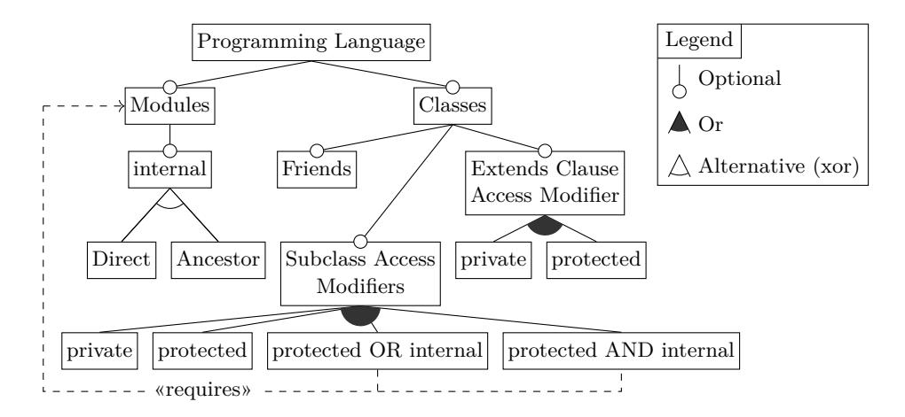
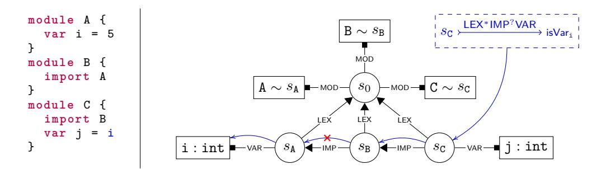
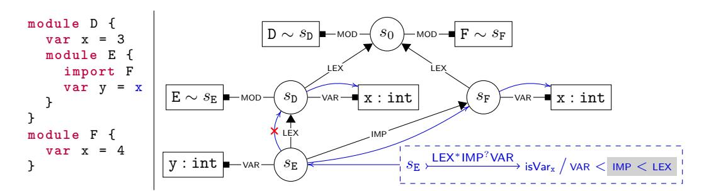
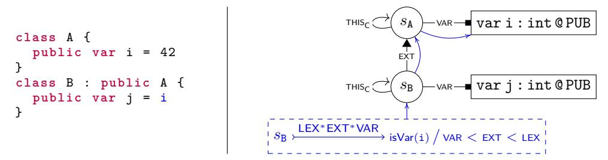
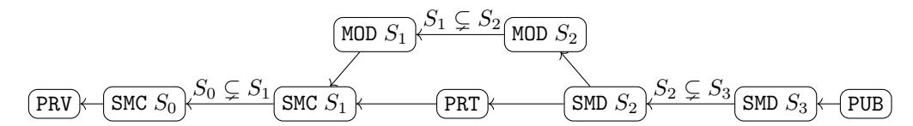

# Defining Name Accessibility using Scope Graphs (Extended Edition)

Aron Zwaan ⊠ ©

Delft University of Technology, Delft, Netherlands

Casper Bach Poulsen 

□

Delft University of Technology, Delft, Netherlands

#### Abstract

Many programming languages allow programmers to regulate *accessibility*; i.e., annotating a declaration with keywords such as **export** and **private** to indicate where it can be accessed. Despite the importance of name accessibility for, e.g., compilers, editor auto-completion and tooling, and automated refactorings, few existing type systems provide a formal account of name accessibility.

We present a declarative, executable, and language-parametric model for name accessibility, which provides a formal specification of name accessibility in Java,  $C^{\#}$ ,  $C^{++}$ , Rust, and Eiffel. We achieve this by defining name accessibility as a predicate on resolution paths through scope graphs. Since scope graphs are a language-independent model of name resolution, our model provides a uniform approach to defining different accessibility policies for different languages.

Our model is implemented in Statix, a logic language for executable type system specification using scope graphs. We evaluate its correctness on a test suite that compares it with the  $C^{\#}$ , Java, and Rust compilers, and show we can synthesize access modifiers in programs with holes accurately.

**2012 ACM Subject Classification** Software and its engineering  $\rightarrow$  Compilers; Software and its engineering  $\rightarrow$  Language features; Theory of computation  $\rightarrow$  Program constructs

Keywords and phrases access modifier, visibility, scope graph, name resolution

Digital Object Identifier 10.4230/LIPIcs.ECOOP.2024.31

Related Version Published Version: https://doi.org/10.4230/LIPIcs.ECOOP.2024.31 [38]

Supplementary Material Software Artifact

Software (ECOOP'24 AEC Approved Artifact): https://zenodo.org/records/11179594 [39]

**Acknowledgements** We thank Friedrich Steimann for challenging us to specify and formalize access modifiers using scope graphs, and the anonymous reviewers for their helpful comments.

# 1 Introduction

Many programming languages, especially object-oriented ones, support information hiding, i.e., regulating from which positions in a program a declaration can be accessed. Information hiding is used to enforce invariants of particular code units, implement design patterns (e.g. the singleton pattern), improve modularization, limit public APIs to offer guidance to library users and guarantee forward compatibility. Support for information hiding is usually provided using access modifier keywords<sup>1</sup> (access modifiers for short), such as public, protected, internal and private. Each of these corresponds with a particular accessibility policy that is validated by the type checker.

Although recent research has not paid much attention to access modifiers, there are still good reasons to study their semantics. First, understanding access modifiers is required to implement (alternative) compilers and editor services correctly. In particular, disregarding

© Aron Zwaan and Casper Bach Poulsen; licensed under Creative Commons License CC-BY 4.0
38th European Conference on Object-Oriented Programming (ECOOP 2024).
Editors: Jonathan Aldrich and Guido Salvaneschi; Article No. 31; pp. 31:1–31:50
Leibniz International Proceedings in Informatics
LIPICS Schloss Dagstuhl – Leibniz-Zentrum für Informatik, Dagstuhl Publishing, Germany

<sup>&</sup>lt;sup>1</sup> Other common names include 'access specifier' or 'visibility modifier'.

```
package p1;
                              package p;
                                                          package p;
class A {
                              class A {
                                                          class A {
  int x;
                                 protected int x;
                                                            private int x = 0;
                                                            protected int y = 1
                                                          }
package p2;
                               class B extends A {
                                                          class B {
class B extends p1.A { }
                                private int x;
                                                            int x = 3;
                                                            int y = 4;
                                                            class C extends A {
package p1;
class C extends p2.B {
                              class C extends B {
                                                               int z = x + y
  int y = x;
                                 int y = x;
                                                          }
(a) Inheritance through Packages.
                              (b) Inaccessible or Shadowed?
                                                         (c) Accessibility and Shadowing.
```

Figure 1 Examples of intricate Access Modifier semantics. Classes are assumed to be public.

accessibility may result in incorrect name binding, and hence incorrect program behavior. Second, formalizing access modifiers enables reasoning about the meaning of programs. Finally, program transformation tools, such as automated refactorings, must handle the semantics of accessibility correctly. This is especially relevant for research on large-scale automated transformations, aimed at dealing with large (legacy) codebases. It is often infeasible to check transformations performed with such tools manually. Thus, the correctness of these transformations must be guaranteed through other means.

The meaning of access modifiers can be intricate in corner cases. We illustrate that using the examples in Figure 1. In Figure 1a, there is an inheritance chain, where class C extends class B, which itself extends A. Classes A and C reside in package p1, while B is in p2. Class A defines a package-accessible field x, which is accessed in C. The question here is whether that access is actually allowed. One could reason that it is correct, as the access occurs in the same package as the declaration, so a package-level declaration should be visible. On the other hand, one could consider x not inherited by B [13, §8.2], and thus not inherited by C either. In fact, the Java language designers chose the second option, rejecting this program [26, §4.2]. Using ((A) this).x is accepted however.

Something similar happens in Figure 1b. Here, one can consider the reference x in class C to be invalid, as the field in class B is inaccessible. Alternatively, under the assumption that B.x is out of scope, the reference can be valid, pointing to A.x. In this case, Java checks accessibility after shadowing, so this program is again rejected. However, in Figure 1c, accessibility does influence the binding. The reference x binds to the field of the enclosing class B, as the field inherited from class A is inaccessible. However, reference y binds to the field inherited from A. Thus, in this case, the accessibility of the inherited fields determines the resolution of x and y; i.e., accessibility is checked before shadowing. This shows that specifying accessibility is essential to defining the name binding of a language correctly.

Unintuitive semantics of accessibility occurs in non-object-oriented languages as well. For example, the accessibility scheme of Agda seems simple: definitions are either public or module-private, and imported definitions can be re-exported. However, issue #5461<sup>2</sup> reports that re-exports in a private block are still exposed to the outside world. While this intuitively seems wrong to most commenters, an argument is made that this is actually the intended behavior. The discussion stalls shortly after a remark that talking about intended behavior is "meaningless without a specification".

https://github.com/agda/agda/issues/5461

These examples show that the meaning of access modifiers is not always obvious. Hence, language designers should define their semantics unambiguously. Ideally, that is done through specifications containing inference rules. Inference rules allow unambiguous interpretation of the meaning of programming language constructs, including name binding. However, perhaps surprisingly, a general model for defining access modifiers has never been proposed.

Perhaps closest is the work of Steimann and Thies [28] (later incorporated in the JRRT refactoring tool [26]). They propose a constraint-based approach to automating refactorings in Java, by collecting and solving accessibility constraints. These constraints are generated using constraint generation rules, which cover the access rules the Java compiler enforces. By solving these constraints, changes in accessibility implied by the refactoring can be inferred, yielding type- and behavior-preserving refactorings.

Steimann and Thies' work solves the problem of making refactorings in Java sound regarding accessibility. However, it does not yet give a high-level explanation of the meaning of access modifiers. This is partly because the constraint generation rules need several low-level details to catch some intricate corner cases, but also because the function that computes the minimal required accessibility level is not given, as it was "unpleasant to specify" and "of no theoretical interest" [28, §5.2]. Therefore, their work cannot easily be adapted to a different language or a different application (e.g., a type checker).

To advance the state of the art, we pursue the following goals:

- **Explain** the meaning of access modifiers.
- Explain the (subtle) differences between access modifiers in different languages.
- Provide a framework for experimenting with feature combinations that do not (yet) exist in other languages.

To this end, we do not fully formalize one particular language, but rather define a toy language that incorporates and combines a large number of accessibility features. To abstract over low-level name resolution details, we use *scope graphs* [21, 30, 25, 40]. In this paper, we demonstrate this is a natural fit, because accessibility can be expressed as a predicate over paths in a scope graph. The specification is written in the logic language Statix [30, 25], which has a well-defined declarative semantics and also supports generating executable type-checkers automatically.

We compare these executable type checkers with reference compilers of Java, C<sup>#</sup>, and Rust, showing that we accurately captured the semantics of access modifiers in some real-world languages. Moreover, using Statix/scope graphs as a basis for (language-parametric) refactorings is an active topic of research [19, 32, 18, 3]. We envision that this will provide accessibility-aware refactorings similar to Steimann et al., without requiring significant additional effort. This is substantiated by the fact that Statix-based code completion [22] proposes an access modifier if and only if it would not cause accessibility errors elsewhere in the program.

In summary, the contributions of this paper are as follows:

- We provide a systematic classification of accessibility features (Section 2);
- we apply our taxonomy to Java, C<sup>++</sup>, C<sup>#</sup>, Rust, and Eiffel (Section 2):
- we present a specification of (various versions of) accessibility on modules (Section 5), subclasses (Section 6), and their conjunctive and disjunctive combination (Section 7);
- we extend our specification with accessibility-restricting inheritance (Section 8);
- we prove some theorems about our model, showing it is well-behaved (Section 9); and
- we implement our specification in Statix, and compare it with the standard compilers of Java, C#, and Rust. Moreover, we show access modifiers can be synthesized accurately using Statix-based Code Completion [22] (Section 10).

# 2 Access Modifiers in Real-World Languages

In this section, we explore the design space of access modifiers as they occur in real-world languages. We first motivate why languages have access modifiers (Section 2.1). After that, we discuss common accessibility features (Section 2.2), summarizing them in a feature model (Section 2.3).

# 2.1 Why Accessibility?

Most programming languages allow programmers to define entities (variables, functions, types, etc.), and assign a name to them. That name can then be used to refer to the introduced entity from other positions in the program. However, as there is typically a large number of entities within a software project, most languages offer a notion of modularization to group related definitions. Equally named definitions in different modules can be distinguished by qualifying them with the name of the module in which they reside. Unqualified (or partially qualified) names by default resolve within their enclosing module, or imported modules. Details of this scheme differ from language to language, but generally aim to make definitions easy to refer to (e.g., by minimizing the number of required qualifiers), while trying to be unambiguous to the compiler and the programmer.

However, these rules may often be too lenient with respect to the intention of the programmer. A definition may be accessible from scopes where it is not intended to be used. This can have detrimental effects on the quality of a software artifact. For example, exposing all internal definitions of a library makes it (1) less intuitive to its users, (2) prone to forward compatibility issues and technical dept (e.g. strong coupling).

For these reasons, many programming languages provide constructs that give the programmer control over the regions of code where a definition can be accessed. For example, in many object-oriented languages, a class can access fields from its ancestor classes by default (language-controlled). However, if the programmer does not want a field to be accessible from subclasses, they can add a private access modifier. This modifier prevents access from all other classes (programmer-controlled). Although many constructs that provide access control to the programmer can be envisioned, most languages settle on a limited set of keywords that can be attached to a definition. In practice, this relatively simple scheme has proven powerful enough to cover most use cases.

#### 2.2 Accessibility in Practice

Next, we explore how languages typically provide modularization and accessibility features.

**Modules** A common feature that provides modularization is *modules* (also called 'package' or 'namespace'). A module is a syntactic construct that introduces a named collection of definitions. Members of modules can be accessed using the name of the module, for example in a preceding import statement, or as a qualifier to the name of the member that is accessed.

Hiding a definition from other modules is the simplest accessibility restriction that can be applied with respect to modules. For example, Java declarations without an access modifier can only be accessed within the same package. Rust items without a modifier behave similarly, except that declarations can still be accessed from submodules.

Some languages have multiple notions of modularization. For example, C<sup>#</sup> has assemblies, namespaces, and files, where a namespace can comprise multiple files, and/or a file can contain multiple namespaces. The internal keyword in C<sup>#</sup> restricts accessibility to the

```
mod outer {
    mod inner {
        pub x = 42;
        }
        pub use inner::x;
    }
}
fn main() {
        // ERROR: inner is inaccessible:
        // let x = outer::inner::x;
        let x = outer::x;
        println!("{x}")
}
```

Figure 2 Re-exports can change Accessibility

assembly, and the file keyword (introduced in  $C^{\#}$  11 [35]) to the current file. Similarly, Java 9 introduces modules [24], with features to restrict access from external modules.

Some languages give some more control over *which* modules a declaration can be accessed from. For example, Rust has the pub(in *path*) access modifier, where *path* refers to some enclosing module. This enables programmers to expose items to an arbitrary ancestor.

Imports usually do not affect the visibility of a declaration. A notable exception to this rule is re-exporting (e.g., as implemented in Rust), which can actually change the visibility of a declaration, as shown in Figure 2. In this program, the module inner is accessible in outer, but not in its parent (the root scope). Therefore, the function main cannot access its field x. However, outer re-exports inner::x, which gives rise to a new definition outer::x. As outer is accessible in the root scope, so is this definition. Hence, via the re-export, main can access x, although the original declaration was hidden.

From an accessibility point of view, re-exporting can typically be considered as a combination of an import and a declaration, where the declaration always points to the imported member. The re-exported item (inner::x in the example) should be accessible from the location of the re-export. References to the re-export should have access to the location of the re-export, but not necessarily to the location of the original declaration. In fact, for any access path, it does not matter whether the declaration is a re-export or not.

**Classes** A special modularization concept is the notion of *classes*, which represent composite data types with associated operations (methods). Where simple modules only have a static interpretation, an arbitrary number of class instances can exist at runtime.<sup>3</sup> While modules can implicitly be related to each other by their relative position, such a relation does not exist for classes. However, classes can extend other classes, ensuring the subclass inherits the fields of its parent class. This creates an inheritance hierarchy orthogonal to the module hierarchy.

Object-oriented languages usually provide modifiers to control accessibility over the inheritance chain. For example, Java and  $C^{\#}$  have a private keyword, which prevents access outside the defining class. Additionally, the protected keyword allows access from subclasses, but prevents access from any other location.

In Java and C<sup>#</sup>, the accessibility level is inherited with the field. That means, if a field in the superclass is protected, it will be protected in the subclass as well. However, C<sup>++</sup> allows restricting the accessibility of members of the parent class. A private modifier on extends-clauses will make all inherited public/protected members private on instances of the subclass. Similarly, a protected modifier will make all inherited public members protected.

Finally, some languages allow specifying 'friend' classes, which grant the friend access to its members. This enables fine-grained access control, independent from module and class hierarchies. While discouraged in  $C^{++}$ , Eiffel provides only this access control mechanism.

<sup>&</sup>lt;sup>3</sup> At this point, we slightly over-simplify the reality. For example, neither parameterized modules (ML) nor objects (e.g. Scala/Kotlin) fit in this scheme. We made this choice deliberately, to cover the most prevalent cases. We conjecture that the techniques we develop for classes can be applied to parameterized modules (and vice versa for modules and objects) but leave explicating that to future work.

**Interaction** Accessibility restrictions on modules and classes be combined. This is very explicit in C#, which has protected internal and private protected as additional modifiers. The former permits access from within the assembly (similar to internal) and to subclasses (similar to protected), even if they live outside the assembly. Analogously, private protected grants access to subclasses in the same assembly only, which is equivalent to the conjunction of internal and protected.

#### 2.3 Classification

These concepts are organized and related in the feature model in Figure 3. Following the previous discussion, the main features are modules and classes. We have only a single feature for modules, because the different variants are (apart from C#s files and namespaces) typically not mutually nested. The internal keyword can either relate to the containing module (Direct) or an arbitrary parent module (Ancestor). We explore this further in Section 5.

<sup>&</sup>lt;sup>4</sup> Either the most direct enclosing file (file), or most directly enclosing assembly (internal), possibly bypassing some namespaces.



Figure 3 Feature Model for Access Control.

**Table 1** Languages classified according to the feature model in Figure 3.

|                             | Java         | C#                  | $C^{++}$     | Eiffel       | Rust     |
|-----------------------------|--------------|---------------------|--------------|--------------|----------|
| Modules                     | <b>✓</b>     | <b>✓</b>            | <b>✓</b>     |              | <b>✓</b> |
| Internal                    | Direct       | $\mathrm{Direct}^4$ | Direct       |              | Ancestor |
| Classes                     | $\checkmark$ | $\checkmark$        | $\checkmark$ | $\checkmark$ |          |
| Friends                     |              |                     | $\checkmark$ | $\checkmark$ |          |
| Subclass Acc. Mod.          | $\checkmark$ | $\checkmark$        | $\checkmark$ | $\checkmark$ |          |
| private                     | $\checkmark$ | $\checkmark$        | $\checkmark$ | $\checkmark$ |          |
| protected                   |              | $\checkmark$        | $\checkmark$ |              |          |
| $protected \mid internal$   | $\checkmark$ | $\checkmark$        |              |              |          |
| $protected \ \& \ internal$ |              | $\checkmark$        | $\checkmark$ |              |          |
| Extends Clause Acc. Mod.    |              |                     | $\checkmark$ |              |          |
| private                     |              |                     | $\checkmark$ |              |          |
| protected                   |              |                     | <b>✓</b>     |              |          |

In the Classes category, the three subfeatures denote the three mechanisms for access control: Friends allow access to other classes by name, Subclass Access Modifiers are access modifiers on definitions that determine how it is accessible within the class hierarchy (Sections 6 and 7), and Extends Clause Access Modifiers (Section 8) are access modifiers on extends clauses, as seen in C<sup>++</sup>. The latter two have subfeatures for each concrete keyword associated with the access control mechanism. For that reason, private and protected occur twice: once on definitions and once on extends clauses. Table 1 classifies several languages according to this scheme. In the remainder of this paper, we develop AML (Access Modifier Language), a language that covers all features. To this end, we first introduce scope graphs (Section 3), and a base language for AML (Section 4).

# 3 Using Scope Graphs to Model Name Binding in Programs

In the previous section, we sketched the landscape of access modifiers. This discussion was based largely on prose specifications as well as experiments with compiler implementations. No language specification we are aware of provides a more rigorous model of accessibility (or even non-lexical name binding). In this section, we introduce *scope graphs* [21, 30, 25, 40], and argue that they provide a suitable framework for such a model. Section 4 introduces AML (Access Modifier Language), a toy language with a type system defined using scope graphs. Sections 5–8 will extend this language with all accessibility features from Figure 3.

#### 3.1 Scope Graphs as A Model for Name Binding

From a name binding perspective, classes and modules have some similarities. Each of these constructs can be thought of as introducing a 'scope' (region of code), in which declarations live, and in which names can be resolved. Scopes are related to each other in various ways. First, modules are related according to their relative position in the abstract syntax tree. In addition, imports and extends clauses relate arbitrary modules and classes, respectively. Resolving a reference corresponds to finding a matching declaration in a scope that is reachable from the scope of the reference. For example, a reference may resolve to a declaration if it lives in a lexically enclosing scope, or in a module that is imported in an enclosing scope.

Scope graphs [21, 30, 25, 40] make this more precise. In this model, the name binding structure of a program is represented by a graph. Figure 4 (adapted from Poulsen et al. [23, Fig. 1]) gives an example program and its corresponding scope graph. A scope is represented by a circular node in the graph. For example,  $s_0$  represents the global scope, and  $s_A$ ,  $s_B$  and  $s_C$  represent the bodies of modules A, B, and C, respectively. Scopes are related using labeled, directed edges. For example,  $s_A$  is lexically enclosed by  $s_0$ , and thus the graph contains an edge from  $s_A$  to  $s_0$  with label Lex. Similarly,  $s_B$  imports  $s_A$ , and thus the graph contains an edge  $s_B \xrightarrow{\text{IMP}} s_A$ . Finally, scope graphs contain declarations. For example, a declaration of i in scope  $s_C$  is represented by the  $s_C \xrightarrow{\text{VAR}} i$ : int edge/node pair. Similarly, the modules are declared in the root scope (e.g.,  $s_0 \xrightarrow{\text{MOD}} A \sim s_A$ ). The language specification determines which data is included in the declaration. Similarly, the labels for edges and declarations can be chosen to match the (binding) constructs of the language.

**Reachability** To resolve a reference, a *query* is executed to find a valid path in the scope graph from the scope of the reference to a matching declaration. Queries give specification writers several options to filter paths, to retain only valid paths. First, a unary predicate selects valid declarations. Usually, this predicate matches declarations with the name of the



Figure 4 Reachability example. The IMP? part in the regular expression prevents traversal over the second IMP edge.



Figure 5 Shadowing example. The highlighted label order causes the edge to SF to have priority.

reference. Second, a regular expression over labels is used to select valid paths. This regular expression can, for example, be used to prevent transitive imports, or accessing members in a lexical parent of an imported module.

Figure 4 illustrates this with the query for i in module C (dashed blue box). The parameter on the arrow (LEX\*IMP<sup>?</sup>VAR), is a regular expression that defines which paths to declarations are valid. The LEX\* indicates that a path may traverse an arbitrary number of LEX-edges. This corresponds to looking for variables in enclosing scopes. Next, the IMP? part indicates that zero or one IMP-edges can be traversed. Finally, the regular expression ends with VAR to ensure all paths resolve in variable declarations only, excluding e.g. modules. The isVar<sub>i</sub> parameter matches all variable definitions with name i (isVar is defined in the next section). The candidate path (shown as blue edges) does not match this regular expression. Because IMP-labeled edges may only be traversed one time, the step to  $s_A$  cannot be made. In other words: the declaration of i in A is not reachable from C.

**Visibility** Not every declaration that is reachable (i.e., for which a valid access path exists) can actually be referenced, due to shadowing. For example, in most languages, local definitions have higher priority than imported ones. We call reachable declarations that are not shadowed by any other declaration visible.

In scope graphs, visibility can be encoded using a partial order on labels. For example, an order VAR < IMP encodes that (local) variable declarations shadow imported declarations. This is illustrated in Figure 5. The reference x in module F can refer to the declaration in module D as well as the one in module E. Because the label order (third argument) indicates that imports shadow lexically enclosing scopes (IMP < LEX). Thus, the variable resolves to the declaration in  $s_{\rm F}$ . Alternatively, if LEX < IMP, it would resolve to x in  $s_{\rm D}$ . Finally, if neither LEX  $\not <$  IMP nor IMP  $\not <$  LEX, both paths would be included in the query result.

In summary, scope graphs model the name binding structure of a program using nodes for scopes and declarations, and edges for relations between those. Queries can be used to model reference resolution. A query selects a declaration when (1) it matches some predicate, and (2) there exists a path to it of which the labels match a regular expression, and (3) no other paths that traverse labels with higher priority exist. The result of a query is a set of paths that lead to these matching declarations.

**Accessibility** We can model extensibility using plain scope graphs by including accessibility information in the *declaration*. In other words, a declaration of a variable in a scope graph contains not only a name and a type, but also its accessibility level. *After resolution*, we check if the path that the query returns is actually valid according to the accessibility level of the declaration. For example, if a variable is private, but an EXT-edge (for class *extension*) is traversed, an error is emitted. With this pattern, we can model all accessibility features.

**Notation** Figures 4 and 5 introduce the graphical notation of scope graphs. In text, variable s ranges over scopes, and S over sets of scopes. Moreover, we use the following notation for assertions on scope graphs:  $s_1 \stackrel{\mathsf{L}}{\longrightarrow} s_2 \in \mathcal{G}$  means 'scope graph  $\mathcal{G}$  has an  $\mathsf{L}$ -labeled edge from  $s_1$  to  $s_2$ ', and  $s \stackrel{\mathsf{D}}{\longrightarrow} d \in \mathcal{G}$  means that  $\mathcal{G}$  has a declaration with data d under label  $\mathsf{D}$  in scope s. Moreover, we write queries in the following way:

$$\mathbf{query}_{\mathcal{G}} s \stackrel{R}{\longmapsto} \mathcal{P} / \mathcal{O} \mapsto R$$

where  $\mathcal{G}$  is the scope graph in which the query is resolved, s is the scope in which the resolution starts, R is the regular expression that paths must adhere to, and  $\mathcal{P}$  is the predicate that declarations must match.  $\mathcal{O}$  is the strict partial order on labels used for shadowing. It is usually written as  $L_1 < L_2 < \cdots < L_n$ . We omit the label order when there is no shadowing. R is the result set containing tuples of paths and declarations. When we expect a single result, we use  $\{\langle p, d \rangle\}$  to match on the value in the set. Paths are alternating sequences of scopes and labels, written as  $s_1 \stackrel{L_1}{\longrightarrow} s_2 \cdots s_m$ . Paths do not include the declaration it resolved to, but stop at the scope in which the declaration occurs. The functions  $\operatorname{src}(p)$ ,  $\operatorname{tgt}(p)$  refer to the source and target scope of a path, respectively,  $\operatorname{scopes}(p)$  denotes all scopes in a path.

# 4 AML: The Base Language

In the next sections, we show how scope graphs support intuitive formalization of accessibility. We will do so by defining AML (Access Modifier Language). The base syntax (which will be extended later) is given in Figure 6. In AML, a program consists of a list of modules. Each module can define other modules, import other modules, and contain class definitions. A class can optionally extend another class, and contains a list of field declarations. Each field has an access modifier, and is initialized by some expression. Possible expressions include references, integer constants, class instance creation, field access, and binary operations.

At the right-hand side of Figure 6, the scope graph parameters are shown. There are three labels that connect scopes. Lex denotes lexical scoping, IMP denotes imports, and ext class extension. The other three labels are used for declarations. Mod is used for module declarations, cls for classes, and var for variables/fields. Next, we assume that each *module scope* has a thism edge pointing to itself, and similarly, each class has a thisc scope pointing to itself. This will be used to resolve enclosing classes or modules. The sort  $\langle d \rangle$  denotes the data that can be associated with scopes. Modules and classes are characterized by their name and the scope of their body. A field has a name, a type  $\langle T \rangle$ , and an accessibility level  $\langle A \rangle$ .

#### 31:10 Defining Name Accessibility using Scope Graphs (Extended Edition)

$$\begin{array}{llllllllllllllllllllllllllllllllllll$$

**Figure 6** Syntax of AML. The highlighted positions indicate extensions in later sections. The syntax of the complete language can be found in Appendix A.

# **Data Matching Predicates** $\mathcal{P}(d)$ $\mathrm{isVar}_x(\operatorname{mod} x':s) \ \Leftarrow \ x = x'$ $\mathrm{isVar}_x(\operatorname{var} x':T \ \mathbf{0} \ A) \ \Leftarrow \ x = x'$ $\mathsf{isCls}_x(\mathsf{cls}\ x':s) \Leftarrow x = x'$ $isScope_s(s') \Leftarrow s = s'$ $s \vdash_{\mathcal{G}} cd \text{ OK}$ **Class Members** $\text{D-Def} \frac{s \vdash_{\mathcal{G}} e : T \quad s \vdash_{\mathcal{G}} acc \Rightarrow A \quad s \xrightarrow{\text{VAR}} (\text{var } x : T @ A) \in \mathcal{G} }{s \vdash_{\mathcal{G}} acc \text{ var } x = e \text{ OK} }$ Type of Expression $s \vdash_{\mathcal{G}} e : T$ $\frac{\operatorname{\mathbf{query}}_{\mathcal{G}}s \xrightarrow{\mathsf{LEX}^*\mathsf{EXT}^*\mathsf{VAR}} \mathsf{isVar}_x \, / \, \mathsf{var} \, < \, \mathsf{ext} \, < \, \mathsf{lex} \, \mapsto \, \{\, \langle p, \mathsf{var} \, x : T \, @ \, A \rangle \,\} \qquad \, s \vdash_{\mathcal{G}} p \, ! \, A \\ s \vdash_{\mathcal{G}} x : T$ $\frac{s \vdash_{\mathcal{G}} e : \texttt{inst } s_c}{\texttt{query}_{\mathcal{G}} \ s_c \\ \xrightarrow{\texttt{EXT*VAR}} \\ \mathsf{isVar}_x \ / \ \mathsf{var} \ < \\ \mathsf{ext} \mapsto \{ \langle p, \texttt{var} \ x : T @ A \rangle \} \\ \hline s \vdash_{\mathcal{G}} e.x : T}$ Access Policy **Access Modifier** $s \vdash_{\mathcal{G}} x \stackrel{\mathsf{M}}{\leadsto} \underline{s_m} \qquad s \vdash_{\mathcal{G}} x \stackrel{\mathsf{C}}{\leadsto} s_c$ Module and Class References

$$\frac{\mathbf{query}_{\mathcal{G}} \ s \overset{\mathsf{LEX*MOD}}{\longrightarrow} \mathsf{isMod}_x \, / \, \mathsf{mod} < \mathsf{lex} \mapsto \big\{ \langle p, \mathsf{mod} \ x : s_m \rangle \big\}}{s \vdash_{\mathcal{G}} x \overset{\mathsf{M}}{\leadsto} s_m}$$

$$\frac{\mathbf{query}_{\mathcal{G}} \ s \overset{\mathsf{LEX*IMP}^?\mathsf{CLS}}{\longrightarrow} \mathsf{isCls}_x \, / \, \mathsf{cls} < \mathsf{IMP} < \mathsf{lex} \mapsto \big\{ \langle p, \mathsf{cls} \ x : s_c \rangle \big\}}{s \vdash_{\mathcal{G}} x \overset{\mathsf{C}}{\leadsto} s_c}$$

**Figure 7** Typing Rules of AML. Accessibility is integrated at the highlighted positions. The full type system specification can be found in Appendix A.

Scopes that are not declarations implicitly map to themselves. To query declarations, we use the four predicates shown at the top of Figure 7, which each match a single kind of declaration. Depending on the type of access control we formalize, different access modifiers will be used. Therefore, we have left the  $\langle acc \rangle$  and  $\langle A \rangle$  productions partially unspecified. Each section will instantiate those appropriately.

**Typing Rules** Figure 7 presents some typing rules of AML. The rules are written in a declarative style, where a scope graph  $\mathcal{G}$  that models the program is assumed. Constraints over the scope graph are used as premises. The highlighted premises show where accessibility is integrated into the type system. We now discuss each of the presented rules.

The D-DEF rule asserts a declaration is well-typed if the initialization expression e has some type T (first premise), the access modifier acc corresponds to some accessibility policy A (second premise), and an appropriate declaration exists in the scope graph (third premise). The accessibility policy is included in the declaration, which enables us to validate accessibility when type checking references.

Next, rule T-VAR defines how references are type checked in a current scope s. First, it performs a query that looks into the lexical context (LEX\*), parent classes (EXT\*), and eventually resolves to a variable declaration (VAR). It matches only variables with the same name as the reference (isVar<sub>x</sub>). Regarding shadowing, it prefers local variables over variables from a parent class (VAR < EXT), and variables from parent classes over variables from enclosing classes (EXT < LEX). The query should return a single result, as the name would otherwise be ambiguous. From this result, the access path p, type T, and accessibility policy A are extracted. The path and the accessibility policy are used in the second (highlighted) premise ( $s \vdash_{\mathcal{G}} p ! A$ ), which asserts that 'accessibility policy A grants access via path p in scope s'. In future sections, we will define new accessibility policy rules, that may prohibit access of a variable, even if the query premise resolved properly.

Note that, by having accessibility separated from the resolution, we do not capture the interaction between accessibility as shown in Figure 1c. We made this choice because the place where accessibility is integrated does not influence the access rules themselves, and this presentation allows more concise derivations, which makes the explanations more accessible. Appendix A.1 shows how to integrate accessibility in the shadowing policy of a query, and is incorporated in the evaluation (Section 10).

For this base language, we only have the public access modifier. The A-Pub rule shows that this keyword corresponds to the PUB policy. The meaning of this policy is that access is allowed from any location, with any access path. This is encoded in the AP-Pub rule, which has no premises.

Finally, the last two rules define how references to classes and modules are resolved. Rule Q-Mod indicates that module reference x resolves to scope  $s_m$  if that scope is included in the closest module declaration with name x in the lexical context. Similarly, a class reference resolves to the scope of the closest class declaration  $s_c$ , preferring (non-transitively) imported classes over classes in the lexical context (Q-CLS).

**Example** The example in Figure 8 shows two classes A and B. Both classes have a THIS<sub>C</sub>-edge pointing to itself. Class B extends class A, which is represented by the  $s_B \xrightarrow{\text{EXT}} s_A$  edge in the scope graph. Class A has a public field i with type int. The type as well as the corresponding PUB access policy are included in the scope graph declaration. Similarly, class B has a field j. The initialization expression of j references i, which is represented with the query shown in the dashed box.



(a) Example program and (partial) scope graph.

$$\frac{\operatorname{query}_{\mathcal{G}} s_{\operatorname{B}} \stackrel{\dots}{\longmapsto} \operatorname{isVar}_{\operatorname{i}} / \dots \mapsto \left\{ \left\langle s_{\operatorname{B}} \stackrel{\operatorname{EXT}}{\longrightarrow} s_{\operatorname{A}}, \operatorname{var} \operatorname{i} : \operatorname{int} \operatorname{@PUB} \right\rangle \right\}}{s_{\operatorname{B}} \vdash_{\mathcal{G}} s_{\operatorname{B}} \stackrel{\operatorname{EXT}}{\longrightarrow} s_{\operatorname{A}} \operatorname{!PUB}}$$

- (b) Part of typing derivation that shows how access is granted by the PUB accessibility policy.
- **Figure 8** Example AML program demonstrating the scope graph structure and name resolution with accessibility checking.

$$\begin{array}{c|c} \textbf{Enclosing Modules} & \hline & \vdash_{\mathcal{G}} s \uparrow_{\mathsf{M}} S & \vdash_{\mathcal{G}} s \uparrow_{\mathsf{M}} s \\ \hline & \\ & \\ & \vdash_{\mathcal{G}} s \uparrow_{\mathsf{M}} S & \\ \hline & \vdash_{\mathcal{G}} s \uparrow_{\mathsf{M}} S \\ \hline & \\ & \vdash_{\mathcal{G}} s \uparrow_{\mathsf{M}} S_{M} \\ \hline & \\ & \\ & \vdash_{\mathcal{G}} s \uparrow_{\mathsf{M}} S_{M} \\ \hline & \\ & \vdash_{\mathcal{G}} s \uparrow_{\mathsf{M}} S_{M} \\ \hline & \\ & \vdash_{\mathcal{G}} s \uparrow_{\mathsf{M}} S_{M} \\ \hline & \\ & \vdash_{\mathcal{G}} s \uparrow_{\mathsf{M}} S_{M} \\ \hline & \\ & \vdash_{\mathcal{G}} s \uparrow_{\mathsf{M}} S_{M} \\ \hline & \\ & \vdash_{\mathcal{G}} s \uparrow_{\mathsf{M}} S_{M} \\ \hline & \\ & \vdash_{\mathcal{G}} s \uparrow_{\mathsf{C}} S & \vdash_{\mathcal{G}} s \uparrow_{\mathsf{C}} S \\ \hline & \\ & \vdash_{\mathcal{G}} s \uparrow_{\mathsf{C}} S_{C} \\ \hline & \\ & \vdash_{\mathcal{G}} s \uparrow_{\mathsf{C}} S_{C} \\ \hline & \\ & \vdash_{\mathcal{G}} s \uparrow_{\mathsf{C}} S_{C} \\ \hline & \\ & \vdash_{\mathcal{G}} s \uparrow_{\mathsf{C}} S_{C} \\ \hline \end{array}$$

Figure 9 Auxiliary relations for AML scope graphs.

Figure 8b shows the part of the typing derivation that checks the highlighted reference. Reference i is type checked in scope  $s_B$ , and has type int. The first premise repeats the query shown in the scope graph, with the parameters and result made explicit. In particular, the resolution path is  $s_B \xrightarrow{\text{EXT}} s_A$ . The validity of this path is checked by the second premise, which is satisfied by the AP-Pub rule.

 $\text{Enc-CI} \frac{\mathbf{query}_{\mathcal{G}} \ s \xrightarrow{\mathsf{LEX}^*\mathsf{THIS}_{\mathsf{C}}} \top / \mathsf{This}_{\mathsf{C}} < \mathsf{lex} \mapsto \{ \langle p, s_c \rangle \}}{\vdash_{\mathcal{C}} s \uparrow_{\mathsf{C}} s_{\mathsf{C}}}$ 

**Auxiliary Relations** Finally, Figure 9 presents some auxiliary relations that we will use later. First, the  $\vdash_{\mathcal{G}} s \uparrow_{\mathsf{M}} S_M$  relation asserts that  $S_M$  is the set of scopes of the enclosing modules of s. It is defined as a query that looks for a this<sub>M</sub> edge in the lexically enclosing scopes. There is no shadowing, so R can contain multiple results in the case of multiple nested modules. The result R is translated to the set of module scopes by discarding the access paths.

This relation is inhabited for any enclosing module scope. The second relation  $\vdash_{\mathcal{G}} s \uparrow_{\mathsf{M}} s_m$  is only inhabited for the *innermost* enclosing module  $s_m$ . The query in its definition finds the closest this\_m-edge, which is enforced by the shadowing policy this\_m < lex. Thus, the query returns only one result, from which the module scope  $s_m$  is extracted. Analogously,  $\vdash_{\mathcal{G}} s \uparrow_{\mathsf{C}} S_C$  relates s to all enclosing class scopes  $S_C$ , and  $\vdash_{\mathcal{G}} s \uparrow_{\mathsf{C}} s_c$  is satisfied if  $s_c$  is the *innermost* enclosing class of s.

# 5 Defining Module Visibility

Some languages have access modifiers that regulate the visibility of a declaration in other modules. For example, in Rust, it is possible to write pub(in ...) to indicate in which module a declaration is visible. Similarly, some languages support giving particular classes access to an item. It is the primary accessibility mechanism for Eiffel, and  $C^{++}$ 's friend modifier enables this as well. Less flexible approaches, such as Java's package visibility and  $C^{\#}$ 's internal keyword can be seen as special instances of this mechanism.

To demonstrate how these access policies can be encoded using scope graphs, we extend our base language as follows. Figure 10a introduces an additional modifier keyword internal, which can contain references to modules. The declaration is visible in these modules only. The corresponding accessibility policy MOD has a set of scopes, each corresponding to a name given in the keyword argument.

Next, we explain how this keyword is interpreted. An internal declaration is accessible if the reference occurs in a module that the arguments to the internal modifier give access to. This is formalized in the rules given in Figure 10b. Rule A-Int translates an internal access modifier to the MOD policy. Each module name argument to the modifier  $(x_i)$  is resolved relative to the current scope s. This yields a collection of module scopes  $s_i$ , which are included in the resulting policy. The AP-Int rule encodes that accessing an internal variable is valid if  $s_m$ , the scope of some enclosing module of s (the scope of the reference), is in the list of scopes to which access is granted.

$$\langle acc \rangle ::= \dots |$$
 internal (  $\langle x \rangle^*$  )  $\langle A \rangle ::=$  MOD  $S$ 

(a) Syntax of internal keyword.

$$\text{A-Int} \frac{S = \left\{ s' \ \middle| \ x_i \in \overline{x}_{0...n}, s \vdash_{\mathcal{G}} x_i \overset{\mathsf{M}}{\leadsto} s' \right\}}{s \vdash_{\mathcal{G}} \text{ internal} \left( \overline{x}_{0...n} \right) \Rightarrow \texttt{MOD} \ S} \\ \text{AP-Int} \frac{\vdash_{\mathcal{G}} s \uparrow_{\mathsf{M}} S_M \quad s_m \in S_M \quad s_m \in S}{s \vdash_{\mathcal{G}} p \, ! \, \texttt{MOD} \ S}$$

(b) Semantics of internal keyword.

$$\begin{array}{c|c} & \vdash_{\mathcal{G}} s \uparrow_{\mathsf{M}} S_{M} \\ \\ \text{A-Int'} & \frac{S = \left\{ s' \ \middle| \ x_{i} \in \overline{x}_{0...n}, s \vdash_{\mathcal{G}} x_{i} \overset{\mathsf{M}}{\leadsto} s', \ s' \in S_{M} \ \right\}}{s \vdash_{\mathcal{G}} \ \text{internal} \left( \overline{x}_{0...n} \right) \Rightarrow \mathsf{MOD} \ S} \\ \end{array} \\ \begin{array}{c|c} \text{AP-Int'} & \frac{\vdash_{\mathcal{G}} s \uparrow_{\mathsf{M}} s_{m}}{s \vdash_{\mathcal{G}} p \, ! \, \mathsf{MOD} \ S} \end{array}$$

(c) Variant 1: Ancestor module only

$$\begin{array}{cccccccccccccccccccccccccccccccccccc$$

- (e) Variant 3: Definition exposed to all classes in path
- **Figure 10** Extending AML (Figure 7) with module-level visibility.

(a) Example program and partial scope graph demonstrating the internal access modifier.

$$\text{A-Int} \frac{s_{\mathtt{A}} \vdash_{\mathcal{G}} \mathtt{M} \overset{\mathtt{M}}{\leadsto} s_{\mathtt{M}}}{s_{\mathtt{A}} \vdash_{\mathcal{G}} \mathtt{internal}(\mathtt{M}) \Rightarrow \mathtt{MOD} \left\{ s_{\mathtt{M}} \right\} }$$

**(b)** Part of typing derivation that shows how accessibility policy is derived.

$$\text{AP-Int} \frac{\frac{\dots}{\vdash_{\mathcal{G}} s_{\mathsf{B}} \uparrow_{\mathsf{M}} \left\{s_{0}, s_{\mathsf{M}}, s_{\mathsf{N}}\right\}} \quad s_{\mathsf{M}} \in \left\{s_{0}, s_{\mathsf{M}}, s_{\mathsf{N}}\right\} \quad s_{\mathsf{M}} \in \left\{s_{\mathsf{M}}\right\}}{s_{\mathsf{B}} \vdash_{\mathcal{G}} \left(s_{\mathsf{C}} \xrightarrow{\mathsf{EXT}} s_{\mathsf{A}}\right) ! \; \mathsf{MOD} \left\{s_{\mathsf{M}}\right\}}$$

- (c) Part of typing derivation that shows how access is granted by the MOD accessibility policy.
- Figure 11 Example program demonstrating the meaning of the internal access modifier.

**Example.** Figure 11 gives an example of an *internal* variable. Class A has a field x that can be accessed from module M. In the scope graph, this is indicated with the access policy MOD  $\{s_{\mathbb{M}}\}$  on the corresponding declaration in  $s_{\mathbb{A}}$ . The derivation of this policy is shown in Figure 11b. Module M contains a nested module N, which contains a class B. In class B, the field x is accessed on an instance of A. The (partial) typing derivation in Figure 11c shows this access is allowed by the AP-INT rule. The first premise asserts that  $s_0$ ,  $s_{\mathbb{M}}$  and  $s_{\mathbb{N}}$  are the enclosing modules of  $s_{\mathbb{B}}$ . This can be seen in the scope graph, as those scopes are reachable via paths with regular expression LEX\*THISM (Figure 9). As  $s_{\mathbb{M}}$  occurs both in the enclosing modules and in the access policy, access is allowed.

Variant 1. Several variations on this scheme are conceivable. For example, languages can restrict the modules to which an internal modifier may expose a declaration. For example, Rust has the pub(in  $\langle path \rangle$ ) visibility modifier, similar to how we defined internal. However, at the  $\langle path \rangle$  position, only "an ancestor module of the item whose visibility is being declared" is allowed [9, §12.6]. This is encoded in Figure 10c. Compared to A-INT, this rule adds premises (highlighted) that guarantee that the arguments of the internal modifier  $(x_i)$  resolve to an enclosing module  $(s_i \in S_M)$ .

Note how these premises would make the example fail to type-check. Only  $s_0$  is an enclosing module of  $s_A$ . In particular, the derivation in Figure 11b would have an additional premise  $s_A \in \{s_0\}$ , which is clearly unsatisfiable.

**Variant 2.** Next, consider the example in Figure 11a again. In the system above, x is accessible in B, because x is exposed to one of its enclosing modules (M). However,  $s_M$  is not its *innermost* enclosing module. Such a more lenient accessibility scheme might be desirable (e.g., Rust has this behavior), but languages such as Java do not allow this. To model these

```
class A {
   private int x = 42;
   public int accessX(B b) {
      return b.x; // ERROR!
   }
}
class B extends A { }

class A {
   private int x = 42;
   public int AccessX(B b) {
      return b.x; // fine
   }
}
class B extends A { }

class B : A { }
```

Figure 12 Difference in private member access of subclass instances between Java and C<sup>#</sup>.

languages, we instead use the premise that asserts  $s_m$  is the *innermost* enclosing module scope. The rule for this variant is given in Figure 10d.

With this addition, the example would fail to type-check as well. The access validation (Figure 11c) would now have to satisfy  $\vdash_{\mathcal{G}} s_{\mathsf{B}} \uparrow_{\mathsf{M}} s_{\mathsf{M}}$ , which is impossible, as  $s_{\mathsf{N}}$  is the innermost enclosing module.

**Variant 3.** Finally, consider example Figure 1a from the introduction again. In this example, the reference to x in class C was not valid, as B (by virtue of residing in a different package), did not inherit x. The (partial) rule in Figure 10e covers this case. For each scope in the path (apart from the target), it adds premises that assert that the definition is exposed to that scope (similar to s in Figure 10b). The target is excluded because it is not inheriting the accessed field, but rather defining it. (Recall that paths move from reference to declaration, so the target is the scope of the defining class.) For that reason, there is no need to assert it inherits the field.

When adding this rule fragment to the derivation in Figure 11c, there will be additional premises that validate that class C inherits x. This is the case, as C resides in module M.

# 6 Defining Subclass Visibility

Next, we consider how to define access modifiers that regulate access from other *classes*: the private modifier (Section 6.1), and the protected keyword (Section 6.2).

#### 6.1 Private Access

The private access modifier is slightly challenging to define, as languages implement it differently. For example, C# allows accessing private variables on instances of *subclasses*, whereas Java does not. Consider the example programs in Figure 12. In the Java case, the access b.x is invalid, because it only allows access on instances of A.

On the other hand, Java exposes private members to the *outermost* enclosing class<sup>6</sup>, while C<sup>#</sup> only exposes members to the *defining* (i.e., innermost enclosing) class (including nested classes), as shown in Figure 13.

We start with modeling the C# semantics in Figures 14a–14c. Rule AP-PRIV states that the class in which the field is declared (which is the target of the path  $\mathsf{tgt}(p)$ ) should be an enclosing class of the scope in which the access occurs. This permits access from nested

 $<sup>^{5}</sup>$  Alternatively, the premises of Figure 10d can be used when direct exposure is required.

<sup>&</sup>lt;sup>6</sup> "[When] the member or constructor is declared private, (...) access is permitted if and only if it occurs within the body of the top level class [sic!] that encloses the declaration of the member or constructor." [13, §6.6.1]

```
class A {
                                                 class A {
     class B {
                                                      class B {
          private int x = 42;
                                                            private int x = 42;
     int accessX(B b) {
    return b.x; // fine
                                                      int AccessX(B b) {
    return b.x; // ERROR!
}
```

Figure 13 Difference in private member access from enclosing class between Java and C<sup>#</sup>.

```
\text{A-Priv} \overline{s \vdash_{\mathcal{G}} \text{private} \Rightarrow \text{PRV}}
\langle acc \rangle ::= \dots \mid \mathtt{private} \quad \langle A \rangle ::= \dots \mathtt{PRV}
```

(a) Syntax of private keyword.

$$AP-PRIV' \frac{p \sim LEX^*}{s \vdash_{\mathcal{G}} p \,! \, A}$$

 $AP-P_{RIV} \frac{\vdash_{\mathcal{G}} s \uparrow_{\mathsf{C}} S_C \qquad \mathsf{tgt}(p) \in S_C}{s \vdash_{\mathcal{G}} p \,! \, A}$ 

(b) private to PRV access policy.

(c) Semantics of private keyword.

(d) Prevent access on instances of subclasses.

$$\begin{array}{c|c} & \vdash_{\mathcal{G}} s \uparrow_{\mathsf{C}} S_{C_{\mathit{ref}}} & \vdash_{\mathcal{G}} \mathsf{tgt}(p) \uparrow_{\mathsf{C}} S_{C_{\mathit{decl}}} & s_c \in S_{C_{\mathit{ref}}} & s_c \in S_{C_{\mathit{decl}}} \\ & & s \vdash_{\mathcal{G}} p \: ! \: A \end{array}$$

- (e) Allow access from enclosing classes
- Figure 14 Extending AML (Figure 7) with private visibility.

classes of tgt(p), but does not expose it to enclosing classes. On the other hand, access on instances of subclasses is allowed, as there are no constraints on the structure of the path.

Note that we did not specify that this rule matches on the PRV policy specifically, but rather applies to any access policy A. This is a deliberate choice; it adds the possibility of using this rule as a fallback in case no other rule works. This ensures other accessibility policies will never be more strict than PRV, which corresponds to general intuition. By matching on an arbitrary A in AP-PRIV, we simplify the definition of the other policies, as they otherwise would need to define special rules for private-like access.

**Current Instance.** Now, we adapt these rules to match the Java semantics. First, Figure 14d shows how to prevent access to the private field on instances of subclasses (Figure 12). It uses a new type of constraint,  $p \sim R$ , which holds when the sequence of labels in path p is in the language described by the regular expression R. In this case, we assert that the access path p must adhere to the regular expression LEX\*. This prevents access from instances of subclasses of the defining class, as that requires traversing an EXT edge. For example, the access path in Figure 12 would be  $s_B \xrightarrow{\mathsf{EXT}} s_A \sim \mathsf{LEX}^*$ , which is not satisfiable.

**Outermost Class.** Finally, Figure 14e shows how to expose private fields to the outermost enclosing class. In this rule, the set  $S_{C_{ref}}$  contains the scope of the enclosing classes of the reference location, and  $S_{C_{decl}}$  contains the scope of the enclosing classes of the class in which the declaration occurs. These sets should share a scope  $s_c$ , which represents the shared enclosing class of the reference and the declaration.

Note how this rule enables type-checking the program in Figure 13. Using AP-PRIV does not work, as  $\vdash_{\mathcal{G}} s_{\mathbb{A}} \uparrow_{\mathbb{C}} \{s_{\mathbb{A}}\}$ , which does not include  $\mathsf{tgt}(p) = s_{\mathbb{B}}$ . However, we can check it with AP-PRIV", as  $\vdash_{\mathcal{G}} \mathsf{tgt}(p) \uparrow_{\mathsf{C}} \{s_{\mathsf{B}}, s_{\mathsf{A}}\}$ , which includes the shared enclosing class  $s_{\mathsf{A}}$ .

$$\langle acc \rangle ::= \dots \mid \texttt{protected} \qquad \qquad \langle A \rangle ::= \dots \mid \texttt{PRT}$$

(a) Syntax of protected keyword.

$$\text{A--Prot} \frac{}{s \vdash_{\mathcal{G}} \text{protected} \Rightarrow \text{PRT} } \qquad \text{AP--Prot} \frac{\vdash_{\mathcal{G}} s \uparrow_{\mathsf{C}} S_{C} \quad s_{c} \in S_{C} \quad s_{c} \in \text{scopes}(p) }{s \vdash_{\mathcal{G}} p \,! \, \text{PRT} }$$

- (b) Semantics of protected keyword.
- Figure 15 Extending AML (Figure 7) with protected visibility.

```
class A {
  protected var x = 42
}
class B : public A {
  class I {
    public int f(b: B) {
      return b.x;
    }
}
var b : inst $s_B @ PUB
```

(a) Example program and partial scope graph demonstrating the protected access modifier.

$$\frac{\frac{\cdots}{\vdash_{\mathcal{G}} s_{\mathsf{f}} \uparrow_{\mathsf{C}} \{s_{\mathsf{I}}, s_{\mathsf{B}}\}} \quad s_{\mathsf{B}} \in \{s_{\mathsf{I}}, s_{\mathsf{B}}\} \quad s_{\mathsf{B}} \in \mathsf{scopes}\left(s_{\mathsf{B}} \xrightarrow{\mathsf{EXT}} s_{\mathsf{A}}\right)}{s_{\mathsf{f}} \vdash_{\mathcal{G}} \left(s_{\mathsf{B}} \xrightarrow{\mathsf{EXT}} s_{\mathsf{A}}\right) ! \mathsf{PRT}}$$

- (b) Part of typing derivation that shows how access is granted by the PRT accessibility policy.
- **Figure 16** Example program demonstrating the meaning of the protected access modifier.

#### 6.2 Protected Access

The protected access modifier (Figure 15a) grants access to subclasses of the defining class, including classes nested in subclasses. For field access expressions ( $\langle e.x \rangle$ ), e must be an instance of a class that encloses the reference [13, §6.6.2.1]. This semantics (Figure 15b) can be modeled by asserting that there should be some class  $s_c$  that is both (a) an enclosing scope of the reference location ( $\vdash_{\mathcal{G}} s \uparrow_{\mathsf{C}} S_C$ ), and (b) occurs in the in the access path ( $s_c \in \mathsf{scopes}(p)$ ). The last condition implies that the enclosing class  $s_c$  is a subclass of the defining class, which is the intuitive understanding of the protected keyword.

Figure 16 demonstrates how this rule works. In this program, there is a class A which has a subclass B. Class B has a nested class I, which has a method f with a parameter b of type B. The body of f accesses field x on the instance of B. On the right-hand side of the picture, a part of the corresponding scope graph is shown. The scopes for classes A and B are connected by an EXT-edge again. The fact that class I is nested in class B is represented by the  $s_1 \stackrel{\text{LEX}}{\longrightarrow} s_B$  edge, similar to other lexically nested constructs. Likewise, scope  $s_f$ , which represents the body of the method f, has a LEX-edge to  $s_I$ .

Figure 16b shows how the access to b.x is validated. The first premise states that  $s_I$  and  $s_B$  are the enclosing classes of  $s_f$ . The other premises assert that  $s_B$  is in the enclosing classes as well as in the access path. Together, this allows access to the protected member. Note how access to an instance of A in  $s_f$  would not be allowed. In that case, the access path would have been just  $s_A$ , which is not an enclosing class of  $s_f$ .

$$\begin{array}{ll} \langle acc \rangle & ::= \ldots \mid \text{protected internal (} \langle x \rangle^* \text{ )} \mid \text{private protected (} \langle x \rangle^* \text{ )} \\ \langle A \rangle & ::= \ldots \mid \text{SMD } S \mid \text{SMC } S \end{array}$$

(a) Syntax of policy interaction keywords.

$$\text{A-PPROT} \frac{S = \left\{ s' \;\middle|\; x_i \in \overline{x}_{0...n}, s \vdash_{\mathcal{G}} x_i \overset{\mathsf{M}}{\leadsto} s' \right\}}{s \vdash_{\mathcal{G}} \text{private protected}(\overline{x}_{0...n}) \Rightarrow \text{SMC } S}$$

$$A\text{-PINT} \frac{S = \left\{ s' \mid x_i \in \overline{x}_{0...n}, s \vdash_{\mathcal{G}} x_i \overset{\mathsf{M}}{\leadsto} s' \right\}}{s \vdash_{\mathcal{G}} \mathtt{protected\ internal}(\overline{x}_{0...n}) \Rightarrow \mathtt{SMD}\ S}$$

(b) Translation of composite keywords to their policies.

$$\begin{split} \operatorname{AP-SMC} & \frac{s \vdash_{\mathcal{G}} p \, ! \, \operatorname{MOD} \, S \quad s \vdash_{\mathcal{G}} p \, ! \, \operatorname{PRT}}{s \vdash_{\mathcal{G}} p \, ! \, \operatorname{SMC} \, S} \\ \\ \operatorname{AP-SMD-Prot} & \frac{s \vdash_{\mathcal{G}} p \, ! \, \operatorname{PRT}}{s \vdash_{\mathcal{G}} p \, ! \, \operatorname{SMD} \, S} \quad & \operatorname{AP-SMD-Mod} & \frac{s \vdash_{\mathcal{G}} p \, ! \, \operatorname{MOD} \, S^{(*)}}{s \vdash_{\mathcal{G}} p \, ! \, \operatorname{SMD} \, S} \end{split}$$

- (c) Semantics of interaction policies.
- **Figure 17** Extending AML (Figure 7) with keywords to combine module-level and subclass-level accessibility.

# 7 Combining Subclass and Module Visibility

Access modifiers regulating both the module and subclass dimensions occur in real-world languages as well. For example (as noticed earlier), Java's protected keyword also exposes a definition in the same package, similar to  $C^{\#}$ 's protected internal. In addition,  $C^{\#}$  has a private protected modifier, which allows access to subclasses in the same assembly only. In fact, those two keywords denote the two main ways in which access modifiers can interact. First, protected internal denotes disjunctive interaction, where a declaration is accessible from the subclasses or the same module. Second, private protected denotes conjunctive interaction, where a declaration is accessible from the subclasses in the same module only. These interactions are straightforward to define, with one intricate case discussed below.

Figure 17a defines the syntax of the two new keywords (based on their name in C#) and policies. We add SMD (Subclass/Module, Disjunctive) and SMC (Subclass/Module, Conjunctive) policies, which each contain a list of module scopes to which they are exposed. The translation from keyword to policy is given in Figure 17b. Both rules resolve their module arguments, similar to A-INT. The SMC policy has one rule (AP-SMC), which simply asserts that access is granted by the module (MOD) and protected (PRV) policies. There are two rules for the SMD policy. The first one simply delegates to the PRT access policy, permitting access wherever a protected member would have been accessible. The other rule delegates to the MOD policy, but more careful attention must be paid here (hence the (\*) mark). Recall that the semantics of this policy has a variant that asserts that the whole inheritance chain has access to the declaration (Figure 10e). However, this extension should *not* be applied here, because the protected part of this modifier already grants access, regardless of the module-level exposure.

$$\text{P-Pub} \frac{p \sim \text{Lex*ext*}}{s \vdash_{\mathcal{G}} p \: \text{i}} \qquad \text{P-Priv-Prot} \frac{p_1 \sim \text{Lex*ext*}}{p_2 \sim \text{Ext}_{\text{prv}}^2 (\text{ext}|\text{ext}_{\text{prt}})^*}}{s \vdash_{\mathcal{G}} p \: \text{i}}$$

Figure 18 Extending AML (Figure 7) with path-level visibility.

# 8 Defining Extends-Clause Accessibility Restriction

Until now, we have only considered inheritance as it exists in Java and  $C^{\#}$ . In this section, we shift our focus to  $C^{++}$ , in particular the access modifiers on extends clauses. In  $C^{++}$ , it is possible to add a private modifier to an extends clause, which reduces the accessibility of public and protected members to private in the derived class. Similarly, the protected keyword can be used to reduce the accessibility of public members to protected. For qualified accesses,  $C^{++}$  imposes the additional constraint that the inheritance chain leading to class in which the variable is declared should be accessible from the class in which the access occurs [10, §11.9.3 (4)].

**Setup.** In contrast to the previous sections, we cannot encode inheritance-imposed access control in our accessibility policy A. Instead, we encode it in the scope graph directly. For that purpose, we introduce two new labels:  $\mathsf{EXT}_{\mathsf{PRV}}$  and  $\mathsf{EXT}_{\mathsf{PRT}}$ , which model private and protected extension, respectively. Similar to the previous sections,  $\mathsf{EXT}$  will model public extension; i.e. inheritance without access restriction.

Fortunately, we can validate path access independently from the declaration-level access policy. We require two adaptations to the rules T-VAR and T-FLD (Figure 7). First, the regular expressions of the queries must be changed to also traverse these new edges. Thus, in T-VAR, Lex\*ext\*var must be changed to Lex\*(ext|ext\_prt|ext\_prt)\*var. Similarly, T-FLD now has  $(ext|ext_prt|ext_prt)$ \*var as regular expression instead of ext\*var. Second, we add a premise  $s \vdash_{\mathcal{G}} p \mid$  to both rules. This premise asserts that the labels in the path p do not hide the accessed definition in scope s.

Path accessibility can be captured in two rules, shown in Figure 18. First, P-PuB asserts that a path is valid when there is only public inheritance. With this rule, the semantics of the programs that do not use private or protected inheritance has not changed. Second, rule P-PRIV-PROT covers the other two cases. This rule looks intricate, but the intuition behind it is not too complicated. Similar to the private and protected modifiers (Sections 6.1 and 6.2), access must occur within the class where the member is private/protected. This is now not necessarily the defining class, but rather the last class in the inheritance chain that has a non-public modifier on the extends clause. In the rule, this is encoded as follows. The first two premises introduce a scope  $s_c$ , which is an enclosing scope of the reference location s. The third premise asserts that the path p can be split into two segments at scope  $s_c$ . That is, p consists of two segments: a part  $p_1$  from  $s_1$  to  $s_c$  and a part  $p_2$  from  $s_c$  to  $s_n$ . This implies that  $s_c$  is in the access path. To validate that all subclasses of  $s_c$  in the path have public inheritance,  $p_1$  should match regular expression LEX\*EXT. The path

<sup>&</sup>lt;sup>7</sup> That also holds for the subtle interaction between internal and protected discussed in Section 7. protected or private inheritance in subclasses of the reference class can still compromise these access modes, and must therefore be validated.

<sup>&</sup>lt;sup>8</sup> Alternatively, one can encode the requirement that the instance type must be  $s_c$  itself by using Lex\*, similar to Figure 14d.

(a) Example program and partial scope graph demonstrating path access restrictions.

$$\frac{\cdots}{\vdash_{\mathcal{G}} s_{\mathsf{B}} \uparrow_{\mathsf{C}} \left\{ s_{\mathsf{B}} \right\}} \qquad \qquad s_{\mathsf{B}} \in \left\{ s_{\mathsf{B}} \right\}$$

$$\mathsf{split-at}(s_{\mathsf{B}}, s_{\mathsf{C}} \xrightarrow{\mathsf{EXT}} s_{\mathsf{B}} \xrightarrow{\mathsf{EXT}_{\mathsf{PRV}}} s_{\mathsf{A}}) = \left\langle s_{\mathsf{C}} \xrightarrow{\mathsf{EXT}} s_{\mathsf{B}}, s_{\mathsf{B}} \xrightarrow{\mathsf{EXT}_{\mathsf{PRV}}} s_{\mathsf{A}} \right\rangle$$

$$\frac{\left( s_{\mathsf{C}} \xrightarrow{\mathsf{EXT}} s_{\mathsf{B}} \right) \sim \mathsf{LEX}^* \mathsf{EXT}^*}{\left( s_{\mathsf{B}} \xrightarrow{\mathsf{EXT}_{\mathsf{PRV}}} s_{\mathsf{A}} \right) \sim \mathsf{EXT}_{\mathsf{PRV}}^? (\mathsf{EXT} | \mathsf{EXT}_{\mathsf{PRT}})^*}{s_{\mathsf{B}} \vdash_{\mathcal{G}} \left( s_{\mathsf{C}} \xrightarrow{\mathsf{EXT}} s_{\mathsf{B}} \xrightarrow{\mathsf{EXT}_{\mathsf{PRV}}} s_{\mathsf{A}} \right) \mathsf{i}}$$

- (b) Part of typing derivation that shows how access is granted by the P-Priv-Prot rule.
- Figure 19 Example program demonstrating path accessibility.

leading from the current class to the declaration  $(p_2)$  may start with a private inheritance step (EXT<sub>PRV</sub>?), but may have only public and protected inheritance higher in the access path.

Figure 19 gives an example that uses this rule. There is a class A with a field x. Class A is inherited privately by class B, which makes x private in B. Next, class C extends B publicly. In class B, x is accessed on an instance of C. This access should be allowed, as class B is the class in which x is private as well as the class in which the reference occurs. The partial derivation in Figure 19b asserts this.  $s_B$  is the scope that encloses the reference. Splitting the access path from  $s_C$  to  $s_A$  at that  $s_B$  yields two segments of a single step. The segment leading up to  $s_B$  ( $s_C \xrightarrow{EXT} s_B$ ) does indeed match the regular expression LEX\*EXT\*. Likewise, the other segment also matches its regular expressions, showing that this access is valid. Note that, when class C would have extended class B with protected or private visibility instead, the premise on the first section would not hold anymore. This corresponds with the behavior in Section 6 (the field must be accessible as if it was defined on the instance type) as well as the specification of  $C^{++}$  cited above.

# 9 Analysis

A comprehensive model of accessibility can be made by composing the system fragments we discussed so far (Figures 7, 10, 14, 15, 17, and 18). In this section, we discuss a few properties that our system adheres to.

#### 9.1 Soundness of Access Policies

First, we claim some soundness theorems for private, protected and internal access. There is no soundness theorem for public, as access is allowed unconditionally. Soundness theorems for private protected and protected internal are easily derived from Theorems 2 and 3, and hence omitted. In the theorems,  $P_{\mathcal{G}}$  ranges over valid typing derivation for an AML program with scope graph  $\mathcal{G}$ ,  $x_r$  over references, and  $x_d$  over declarations. Appendix D defines the predicates used in these theorems, and proves them.

First, soundness for private access is stated as follows:

▶ **Theorem 1** (Soundness of private member access).

$$\begin{split} \operatorname{resolve}_{P_{\mathcal{G}}}(x_r) &= x_d \wedge \operatorname{private}_{P_{\mathcal{G}}}(x_d) \ \Rightarrow \\ \exists s_d. \ \operatorname{definingClass}_{P_{\mathcal{G}}}(x_d) &= s_d \wedge \operatorname{enclosingClass}_{P_{\mathcal{G}}}(x_r, s_d) \end{split}$$

This should be read as 'when  $x_r$  resolves to  $x_d$ , and  $x_d$  is private, then  $x_r$  must occur in the class  $s_c$  that defines  $x_d$ '.

Likewise, soundness for protected access is stated as:

▶ Theorem 2 (Soundness of protected member access).

```
\begin{split} \operatorname{resolve}_{P_{\mathcal{G}}}(x_r) &= x_d \wedge \operatorname{protected}_{P_{\mathcal{G}}}(x_d) \ \Rightarrow \\ \exists s_c, s_d. \ \operatorname{definingClass}_{P_{\mathcal{G}}}(x_d) &= s_d \wedge \operatorname{enclosingClass}_{P_{\mathcal{G}}}(x_r, s_c) \wedge \operatorname{subClass}_{P_{\mathcal{G}}}(s_c, s_d) \end{split}
```

Compared to Theorem 1, this theorem states that  $x_r$  can occur in some arbitrary subclass  $s_c$  of  $s_d$  if  $x_d$  is protected.

Finally, internal access is specified correctly when:

▶ Theorem 3 (Soundness of internal member access).

```
\begin{split} \operatorname{resolve}_{P_{\mathcal{G}}}(x_r) &= x_d \wedge \operatorname{internal}_{P_{\mathcal{G}}}(x_d, \overline{x}) \ \Rightarrow \\ &(\exists x, \, s_m. \, \operatorname{enclosingMod}_{P_{\mathcal{G}}}(x_r) = s_m \wedge x \in \overline{x} \wedge \operatorname{resolveMod}(x) = s_m) \vee \\ &(\exists s_d. \, \operatorname{definingClass}_{P_{\mathcal{G}}}(x_d) = s_d \wedge \operatorname{enclosingClass}_{P_{\mathcal{G}}}(x_r, s_d)) \end{split}
```

This theorem states that references to declarations with modifier internal are valid if the enclosing module of the reference  $s_m$  is referred to in the arguments of the access modifier  $\overline{x}$ , or if it is accessed as a private variable.

#### 9.2 Equivalence of Access Policies

The access policy language  $\langle A \rangle$  we defined is not minimal. It is possible to define equivalent policies in multiple ways. To analyze that, we define equivalence of access policies as follows:

**▶ Definition 4** (Equivalence of Access Policies).

$$\frac{\forall \mathcal{G}, s, p. \ (s \vdash_{\mathcal{G}} p \,!\, A) \Leftrightarrow (s \vdash_{\mathcal{G}} p \,!\, A')}{A = A'}$$

That is, two accessibility policies are equivalent when, for any scope s, path p, scope graph  $\mathcal{G}$ , either both policies admit access, or neither does.

The equivalences that hold in our model are:  $PRT \equiv SMD \emptyset$  and  $PRV \equiv SMC \emptyset \equiv MOD \emptyset$ . This follows from the fact that module access grants nothing if no module parameters are given. Thus, the  $SMD \emptyset$  policy reduces to PRT, while  $SMC \emptyset$  and  $MOD \emptyset$  do not elevate accessibility beyond PRV. Appendix B gives proofs for each of these equivalences. Because of these equivalences, we did not include PRT and PRV in our implementation (Section 10).

#### 9.3 Order of Access Policies

Intuitively, there exists an ordering between accessibility policies, where PRV is the bottom most restrictive, and PUB is the least restrictive. This order is partial, as the module-exposure dimension and subclass-exposure dimension are orthogonal. Assuming a subset relation on scope sets  $(S \subset S')$ , we can define a strict partial order  $A <_A A'$  as follows:



where the edges indicate instances of the  $<_A$ -relation. The edges with a condition indicate that SMC, MOD, and SMD become more permissive when more scopes are added to the policy. The intuition behind this order is not arbitrary. In fact, we claim the following:

▶ **Theorem 5** (The order on access policies  $<_A$  is well-behaved).

$$(A <_A A') \Rightarrow \forall \mathcal{G}, s, p. \ (s \vdash_{\mathcal{G}} p ! A) \Rightarrow (s \vdash_{\mathcal{G}} p ! A')$$

That is, when A is more restrictive than A', and A permits access in scope s via a path p, then A' will permit that access too. A proof of this theorem can be found in Appendix C.

### 10 Evaluation

So far, we have motivated our specification with examples from real-world languages such as Java and C<sup>#</sup>, and stated some generic properties of our model. However, for our specification to be usable as a basis for practical tools, it must correspond with the behavior of the actual languages. To validate that, we evaluated our specification in two ways. First, we systematically compared our specification with reference compilers of Java, C<sup>#</sup>, and Rust. Second, we validated the compatibility of our framework with recent work on language-parametric code completion [22].

# 10.1 Comparison with Reference Compilers: Implementation

The comparison to compilers of real-world languages is implemented as follows:

- 1. Apply our type system on an AML program (the test case).
- 2. Translate the AML program to the target language.
- 3. Compile the translated program using a compiler of the target language.
- **4.** Compare results: either both analyses should succeed, or both should give errors. We discuss these steps in more detail below.

**AML Type Checker.** To compare our model with real-world compilers, we need a way to type check concrete AML programs. To that end, we implemented AML in the Spoofax language workbench [16, 34]. The actual type system is implemented using the Statix specification language [30, 25]. Statix is a suitable choice, as its declarativity allows an overall straightforward translation from our inference. For example, the Statix encoding of rule T-VAR in Figure 20a strongly corresponds to the original (Figure 7). Using this implementation, we can systematically check accessibility in concrete AML programs.

Compiling with Reference Compiler Next, we implemented source-to-source translations from AML to each of Java, C# and Rust. This translation was straightforward by design, as otherwise the results of the type checkers can be different due to semantic differences introduced by the translation. For that reason, we do not support AML features that have no direct counterpart in the target language. For example, the translation to Java will error when the AML program uses the private protected access modifier, as Java does

```
typeOfExpr: scope * Expr -> TYPE
                                                  test private - nested [[
                                                    class A {
typeOfExpr(s, Id(x)) = T :- {p A}
                                                      private var x = 42
  query var
                                                      class B {
    filter LEX* EXT*
                                                        public var y = x
     and { x ' :- x ' == x }
     min $ < EXT, EXT < LEX
     in s |-> [(p, (x, T, A))],
                                                  11
   accessOk(s, p, A),
                                                  analysis succeeds
  pathOk(s, p).
                                                  run java-compat
(a) Encoding of rule T-VAR in Statix.
                                                 (b) Example test case.
```

**Figure 20** Overview of Approach to Comparison with Reference Compilers.

not support that accessibility policy. This way, we know that correspondence between the programs is guaranteed when the translation succeeds.

After translating, we invoke the reference compiler, observe its output (success or failure), and compare the given output with the result from our own type checker (step 1). If those are different (i.e., our type checker accepts the program, while the reference compiler emits errors, or vice versa), the test fails.

#### 10.2 Comparison with Reference Compilers: Test Cases

To the best of our knowledge, there exists no test suite specifically aimed at verifying the semantics of access modifiers. For that reason, we manually created an extensive test suite. Each test contains a class Def, that defines some variable x with some access modifier A. Furthermore, each test contains a class Ref, in which a reference to x occurs. Def and Ref can be related in two different ways at the same time:

- By inheritance: either (1) Def and Ref are actually the same class, (2) have no mutual inheritance, (3) Ref inherits Def, or (4) Def inherits Ref.
- By module position: either Def and Ref (1) occur in the same module, or (2) Ref occurs in a parent/sibling/child module of Def.
- By class nesting: either (1) Def and Ref are top-level classes, (2) Ref is nested in Def,
  (3) Def is nested in Ref, or (4) Def and Ref have a shared enclosing class.

In addition, tests for member accesses (i.e., recv.x) have a receiver type Recv. This type must either be equal to Def, or inherit from it. However, it can be related in all possible other ways to Def and Ref. By systematically exploring all options, we derived our test suite.

We excluded cases that are (1) impossible (e.g., Ref cannot be nested in Def and live in a different module at the same time), (2) use features not supported by the target language, (3) invalid for another reason (i.e., inheriting from a nested class is not allowed by Java), or (4) do not bind properly (i.e., lexical access where Ref and Def do not inherit from each other, and are not nested in each other), To reduce the number of test cases, we restricted the cases that involved nested classes to have one module only. Additionally, we only used private, protected and protected internal as access modifiers in these cases. Table 2 summarizes the results of the test suite generation.

Figure 20b shows an example test case written in the Spoofax Testing Language (SPT) [15]. This test validates that a private field is accessible from a nested class. The test consists of a program (between double square brackets), and some *expectations*. In this case, we expect the (Statix-based) analysis to succeed. Moreover, we expect the java-compat transformation to succeed. This transformation is executing the steps in Section 10.1.

**Table 2** Summary of Test Suite.

|            | Java               | C#                         | Rust                     | Manual                 |
|------------|--------------------|----------------------------|--------------------------|------------------------|
| Acc. Mods. | public             | Same as Java, and          | public                   | All                    |
|            | protected internal | protected                  | internal                 |                        |
|            | internal, private  | private protected          |                          |                        |
| Features   | class inheritance  | class inheritance          | structs,                 | advanced modules       |
|            | class nesting, and | class nesting, and         | modules                  | inheritance visibility |
|            | packages           | assemblies                 |                          |                        |
| #Cases     | 433                | 522                        | 60                       | 168                    |
| Compiler   | javac 11.0.20.1    | $\mathtt{dotnet}\ 7.0.401$ | $\mathtt{rustc}\ 1.73.0$ | _                      |

**Results** There are several features present in AML that were not covered by any of the reference compilers, most notably private/protected *inheritance*, and module visibility beyond what Rust supports. To validate we cover these features to some extent, we have written 168 additional test cases. While initially exposing a lot of edge cases, in the end all test cases succeeded. This shows that our specification covers the languages it set out to model rather accurately.

#### 10.3 Code Completion

One of our future goals is to use our framework to implement refactoring tools that are sound with respect to accessibility. The most recent work in this area is done by Pelsmaeker et al. [22]. They show how Statix specifications can be used to generate editor auto-completion proposals language-parametrically. We applied auto-completion to the access modifiers in the  $C^{\#}/Java$  and Rust tests (152, after deduplication), and validated soundness and completeness. That is, when the analysis succeeded, code completion should propose the current modifier at that position. Otherwise, if the access was invalid, the modifier should not be proposed, as only less restrictive ones are valid at that position.

We consider the fact that all completion tests pass a good indication that our specification can be applied with refactoring tools in the future. Apparently, the code completion framework is sound and complete with respect to our encoding of access modifiers. Accessibility errors introduced by a refactoring can be fixed by generating proposals for that position, and using the ordering from Section 9.3 to pick the most restrictive one.

#### 10.4 Threats to Validity

In Section 4, we briefly mentioned that the specification as presented in the paper did not model the interaction between shadowing and accessibility correctly. Doing so would require a full path order, instead of ordering paths by a lexicographical order on labels. Appendix A.1 explains how we think that could be done. However, Statix does not support full path orders. To work around that, we emulated this behavior using a few helper predicates. Our test suite gives confidence we modeled it correctly, but we did not prove that the specification in Statix and the full path order are semantically equivalent.

Finally, we might have modeled incorrect/unspecified behavior if the reference compilers were incorrect. Examples such as Figure 12 were derived from actual compiler behavior. However, we could not find our interpretation of the implementation behavior explicitly specified in the JLS [13, §6.6.1].

#### 11 Related Work

In this section, we discuss previous work related to access modifiers and scope graphs.

#### 11.1 Access Modifier Semantics and Implementations

The origin of access modifiers dates back to at least Simula 67, which around 1972 introduced protected and hidden access modifiers [4, §8] (the latter being equivalent to our private). Later, languages such as Java and C<sup>++</sup> incorporated these keywords, making them well-known and often used. Design principles and patterns [11] using these keywords were developed, making contemporary software development heavily reliant on accessibility features the programming language provides.

Giurca and Savulea (2004) [12] apply object-oriented notions of public, protected and private to logic programs, with the purpose of better knowledge distribution and run time optimization. Moreover, Apel et al. [2, 1] introduce access modifiers in feature-oriented programming. Where we define accessibility for module nesting and class inheritance, they add the 'feature refinement' dimension to this. In particular, the feature keyword restricts access to the 'current feature' only (comparable to private in the class inheritance dimension), the subsequent keyword grants access to the current feature and later refinements (comparable to protected), and the program modifier allows access from any position (similar to public). In our terminology, their model supports 'conjunctive' combination of the class and feature dimensions. As Section 7 shows that combining the module and class dimensions conjunctively is straightforward, we expect that integrating their work in our model will not pose major challenges (apart from a combinatorial explosion of policies).

Semantics. As access modifiers mainly originated from practical needs, it is not very surprising that little attention to them was paid from a more theoretical perspective. A few attempts to create a more formal account have been performed, however. In 1998, Yang [36] presented a formalization of Java access modifiers using attribute grammars. At that time, attribute grammars still lacked several convenience features, such as default attributes [33] and collection attributes [17]. For that reason, all members must be propagated explicitly to the scopes where they are accessible, which makes the specification rather verbose. Additionally, since fields and methods are not treated equally (shadowing vs. overriding), they are treated separately, doubling the specification size. In contrast, we specify the propagation of members queries in scope graphs, which is more concise. The additional requirements on methods (not explicitly discussed), can be handled at the definition site. Furthermore, we cover more features than just the Java ones. Fharkani et al. [7] present a generalized model of accessibility, where accessibility is modeled as a set of rules granting access of a member to another member (similar to Eiffel/friends in C<sup>++</sup>). In addition, rules can deny access to the named member, or apply to all members except the named ones.

**Tools.** Steimann et al. [28] observe that disregarding accessibility can result in a lot of subtle mistakes. For example, a method may silently fail to override another method when it is moved to a different package, which results in different dynamic dispatch. To capture these errors, they present nine constraint generation rules that model the accessibility semantics of Java. Refactoring tools can use these constraints to detect where the accessibility level of a member must be elevated. This work was incorporated in the JRRT refactoring tool [26], which was evaluated on a large number of real-world Java projects, showing the accuracy of their implementation. While their work also covers overriding-specific constraints, which our

specification treats rather superficially, we think our model is more comprehensible, and also gives insight in the differences between languages. Moreover, their work is applied in real refactoring implementations, while the quest for Statix-based refactorings is still ongoing. Meanwhile, a similar approach was applied to Eiffel accessibility [27, §6.3].

While these tools *elevate* accessibility if needed, a different line of research aims to *restrict* accessibility if possible [5, 20, 37]. The purpose of these tools is to detect access modifiers that are more lenient than needed, and restrict those. This is claimed to improve readability, enable optimizations, and increase modularity [20]. The exact underlying model is not the topic of these publications, and hence remains unclear. Despite that, the tools appear to be useful in practice. Zoller and Schmolitzky mention some challenges in porting their tool to other object-oriented languages [37, V.B]. A language-parametric model such as ours helps in that regard by (1) making differences between languages explicit, and (2) make implementations of these (kind of) tools language-parametric.

# 11.2 Scope Graphs

Scope Graphs (Section 3) have been introduced by Neron et al. [21], and later refined by Van Antwerpen et al. [30] and Rouvoet et al. [25]. In order to bridge the gap between language specification and implementation, scope graphs have been embedded into the NaBL2 constraint language [29]. Later, the Statix logic language was introduced [30, 25], which is more expressive than NaBL2. Both languages allow specifying type checking as constraint programs, giving the language a declarative appeal, but also yielding an executable type checker. Scope graphs are also available in a framework for concurrent and incremental type checkers [31, 41] and an embedded DSL in Haskell [23]. Finally, Statix specifications have been used for language-parametric code completion [22] and refactorings [19, 32]. Zwaan and Van Antwerpen provide a detailed overview of the development history of scope graphs, their embeddings in type system specification DSLs, and their applications [40].

#### 12 Conclusion

Access modifiers occur in many real-world languages. To implement high-quality tooling for these languages, a good understanding of access modifiers is required. In this paper, we presented a model for access validation based on scope graphs. Our model covers the most important accessibility features in contemporary languages, including module accessibility, and inheritance accessibility, both on declarations and extends-clauses. Variations between different languages, both in supported features and their semantics, are made explicit in our model. Our specification is quite declarative, partly because scope graphs abstract over low-level name resolution and scoping details. Our model was validated using an extensive test suite, using Java, C#, and Rust compilers as oracles. This test suite was also used to show that we can synthesize access modifiers accurately using previous work on code completion [22].

Our main motivation for this work is twofold. First, we aim to provide a 'language-transcendent' model for accessibility that enables comparison of different languages regarding accessibility. To this end we identify and formalize differences in the semantics of several access modifiers. In addition, we formulate soundness theorems of several access modifiers, and prove them. As such, we consider our specification accurate enough to serve as a reference for future tool implementations. Second, we aim to use our model in language-parametric refactorings, ensuring they respect accessibility properly. As these refactoring tools are still in development, actual validation of this application is still future work.

#### - References

- 1 Sven Apel, Sergiy S. Kolesnikov, Jörg Liebig, Christian Kästner, Martin Kuhlemann, and Thomas Leich. Access control in feature-oriented programming. *Science of Computer Programming*, 77(3):174–187, 2012. URL: http://dx.doi.org/10.1016/j.scico.2010.07.005, doi:10.1016/j.scico.2010.07.005.
- 2 Sven Apel, Jörg Liebig, Christian Kästner, Martin Kuhlemann, and Thomas Leich. An orthogonal access modifier model for feature-oriented programming. In Sven Apel, William R. Cook, Krzysztof Czarnecki, Christian Kästner, Neil Loughran, and Oscar Nierstrasz, editors, Proceedings of the First International Workshop on Feature-Oriented Software Development, FOSD 2009, Denver, Colorado, USA, October 6, 2009, ACM International Conference Proceeding Series, pages 27–33. ACM, 2009. URL: http://doi.acm.org/10.1145/1629716.1629723, doi:10.1145/1629716.1629723.
- 3 Casper Bach Poulsen, Xulei Liu, and Luka Miljak. Towards a Language-parametric DSL for Refactoring (Short Paper), 2024. URL: https://popl24.sigplan.org/details? action-call-with-get-request-type=1&c9432bfaa61a48fb852237f9e99a821daction\_1742650661080820307cb713fc2d28c30ae360b0bed=1&\_ajax\_runtime\_request\_\_=1&context=POPL-2024&track=pepm-2024&urlKey=8&decoTitle=Towards-a-Language-parametric-DSL-for-Refactoring-Short-Paper-.
- 4 Andrew P. Black. Object-oriented programming: Some history, and challenges for the next fifty years. *Inf. Comput.*, 231:3-20, 2013. URL: http://dx.doi.org/10.1016/j.ic.2013.08.002, doi:10.1016/j.ic.2013.08.002.
- 5 Philipp Bouillon, Eric Großkinsky, and Friedrich Steimann. Controlling Accessibility in Agile Projects with the Access Modifier Modifier. In Richard F. Paige and Bertrand Meyer, editors, Objects, Components, Models and Patterns, 46th International Conference, TOOLS EUROPE 2008, volume 11 of Lecture Notes in Business Information Processing, pages 41–59. Springer, 2008. URL: http://dx.doi.org/10.1007/978-3-540-69824-1\_4, doi:10.1007/ 978-3-540-69824-1\_4.
- 6 Susanna S. Epp. *Discrete Mathematics with Applications*. Boston, MA: Brooks/Cole: Cengage Learning, 4th edition, 2010.
- 7 Toktam Ramezani Farkhani, Mohammadreza Razzazi, and Peyman Teymoori. Eam: Expansive access modifiers in oop. In 2008 International Conference on Computer and Communication Engineering, pages 589–594, 2008. doi:10.1109/ICCCE.2008.4580672.
- 8 Matthias Felleisen and Robert Hieb. The revised report on the syntactic theories of sequential control and state. *Theor. Comput. Sci.*, 103(2):235–271, 1992. doi:10.1016/0304-3975(92) 90014-7.
- 9 The Rust Foundation. The Rust Reference. Accessed 25-09-2023. URL: https://doc.rust-lang.org/reference/.
- 10 The Standard C++ Foundation. Working Draft, Standard for Programming Language C++. Online version from https://github.com/cplusplus/draft/releases/tag/n4868 was consulted. Per release notes, 'only editorial changes compared to C++20' were made.
- Erich Gamma, Richard Helm, Ralph Johnson, and John Vlissides. Design Patterns: Abstraction and Reuse of Object-Oriented Design. In Oscar M. Nierstrasz, editor, ECOOP' 93 Object-Oriented Programming, pages 406–431, Berlin, Heidelberg, 1993. Springer Berlin Heidelberg. doi:https://doi.org/10.1007/3-540-47910-4\_21.
- 12 Adrian Giurca and Dorel Savulea. Logic programs with access modifiers. In 4th International Conference on Artificial Intelligence and Digital Communication, AIDC, pages 22–31, 2004.
- James Gosling, Bill Joy, Guy Steele, Gilad Bracha, and Alex Buckley. The Java Language Specification - Java SE 8 Edition, February 2015. URL: https://docs.oracle.com/javase/ specs/jls/se8/html/.
- 14 Gérard P. Huet. The Zipper. Journal of Functional Programming, 7(5):549–554, 1997.
- 15 Lennart C. L. Kats, Rob Vermaas, and Eelco Visser. Integrated language definition testing: enabling test-driven language development. In Cristina Videira Lopes and Kathleen Fisher,

- editors, Proceedings of the 26th Annual ACM SIGPLAN Conference on Object-Oriented Programming, Systems, Languages, and Applications, OOPSLA 2011, part of SPLASH 2011, Portland, OR, USA, October 22 27, 2011, pages 139—154. ACM, 2011. URL: http://doi.acm.org/10.1145/2048066.2048080, doi:10.1145/2048066.2048080.
- Lennart C. L. Kats and Eelco Visser. The Spoofax language workbench: rules for declarative specification of languages and IDEs. In William R. Cook, Siobhán Clarke, and Martin C. Rinard, editors, Proceedings of the 25th Annual ACM SIGPLAN Conference on Object-Oriented Programming, Systems, Languages, and Applications, OOPSLA 2010, pages 444–463, Reno/Tahoe, Nevada, 2010. ACM. doi:10.1145/1869459.1869497.
- 17 Eva Magnusson, Torbjorn Ekman, and Gorel Hedin. Extending Attribute Grammars with Collection Attributes-Evaluation and Applications. Source Code Analysis and Manipulation, IEEE International Workshop on, 0, 2007. URL: http://doi.ieeecomputersociety.org/10.1109/SCAM.2007.13, doi:10.1109/SCAM.2007.13.
- Luka Miljak, Casper Bach Poulsen, and Flip van Spaendonck. Verifying Well-Typedness Preservation of Refactorings using Scope Graphs. In Aaron Tomb, editor, Proceedings of the 25th ACM International Workshop on Formal Techniques for Java-like Programs, FTfJP 2023, Seattle, WA, USA, 18 July 2023, pages 44–50. ACM, 2023. doi:10.1145/3605156.3606455.
- Phil Misteli. Renaming for Everyone: Language-parametric Renaming in Spoofax. Master's thesis, Delft University of Technology, May 2021. URL: http://resolver.tudelft.nl/uuid: 60f5710d-445d-4583-957c-79d6afa45be5.
- 20 Andreas Müller. Bytecode analysis for checking java access modifiers. In Work in Progress and Poster Session, 8th Int. Conf. on Principles and Practice of Programming in Java (PPPJ 2010), Vienna, Austria, pages 1–4, 2010.
- Pierre Néron, Andrew P. Tolmach, Eelco Visser, and Guido Wachsmuth. A Theory of Name Resolution. In Jan Vitek, editor, Programming Languages and Systems 24th European Symposium on Programming, ESOP 2015, Held as Part of the European Joint Conferences on Theory and Practice of Software, ETAPS 2015, London, UK, April 11-18, 2015. Proceedings, volume 9032 of Lecture Notes in Computer Science, pages 205-231. Springer, 2015. URL: http://dx.doi.org/10.1007/978-3-662-46669-8\_9, doi:10.1007/978-3-662-46669-8\_9.
- Daniël A. A. Pelsmaeker, Hendrik van Antwerpen, Casper Bach Poulsen, and Eelco Visser. Language-parametric static semantic code completion. *Proceedings of the ACM on Programming Languages*, 6(OOPSLA):1–30, 2022. doi:10.1145/3527329.
- Casper Bach Poulsen, Aron Zwaan, and Paul Hübner. A Monadic Framework for Name Resolution in Multi-phased Type Checkers. In Coen De Roover, Bernhard Rumpe, and Amir Shaikhha, editors, Proceedings of the 22nd ACM SIGPLAN International Conference on Generative Programming: Concepts and Experiences, GPCE 2023, Cascais, Portugal, October 22-23, 2023, pages 14-28. ACM, 2023. doi:10.1145/3624007.3624051.
- 24 Mark Reinhold. Java platform module system, aug 2017. URL: https://jcp.org/en/jsr/detail?id=376.
- Arjen Rouvoet, Hendrik van Antwerpen, Casper Bach Poulsen, Robbert Krebbers, and Eelco Visser. Knowing when to ask: sound scheduling of name resolution in type checkers derived from declarative specifications. *Proceedings of the ACM on Programming Languages*, 4(OOPSLA), 2020. doi:10.1145/3428248.
- Max Schäfer, Andreas Thies, Friedrich Steimann, and Frank Tip. A Comprehensive Approach to Naming and Accessibility in Refactoring Java Programs. *IEEE Trans. Software Eng.*, 38(6):1233-1257, 2012. URL: http://doi.ieeecomputersociety.org/10.1109/TSE.2012.13, doi:10.1109/TSE.2012.13.
- Friedrich Steimann, Christian Kollee, and Jens von Pilgrim. A Refactoring Constraint Language and Its Application to Eiffel. In Mira Mezini, editor, ECOOP 2011 Object-Oriented Programming 25th European Conference, Lancaster, UK, July 25-29, 2011 Proceedings, volume 6813 of Lecture Notes in Computer Science, pages 255-280. Springer, 2011. URL: http://dx.doi.org/10.1007/978-3-642-22655-7\_13, doi:10.1007/978-3-642-22655-7\_13.

- Friedrich Steimann and Andreas Thies. From Public to Private to Absent: Refactoring Java Programs under Constrained Accessibility. In Sophia Drossopoulou, editor, ECOOP 2009 Object-Oriented Programming, 23rd European Conference, Genoa, Italy, July 6-10, 2009. Proceedings, volume 5653 of Lecture Notes in Computer Science, pages 419-443. Springer, 2009. URL: http://dx.doi.org/10.1007/978-3-642-03013-0\_19, doi:10.1007/978-3-642-03013-0\_19.
- 29 Hendrik van Antwerpen, Pierre Néron, Andrew P. Tolmach, Eelco Visser, and Guido Wachsmuth. A constraint language for static semantic analysis based on scope graphs. In Martin Erwig and Tiark Rompf, editors, Proceedings of the 2016 ACM SIGPLAN Workshop on Partial Evaluation and Program Manipulation, PEPM 2016, St. Petersburg, FL, USA, January 20-22, 2016, pages 49-60. ACM, 2016. URL: http://doi.acm.org/10.1145/2847538.2847543, doi:10.1145/2847538.2847543.
- 30 Hendrik van Antwerpen, Casper Bach Poulsen, Arjen Rouvoet, and Eelco Visser. Scopes as types. Proceedings of the ACM on Programming Languages, 2(OOPSLA), 2018. doi: 10.1145/3276484.
- 31 Hendrik van Antwerpen and Eelco Visser. Scope States: Guarding Safety of Name Resolution in Parallel Type Checkers. In Anders Møller and Manu Sridharan, editors, 35th European Conference on Object-Oriented Programming, ECOOP 2021, July 11-17, 2021, Aarhus, Denmark (Virtual Conference), volume 194 of LIPIcs. Schloss Dagstuhl Leibniz-Zentrum für Informatik, 2021. doi:10.4230/LIPIcs.ECOOP.2021.1.
- Loek Van der Gugten. Function Inlining as a Language Parametric Refactoring. Master's thesis, Delft University of Technology, June 2022. URL: http://resolver.tudelft.nl/uuid: 15057a42-f049-4321-b9ee-f62e7f1fda9f.
- Eric Van Wyk, Oege de Moor, Kevin Backhouse, and Paul Kwiatkowski. Forwarding in Attribute Grammars for Modular Language Design. In R. Nigel Horspool, editor, Compiler Construction, 11th International Conference, CC 2002, Held as Part of the Joint European Conferences on Theory and Practice of Software, ETAPS 2002, Grenoble, France, April 8-12, 2002, Proceedings, volume 2304 of Lecture Notes in Computer Science, pages 128–142. Springer, 2002. URL: https://doi.org/10.1007/3-540-45937-5\_11.
- Guido Wachsmuth, Gabriël Konat, and Eelco Visser. Language Design with the Spoofax Language Workbench. *IEEE Software*, 31(5):35–43, 2014. URL: http://dx.doi.org/10.1109/MS.2014.100, doi:10.1109/MS.2014.100.
- 35 Bill Wagner, Manuel Zelenka, and Youssef Victor. C# Reference Keywords file, November 2022. URL: https://learn.microsoft.com/en-us/dotnet/csharp/language-reference/keywords/file.
- Wuu Yang. Discovering anomalies in access modifiers in java with a formal specification. 1998. URL: http://dspace.fcu.edu.tw/bitstream/2377/2120/1/ce07ics001998000164.pdf.
- 37 Christian Zoller and Axel Schmolitzky. Measuring Inappropriate Generosity with Access Modifiers in Java Systems. In 2012 Joint Conference of the 22nd International Workshop on Software Measurement and the 2012 Seventh International Conference on Software Process and Product Measurement, Assisi, Italy, October 17-19, 2012, pages 43-52. IEEE Computer Society, 2012. URL: http://doi.ieeecomputersociety.org/10.1109/IWSM-MENSURA.2012.15, doi: 10.1109/IWSM-MENSURA.2012.15.
- Aron Zwaan and Casper Bach Poulsen. Defining Name Accessibility using Scope Graphs. In Jonathan Aldrich and Guido Salvaneschi, editors, 38th European Conference on Object-Oriented Programming, ECOOP 2024, September 16–20, 2024, Vienna, Austria, volume 313 of LIPIcs. Schloss Dagstuhl Leibniz-Zentrum für Informatik, 2024. doi:10.4230/LIPIcs. ECOOP.2024.31.
- 39 Aron Zwaan and Casper Bach Poulsen. Defining Name Accessibility using Scope Graphs (Artifact), May 2024. doi:10.5281/zenodo.11179594.
- 40 Aron Zwaan and Hendrik van Antwerpen. Scope Graphs: The Story so Far. In Ralf Lämmel, Peter D. Mosses, and Friedrich Steimann, editors, *Eelco Visser Commemorative Symposium*,

# 31:30 Defining Name Accessibility using Scope Graphs (Extended Edition)

- EVCS 2023, April 5, 2023, Delft, The Netherlands, volume 109 of OASIcs. Schloss Dagstuhl Leibniz-Zentrum für Informatik, 2023. doi:10.4230/OASIcs.EVCS.2023.32.
- 41 Aron Zwaan, Hendrik van Antwerpen, and Eelco Visser. Incremental type-checking for free: using scope graphs to derive incremental type-checkers. *Proceedings of the ACM on Programming Languages*, 6(OOPSLA2):424–448, 2022. doi:10.1145/3563303.

$$\langle prog \rangle ::= \langle mod \rangle^*$$
 
$$\langle mod \rangle ::= module \langle x \rangle \{ \langle md \rangle^* \}$$
 
$$| mod | CLS | VAR$$
 
$$| THIS_M | THIS_C$$
 
$$\langle md \rangle ::= \langle mod \rangle | import \langle x \rangle | \langle cls \rangle$$
 
$$\langle cls \rangle ::= class \langle x \rangle (: public \langle x \rangle)^? \{ \langle cd \rangle^* \}$$
 
$$| cls \langle x \rangle :: \langle s \rangle$$
 
$$| var \langle x \rangle :: \langle s \rangle$$
 
$$| var \langle x \rangle :: \langle T \rangle @ \langle A \rangle$$
 
$$| cls \langle x \rangle :: \langle T \rangle @ \langle A \rangle$$
 
$$| cls \langle x \rangle :: \langle S \rangle$$
 
$$| var \langle x \rangle :: \langle T \rangle @ \langle A \rangle$$
 
$$| cls \langle x \rangle :: \langle S \rangle$$
 
$$| var \langle x \rangle :: \langle T \rangle @ \langle A \rangle$$
 
$$| cls \langle x \rangle :: \langle S \rangle$$
 
$$| var \langle x \rangle :: \langle T \rangle @ \langle A \rangle$$
 
$$| cls \langle x \rangle :: \langle S \rangle$$
 
$$| var \langle x \rangle :: \langle T \rangle @ \langle A \rangle$$
 
$$| cls \langle x \rangle :: \langle S \rangle$$
 
$$| var \langle x \rangle :: \langle T \rangle @ \langle A \rangle$$
 
$$| cls \langle x \rangle :: \langle S \rangle$$
 
$$| var \langle x \rangle :: \langle T \rangle @ \langle A \rangle$$
 
$$| cls \langle x \rangle :: \langle S \rangle$$
 
$$| var \langle x \rangle :: \langle T \rangle @ \langle A \rangle$$
 
$$| cls \langle x \rangle :: \langle S \rangle$$
 
$$| var \langle x \rangle :: \langle T \rangle @ \langle A \rangle$$
 
$$| cls \langle x \rangle :: \langle S \rangle$$
 
$$| var \langle x \rangle :: \langle S \rangle$$
 
$$| cls \langle x \rangle :: \langle S \rangle$$
 
$$| var \langle x \rangle :: \langle T \rangle @ \langle A \rangle$$
 
$$| cls \langle x \rangle :: \langle S \rangle$$
 
$$| var \langle x \rangle :: \langle T \rangle @ \langle A \rangle$$
 
$$| cls \langle x \rangle :: \langle S \rangle$$
 
$$| var \langle x \rangle :: \langle T \rangle @ \langle A \rangle$$
 
$$| cls \langle x \rangle :: \langle S \rangle$$
 
$$| var \langle x \rangle :: \langle T \rangle @ \langle A \rangle$$
 
$$| cls \langle x \rangle :: \langle S \rangle$$
 
$$| cls \langle x \rangle :: \langle S \rangle$$
 
$$| cls \langle x \rangle :: \langle S \rangle$$
 
$$| cls \langle x \rangle :: \langle S \rangle$$
 
$$| cls \langle x \rangle :: \langle S \rangle$$
 
$$| cls \langle x \rangle :: \langle S \rangle$$
 
$$| cls \langle x \rangle :: \langle S \rangle$$
 
$$| cls \langle x \rangle :: \langle S \rangle$$
 
$$| cls \langle x \rangle :: \langle S \rangle$$
 
$$| cls \langle x \rangle :: \langle S \rangle$$
 
$$| cls \langle x \rangle :: \langle S \rangle$$
 
$$| cls \langle x \rangle :: \langle S \rangle$$
 
$$| cls \langle x \rangle :: \langle S \rangle$$
 
$$| cls \langle x \rangle :: \langle S \rangle$$
 
$$| cls \langle x \rangle :: \langle S \rangle$$
 
$$| cls \langle x \rangle :: \langle S \rangle$$
 
$$| cls \langle x \rangle :: \langle S \rangle$$
 
$$| cls \langle x \rangle :: \langle S \rangle$$
 
$$| cls \langle x \rangle :: \langle S \rangle$$
 
$$| cls \langle x \rangle :: \langle S \rangle$$
 
$$| cls \langle x \rangle :: \langle S \rangle$$
 
$$| cls \langle x \rangle :: \langle S \rangle$$
 
$$| cls \langle x \rangle :: \langle S \rangle$$
 
$$| cls \langle x \rangle :: \langle S \rangle$$
 
$$| cls \langle x \rangle :: \langle S \rangle$$
 
$$| cls \langle x \rangle :: \langle S \rangle$$
 
$$| cls \langle x \rangle :: \langle S \rangle$$
 
$$| cls \langle x \rangle :: \langle S \rangle$$
 
$$| cls \langle x \rangle :: \langle S \rangle :: \langle S \rangle$$
 
$$| cls \langle x \rangle :: \langle S \rangle :: \langle S \rangle$$
 
$$| cls \langle x \rangle :: \langle S \rangle :: \langle S \rangle :: \langle S \rangle$$
 
$$| cls \langle x \rangle :: \langle S \rangle :: \langle S \rangle :: \langle S \rangle :: \langle S \rangle :: \langle S \rangle :: \langle S \rangle :: \langle S \rangle :: \langle S \rangle :: \langle S \rangle :: \langle S \rangle :: \langle S \rangle :: \langle S \rangle :: \langle S \rangle :: \langle S \rangle :: \langle S \rangle ::$$

Figure 21 Syntax of AML.

Program
$$\vdash_{\mathcal{G}} mod^* \operatorname{PROG}$$
Module $s \vdash_{\mathcal{G}} mod \operatorname{MOD}$  $s_0 \in \mathcal{G}$   $s_0 \xrightarrow{\operatorname{THISb}} s_0$   
 $\operatorname{PROG-OK} \frac{[s_0 \vdash_{\mathcal{G}} m \operatorname{MOD}]_{m \in \overline{mod}}}{\vdash_{\mathcal{G}} \overline{mod} \operatorname{PROG}}$  $s_m \in \mathcal{G}$   $s_m \xrightarrow{\operatorname{THISb}} s_m$   
 $(s \xrightarrow{\operatorname{MOD-OK}} mod x : s_m) \in \mathcal{G}$   
 $s \vdash_{\mathcal{G}} m \operatorname{MDD}]_{m \in \overline{mod}}$   
 $s \vdash_{\mathcal{G}} m \operatorname{MDD}$ Module Members $s \vdash_{\mathcal{G}} m \operatorname{MDD}$   
 $s \vdash_{\mathcal{G}} m \operatorname{MDD}$  $s \vdash_{\mathcal{G}} m \operatorname{MDD}$   
 $s \vdash_{\mathcal{G}} m \operatorname{MDD}$   
 $s \vdash_{\mathcal{G}} m \operatorname{MDD}$ IMP-OR $s \vdash_{\mathcal{G}} x \xrightarrow{\operatorname{M}} s_m$   
 $s \vdash_{\mathcal{G}} import x \operatorname{MD}$  $s \vdash_{\mathcal{G}} m \operatorname{MDD}$   
 $s \vdash_{\mathcal{G}} m \operatorname{MDD}$   
 $s \vdash_{\mathcal{G}} n \operatorname{MDD}$   
 $s \vdash_{\mathcal{G}} n \operatorname{MDD}$  $s \vdash_{\mathcal{G}} c \operatorname{Is} \operatorname{CLS}$   
 $s \vdash_{\mathcal{G}} c \operatorname{Is} \operatorname{MDD}$ Module Resolution $s \vdash_{\mathcal{G}} x \xrightarrow{\operatorname{M}} s$  $s \vdash_{\mathcal{G}} x \xrightarrow{\operatorname{M}} s_m$ 

Figure 22 Typing AML Modules.

# A AML Specification

In this section, we present a specification of AML Section 4, with the following restrictions:

- We do not cover the 'subclass'-inheritance (Section 8). That is, only public inheritance (Java/C<sup>#</sup>-like) is supported. The rules that validate paths are included for reference.
- For the variation points regarding protected/private access modifiers (Section 6), we chose the variant that corresponds to C<sup>#</sup>.
- For the module-accessibility, we chose the variant that allows the modifier to refer to any module (not only enclosing ones), but does not expose members to sub-modules of the named modules.

For this specification, we prove access modifier equivalences (Appendix B), strict partial order (Appendix C), and characterizing predicates (Appendix D). Figure 21 gives the full syntax of AML. Figures 22–26 give the typing rules for AML, grouped by topic.

Classes 
$$s \vdash_{\mathcal{G}} cls \text{ }$$

CLS-OK 
$$\frac{s_c \in \mathcal{G} \quad s_c \xrightarrow{\text{THIS}_{\varsigma}} s_c \quad \left(s \xrightarrow{\text{CLS}} \text{cls } x : s_c\right) \in \mathcal{G} \quad s \vdash_{\mathcal{G}} ext^? \text{ ext} \quad \left[s_c \vdash_{\mathcal{G}} cd \text{ cd}\right]_{cd \in \overline{cd}}}{s \vdash_{\mathcal{G}} \text{class } x \text{ } ext^? \left\{ \overline{cd} \right\} \text{ cls}}$$

**Extension** 

No-Ext 
$$\frac{s_c \vdash_{\mathcal{G}} \text{ Ext}}{s_c \vdash_{\mathcal{G}} \text{ Ext}}$$
  $\xrightarrow{\text{Ext}} \frac{s_c \vdash_{\mathcal{G}} x \stackrel{\mathsf{C}}{\leadsto} s_p \quad \left(s_c \stackrel{\mathsf{Ext}}{\longrightarrow} s_p\right) \in \mathcal{G}}{s_c \vdash_{\mathcal{G}} : \mathbf{public} \ x \text{ Ext}}$ 

**Class Members** 

$$\begin{array}{cccccccccccccccccccccccccccccccccccc$$

$$\underbrace{ \mathbf{query}_{\mathcal{G}} \; s \overset{\mathsf{LEX*IMP}^?\mathsf{CLS}}{\longrightarrow} \mathsf{isCls}_x \, / \, \mathsf{cls} < \mathsf{IMP} < \mathsf{LEX} \mapsto \big\{ \big\langle p, \mathsf{cls} \; x : s_c \big\rangle \big\} }_{ s \vdash_{\mathcal{G}} x \overset{\mathsf{C}}{\leadsto} s_c }$$

Figure 23 Typing AML Classes.

**Expresions**  $s \vdash_{\mathcal{G}} e : T$ 

$$\begin{array}{ccc} & & s \vdash_{\mathcal{G}} x \overset{\mathsf{C}}{\sim} s_c \\ & & \\ & & \\ & & \\ & & \\ & & \\ & & \\ & & \\ & & \\ & & \\ & & \\ & & \\ & & \\ & & \\ & & \\ & & \\ & & \\ & & \\ & & \\ & & \\ & & \\ & & \\ & & \\ & & \\ & & \\ & & \\ & & \\ & & \\ & & \\ & & \\ & & \\ & & \\ & & \\ & & \\ & & \\ & & \\ & & \\ & & \\ & & \\ & & \\ & & \\ & & \\ & & \\ & & \\ & & \\ & & \\ & & \\ & & \\ & & \\ & & \\ & & \\ & & \\ & & \\ & & \\ & & \\ & & \\ & & \\ & & \\ & & \\ & & \\ & & \\ & & \\ & & \\ & & \\ & & \\ & & \\ & & \\ & & \\ & & \\ & & \\ & & \\ & & \\ & & \\ & & \\ & & \\ & & \\ & & \\ & & \\ & & \\ & & \\ & & \\ & & \\ & & \\ & & \\ & & \\ & & \\ & & \\ & & \\ & & \\ & & \\ & & \\ & & \\ & & \\ & & \\ & & \\ & & \\ & & \\ & & \\ & & \\ & & \\ & & \\ & & \\ & & \\ & & \\ & & \\ & & \\ & & \\ & & \\ & & \\ & & \\ & & \\ & & \\ & & \\ & & \\ & & \\ & & \\ & & \\ & & \\ & & \\ & & \\ & & \\ & & \\ & & \\ & & \\ & & \\ & & \\ & & \\ & & \\ & & \\ & & \\ & & \\ & & \\ & & \\ & & \\ & & \\ & & \\ & & \\ & & \\ & & \\ & & \\ & & \\ & & \\ & & \\ & & \\ & & \\ & & \\ & & \\ & & \\ & & \\ & & \\ & & \\ & & \\ & & \\ & & \\ & & \\ & & \\ & & \\ & & \\ & & \\ & & \\ & & \\ & & \\ & & \\ & & \\ & & \\ & & \\ & & \\ & & \\ & & \\ & & \\ & & \\ & & \\ & & \\ & & \\ & & \\ & & \\ & & \\ & & \\ & & \\ & & \\ & & \\ & & \\ & & \\ & & \\ & & \\ & & \\ & & \\ & & \\ & & \\ & & \\ & & \\ & & \\ & & \\ & & \\ & & \\ & & \\ & & \\ & & \\ & & \\ & & \\ & & \\ & & \\ & & \\ & & \\ & & \\ & & \\ & & \\ & & \\ & & \\ & & \\ & & \\ & & \\ & & \\ & & \\ & & \\ & & \\ & & \\ & & \\ & & \\ & & \\ & & \\ & & \\ & & \\ & & \\ & & \\ & & \\ & & \\ & & \\ & & \\ & & \\ & & \\ & & \\ & & \\ & & \\ & & \\ & & \\ & & \\ & & \\ & & \\ & & \\ & & \\ & & \\ & & \\ & & \\ & & \\ & & \\ & & \\ & & \\ & & \\ & & \\ & & \\ & & \\ & & \\ & & \\ & & \\ & & \\ & & \\ & & \\ & & \\ & & \\ & & \\ & & \\ & & \\ & & \\ & & \\ & & \\ & & \\ & & \\ & & \\ & & \\ & & \\ & & \\ & & \\ & & \\ & & \\ & & \\ & & \\ & & \\ & & \\ & & \\ & & \\ & & \\ & & \\ & & \\ & & \\ & & \\ & & \\ & & \\ & & \\ & & \\ & & \\ & & \\ & & \\ & & \\ & & \\ & & \\ & & \\ & & \\ & & \\ & & \\ & & \\ & & \\ & & \\ & & \\ & & \\ & & \\ & & \\ & & \\ & & \\ & & \\ & & \\ & & \\ & & \\ & & \\ & & \\ & & \\ & & \\ & & \\ & & \\ & & \\ & & \\ & & \\ & & \\ & & \\ & & \\ & & \\ & & \\ & & \\ & & \\ & & \\ & & \\ & & \\ & & \\ & & \\ & & \\$$

**Figure 24** Typing AML Expressions. In rule T-VAR,  $\langle p \rangle$  represents the path order that takes accessibility in account properly. It is further discussed in Appendix A.1.

Access Modifiers  $s \vdash_{\mathcal{G}} acc \Rightarrow A$ 

$$\begin{array}{ll} \text{A-Pub} & \text{A-Int} \frac{S = \left\{s' \ \middle| \ x_i \in \overline{x}_{0...n}, s \vdash_{\mathcal{G}} x_i \overset{\text{M}}{\leadsto} s'\right\}}{s \vdash_{\mathcal{G}} \text{ public} \Rightarrow \text{PUB}} \\ \text{A-Prot} & \text{A-Prot} \frac{S = \left\{s' \ \middle| \ x_i \in \overline{x}_{0...n}, s \vdash_{\mathcal{G}} x_i \overset{\text{M}}{\leadsto} s'\right\}}{s \vdash_{\mathcal{G}} \text{ protected} \Rightarrow \text{PRT}} \\ \text{A-Prot} & \text{A-Pint} & \text{A-Pint} \frac{S = \left\{s' \ \middle| \ x_i \in \overline{x}_{0...n}, s \vdash_{\mathcal{G}} x_i \overset{\text{M}}{\leadsto} s'\right\}}{s \vdash_{\mathcal{G}} \text{ protected}} \\ \text{A-Prot} & \text{A-Prot} & \text{A-Prot} & \text{A-Prot} & \text{A-Prot} & \text{A-Prot} \\ \hline s \vdash_{\mathcal{G}} \text{ private} \Rightarrow \text{PRV} \\ \end{array}$$

Figure 25 Translating Access Modifier Keywords to Access Policies.

Access Policy  $s \vdash_{\mathcal{G}} p \,! \, A$ 

$$\begin{split} & \text{AP-PuB} \frac{}{s \vdash_{\mathcal{G}} p \,! \, \text{PUB}} & \quad \text{AP-PROT} \frac{\vdash_{\mathcal{G}} s \uparrow_{\mathsf{C}} S_{C} \quad s_{c} \in S_{C} \quad s_{c} \in \text{scopes}(p)}{s \vdash_{\mathcal{G}} p \,! \, \text{PRT}} \\ & \quad \text{AP-Int} \frac{\vdash_{\mathcal{G}} s \uparrow_{\mathsf{M}} s_{m} \quad s_{m} \in S}{s \vdash_{\mathcal{G}} p \,! \, \text{MOD} \, S} & \quad \text{AP-PRIV} \frac{\vdash_{\mathcal{G}} s \uparrow_{\mathsf{C}} S_{C} \quad \text{tgt}(p) \in S_{C}}{s \vdash_{\mathcal{G}} p \,! \, \text{A}} \\ & \quad \text{AP-SMD-PROT} \frac{s \vdash_{\mathcal{G}} p \,! \, \text{PRT}}{s \vdash_{\mathcal{G}} p \,! \, \text{SMD} \, S} & \quad \text{AP-SMD-MoD} \frac{s \vdash_{\mathcal{G}} p \,! \, \text{MOD} \, S}{s \vdash_{\mathcal{G}} p \,! \, \text{SMD} \, S} \end{split}$$

$$\operatorname{AP-SMC} \frac{s \vdash_{\mathcal{G}} p \,! \, \operatorname{\mathsf{MOD}} S \qquad s \vdash_{\mathcal{G}} p \,! \, \operatorname{\mathsf{PRT}}}{s \vdash_{\mathcal{G}} p \,! \, \operatorname{\mathsf{SMC}} S}$$

Path Access

 $s \vdash_{\mathcal{G}} p i$ 

$$\begin{array}{cccccccccccccccccccccccccccccccccccc$$

$$\text{Enc-MI} \frac{\mathbf{query}_{\mathcal{G}} \ s \overset{\mathsf{LEX*THIS_{M}}}{\longrightarrow} \top / \text{this_{M}} < \mathsf{lex} \mapsto \{ \langle p, s_{m} \rangle \}}{\vdash_{\mathcal{G}} s \uparrow_{\mathsf{M}} s_{m}}$$

**Enclosing Classes** 

 $\vdash_{\mathcal{G}} s \uparrow_{\mathsf{C}} S$ 

$$\underbrace{\text{query}_{\mathcal{G}} \: s \xrightarrow{\text{LEX*THISc}} \top \mapsto R \quad S_C = \{s_c \mid \langle p_c, s_c \rangle \in R\}}_{\vdash_{\mathcal{G}} s \: \uparrow_C \: S_C}$$

**Figure 26** Checking Access Permissions.

Full Path Order 
$$\begin{array}{c|c} s \vdash_{\mathcal{G}} \langle p, d \rangle <_{p} \langle p, d \rangle \\ \hline \\ \text{PO-Loc} \\ \hline \\ s_{r} \vdash_{\mathcal{G}} \langle s, d \rangle <_{p} \langle s \xrightarrow{l} p', d' \rangle \\ \hline \\ \text{PO-PREF} \\ \hline \\ s_{r} \vdash_{\mathcal{G}} \langle s \xrightarrow{l} p, d \rangle <_{p} \langle p', d' \rangle \\ \hline \\ \text{PO-Acc} \\ \hline \\ \hline \\ \\ \text{PO-Acc} \\ \hline \\ \\ \\ \text{PO-NoAcc} \\ \hline \\ \\ \\ \\ \\ \\ \\ \\ \\ \\ \\ \\ \\ \\ \\ \\ \\$$

**Figure 27** Path order  $<_p$  capturing the interaction between shadowing and accessibility in Java.

#### A.1 Full Path Order

In this section, we describe how to model the interaction between shadowing and accessibility, such as implemented in Java, correctly. In particular, we should model the following behavior:

- Members declared in subclasses shadow fields from superclasses/enclosing scopes, regardless of their accessibility.
- Members declared in enclosing classes are shadowed by accessible members from superclasses.
- Members declared in enclosing classes shadow *inaccessible* members from superclasses. We model this using the order shown in Figure 27. Full path orders are *preorders* over pathdata pairs  $(\langle p, d \rangle)$ . One can consider query resolution using full path orders as computing the *minimum* over the query results set without an user. For details, we refer to [25, §3.1].

The definition of this order is parameterized by a scope s, which is the scope in which the reference occurs. Rule PO-Loc states that a path that ends in the current scope s has priority over a path that traverses some edges after s. This corresponds to the first criterion: members in sub-classes (s) shadow members from superclasses or enclosing scopes. Next, rule PO-Pref indicates that paths from the same scope that traverse an edge with the same label have an ordering iff their suffixes have an ordering. In this way, paths with a shared prefix can be ordered by applying PO-Pref until the paths diverge. Both of these rules are a standard, and were implied in the label order we used previously [30, Fig. 1].

The limitation of label orders however is that only either LEX < EXT can be chosen, or the other way around. However, based on the accessibility of the inherited declaration, we want to chose either one or the other. This is encoded in the last rules. Rule PO-ACC states that inherited members (through either of the three extends edges) are preferred over the path that traversed a LEX-edge if the resulting declaration is accessible, and the path itself did not hide the declaration. Conversely, if the declaration is inaccessible, or hidden by a path, rules PO-NoACC and PO-NoPath indicate the lexically enclosing path has priority instead. Together, these rules model all the constraints we set out above.

# B Equivalence Proofs

In this section, we prove the equivalences of accessibility policies defined in Section 9.2. We will use the specification as presented in Appendix A. For completeness, we repeat our definition of equivalence:

▶ **Definition 4** (Equivalence of Access Policies).

$$\frac{\forall \mathcal{G}, s, p. \ (s \vdash_{\mathcal{G}} p \,!\, A) \Leftrightarrow (s \vdash_{\mathcal{G}} p \,!\, A')}{A \equiv A'}$$

For the of the equivalence proofs, the following lemmas will be used.

▶ Lemma 6.

$$\forall A, A'. (A \equiv A') \Rightarrow (A' \equiv A)$$

This lemma proves that the relation  $\equiv$  is symmetric.

**Proof.** Follows from symmetry of bi-implication.

▶ Lemma 7.

$$\forall A, A', A''. (A \equiv A') \land (A' \equiv A'') \Rightarrow (A \equiv A'')$$

This lemma proves that the relation  $\equiv$  is transitive.

**Proof.** Follows from transitivity of (bi)-implication.

▶ Lemma 8.

$$\forall A, s, \mathcal{G}. \ (s \vdash_{\mathcal{G}} p \ ! \ \mathtt{PRV}) \Rightarrow (s \vdash_{\mathcal{G}} p \ ! \ A)$$

This lemma proves that, if access is allowed for a path p in scope s in scope graph G under access policy PRV, then access is allowed by any access policy A.

**Proof.** This lemma is proven by implication elimination, and applying AP-PRIV on the goal, which yields a tautology.<sup>9</sup>

**Equivalences.** Now, we can prove the first equivalence:

▶ Theorem 9. PRT  $\equiv$  SMD  $\emptyset$ .

**Proof.** The statement to prove here is:

$$\forall \mathcal{G}, s, p. \ (s \vdash_{\mathcal{G}} p \,!\, \mathtt{PRT}) \Leftrightarrow (s \vdash_{\mathcal{G}} p \,!\, \mathtt{SMD} \ \emptyset)$$

The forward direction can be proven by implication elimination and application of the AP-SMD-PROT rule (Figure 17c). The backward direction can be proven by inversion on  $s \vdash_{\mathcal{G}} p \,!\, \mathtt{SMD}\, \emptyset$ . This yields three cases:

 $(s \vdash_{\mathcal{G}} p ! PRT) \Rightarrow (s \vdash_{\mathcal{G}} p ! PRT)$ , which is a tautology.

Note how our design choice of making the AP-PRIV rule match on any access policy made this lemma trivial. If this rule would have matched the PRV policy only, several cases would not be provable. For example, the MOD S case would reduce to proving  $s \in S$  for any S, which is clearly impossible (e.g.,  $S = \emptyset$  is a counter-example).

#### 31:36 Defining Name Accessibility using Scope Graphs (Extended Edition)

- $(s \vdash_{\mathcal{G}} p ! \text{MOD } \emptyset) \Rightarrow (s \vdash_{\mathcal{G}} p ! \text{PRT})$ . We prove this by implication elimination and  $s \vdash_{\mathcal{G}} p ! \text{MOD } \emptyset$ , which simplifies to  $\bot$ , as there exists no  $s_c$  such that  $s_c \in \emptyset$ .
- The last case follows from the AP-Priv rule, which can be proven using Lemma 8. ■

Next, we prove the second equivalence:

▶ Theorem 10. PRV  $\equiv$  MOD  $\emptyset$ .

**Proof.** The statement to prove here is:

$$\forall \mathcal{G}, s, p. \ (s \vdash_{\mathcal{G}} p \,! \, \mathtt{PRV}) \Leftrightarrow (s \vdash_{\mathcal{G}} p \,! \, \mathtt{MOD} \ \emptyset)$$

The forward direction follows from Lemma 8. The backwards direction can be proven using implication elimination and inversion. This yields two cases:

- AP-SMC:  $s \vdash_{\mathcal{G}} p ! \text{MOD } \emptyset \land s \vdash_{\mathcal{G}} p ! \text{ PRT.}$  The left conjunct reduces to  $s \in \emptyset$ , which is absurd.
- AP-PRIV:  $s \vdash_{\mathcal{G}} p!$  PRV. This is a tautology, as the goal is in the current set of assumptions.

The third equivalence we prove is the following:

▶ Theorem 11. MOD  $\emptyset \equiv SMC \emptyset$ .

**Proof.** The statement to prove here is:

$$\forall \mathcal{G}, s, p. \ (s \vdash_{\mathcal{G}} p ! \text{MOD } \emptyset) \Leftrightarrow (s \vdash_{\mathcal{G}} p ! \text{SMC } \emptyset)$$

The forward direction follows from inversion on the left-hand side of the implication, which yields two cases:

- AP-INT:  $s \in \emptyset$ , which is absurd.
- AP-PRIV:  $s \vdash_{\mathcal{G}} p$ ! PRV, from which the goal follows by Lemma 8.

The backward direction follows from a similar inversion, which yields two cases:

- AP-SMC:  $(s \vdash_{\mathcal{G}} p ! \text{MOD } \emptyset) \land (s \vdash_{\mathcal{G}} p ! \text{PRT})$ , where the left conjunct is the goal to prove.
- $\blacksquare$  AP-Priv:  $s \vdash_{\mathcal{G}} p$ ! Priv, from which the goal follows by Theorem 10.

Finally, we have the following equivalence.

▶ Theorem 12. PRV  $\equiv$  SMC  $\emptyset$ .

**Proof.** Follows from Theorem 10, Theorem 11, and Lemma 7 (transitivity).

# C Strict Partial Order

In this appendix, we prove the well-behavedness of strict partial order on access policies defined in Section 9.3. This order can be defined as follows:

# ▶ Definition 13 ( $A <_A A$ ).

$$\begin{array}{ll} \operatorname{PRV} <_A \operatorname{SMC} S \\ \operatorname{SMC} S <_A \operatorname{SMC} S' & \text{ } if \ S \subsetneq S' \\ \operatorname{SMC} S <_A \operatorname{PRT} \\ \operatorname{SMC} S <_A \operatorname{MOD} S \\ \operatorname{MOD} S <_A \operatorname{MOD} S' & \text{ } if \ S \subsetneq S' \\ \operatorname{MOD} S <_A \operatorname{SMD} S \\ \operatorname{PRT} <_A \operatorname{SMD} S \\ \operatorname{SMD} S <_A \operatorname{SMD} S' & \text{ } if \ S \subsetneq S' \\ \operatorname{SMD} S <_A \operatorname{PUB} \\ A <_A A'' & \text{ } if \ \exists A'. \ (A <_A A') \land (A' <_A A'') \end{array}$$

To prove the well-behavedness of this relation, we will use the following lemmas.

#### ▶ Lemma 14.

$$s \in S \land (S \subsetneq S') \Rightarrow s \in S'$$

**Proof.** By definition of subset, see e.g. [6, p. 70].

Now, we state that access to definitions with MOD-accessibility is preserved when adding more modules to its argument.

#### **▶** Lemma 15.

$$\forall \mathcal{G}, s, p, S, S'. \ (S \subseteq S') \land (s \vdash_{\mathcal{G}} p ! \texttt{MOD} \ S) \Rightarrow (s \vdash_{\mathcal{G}} p ! \texttt{MOD} \ S')$$

**Proof.** Implication elimination and inversion yields two cases:

- AP-INT: this case can be proven by applying AP-INT on the goal. This yields the following assumptions:
  - $\blacksquare \vdash_{\mathcal{G}} s \uparrow_{\mathsf{M}} S_M$
  - $s_m \in S_M$
  - $s_m \in S$

and proof goal:  $\exists M', s'_m$ .  $(\vdash_{\mathcal{G}} s \uparrow_{\mathsf{M}} S'_M) \land (s'_m \in S'_M) \land (s'_m \in S')$ . We instantiate  $S'_M$  with  $S_M$  and  $s'_m$  with  $s_m$ . Then, the first two conjuncts follow by assumption, and the last one by Lemma 14.

■ AP-Priv: goal follows from Lemma 8.

We now restate and prove the theorem that defines well-behavedness of this order.

▶ **Theorem 5** (The order on access policies  $<_A$  is well-behaved).

$$(A <_A A') \Rightarrow \forall \mathcal{G}, s, p. \ (s \vdash_{\mathcal{G}} p ! A) \Rightarrow (s \vdash_{\mathcal{G}} p ! A')$$

**Proof.** We prove this implication by induction on the  $<_A$ -relation. Each claim in this proof corresponds to a case from Definition 13. We first cover the base cases.

#### 31:38 Defining Name Accessibility using Scope Graphs (Extended Edition)

$$\triangleright$$
 Case.  $\forall \mathcal{G}, s, p. \ (s \vdash_{\mathcal{G}} p \mid PRV) \Rightarrow (s \vdash_{\mathcal{G}} p \mid SMC S)$ 

Proof. Follows from Lemma 8.

$$\rightharpoonup$$
 Case.  $S \subsetneq S' \Rightarrow \forall \mathcal{G}, s, p. \ (s \vdash_{\mathcal{G}} p \,! \, \mathsf{SMC} \, S) \Rightarrow (s \vdash_{\mathcal{G}} p \,! \, \mathsf{SMC} \, S')$ 

Proof. By implication elimination, we need to prove  $s \vdash_{\mathcal{G}} p \,!\, \mathtt{SMC}\,\, S'$  from the following assumptions:

 $\triangleleft$ 

 $\triangleleft$ 

 $\triangleleft$ 

 $\triangleleft$ 

 $\triangleleft$ 

 $\langle$ 

 $\triangleleft$ 

 $\langle 1$ 

 $\triangleleft$ 

- 1.  $S \subseteq S'$ , and
- **2.**  $s \vdash_{\mathcal{G}} p \,! \, \mathsf{SMC} \, S$ .

We proceed by inversion on the second assumption, which yields two cases:

- AP-SMC: proven by applying AP-SMC on the goal, which gives two residual proof obligations:
  - $s \vdash_{\mathcal{G}} p$ ! PRT: proven by assumption obtained from inversion on assumption 2.
  - $s \vdash_{\mathcal{G}} p ! \text{MOD } S'$ : proven by Lemma 15.
- AP-Priv: goal follows from Lemma 8.

$$\triangleright$$
 Case.  $\forall \mathcal{G}, s, p. \ (s \vdash_{\mathcal{G}} p \,! \, \mathtt{SMC} \, S) \Rightarrow (s \vdash_{\mathcal{G}} p \,! \, \mathtt{PRT})$ 

Proof. By implication elimination and inversion, we obtain two cases:

- AP-SMC: goal follows from assumption.
- AP-PRIV: goal follows from Lemma 8.

$$\rightharpoonup \mathsf{Case.} \ \ \forall \mathcal{G}, s, p. \ (s \vdash_{\mathcal{G}} p \,! \, \mathsf{SMC} \, S) \Rightarrow (s \vdash_{\mathcal{G}} p \,! \, \mathsf{MOD} \, S)$$

Proof. By implication elimination and inversion, we obtain two cases:

- AP-Int: goal follows from assumption.
- AP-Priv: goal follows from Lemma 8.

$$\rightharpoonup \mathsf{Case}. \quad S \subsetneq S' \Rightarrow \forall \mathcal{G}, s, p. \ (s \vdash_{\mathcal{G}} p \,! \, \mathsf{SMC} \, S) \Rightarrow (s \vdash_{\mathcal{G}} p \,! \, \mathsf{MOD} \, S)$$

Proof. Follows from Lemma 15.

$$\triangleright$$
 Case.  $\forall \mathcal{G}, s, p. \ (s \vdash_{\mathcal{G}} p ! \text{MOD } S) \Rightarrow (s \vdash_{\mathcal{G}} p ! \text{SMD } S)$ 

Proof. Follows from implication elimination and applying AP-SMD-Mod.

$$\triangleright$$
 Case.  $\forall \mathcal{G}, s, p. \ (s \vdash_{\mathcal{G}} p \,! \, \mathtt{PRT}) \Rightarrow (s \vdash_{\mathcal{G}} p \,! \, \mathtt{SMD} \, S)$ 

Proof. Follows from implication elimination and applying AP-SMD-PROT.

$$\rhd \mathsf{Case}. \quad S \subsetneq S' \Rightarrow \forall \mathcal{G}, s, p. \ (s \vdash_{\mathcal{G}} p \,! \, \mathsf{SMD} \, S) \Rightarrow (s \vdash_{\mathcal{G}} p \,! \, \mathsf{SMD} \, S')$$

Proof. By implication elimination and inversion, we obtain three cases:

- AP-SMD-Mod: goal follows from applying AP-SMD-Mod and Lemma 14.
- AP-SMD-PROT: goal follows from applying AP-SMD-PROT.
- AP-Priv: goal follows from Lemma 8.

$$\rightharpoonup$$
 Case.  $\forall \mathcal{G}, s, p. \ (s \vdash_{\mathcal{G}} p \, ! \, \mathtt{SMD} \ S) \Rightarrow (s \vdash_{\mathcal{G}} p \, ! \, \mathtt{PUB})$ 

Proof. Follows from AP-Pub.

Finally, there is an inductive case left:

Case.

$$\forall A, A''. \ (\exists A'. \ A <_A A' \Rightarrow (\forall \mathcal{G}, s, p. \ s \vdash_{\mathcal{G}} p \,! \ A \Rightarrow s \vdash_{\mathcal{G}} p \,! \ A') \land A' <_A A'' \Rightarrow (\forall \mathcal{G}, s, p. \ s \vdash_{\mathcal{G}} p \,! \ A' \Rightarrow s \vdash_{\mathcal{G}} p \,! \ A''))$$

$$\Rightarrow A <_A A'' \Rightarrow (\forall \mathcal{G}, s, p. \ s \vdash_{\mathcal{G}} p \,! \ A \Rightarrow s \vdash_{\mathcal{G}} p \,! \ A'')$$

Proof. In this case, we have the following induction hypotheses (for some A'):

- 1.  $A <_A A' \Rightarrow (\forall \mathcal{G}, s, p. \ s \vdash_{\mathcal{G}} p \,! \ A \Rightarrow s \vdash_{\mathcal{G}} p \,! \ A')$ , and
- **2.**  $A' <_A A'' \Rightarrow (\forall \mathcal{G}, s, p. \ s \vdash_{\mathcal{G}} p \,! \ A' \Rightarrow s \vdash_{\mathcal{G}} p \,! \ A'').$

By implication elimination, we obtain the following assumptions:

- 1.  $A <_A A'$
- **2.**  $A' <_A A''$
- 3.  $s \vdash_{\mathcal{G}} p \,! \, A$

From assumptions 1 and 3, and induction hypothesis 1, we infer  $s \vdash_{\mathcal{G}} p \,!\, A'$ . From this, assumption 2, and induction hypothesis 2, we infer our goal.

Together, these cases prove Theorem 5.

# **D** Soundness Proofs

In this appendix, we give soundness proofs for the following access policies:

- private
- protected
- internal

As access to public is allowed unconditionally, no soundness proof for it is needed. Moreover, as private protected and protected internal are defined as a conjunction or disjunction of protected and internal, their proofs are trivially derived from the soundness proofs of the access modifiers they are based on. Thus, we omitted those for brevity.

Appendix D.1 briefly discusses the machinery we use to reason over AML proof trees. After that, Appendix D.2 presents a significant number of definitions, lemma's and assumptions we make. Readers are recommended to skip this section, and refer back to it when needed. Appendices D.3–D.5 present the actual soundness proofs.

#### D.1 Proof Techniques

To prove that our language (AML) faithfully represents the characterizing properties presented in Section 9.1, we need to reason about the *structure* of *proof trees* that are valid according to our AML specification. To this end, we use  $\mathcal{C}$  to represent a *typing derivation context*; i.e., a typing derivation with a hole, where the typing derivation is valid according to the AML typing rules presented in our paper and in the Statix definition in the accompanying artifact. This notion of typing derivation context is analogous to the well-known notion of *evaluation context* à la Felleisen and Hieb [8].<sup>10</sup> The notation  $\mathcal{C}[A]$  represents the full typing derivation given by plugging the derivation of A into the typing derivation context  $\mathcal{C}$ . This assertion can be interpreted the other way around as well. For example, it might be useful to think of a statement such as  $P = \mathcal{C}[A]$  as 'P contains a derivation of A at the subtree pointed to by  $\mathcal{C}$ '.

#### **D.1.1** Proofs using Derivation Contexts

Standard backward reasoning proof techniques, such as case analysis and inversion, are valid inside a derivation context as well. For example, given the inference rules:

$$\frac{B}{A}$$
  $\frac{C}{A}$ 

and a proof tree  $P = \mathcal{C}[A]$ , by inversion we can deduce that

$$\exists \mathcal{C}'. \ (P = \mathcal{C}'[B] \lor P = \mathcal{C}'[C])$$

That is, there exists a proof context C' where plugging either a derivation of B or a derivation of C, is equivalent to P.

However, this does not hold for forward reasoning. For example, consider the following inference rules:

$$R-A - A - B - AB - AB - B - BD - B - BD - B - BD - B - BD - B - B$$

<sup>&</sup>lt;sup>10</sup> Alternatively, derivation contexts can be understood as zippers [14] over proof trees.

and a proof tree

$$P = \frac{\frac{A}{C}}{\frac{C}{D}}$$

Clearly, there exists a context  $\mathcal{C}$  such that  $P = \mathcal{C}[A]$ . However, is is incorrect to derive from this fact and R-AB that there exists a  $\mathcal{C}'$  such that  $P = \mathcal{C}'[B]$ . Although B could have been derived from A, this does not actually happen in P.

We can do the following, however. From  $P = \mathcal{C}[A]$  in the above setup, we derive that

$$P = A \vee \exists C'. \ P = C[B] \vee P = C[C]$$

That is, either A was the final conclusion of P, or A was derived in a derivation of either B or C.

Next, we use the following lemma to equate propositions in equal positions in the proof tree.

▶ Lemma 16 (Equality of Substitutions).

$$\forall \mathcal{C}, A, A'. \ (\mathcal{C}[A] = \mathcal{C}[A']) \Rightarrow A = A'$$

Finally, propositions can vacuously be lifted out of proof contexts.

▶ Lemma 17 (Derivation Lifting).

$$\forall P, C, A. P = C[A] \Rightarrow A$$

The rationale behind this lemma is that C[A] is substituting a derivation of A. If there exists a valid proof P in which such a derivation occurs, there must exist a derivation of A, from which A follows.

#### **D.2** Auxiliary Definitions

In this section, we will present some auxiliary definitions, lemma's and assumptions that we will repeatedly use in the proof. Readers are recommended to skip this section, and refer back to it when reading the proofs in the subsequent sections.

#### D.2.1 Scope Graphs

The first lemma states that each result in the query answer should have a corresponding declaration in the scope graph.

▶ Assumption 18 (Query Declaration).

$$\operatorname{\mathbf{query}}_{\mathcal{G}} s \stackrel{re}{\longmapsto} D / \operatorname{ord} \mapsto R \Rightarrow (\forall \langle p, d \rangle \in R. \operatorname{\mathsf{tgt}}(p) \stackrel{l}{\longrightarrow} d \in \mathcal{G})$$

⊳ Proof Sketch. This follows immediately from the query resolution calculus [30, Fig. 1, (NR-Rel)]. ⊲

The first lemma states that each result in the query answer should have a corresponding declaration in the scope graph.

► Assumption 19 (Query Paths).

$$\operatorname{\mathbf{query}}_{\mathcal{G}} s \stackrel{re}{\rightarrowtail} D / \operatorname{ord} \mapsto R \Rightarrow (\forall \langle p, d \rangle \in R. \ p \sim re)$$

 $\triangleright$  Proof Sketch. This follows immediately from the query resolution calculus [30, Fig. 1, (NR-Rel)].

Second, we pose a lemma that states that queries have only a single result.

▶ Assumption 20 (Query Answer Uniqueness).

$$\Big(\operatorname{\mathbf{query}}_{\mathcal{G}} s \stackrel{\mathit{re}}{\rightarrowtail} D \operatorname{/} \mathit{ord} \mapsto R\Big) \wedge \Big(\operatorname{\mathbf{query}}_{\mathcal{G}} s \stackrel{\mathit{re}}{\rightarrowtail} D \operatorname{/} \mathit{ord} \mapsto R'\Big) \Rightarrow R = R'$$

This should follow from the set-comprehension semantics of queries [25, §3.1]. We omit the proof for brevity.

#### **D.2.2 AML**

In this section, we pose some lemmas about AML typing derivations and the scope graphs that support those.

For convenience, we assume that each AST term has a particular *index* associated with it, that distinguishes it from (structurally) equivalent AST nodes at *different positions*. For example, we often need to reason about references and declarations, which are structurally equivalent (i.e., both represented by a name x). To distinguish those, we assign indices r and d (written as  $x_r$  and  $x_d$ ) to make clear if we are referring to the reference or the declaration. For terms that we annotate with an index, we consider the index part of the equality relation; e.g.,  $x_r \neq x_d$ .

▶ Assumption 21. Each AST node in a typing derivation  $P_{\mathcal{G}}$  has a unique index that distinguishes it from all other AST nodes in  $P_{\mathcal{G}}$ .

For our proofs, we need some 'minimality' guarantees on the scope graph  $\mathcal{G}$  that we did not make explicit in our initial presentation of AML's type system. That is, the scope graph should contain exactly the declarations asserted by the program; no more, no less. More specifically, we want each declaration/edge in the scope graph to correspond to some construct in the underlying program. We state this in the form of *support* lemmas.

▶ Lemma 22 (Scope Support).

$$\forall P_G. (s \in \mathcal{G}) \Leftrightarrow (\exists \mathcal{C}. P_G = \mathcal{C}[s \in \mathcal{G}])$$

▶ Lemma 23 (Edge Support).

$$\forall P_{\mathcal{G}}. \left( s \xrightarrow{l} s' \in \mathcal{G} \right) \Leftrightarrow \left( \exists \mathcal{C}. P_{\mathcal{G}} = \mathcal{C} \left[ s \xrightarrow{l} s' \in \mathcal{G} \right] \right)$$

▶ Lemma 24 (Declaration Support).

$$\forall P_{\mathcal{G}}. \left(s \stackrel{l}{\longrightarrow} d \in \mathcal{G}\right) \Leftrightarrow \left(\exists \mathcal{C}. P_{\mathcal{G}} = \mathcal{C}\left[s \stackrel{l}{\longrightarrow} d \in \mathcal{G}\right]\right)$$

 $\triangleright$  Proof Sketch. The forward direction of these lemmas is equivalent to the notion of *support* by Rouvoet et al. [25, §3.3]. Their declarative semantics 'collects' all assertions on the scope graph in a support parameter  $\sigma$ , and propagates them to the root of the proof tree. The path through which scope graph assertions are propagated to the root is, in our notation,

represented by the context C. At the root of the proof tree, it is asserted that  $\sigma$  supports the full scope graph G.

This notion of support is intrinsic to the semantics of Statix. As such, by virtue of being expressed in Statix, our specification of AML adheres to these lemmas. The backward direction of these lemmas holds vacuously (Lemma 17).

Additionally, we assert that each scope assertion is unique.

▶ Lemma 25 (Scope Uniqueness).

$$\forall \mathcal{C}_1, \, \mathcal{C}_F 2. \, \mathcal{C}_1[s \in SG] = \mathcal{C}_2[s \in SG] \Leftrightarrow \mathcal{C}_1 = \mathcal{C}_2$$

⊳ Proof Sketch. The forward direction of this lemmas enforced by the *disjoin union* used to define *support* by Rouvoet et al. [25, §3.3]. This notion of support is intrinsic to the semantics of Statix. As such, by virtue of being expressed in Statix, our specification of AML adheres to these lemmas. The backward direction of these lemmas holds vacuously (Lemma 17).

**Uniqueness of Variable Declarations.** Next, we state that every declaration in the program corresponds to a unique declaration in the scope graph:

▶ **Lemma 26** (Uniqueness of Declarations). For any scope graph  $\mathcal{G}$ , declaration  $x_d$ , contexts  $\mathcal{C}_1$  and  $\mathcal{C}_2$ , scopes  $s_1$  and  $s_2$ , types  $T_1$  and  $T_2$ , and access policies  $A_1$  and  $A_2$ , it holds that

$$\left(\mathcal{C}_1\big[s_1 \overset{\mathsf{VAR}_{\blacksquare}}{\longrightarrow} (\mathsf{var}\, x_d : T_1 \, \mathbf{0} \, A_1) \in \mathcal{G}\big] = \mathcal{C}_2\big[s_2 \overset{\mathsf{VAR}_{\blacksquare}}{\longrightarrow} (\mathsf{var}\, x_d : T_2 \, \mathbf{0} \, A_2) \in \mathcal{G}\big]\right) \Rightarrow \mathcal{C}_1 = \mathcal{C}_2$$

This lemma states that, if plugging in an assertion of the declaration of  $x_d$  in  $C_1$  and  $C_2$  yields the same proof, it follows that  $C_1$  and  $C_2$  are equal. That is, there is only one single position in the proof tree where the existence of a declaration containing  $x_d$  is asserted.

- ▷ Proof Sketch. This lemma should follow from the facts that:
- $x_d$  is unique in the program (Assumption 21), and
- no typing rules in the AML specification that match on a part of the AST containing  $x_d$  propagate it to multiple premises.

These conditions guarantee that  $x_d$  is propagated to at most one declaration assertion.

The second condition of this proof sketch is necessary, because otherwise  $x_d$ , despite of being unique in the AST, could be part of multiple sub-trees that contain an assertion of the declaration.

By uniqueness of derivations in some context, it follows that the declaration scope, type and access policy should be unique for each declaration too.

► Corollary 27 (Uniqueness of Declaration Parameters). Given

$$d_1 = \operatorname{var} x_d : T_1 \otimes A_1 \qquad d_2 = \operatorname{var} x_d : T_2 \otimes A_2$$

the following holds:

$$\left(\mathcal{C}_1\big[s_1 \xrightarrow{\mathsf{VAR}} d_1 \in \mathcal{G}\big] = \mathcal{C}_2\big[s_2 \xrightarrow{\mathsf{VAR}} d_2 \in \mathcal{G}\big]\right) \Rightarrow s_1 = s_2 \wedge T_1 = T_2 \wedge A_1 = A_2$$

**Proof.** From Lemma 26, it follows that  $C_1 = C_2$ . Now, from Lemma 16, we infer that

$$\left(s_{c} \stackrel{\text{\tiny VAR}}{---} d_{1} \in \mathcal{G}\right) = \left(s_{c}' \stackrel{\text{\tiny VAR}}{----} d_{2} \in \mathcal{G}\right)$$

from which the desired equalities follow immediately.

Similarly, module declarations are unique:

▶ Assumption 28 (Uniqueness of Modules). For any scope graph  $\mathcal{G}$ , module scope  $s_m$ , declarations  $x_1$  and  $x_2$ , contexts  $\mathcal{C}_1$  and  $\mathcal{C}_2$ , scopes  $s_1$  and  $s_2$ , it holds that

$$\left(\mathcal{C}_1\big[s_1 \xrightarrow{\text{MOD}} (moddeclx_2s_m) \in \mathcal{G}\big] = \mathcal{C}_2\big[s_2 \xrightarrow{\text{MOD}} (mod\ x_1:s_m) \in \mathcal{G}\big]\right) \Rightarrow \mathcal{C}_1 = \mathcal{C}_2$$

- $\triangleright$  Proof Sketch. Using Lemma 25, and the fact that Mod-OK takes ownership over modules scopes, one can infer that module declarations are unique up to module scope  $s_m$ .
- ▶ Corollary 29 (Uniqueness of Module Parameters). For any scope graph  $\mathcal{G}$ , module scope  $s_m$ , declarations  $x_1$  and  $x_2$ , contexts  $\mathcal{C}_1$  and  $\mathcal{C}_2$ , scopes  $s_1$  and  $s_2$ , it holds that

$$\left(\mathcal{C}_1\big[s_1 \stackrel{\text{\tiny{MOD}}}{----} (\operatorname{mod} x_2:s_m) \in \mathcal{G}\big] = \mathcal{C}_2\big[s_2 \stackrel{\text{\tiny{MOD}}}{-----} (\operatorname{mod} x_1:s_m) \in \mathcal{G}\big]\right) \Rightarrow s_1 = s_2 \wedge x_1 = x_2 \wedge x_2 \wedge x_1 = x_2 \wedge x_2 \wedge x_2 \wedge x_2 \wedge x_2 \wedge x_3 \wedge x_4 \wedge x_4 \wedge x_4 \wedge x_4 \wedge x_4 \wedge x_4 \wedge x_4 \wedge x_4 \wedge x_4 \wedge x_4 \wedge x_4 \wedge x_4 \wedge x_4 \wedge x_4 \wedge x_4 \wedge x_4 \wedge x_4 \wedge x_4 \wedge x_4 \wedge x_4 \wedge x_4 \wedge x_4 \wedge x_4 \wedge x_4 \wedge x_4 \wedge x_4 \wedge x_4 \wedge x_4 \wedge x_4 \wedge x_4 \wedge x_4 \wedge x_4 \wedge x_4 \wedge x_4 \wedge x_4 \wedge x_4 \wedge x_4 \wedge x_4 \wedge x_4 \wedge x_4 \wedge x_4 \wedge x_4 \wedge x_4 \wedge x_4 \wedge x_4 \wedge x_4 \wedge x_4 \wedge x_4 \wedge x_4 \wedge x_4 \wedge x_4 \wedge x_4 \wedge x_4 \wedge x_4 \wedge x_4 \wedge x_4 \wedge x_4 \wedge x_4 \wedge x_4 \wedge x_4 \wedge x_4 \wedge x_4 \wedge x_4 \wedge x_4 \wedge x_4 \wedge x_4 \wedge x_4 \wedge x_4 \wedge x_4 \wedge x_4 \wedge x_4 \wedge x_4 \wedge x_4 \wedge x_4 \wedge x_4 \wedge x_4 \wedge x_4 \wedge x_4 \wedge x_4 \wedge x_4 \wedge x_4 \wedge x_4 \wedge x_4 \wedge x_4 \wedge x_4 \wedge x_4 \wedge x_4 \wedge x_4 \wedge x_4 \wedge x_4 \wedge x_4 \wedge x_4 \wedge x_4 \wedge x_4 \wedge x_4 \wedge x_4 \wedge x_4 \wedge x_4 \wedge x_4 \wedge x_4 \wedge x_4 \wedge x_4 \wedge x_4 \wedge x_4 \wedge x_4 \wedge x_4 \wedge x_4 \wedge x_4 \wedge x_4 \wedge x_4 \wedge x_4 \wedge x_4 \wedge x_4 \wedge x_4 \wedge x_4 \wedge x_4 \wedge x_4 \wedge x_4 \wedge x_4 \wedge x_4 \wedge x_4 \wedge x_4 \wedge x_4 \wedge x_4 \wedge x_4 \wedge x_4 \wedge x_4 \wedge x_4 \wedge x_4 \wedge x_4 \wedge x_4 \wedge x_4 \wedge x_4 \wedge x_4 \wedge x_4 \wedge x_4 \wedge x_4 \wedge x_4 \wedge x_4 \wedge x_4 \wedge x_4 \wedge x_4 \wedge x_4 \wedge x_4 \wedge x_4 \wedge x_4 \wedge x_4 \wedge x_4 \wedge x_4 \wedge x_4 \wedge x_4 \wedge x_4 \wedge x_4 \wedge x_4 \wedge x_4 \wedge x_4 \wedge x_4 \wedge x_4 \wedge x_4 \wedge x_4 \wedge x_4 \wedge x_4 \wedge x_4 \wedge x_4 \wedge x_4 \wedge x_4 \wedge x_4 \wedge x_4 \wedge x_4 \wedge x_4 \wedge x_4 \wedge x_4 \wedge x_4 \wedge x_4 \wedge x_4 \wedge x_4 \wedge x_4 \wedge x_4 \wedge x_4 \wedge x_4 \wedge x_4 \wedge x_4 \wedge x_4 \wedge x_4 \wedge x_4 \wedge x_4 \wedge x_4 \wedge x_4 \wedge x_4 \wedge x_4 \wedge x_4 \wedge x_4 \wedge x_4 \wedge x_4 \wedge x_4 \wedge x_4 \wedge x_4 \wedge x_4 \wedge x_4 \wedge x_4 \wedge x_4 \wedge x_4 \wedge x_4 \wedge x_4 \wedge x_4 \wedge x_4 \wedge x_4 \wedge x_4 \wedge x_4 \wedge x_4 \wedge x_4 \wedge x_4 \wedge x_4 \wedge x_4 \wedge x_4 \wedge x_4 \wedge x_4 \wedge x_4 \wedge x_4 \wedge x_4 \wedge x_4 \wedge x_4 \wedge x_4 \wedge x_4 \wedge x_4 \wedge x_4 \wedge x_4 \wedge x_4 \wedge x_4 \wedge x_4 \wedge x_4 \wedge x_4 \wedge x_4 \wedge x_4 \wedge x_4 \wedge x_4 \wedge x_4 \wedge x_4 \wedge x_4 \wedge x_4 \wedge x_4 \wedge x_4 \wedge x_4 \wedge x_4 \wedge x_4 \wedge x_4 \wedge x_4 \wedge x_4 \wedge x_4 \wedge x_4 \wedge x_4 \wedge x_4 \wedge x_4 \wedge x_4 \wedge x_4 \wedge x_4 \wedge x_4 \wedge x_4 \wedge x_4 \wedge x_4 \wedge x_4 \wedge x_4 \wedge x_4 \wedge x_4 \wedge x_4 \wedge x_4 \wedge x_4 \wedge x_4 \wedge x_4 \wedge x_4 \wedge x_4 \wedge x_4 \wedge x_4 \wedge x_4 \wedge x_4 \wedge x_4 \wedge x_4 \wedge x_4 \wedge x_4 \wedge x_4 \wedge x_4 \wedge x_4 \wedge x_4 \wedge x_4 \wedge x_4 \wedge x_4 \wedge x_4 \wedge x_4 \wedge x_4 \wedge x_4 \wedge x_4 \wedge x_4 \wedge x_4 \wedge x_4 \wedge x_4 \wedge x_4 \wedge x_4 \wedge x_4 \wedge x_4 \wedge x_4 \wedge x_4 \wedge x_4 \wedge x_4 \wedge x_4 \wedge x_4 \wedge x_4 \wedge x_4 \wedge x_4 \wedge x$$

◁

⊳ Proof Sketch. Similar to Corollary 27.

**Resolve Predicates.** Using this, we define a resolveTo predicate, which captures what it means for a variable to resolve to some declaration in a particular scope.

▶ Definition 30 (resolveTo).

$$\begin{split} \frac{P_{\mathcal{G}} = \mathcal{C}\Big[\operatorname{\mathbf{query}}_{\mathcal{G}}s \overset{\mathsf{LEX*EXT*VAR}}{\longrightarrow} \operatorname{isVar}_{x_r} / \operatorname{var} < \operatorname{ext} < \operatorname{lex} \mapsto \big\{ \langle p, \operatorname{var} x_d : T @ A \rangle \big\} \Big]}{\operatorname{resolveTo}_{P_{\mathcal{G}}}(s, x_r) = \operatorname{var} x_d : T @ A} \\ P_{\mathcal{G}} = \mathcal{C}_1[s \vdash_{\mathcal{G}} e_r.x_r : T] & P_{\mathcal{G}} = \mathcal{C}_2[s \vdash_{\mathcal{G}} e_r : \operatorname{inst} s_c] \\ P_{\mathcal{G}} = \mathcal{C}_3\Big[\operatorname{\mathbf{query}}_{\mathcal{G}}s_c \overset{\mathsf{EXT*VAR}}{\longrightarrow} \operatorname{isVar}_{x_r} / \operatorname{var} < \operatorname{ext} \mapsto \big\{ \langle p, \operatorname{var} x_d : T @ A \rangle \big\} \Big]} \\ \operatorname{resolveTo}_{P_{\mathcal{G}}}(s, x_r) = \operatorname{var} x_d : T @ A \end{split}$$

This predicate states that the typing derivation  $P_{\mathcal{G}}$  witnesses that  $x_r$  resolves to  $x_d$  in scope s in scope graph  $\mathcal{G}$ . The first case asserts there is a query for lexical references looking for  $x_r$  in scope s, resulting in declaration  $x_d$ . The second case matches on field accesses. To this end, the first premise asserts there exists some expression  $e_r$  on which field  $x_r$  is accessed. This expression should have type  $inst\ s_c$ , for some class scope  $s_c$  (second premise). Then, the last premise asserts the existence of a query for member access that resolve  $x_r$  in  $s_c$  to  $x_d$ .

Next, we the following lemma states that resolving  $x_r$  to  $x_d$  implies that there exists some path p that grants access to  $x_d$  in the scope  $s_r$  in which  $x_r$  is resolved.

▶ Lemma 31 (Resolve implies Accessible).

$$\mathsf{resolveTo}_{P_{\mathcal{G}}}(s_r, x_r) = \mathsf{var}\ x_d : T \otimes A \ \Rightarrow \ \exists p.\ s_c \vdash_{\mathcal{G}} p \,!\, A$$

**Proof.** Inversion on resolve  $\mathsf{To}_{P_{\mathcal{G}}}(s_r, x_r)$  gives two cases: one for lexical access, and one for member access.

**Lexical Access.** In this case, inversion gives us:

$$P_{\mathcal{G}} = \mathcal{C}\Big[ \operatorname{\mathbf{query}}_{\mathcal{G}} s_r \xrightarrow{\operatorname{LEX*EXT*VAR}} \operatorname{isVar}_{x_r} / \operatorname{var} < \operatorname{ext} < \operatorname{lex} \mapsto \big\{ \langle p, \operatorname{var} x_d : T @ A \rangle \big\} \Big]$$

By forward reasoning (under the assumption that  $P_{\mathcal{G}}$  is a typing derivation for a complete program), we infer that there exists a context  $\mathcal{C}'$  such that

$$P_{\mathcal{G}} = \mathcal{C}'[s \vdash_{\mathcal{G}} x_r : T]$$

By inversion, we infer that there exists a context C'' such that

$$P_{\mathcal{G}} = \mathcal{C}''[s \vdash_{\mathcal{G}} p \,!\, A]$$

Member Access. Follows from a similar argument.

Using resolveTo, resolve is then defined as as follows.

**▶ Definition 32** (resolve).

$$\frac{\operatorname{resolveTo}_{P_{\mathcal{G}}}(s,x_r) = \operatorname{var}\,x_d: T \operatorname{@}A}{\operatorname{resolve}_{P_{\mathcal{G}}}(x_r) = x_d}$$

That is,  $x_r$  resolves to  $x_d$  if there is some scope s in which it was resolved.

Finally, we define module resolution as follows:

**▶ Definition 33** (resolveModIn).

$$\frac{P_{\mathcal{G}} = \mathcal{C}\Big[\operatorname{\mathbf{query}}_{\mathcal{G}} s_r \xrightarrow{\mathsf{LEX*MOD}} \operatorname{isMod}_{x_r}/\operatorname{mod} < \operatorname{lex} \mapsto \big\{\langle p, d \rangle\big\}\Big]}{\operatorname{resolveModIn}_{P_{\mathcal{G}}}(x_r, s_r) = d}$$

**▶ Definition 34** (resolveMod).

$$\frac{\operatorname{resolveModIn}_{P\mathcal{G}}(x_r,s_r) = \operatorname{mod} x_d : s_m}{\operatorname{resolveMod}_{P\mathcal{G}}(x_r) = s_m}$$

These definitions are analogous to resolve and resolve To.

Module Relation Predicates Now, we state he enclosing Mod predicate as follows:

**▶ Definition 35** (enclosingMod).

$$\frac{\operatorname{resolveTo}_{P_{\mathcal{G}}}(s_r,x_r) = d \quad \vdash_{\mathcal{G}} s_r \uparrow_{\mathsf{M}} s_m}{\operatorname{enclosingMod}_{P_{\mathcal{G}}}(x_r) = s_m}$$

**Class Relation Predicates** Next, we define some functions/relations between classes. Next, we define defining Class as follows:

▶ Definition 36 (definingClass).

$$\frac{P_{\mathcal{G}} = \mathcal{C}[s \vdash_{\mathcal{G}} acc \text{ var } x_d = e \text{ } OK]}{\text{definingClass}_{P_{\mathcal{G}}}(x_d) = s}$$

This rule states that the declaration of  $x_d$  occurs in some scope s. This must necessarily be the scope of the class that defines  $x_d$ , so we return that as a canonical identifier for the defining class of  $x_d$ .

Furthermore, we define the subClass predicate as follows:

**▶ Definition 37** (subClass).

$$\frac{\mathbf{query}_{\mathcal{G}} \ s_c \overset{\mathsf{EXT}^*}{\longmapsto} \mathsf{isScope}_{s_p} \mapsto R \qquad R \neq \emptyset}{\mathsf{subClass}_{P_{\mathcal{G}}}(s_c, s_p)}$$

This definition states that  $s_c$  is a subclass of  $s_p$  when there exists a path from  $s_c$  to  $s_p$  that traverses only ext-edges.

Finally, we define the enclosing Class predicate as follows:

▶ **Definition 38** (enclosingClass).

$$\frac{\mathsf{resolveTo}_{P_{\mathcal{G}}}(s_r, x_r) = d \quad \vdash_{\mathcal{G}} s_r \uparrow_{\mathsf{C}} S_C \quad s_c \in S_C}{\mathsf{enclosingClass}_{P_{\mathcal{G}}}(x_r, s_c)}$$

First, we capture the scope  $s_r$  in which  $x_r$  resolved using resolveTo. Next we assert that  $s_c$  is an enclosing class of  $s_r$ .

#### D.3 Soundness of Private Access Validation

First, we define a private( $x_d$ ) that holds when  $x_d$  is a variable declared with the private access modifier:

**▶ Definition 39** (private).

$$\frac{P_{\mathcal{G}} = \mathcal{C}[s \vdash_{\mathcal{G}} \texttt{private var } x_d = e \ OK]}{\texttt{private}_{P_{\mathcal{G}}}(x_d)}$$

The premise of this rule states that  $x_d$  was declared with the private access modifier.

▶ Lemma 40.

$$\mathsf{private}_{P_{\mathcal{G}}}(x_d) \ \Rightarrow \ \exists s_c, \, T. \, \, s_c \xrightarrow{\mathsf{VAR}} (\mathsf{var} \, x_d : T \, \mathsf{@PRV}) \in \mathcal{G}$$

**Proof.** From private<sub>P</sub>( $x_d$ ), we derive  $C[s_c \vdash_{\mathcal{G}} \text{private var } x_d = e \text{ OK}]$ , for some C. Inversion yields a single case, using rule D-DEF, from which we infer that there exists some  $C_1$ ,  $C_2$  and  $C_3$  such that

$$\mathcal{C}_1[s_c \vdash_{\mathcal{G}} e:T] \qquad \mathcal{C}_2[s_c \vdash_{\mathcal{G}} \mathtt{private} \Rightarrow \mathtt{PRV}] \qquad \mathcal{C}_3\big[s_c \xrightarrow{\mathtt{VAR}} (\mathtt{var} \ x_d:T \ \mathtt{@} \ \mathtt{PRV}) \in \mathcal{G}\big]$$

From the third premise, the goal follows by Lemma 17.

We can now prove the correctness of our private access modifier specification. The desired semantics of the private access modifier is defined as follows:

▶ **Theorem 41** (Soundness of private member access, informally). If  $x_d$  is a private field, any reference  $x_r$  that resolves to  $x_d$  must live in the class that defines  $x_d$ .

Captured in more mathematical notation, Theorem 41 is equivalent to the following:

▶ **Theorem 42** (Soundness of private member access, formally). Let  $P_{\mathcal{G}}$  be a valid typing derivation for an AML program with scope graph  $\mathcal{G}$ . Then, for all possible  $x_r$  and  $x_d$ ,

$$\begin{aligned} \operatorname{resolve}_{P_{\mathcal{G}}}(x_r) &= x_d \wedge \operatorname{private}_{P_{\mathcal{G}}}(x_d) \ \Rightarrow \\ \exists s_c. \operatorname{definingClass}_{P_{\mathcal{G}}}(x_d) &= s_c \wedge \operatorname{enclosingClass}_{P_{\mathcal{G}}}(x_r, s_c) \end{aligned}$$

Here,  $\operatorname{resolve}_{P_{\mathcal{G}}}(x_r) = x_d$  means that the typing derivation of  $P_{\mathcal{G}}$  witnesses that reference  $x_r$  resolves to declaration  $x_d$ ,  $\operatorname{private}_{P_{\mathcal{G}}}(x_d)$  means that  $x_d$  is a class field with  $\operatorname{private}$  access,  $\operatorname{definingClass}_{P_{\mathcal{G}}}(x_d) = c$  means that  $x_d$  is a member of the class represented by scope  $s_c$ , and  $\operatorname{enclosingClass}_{P_{\mathcal{G}}}(x_r,c)$  holds if class c contains the reference  $x_r$ .

Next, we prove that Theorem 42 is satisfied by our specification.

**Proof.** First, we prove that there is a class  $s_c$  in which  $x_d$  is defined. Then, we prove that this class is an enclosing class of  $x_r$ .

**Defining Class.** We get defining Class $_{P_{\mathcal{G}}}(x_d) = s_c$  in the conclusion as follows. By inversion on the premise  $\mathsf{private}_{P_{\mathcal{G}}}(x_d)$ , we get a  $\mathcal{C}$ ,  $s_c$ , and e for which  $\mathcal{C}[s_c \vdash_{\mathcal{G}} \mathsf{private} \mathsf{var} \ x_d = e \ \mathsf{OK}]$ . From this and Definition 36, the goal follows.

**Enclosing Class.** Next, we apply inversion on resolve (Definition 32), from which we infer that there exists some scope  $s_r$ , such that

$$\mathsf{resolveTo}_{P_G}(s_r, x_r) = \mathsf{var}\ x_d : T' \otimes A$$

By further inversion of resolveTo (Definition 30), and Assumption 18, we infer that, for some scope  $s'_c$ :

$$s_c' \xrightarrow{\mathsf{VAR}_{\blacksquare}} \mathsf{var} \ x_d : T' \, \mathsf{O} \ A \in \mathcal{G}$$

Next, by inversion on  $C[s_c \vdash_G \text{private var } x_d = e \text{ OK}]$  and Lemma 17, we infer that

$$s_c \stackrel{\mathsf{VAR}}{=} \mathsf{var} \ x_d : T \ \mathtt{OPRV} \in \mathcal{G}$$

Then, by Corollary 27, we infer that

$$s_c = s_c'$$
  $T = T'$   $A = PRV$ 

Thus, we have established that the access modifier included in the query result is PRV. To prove the right conjunct of our goal (i.e., that  $s_c$  is an enclosing class of  $s_r$ ), we first apply Lemma 31. This gives us

$$s_r \vdash_{\mathcal{G}} p \,! \, \mathtt{PRV}$$

for the resolution path p. We know by Assumption 18 that  $\mathsf{tgt}(p) = s_c$ , as p was the path towards declaration  $x_d$ . By inversion on this premise (AP-PRIV), we obtain  $\vdash_{\mathcal{G}} s_r \uparrow_{\mathsf{C}} S_C$  and  $\mathsf{tgt}(p) \in S_C$  for some class scope set  $S_C$ . Combined with our earlier result that  $\mathsf{resolveTo}_{P_{\mathcal{G}}}(s_r, x_r) = \mathsf{var}\,x_d : T \, \mathfrak{C}\,A$ , this proves  $\mathsf{enclosingClass}(x_r, s_c)$  by Definition 38.

#### D.4 Soundness of Protected Access Validation

First, we define a protected  $(x_d)$  that holds when  $x_d$  is a variable declared with the protected access modifier:

▶ **Definition 43** (protected).

$$\frac{P_{\mathcal{G}} = \mathcal{C}[s \vdash_{\mathcal{G}} \texttt{protected var } x_d = e \ \textit{OK}]}{\texttt{protected}_{P_{\mathcal{G}}}(x_d)}$$

The premise of this rule states that  $x_d$  was declared with the protected access modifier.

▶ Lemma 44.

$$\mathsf{protected}_{P_{\mathcal{G}}}(x_d) \ \Rightarrow \ \exists s_c, \, T. \, \, s_c \xrightarrow{\mathsf{VAR}_{\bullet}} (\mathsf{var} \, \, x_d : T \, \mathtt{@PRT}) \in \mathcal{G}$$

**Proof.** From protected  $P(x_d)$ , we derive  $C[s_c \vdash_{\mathcal{G}} \text{protected var } x_d = e \text{ OK}]$ , for some C. Inversion yields a single case, using rule D-DEF, from which we infer that there exists some  $C_1$ ,  $C_2$  and  $C_3$  such that

$$\mathcal{C}_1[s_c \vdash_{\mathcal{G}} e : T] \qquad \mathcal{C}_2[s_c \vdash_{\mathcal{G}} \mathtt{protected} \Rightarrow \mathtt{PRT}] \qquad \mathcal{C}_3\big[s_c \xrightarrow{\mathtt{VAR}} (\mathtt{var}\ x_d : T \ \mathtt{@}\ \mathtt{PRT}) \in \mathcal{G}\big]$$

From the third premise, the goal follows by Lemma 17.

We can now prove the correctness of our protected access modifier specification. The desired semantics of the protected access modifier is defined as follows:

▶ **Theorem 45** (Soundness of protected member access). Let  $P_{\mathcal{G}}$  be a valid typing derivation for an AML program with scope graph  $\mathcal{G}$ . Then, for all possible  $x_r$  and  $x_d$ ,

$$\begin{split} \operatorname{resolve}_{P_{\mathcal{G}}}(x_r) &= x_d \wedge \operatorname{protected}_{P_{\mathcal{G}}}(x_d) \ \Rightarrow \\ \exists s_c, s_d. \ \operatorname{definingClass}_{P_{\mathcal{G}}}(x_d) &= s_d \wedge \operatorname{enclosingClass}_{P_{\mathcal{G}}}(x_r, s_c) \wedge \operatorname{subClass}_{P_{\mathcal{G}}}(s_c, s_d) \end{split}$$

Here,  $\operatorname{resolve}_{P_{\mathcal{G}}}(x_r) = x_d$  means that the typing derivation of  $P_{\mathcal{G}}$  witnesses that reference  $x_r$  resolves to declaration  $x_d$ ,  $\operatorname{protected}_{P_{\mathcal{G}}}(x_d)$  means that  $x_d$  is a class field with  $\operatorname{protected}$  access,  $\operatorname{definingClass}_{P_{\mathcal{G}}}(x_d) = c$  means that  $x_d$  is a member of the class represented by scope  $s_c$ , and  $\operatorname{enclosingClass}_{P_{\mathcal{G}}}(x_r,c)$  holds if class c contains the reference  $x_r$ .  $\operatorname{subClass}_{P_{\mathcal{G}}}(s_c,s_d)$  states that class  $s_c$  is a subclass of  $s_d$ .

Next, we prove that Theorem 45 is satisfied by our specification.

**Proof.** First, we prove that there is a class  $s_d$  in which  $x_d$  is defined. Then, we prove that some enclosing class  $s_c$  of  $x_r$  is a sub-class of  $x_d$ .

**Defining Class.** We get defining  $\mathsf{Class}_{P_{\mathcal{G}}}(x_d) = s_d$  in the conclusion as follows. By inversion on the premise  $\mathsf{protected}_{P_{\mathcal{G}}}(x_d)$ , we get a  $\mathcal{C}, s_d$ , and e for which  $\mathcal{C}[s_d \vdash_{\mathcal{G}} \mathsf{protected} \mathsf{var} \ x_d = e \ \mathsf{OK}]$ . From this and Definition 36, the goal follows.

**Enclosing Class.** From an argument similar to the one in the proof of Theorem 42, we infer that  $x_r$  is resolved in some scope  $s_r$ , and the access modifier included in the query result is PRT. From Lemma 31, we infer that

$$s_r \vdash_{\mathcal{G}} p \,! \, \mathtt{PRT}$$

for the resolution path p.

Inversion on this premise yields two cases. For AP-PRIV, we infer enclosingClass( $x_r$ ,  $s_d$ ) (similar to the proof of Theorem 42). In that case, choosing  $s_c = s_d$  satisfies subClass( $s_c$ ,  $s_d$ ), from which our goal follows. In the AP-PROT-case, we have the following premises:

- $\blacksquare \vdash_{\mathcal{G}} s_r \uparrow_{\mathsf{C}} S_C$
- $s'_c \in S_C$
- $s'_c \in \mathsf{scopes}(p)$

for some scope  $s'_c$ . From the third premise, we infer that we can split p in two segments  $p_1$  and  $p_2$ , such that  $\mathsf{tgt}(p_1) = \mathsf{src}(p_2) = s'_c$ . From Assumption 19, we infer that  $p_2 \sim \mathsf{LEX}^*\mathsf{EXT}^*\mathsf{VAR}$ . Now, we pick the scope  $s_c$  to be a scope in  $p_2$  whose incoming edge has label Lex, but has no outgoing Lex. That is  $p_2$  is either the last scope in the path, or has an Lex-edge as outgoing step. In both cases,  $s_c$  is a class scope, because no paths to variables outside classes exist in AML. Therefore  $s_c \in S_C$ , and hence  $\mathsf{enclosingClass}(\mathsf{x_r}, \mathsf{s_c})$ .

When  $s_c$  is the end of the path,  $s_c = s_d$ , and hence  $\mathsf{subClass}(s_c, s_d)$ . In the other case, by the regular expression  $\mathsf{LEX^*EXT^*VAR}$ , we know only  $\mathsf{EXT}$  edges can follow after  $s_c$ . For that reason, we can also infer  $\mathsf{subClass}(s_c, s_d)$ . Together, this proves our initial goal.

#### D.5 Soundness of Internal Access Validation

First, we define a internal  $(x_d, \overline{x})$  that holds when  $x_d$  is a variable declared with the internal access modifier with module parameters  $\overline{x}$ :

**▶ Definition 46** (internal).

$$\frac{P_{\mathcal{G}} = \mathcal{C}[s \vdash_{\mathcal{G}} \mathtt{internal}(\overline{x}) \ \mathtt{var} \ x_d = e \ \mathtt{OK}]}{\mathtt{internal}_{P_{\mathcal{G}}}(x_d, \overline{x})}$$

The premise of this rule states that  $x_d$  was declared with the internal access modifier.

**▶** Lemma 47.

$$\exists s_c, \, S, \, T. \, \, S = \left\{ s_m \, \middle| \, x \in \overline{x}, s_c \vdash_{\mathcal{G}} x \overset{\mathsf{M}}{\leadsto} s_m \right\} \wedge s_c \overset{\mathsf{VAR}}{\longrightarrow} (\mathtt{var} \, x_d : T \, \mathtt{Q} \, \mathtt{MOD} \, S) \in \mathcal{G}$$

**Proof.** From internal  $P(x_d, \overline{x})$ , we derive  $C[s_c \vdash_{\mathcal{G}} \text{internal}(\overline{x}) \text{ var } x_d = e \text{ OK}]$ , for some C. Inversion yields a single case, using rule D-DEF, from which we infer that there exists some  $C_1$ ,  $C_2$  and  $C_3$  such that

$$\mathcal{C}_1[s_c \vdash_{\mathcal{G}} e : T] \qquad \mathcal{C}_2[s_c \vdash_{\mathcal{G}} \mathtt{internal} \Rightarrow \mathtt{MOD} \ S] \qquad \mathcal{C}_3\big[s_c \stackrel{\mathtt{VAR}}{\longleftarrow} (\mathtt{var} \ x_d : T \ \mathtt{@} \ \mathtt{MOD} \ S) \in \mathcal{G}\big]$$

for some S. From the third premise and Lemma 17, we infer that  $s_c \stackrel{\mathsf{VAR}}{=} (\mathsf{var} x_d : T \otimes \mathsf{MOD} S) \in \mathcal{G}$  holds for S. By inversion on the second premise (using A-Int), we infer that S is constructed precisely as defined in Lemma 47.

We can now prove the correctness of our internal access modifier specification. The desired semantics of the internal access modifier is defined as follows:

▶ Theorem 48 (Soundness of internal member access). Let  $P_{\mathcal{G}}$  be a valid typing derivation for an AML program with scope graph  $\mathcal{G}$ . Then, for all possible  $x_r$  and  $x_d$ ,

$$\begin{split} \operatorname{resolve}_{P_{\mathcal{G}}}(x_r) &= x_d \wedge \operatorname{internal}_{P_{\mathcal{G}}}(x_d, \overline{x}) \ \Rightarrow \\ & (\exists x \, s_m. \, \operatorname{enclosingMod}_{P_{\mathcal{G}}}(x_r) = s_m \wedge x \in \overline{x} \wedge \operatorname{resolveMod}(x) = s_m) \vee \\ & (\exists s_c. \, \operatorname{definingClass}_{P_{\mathcal{G}}}(x_d) = s_c \wedge \operatorname{enclosingClass}_{P_{\mathcal{G}}}(x_r, s_c)) \end{split}$$

Here,  $\operatorname{resolve}_{P_{\mathcal{G}}}(x_r) = x_d$  means that the typing derivation of  $P_{\mathcal{G}}$  witnesses that reference  $x_r$  resolves to declaration  $x_d$ , internal  $P_{\mathcal{G}}(x_d, \overline{x})$  means that  $x_d$  is a class field with internal access, with module names  $\overline{x}$ .  $\operatorname{enclosingMod}_{P_{\mathcal{G}}}(x_r) = s_m$  means that  $s_m$  is the scope of the most directly enclosing module of  $x_r$ , and  $\operatorname{resolveMod}(x) = s_m$  holds if module reference x resolves to the module with scope  $s_m$ . The right-hand side of the disjunct is similar to the private property (Theorem 42). In this way, we allow access to a internal variable as if it were private.

Next, we prove that Theorem 48 is satisfied by our specification.

Proof. Similar to the proofs of Theorems 42 and 45, using Lemma 47, we infer that

$$s_d \stackrel{\mathsf{VAR}}{---} (\mathsf{var}\ x_d : T \, \mathsf{@}\, \mathsf{MOD}\ S) \in \mathcal{G}$$

where

$$S = \left\{ s_m \middle| x \in \overline{x}, s_d \vdash_{\mathcal{G}} x \overset{\mathsf{M}}{\leadsto} s_m \right\}$$

in some scope  $s_d$ . Likewise, we infer that  $x_r$  is resolved in some scope  $s_r$ , for which the path is validated as follows:

$$s_r \vdash_{\mathcal{G}} p \; ! \; \texttt{MOD} \; S$$

Inversion on this premise yields two cases. First, the case for AP-Priv makes the right-hand side of the disjunction true (similar to the proof of Theorem 42), which proves our goal.

The case for AP-INT yields the following assumptions:

#### 31:50 Defining Name Accessibility using Scope Graphs (Extended Edition)

$$\blacksquare \vdash_{\mathcal{G}} s_r \uparrow_{\mathsf{M}} s'_m, \text{ and} 
\blacksquare s'_m \in S.$$

Using these premises, we will prove the left-hand disjunct of our goal:

$$\exists s_m,\,x.\; \mathsf{enclosingMod}_{P_{\mathcal{G}}}(x_r) = s_m \land x \in \overline{x} \land \mathsf{resolveMod}(x) = s_m$$

By instantiating the existentially quantified variable  $s_m$  to  $s'_m$ , we obtain  $\operatorname{enclosingMod}_{P_{\mathcal{G}}}(x_r) = s'_m$  as a proof goal, which is proven using the first premise, and the initial assumption  $\operatorname{resolve}_{P_{\mathcal{G}}}(x_r) = x_d$ . Finally, from the construction of S, we infer that

$$s_d \vdash_{\mathcal{G}} x' \stackrel{\mathsf{M}}{\leadsto} s'_m$$

for some  $x' \in \overline{x}$ . By instantiating x with ', Q-Mod, and Definition 33, we infer resolveMod $(x') = s'_m$ . This, together with enclosingMod $_{P_{\mathcal{G}}}(x_r) = s'_m$ , proves our goal.